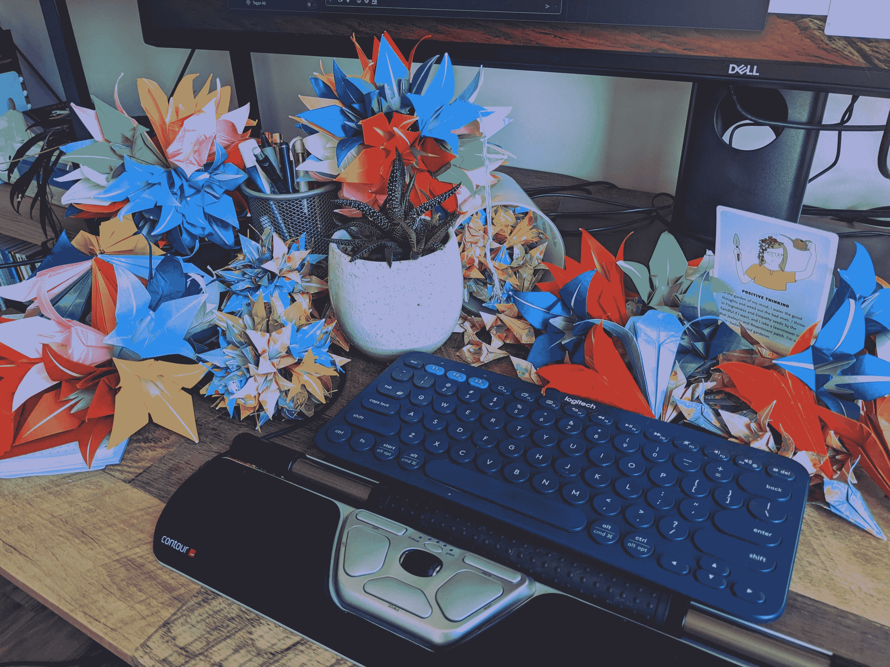

# 由 Trish Khoo - Octopus 负责部署

> 原文：<https://octopus.com/blog/at-the-helm-trish-khoo>

这篇文章是我们系列文章的下一篇[，与 Octopus 的人们谈论他们的角色，他们的挑战，他们正在努力为我们的客户改进产品，等等。](https://octopus.com/blog/tag/At%20The%20Helm)

在这里，我们采访了工程总监崔西·库。

## 你在八达通待了多久，带来了哪些经验？

我在 Octopus 工作一年多了。之前，我在谷歌和微软这样的大公司工作过，也在初创公司这样的小公司工作过，以及介于两者之间的任何公司。在布里斯班定居之前，我在悉尼、伦敦和旧金山工作过。

## 作为工程总监，典型的一天是怎样的？

我通常在喝咖啡的时候开始我的一天。我的“优先”部分有 8 个频道，而“重要”部分有 13 个频道。我尽可能地关注这两方面的最新进展。然后还有 31 个我定期关注的频道。

周一，我会与 Mike(工程副总裁)和 Roy(电子秤小组的工程总监)一起讨论影响 R&D 的问题，我们可以合作解决这些问题。

再次检查空闲时间后，我处理会议上的事情，然后休息去吃午饭。然后，我与我的工程经理和我的团队领导团队(GLT)进行同步。下午，我写政策、指导方针、建议、策略、公告或信息，并召开一对一会议。

每天使用 Slack 和 Zoom 可能听起来不令人兴奋，但我正在建立对我的团队和大 R&D 如何运作的意识，并采取小而有意义的行动来调整事情。我还利用 Zoom 会议的时间做折纸花，这有助于我集中注意力！

 

崔西的书桌上装饰着她的折纸作品

我学到的一个教训是，作为一名高级领导者，做出重大改变会对组织产生重大影响。有时这是必要的，但通常这只是破坏性的。当我阐明情况和政策以帮助他人更有效地履行职责时，我最有帮助。

## 到目前为止，你在八达通公司最大的成就是什么？

定义新的工程经理角色是一大成就。在加入之前，工程经理一般都是事必躬亲的技术主管和人事经理。定义一个纯粹专注于人员管理、团队文化和交付的经理的新角色有助于扩展团队并减轻来自技术领导的额外压力。

我还和我的 GLT 一起建立了第一个 R&D 集团，它为我们提供了更好的方式来制定长期的大计划。

我也喜欢和其他领导一起工作，创建一个工程招聘策略，让我们能够快速扩展。当我刚开始工作时，“人数”在八达通公司不是一个概念，每个经理负责他们的招聘广告和候选人面试——从招聘到录用的整个过程。它对一小部分候选人有效，但没有扩大规模。我和人事团队一起引入了新的可扩展方法来管理新来的候选人，同时确保我们首先填补了正确的团队。

我很高兴看到我在过去一年中为我们的扩展目标所做的贡献，我很自豪能成为这一旅程的一部分。

## Octopus 的工程团队面临的最大挑战是什么？

我们在如此短的时间内为公司增加了如此多的工程师，并努力让我们的系统随着增长而扩展。我们正处于一个关键时刻，工程生产力充满挑战，我们雄心勃勃，我们的团队有一半是新成员。在这一点上保持我们的交付路线图需要持续的关注，但是到目前为止我们做得很好。

## 你对未来几年 Octopus 的工程有什么看法？

我希望看到我们在经历快速增长的过山车的同时，保留使八达通成为工程师工作的好地方的价值观——一种高绩效的文化，在这种文化中，工程师做他们一生中最好的工作。我想看到 Octopus 成为你成为更好的软件工程师的地方。我希望看到我们的组织成为一个充满活力的机器，由欣欣向荣的工程师组成，他们有信心完成大事。

我认为我们做得很好！无论我们做什么，我们正在经历的快速扩张和转型有时会很困难。但是每天和我一起工作的人都很聪明、勤奋、有同情心、诚实，这些都是八达通公司未来的重要基础。

## 您如何在内部以及为我们的客户衡量成功？

这是一个有趣的时刻，我们的重点是获得新的、更大的客户，同时保留现有的客户。我们发现成功对新客户意味着什么，并了解如何创造他们喜爱的引人注目的产品。

在一个团队中，我们正在试验我们的客户第一次使用 Octopus 的体验，看看我们是否可以让更多的首次用户成功部署。在另一个团队中，我们正在学习流行的企业产品，如 ServiceNow，并研究 Octopus 如何适应这种工具生态系统。最终，我们希望我们的产品能够帮助我们的客户取得成功，因为这有助于我们取得成功。

在内部，我们需要持续不断地交付成果。这意味着我们创造了一种工作环境，在这种环境中，我们可以轻松地重复完成重要的事情。有了这些和合适的人，我们几乎可以实现任何事情。