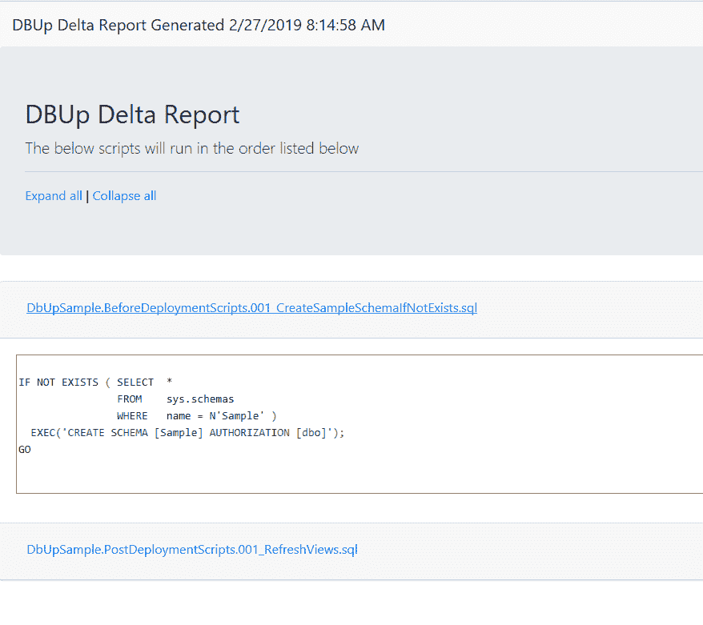
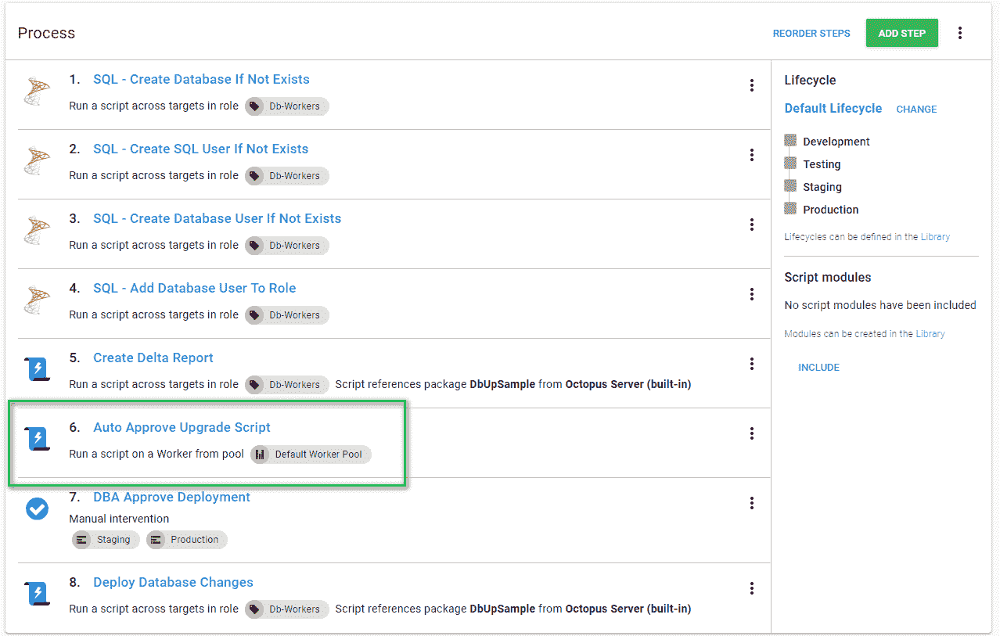
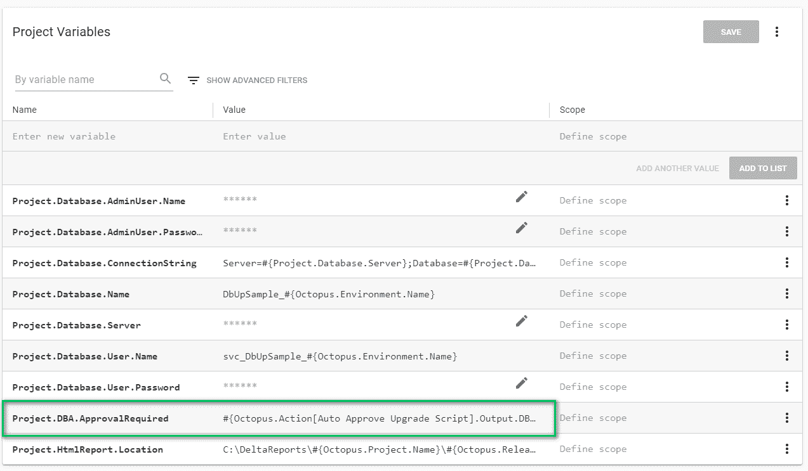
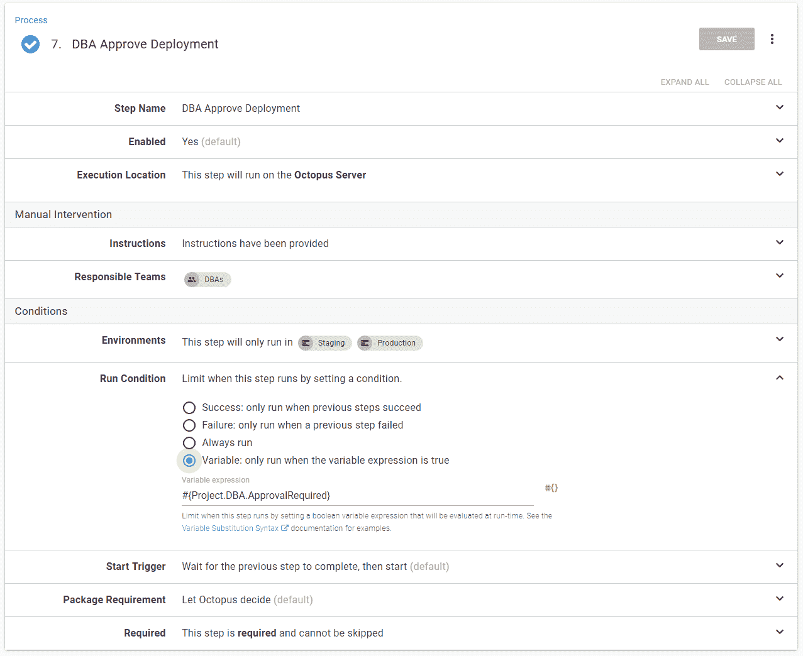
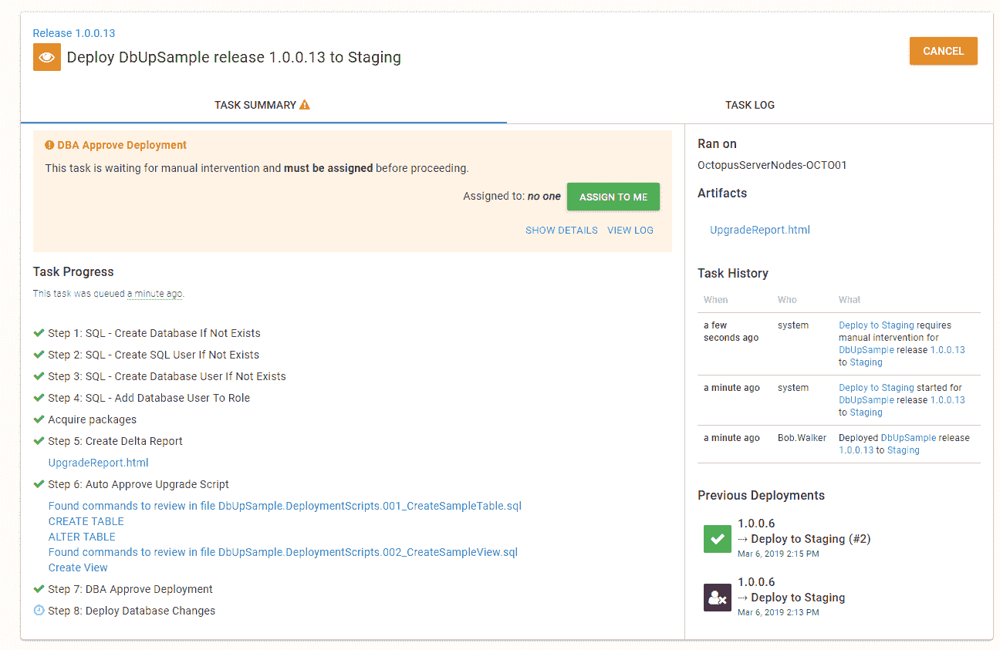
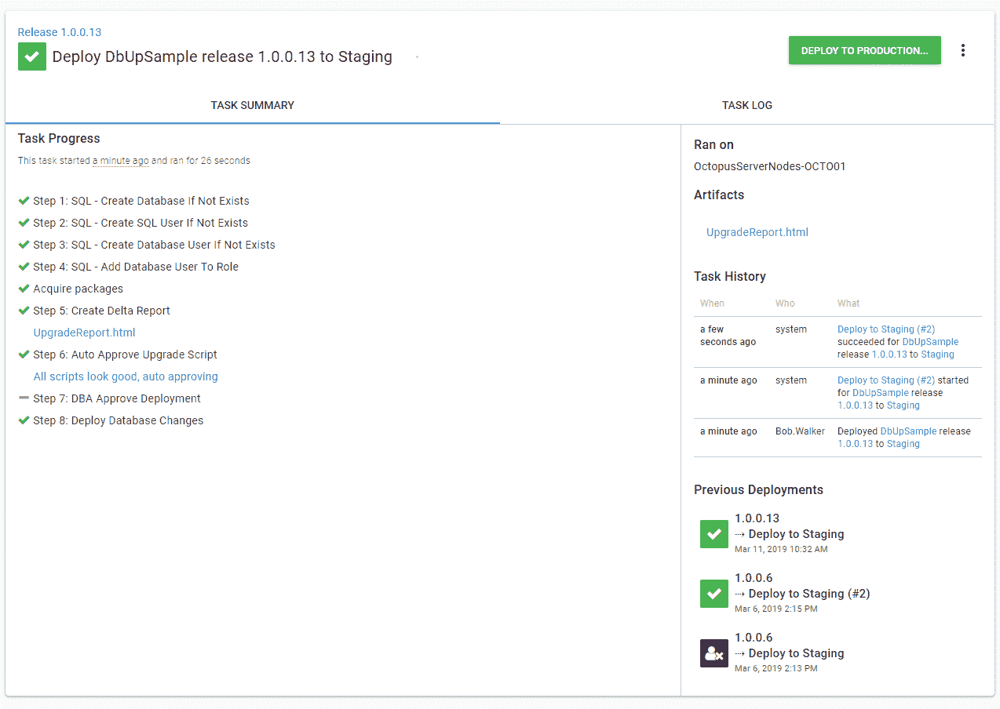

# 数据库部署自动化的自动批准- Octopus Deploy

> 原文：<https://octopus.com/blog/autoapprove-database-deployments>

[](#)

在本文中，我将向您展示如何设置自动批准，这样您的 DBA 就不必手动批准每个部署。

当您第一次开始实现数据库部署自动化时，让 DBA 批准更改是该过程的一个重要部分，因为他们可以发现产品中可能失败并且难以回滚的事情，但这也有助于他们在该过程中建立信任。然而，总有一天，让数据库管理员批准每一项变更不再有用。

## DBA 应该在什么时候参与进来？

DBA 应该只在需要的时候审查变更。

这听起来很简单，但执行起来要困难得多。我过去和 DBA 一起工作时，他们说过类似这样的话，“我希望任何违反标准的行为都会导致失败。他们甚至不应该被部署；我不需要看他们。另一方面，我希望看到那些对模式进行特定更改的脚本，我可能会在凌晨两点收到传呼。”

为了实现这一点，我们可以实施多层方法。第一层将出现在构建服务器上；它将运行必要的工具来检查是否违反了标准，例如，该工具可以检查命名约定、每个表是否有一个主键、存储过程中是否没有使用游标等等。有许多工具可以帮助实施 SQL 标准。这包括静态分析工具，如 [SQL Enlight](https://ubitsoft.com/) 以及使用 tSQLt 编写数据库单元测试。每种工具都有优点和缺点，但是深入研究这些工具超出了本文的范围。重要的是，当一个包到达 Octopus Deploy 时，我们将知道脚本符合我们的标准。

第二层将发生在 Octopus 部署中。自动化工具只能捕捉到这么多。可以编写一个满足所有标准和要求的 SQL 脚本，但是仍然写得很差，会导致严重的问题。例如，当在脚本中发现 drop table 命令时，不能有任何构建失败的规则。你永远无法清理旧的或不用的桌子。

难题的最后一部分是确定 DBA 应该对哪些环境执行手动干预。生产太晚了。到那时，承诺已经做出，用户的期望也已经设定。停止生产部署以便 DBA 可以检查脚本是没有意义的。如果他们发现问题，会发生什么？

让 DBA 批准部署到较低的环境，比如开发，也没有意义。这对 DBA 来说会产生太多的噪音，尤其是在每次签入后都进行构建的时候。

我的建议是在 QA、测试、试运行或 UAT 环境中进行手动干预。选择一个足够低的环境，使 DBA 可以提供建议或拒绝部署，但又足够高，使他们不会经常收到请求。测试不同的方法，因为拨入正确的环境可能需要一段时间。

## Octopus 部署中的自动审批流程

对于自动化审批流程，我们将使用[输出变量](https://octopus.com/docs/deployment-process/variables/output-variables)和[运行条件](https://octopus.com/docs/deployment-process/conditions#run-condition)。该流程将有一个 PowerShell 脚本(或一系列 PowerShell 脚本)来检查增量报告。如果 PowerShell 脚本在增量报告中注意到一些有趣的事情，那么将触发手动干预。

对于本文，我希望我的脚本:

*   如果没有更改，则自动批准。
*   检查 Add Table、Drop Table、Drop Column、Drop View、Drop User、Add User、Alter User、Add User to Role、Create View、Create Select Stored Procedure 和 Merge 语句，如果发现任何语句，则要求进行检查。
*   自动批准其他一切。

SQL 的好处在于

在 SQL 中只能有这么多模式变更语句，这意味着我们可以使用正则表达式来解析增量报告。

当我开始这个过程时，我忘记了部署前和部署后脚本，这是关键。他们会一直在那里。

[](#)

这导致了一个有趣的决定。当检查没有变化时，它到底应该寻找什么？您会注意到报告中包含了文件的全名。例如，`DbUpSample.BeforeDeploymentScripts.001_CreateSampleSchemaIfNotExists.sql`和`DbUpSample.PostDeploymentScripts.001_RefreshViews.sql.`导致几个选项。我可以修改代码来排除部署前和部署后脚本。或者，我可以写我的修改检查来寻找匹配的文件。`DbUpSample.DeploymentScripts.*.sql.`就我个人而言，我喜欢将所有脚本都包括在内供 DBA 审阅的想法，而不仅仅是部署脚本。根据我的经验，完全的可见性可以在部署过程中建立信任。隐藏脚本，或者不包含脚本，是破坏这种信任的好方法。也就是说，这是我的个人偏好，如何实现这一点取决于您和您的 DBA。

### 更新的数据库部署自动化流程

如前所述，我希望这是一个利用输出变量的 PowerShell 脚本。我将该脚本添加到流程中，以便在生成升级报告后立即运行:

[](#)

我选择让升级脚本和自动批准步骤在所有环境中运行。升级脚本将生成一个工件。自动批准步骤将使用 Octopus Deploy 提供的[写高亮显示](https://octopus.com/docs/deployment-examples/custom-scripts#Customscripts-Logging)功能。通过这样做，每个环境都将在部署摘要中有一个升级报告和一个变更列表。

[](#)

PowerShell 脚本在最后包含这一行来设置输出变量:

```
Set-OctopusVariable -name "DBAApprovalRequired" -value $approvalRequired 
```

访问输出变量的语法有点多，`Octopus.Action[Auto Approve Upgrade Script].Output.DBAApprovalRequired.`我在我的项目中添加了一个变量，使它更容易找到。此外，如果我决定更改名称，我只需在一个地方进行更改:

[](#)

最后一部分是将手动干预步骤的运行条件更改为仅在该值为真时运行:

[](#)

我们来测试一下。我创建了一个版本，其中包含需要审核的更改。手动干预步骤在开发或测试中不会触发，但在产品化中会触发:

[](#)

作为另一个测试，我将同一个版本重新部署到 staging。DBUp 看到所有脚本都已运行。没有要批准的内容，手动干预步骤被跳过:

[](#)

虽然我很想生成一个社区步骤模板供每个人使用，但每个公司都是不同的，我更愿意向您展示我整理的脚本。希望您可以从中获得一些东西，根据自己的用途进行修改，并将其添加到您的步骤模板库中:

```
$OctopusURL = # YOUR OCTOPUS BASE URL
$APIKey = # YOUR API KEY
$SpaceId = $OctopusParameters["Octopus.Space.Id"]
$DeploymentId = $OctopusParameters["Octopus.Deployment.Id"]
$CommandsToLookFor = "Create Table,Alter Table,Drop Table,Drop View,Create View,Create Function,Drop Function,sp_addrolemember,sp_droprolemember,alter role,Merge"
$FilePrefixToLookFor = "DbUpSample.DeploymentScripts."
$ArtifactFileName = "UpgradeReport.html"
$sqlFile = ".+\.sql"

$header = @{ "X-Octopus-ApiKey" = $APIKey }

$artifactUrl = "$OctopusUrl/api/$SpaceId/artifacts?take=2147483647&regarding=$DeploymentId&order=asc"
Write-Host "Getting the artifacts for this deployment from $artifactUrl"
$artifactResponse = (Invoke-WebRequest $artifactUrl -Headers $header).content | ConvertFrom-Json
$artifactList = $artifactResponse.Items
$fileToCheck = $null

foreach ($artifact in $artifactList)
{
    # The name of the file is UpgradeReport.html, look for that
    $fileName = $artifact.Filename

    if ($fileName -eq $ArtifactFileName)
    {
        Write-Host "Artifact containing the upgrade report found, downloading"
        $artifactId = $artifact.Id
        $artifactContentUrl = "$OctopusUrl/api/$SpaceId/artifacts/$artifactId/content"
        Write-Host "Pulling the content from $artifactContentUrl"
        $fileToCheck = Invoke-WebRequest $artifactContentUrl -Headers $header
        Write-Host "Finished downloading the file $fileName"
        break;
    }
}

if ($fileToCheck -eq $null)
{
    Write-Host "No file found, there should be a file, requiring approval"
    Set-OctopusVariable -name "DBAApprovalRequired" -value $true   
    Exit 0

    # No file, no checking
}
else
{
    Write-Host "File has been found, going to look through it now"
}
if ($filetocheck.rawcontent -like "$fileprefixtolookfor")
{
   Write-Highlight "No deployment scripts found, auto approving"
   Set-OctopusVariable -name "DBAApprovalRequired" -value $false
   Exit 0
}

Write-Host "Pulling all scripts from the report to check"
$scriptList = $fileToCheck.ParsedHtml.getElementsByTagName("div") | where {$_.className -eq "card"}
$commandsToCheck = $CommandsToLookFor -split ","
$approvalRequired = $false

foreach ($item in $scriptList)
{
    $rawHtml = $item.innerText
    $foundFileName = $rawHtml -match "$sqlFile"
    $fileName = $Matches[0]
    $foundCommandWarnings = $false

    foreach ($command in $commandsToCheck)
    {
        $foundCommand = $rawHtml -match "$command"

        if ($foundCommand)
        {
            $approvalRequired = $true

            if ($foundCommandWarnings -eq $false)
            {
                Write-Highlight "Found commands to review in file $fileName"
                $foundCommandWarnings = $true
            }

            foreach ($h in $Matches.Keys) {
                Write-Highlight "$($Matches.Item($h))"
            }
        }
    }
}

if ($approvalRequired -eq $false){
    Write-Highlight "All scripts look good, auto approving"
}
Set-OctopusVariable -name "DBAApprovalRequired" -value $approvalRequired 
```

对我的脚本有一个警告，我正在使用 PowerShell 解析 HTML。在后台，PowerShell 使用的是 Internet Explorer，我收到错误消息，通知我不可用，因为用户的初始设置没有运行。我通过在机器上运行初始设置来解决这个问题。但是，这仍然很烦人。

## 结论

[输出变量](https://octopus.com/docs/deployment-process/variables/output-variables)和[运行条件](https://octopus.com/docs/deployment-process/conditions#run-condition)是 Octopus Deploy 中的一个强大功能。它们允许您向部署过程添加逻辑。自动批准数据库部署就是一个例子。

* * *

数据库部署自动化系列文章: