# 使用 AWS Lambda 和订阅自动引导故障- Octopus 部署

> 原文：<https://octopus.com/blog/automate-guided-failure-with-lambda>

[手动干预](https://octopus.com/docs/projects/built-in-step-templates/manual-intervention-and-approvals)和[引导故障](https://octopus.com/docs/releases/guided-failures)是 Octopus Deploy 产品的强大功能。这两个功能都暂停部署或运行手册，并等待用户选择一个选项。不利的一面是，需要有人在场做出回应。然而，有了 Octopus Deploy written API-first，就有可能自动化这些响应。

这篇文章演示了如何使用[订阅](https://octopus.com/docs/administration/managing-infrastructure/subscriptions)特性调用 AWS Lambda 函数来自动响应引导失败事件。

## 示例使用案例

引导式失败旨在暂停一个动作并等待指导，自动化响应似乎违反直觉。这里有几个自动化响应有意义的用例。

### 从部署中排除计算机

考虑一下，如果您要部署到数千台机器上。在这种规模下，一小部分机器(通常与 Octopus 无关)的部署失败并不罕见。引导式失败为您提供了从部署中排除一台计算机的选项，这允许部署继续到剩余的目标。您可以自动化`Exclude machine from deployment`响应，稍后再处理故障机器，而不是照看这个过程。

### 自动重试

我们的团队经历了另一个场景；当 [Samples](https://samples.octopus.app) 实例在夜间拆除资源时，如此多的请求同时被发送到 AWS，以至于它经历了请求速率限制并失败。在这种情况下，只需重试 runbook。对引导性故障实施自动`Retry`响应可确保所有资源都被取消供应。

## 解决办法

这篇文章向您展示了如何通过使用 Octopus 的**订阅**特性调用 AWS Lambda 函数来自动响应引导失败事件。

首先，您需要提供一些 AWS 资源。

[OctoSubscriber](https://github.com/OctopusSamples/OctoSubscriber) repo 包含了这篇文章中描述的解决方案的源代码。

### 搭建 AWS 资源

本文中的解决方案利用了以下 AWS 资源:

IAM 角色可能拥有较低的权限，但这是测试解决方案所用的权限。

使用 AWS 资源可能会给您或您的组织带来成本。

使用[操作手册](https://samples.octopus.app/app#/Spaces-1/projects/aws-octosubscriber/operations/runbooks/Runbooks-1805/process/RunbookProcess-Runbooks-1805)，您可以使用 Terraform 和 AWS CLI 提供以下资源:

*   S3 水桶
*   SQS 队列
*   API 网关

[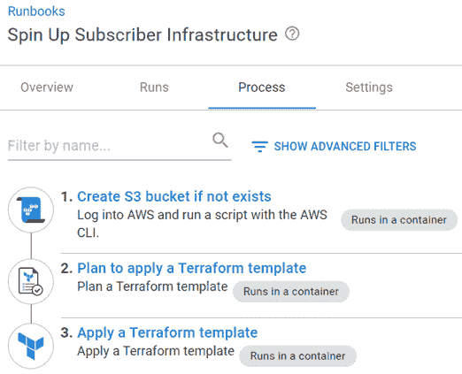](#)

#### 如果不存在，则创建 S3 时段

创建其他 AWS 资源的 Terraform 需要一个存储状态的地方。此步骤使用 AWS CLI 为 Terraform 步骤创建后端存储位置:

```
# Get variables
$bucketName = $OctopusParameters["Project.AWS.Backend.Bucket"]
$bucketRegion = $OctopusParameters["Project.AWS.Backend.Region"]

# Get bucket list
$awsS3BucketList = aws s3api list-buckets --query "Buckets[].Name" --output json

# Convert returned json into an object
$awsS3BucketList = ($awsS3BucketList | ConvertFrom-JSON)

# Check to see if bucket exists
if ($null -eq ($awsS3BucketList | Where-Object {$_ -eq $bucketName}))
{
    # Create the bucket
    Write-Highlight "Bucket $bucketName doesn't exist, creating ..."

    aws s3api create-bucket --bucket $bucketName --region $bucketRegion --create-bucket-configuration LocationConstraint=$bucketRegion
}
else
{
    Write-Highlight "Bucket $bucketName already exists, moving on ..."
} 
```

#### 计划应用 Terraform 模板

为了帮助您快速启动， [OctoSubscriber](https://github.com/OctopusSamples/OctoSubscriber) repo 包含 Terraform 脚本，用于自动创建 SQS 和 API 网关资源。这一步输出 Terraform 将按计划做什么。

main.tf

```
terraform {
  required_providers {
    aws = {
      source  = "hashicorp/aws"
      version = "~> 3.0"
    }
  }

  backend "s3" {
    bucket = "#{Project.AWS.Backend.Bucket}"
    key = "#{Project.AWS.Backend.Key}"
    region = "#{Project.AWS.Backend.Region}"
  }
}

provider "aws" {
    region  = var.region
}

resource "aws_sqs_queue" "subscriber_queue" {
  name                              = var.queue_name
  kms_master_key_id                 = "alias/aws/sqs"
  kms_data_key_reuse_period_seconds = 300
}

resource "aws_apigatewayv2_api" "subscriber_gateway" {
  name                              = var.api_gateway_name
  protocol_type                     = "HTTP"
} 
```

变量. tf

```
variable "region" {
    type = string
}

variable "queue_name" {
    type = string
}

variable "api_gateway_name" {
    type = string
} 
```

terraform.tfvars

```
region = "#{Project.AWS.Region}"
queue_name = "#{Project.AWS.Queue.Name}"
api_gateway_name = "#{Project.AWS.API.Gateway.Name}" 
```

#### 应用 Terraform 模板

使用上面的地形，在 AWS 上创建资源。

创建资源后，您可以关注 Lambdas。

### AWS 函数

该解决方案由两个不同的 Lambda 函数组成:

*   这个函数将包含的有效载荷放到 SQS 队列中。
*   `process-message`:该函数处理出现在 SQS 队列中的消息，并将请求的响应提交给 Octopus 服务器。

#### 接受消息

该函数用 NodeJS 编写，接受以下 querystring 参数:

*   类型:已经发生的中断的类型。
    *   导向:为**导向故障**提供该值。
    *   结果:为**手动干预**提供该值。
*   动作:这是对中断的实际响应。该值取决于类型:
    *   中止(结果)
    *   继续(结果)
    *   失败(指导)
    *   排除(指导)
    *   忽略(指导)
    *   重试(指导)
*   MaximumRetry(与重试操作一起使用):指定在放弃之前执行的最大重试次数。默认值为 1，**导向故障**功能最多可重试 10 次，因此任何大于 10 次的故障都会被忽略。

```
var AWS = require('aws-sdk');

exports.handler = function(event, context) {
  let QUEUE_URL = process.env.sqsqueue;
  let sqs = new AWS.SQS({region : process.env.sqsregion});
  let maximumretry = "1";

  if (event.queryStringParameters.maximumretry) {
    maximumretry = event.queryStringParameters.maximumretry
  }

  var params = {
    MessageBody: event.body,
    QueueUrl: QUEUE_URL,
    MessageAttributes: {
      "Type": {
        DataType: "String",
        StringValue: event.queryStringParameters.type
      },
      "Action": {
        DataType: "String",
        StringValue: event.queryStringParameters.action
      },
      "MaximumRetry": {
        DataType: "String",
        StringValue: maximumretry
      }
    }
  };

  sqs.sendMessage(params, function(err,data){
    if(err) {
      console.log('error:',"Fail Send Message" + err);
      context.done('error', "ERROR Put SQS");  // ERROR with message
    }else{
      console.log('data:',data.MessageId);
      context.done(null,'');  // SUCCESS 
    }
  });
} 
```

querystring 参数作为 MessageAttributes 附加到消息中。

#### 流程消息

该函数从 SQS 队列中读取消息，并使用 [Octopus。客户端获取包引用](https://octopus.com/docs/octopus-rest-api/octopus.client)以自动响应中断。完整的解决方案可以在[八月认购](https://github.com/OctopusSamples/OctoSubscriber)回购中找到。

```
using System;
using System.Collections.Generic;
using System.Linq;
using System.Threading.Tasks;
using Amazon.Lambda.Core;
using Amazon.Lambda.SQSEvents;
using Newtonsoft.Json;
using Octopus.Client;

// Assembly attribute to enable the Lambda function's JSON input to be converted into a .NET class.
[assembly: LambdaSerializer(typeof(Amazon.Lambda.Serialization.SystemTextJson.DefaultLambdaJsonSerializer))]

namespace process_message
{
    public class Function
    {
        public Function()
        {

        }

        /// <summary>
        /// This method is called for every Lambda invocation. This method takes in an SQS event object and can be used 
        /// to respond to SQS messages.
        /// </summary>
        /// <param name="evnt"></param>
        /// <param name="context"></param>
        /// <returns></returns>
        public async Task FunctionHandler(SQSEvent evnt, ILambdaContext context)
        {
            foreach(var message in evnt.Records)
            {
                await ProcessMessageAsync(message, context);
            }
        }

        private async Task ProcessMessageAsync(SQSEvent.SQSMessage message, ILambdaContext context)
        {
            // Log
            LambdaLogger.Log("Begin message processing...");

            // Get environment variables
            string octopusServerUrl = Environment.GetEnvironmentVariable("OCTOPUS_SERVER_URL");
            string octopusApiKey = Environment.GetEnvironmentVariable("OCTOPUS_API_KEY");

            // Check to see if there are message attributes
            if (message.MessageAttributes.Count == 0)
            {
                // Fail
                throw new Exception("MessageAttributes collection is empty, was the queue called with querystring paramters?");
            }

            // Log
            LambdaLogger.Log(string.Format("Retrieved environment variables, Octopus Server Url: {0}...", octopusServerUrl));

            // Deserialize message JSON
            LambdaLogger.Log(string.Format("Parsing message..."));
            dynamic subscriptionEvent = JsonConvert.DeserializeObject(message.Body);
            LambdaLogger.Log("Successfully parsed message JSON...");

            // Create Octopus client object
            LambdaLogger.Log("Creating server endpoint object ...");
            var endpoint = new OctopusServerEndpoint(octopusServerUrl, octopusApiKey);
            LambdaLogger.Log("Creating repository object...");
            var repository = new OctopusRepository(endpoint);
            LambdaLogger.Log("Creating client object ...");
            var client = new OctopusClient(endpoint);

            // Create repository for space
            string spaceId = subscriptionEvent.Payload.Event.SpaceId;
            LambdaLogger.Log(string.Format("Creating repository object for space: {0}...", spaceId));
            var space = repository.Spaces.Get(spaceId);
            Octopus.Client.IOctopusSpaceRepository repositoryForSpace = client.ForSpace(space);

            // Retrieve interruption; first related document is the DeploymentId
            string documentId = subscriptionEvent.Payload.Event.RelatedDocumentIds[0];

            // Check to see if guided failure has already been invoked once, defaults to once if nothing provided
            int maximumRetry = 1;
            if (!string.IsNullOrWhiteSpace(message.MessageAttributes["MaximumRetry"].StringValue))
            {
                // Set to value
                maximumRetry = int.Parse(message.MessageAttributes["MaximumRetry"].StringValue);
            }

            var eventList = repositoryForSpace.Events.List(regarding: documentId);

            if (eventList.Items.Count(x => x.Category == "GuidedFailureInterruptionRaised") > maximumRetry && message.MessageAttributes["Action"].StringValue == "Retry")
            {
                LambdaLogger.Log(string.Format("{0} has raised Guided Failure more than {1} time(s), updating Action to Fail to break the infinite loop.", documentId, maximumRetry));
                message.MessageAttributes["Action"].StringValue = "Fail";
            }

            LambdaLogger.Log(string.Format("Processing event for document: {0}...", documentId));
            var interruptionCollection = repositoryForSpace.Interruptions.List(regardingDocumentId: documentId, pendingOnly: true).Items;

            if (interruptionCollection.Count > 0)
            {
                foreach (var interruption in interruptionCollection)
                {
                    // Check to see if responsibility needs to be taken
                    if (interruption.IsPending)
                    {
                        // Take responsibility
                        LambdaLogger.Log(string.Format("Taking responsibility for interruption: {0}...", interruption.Id));
                        repositoryForSpace.Interruptions.TakeResponsibility(interruption);

                        // The message attributes contain the type [Manual Intervention | GuidedFailure] and the desired Action to take for it
                        interruption.Form.Values[message.MessageAttributes["Type"].StringValue] = message.MessageAttributes["Action"].StringValue;

                        // Update Octopus
                        LambdaLogger.Log(string.Format("Submitting {0}:{1} for: {2}...", message.MessageAttributes["Type"].StringValue, message.MessageAttributes["Action"].StringValue, interruption.Id));
                        repositoryForSpace.Interruptions.Submit(interruption);
                    }
                }
            }
            await Task.CompletedTask;
        }
    }
} 
```

## 制造和包装兰姆达斯

只有`process-message` Lambda 需要构建，但是，它们都需要打包以便部署。OctoSubscriber 项目使用 GitHub 动作来完成这些操作。

```
# This is a basic workflow to help you get started with Actions

name: AWS Lambda

on:
  push:
    paths:
      - 'aws/accept-message/**'

  # Allows you to run this workflow manually from the Actions tab
  workflow_dispatch:

jobs:
  build:
    runs-on: ubuntu-latest
    strategy:
      matrix:
        dotnet-version: ['3.1.x']

    steps:
      - uses: actions/checkout@v2
      - name: Setup .NET Core SDK ${{ matrix.dotnet-version }}
        uses: actions/setup-dotnet@v1.7.2
        with:
          dotnet-version: ${{ matrix.dotnet-version }}

      - name: Create artifacts folder
        run: |
          mkdir "$GITHUB_WORKSPACE/artifacts"
          mkdir "$GITHUB_WORKSPACE/artifacts/process-message"
      - name: Restore dependencies for process-message
        working-directory: aws/process-message/process-message
        run: dotnet restore

      - name: Build process-message
        working-directory: aws/process-message/process-message
        run: dotnet build --configuration Release --no-restore --output "$GITHUB_WORKSPACE/artifacts/process-message"

      - name: Install Octopus CLI
        uses: OctopusDeploy/install-octopus-cli-action@v1.1.1
        with:
          version: latest

      - name: Pack and Push
        env:
          OCTOPUS_URL: ${{ secrets.OCTOPUS_SERVER }}
          OCTOPUS_API_KEY: ${{ secrets.OCTOPUS_API_KEY }}  
        run: |
          octo pack --id=OctoSubscriber-AcceptMessage-Lambda --format=Zip --version=2021.1.1.$GITHUB_RUN_NUMBER --basePath="aws/accept-message/"
          octo pack --id=OctoSubscriber-ProcessMessage-Lambda --format=Zip --version=2021.1.1.$GITHUB_RUN_NUMBER --basePath="$GITHUB_WORKSPACE/artifacts/process-message"
          octo push --package=OctoSubscriber-AcceptMessage-Lambda.2021.1.1.$GITHUB_RUN_NUMBER.zip --server=$OCTOPUS_URL --apiKey=$OCTOPUS_API_KEY --space="Target - Serverless"
          octo push --package=OctoSubscriber-ProcessMessage-Lambda.2021.1.1.$GITHUB_RUN_NUMBER.zip --server=$OCTOPUS_URL --apiKey=$OCTOPUS_API_KEY --space="Target - Serverless" 
```

在本例中，GitHub 动作将 Lambda 包直接推送到内置的 Octopus Deploy 包存储库。

## 部署兰姆达斯

这篇文章假设你熟悉如何创建一个 Octopus Deploy 项目，不会涉及这个主题。

Lambdas 的部署过程将包括以下步骤:

*   **AWS - Deploy 接受消息 Lamdba 函数**
*   **AWS -部署流程消息 Lamdbda 函数**
*   **AWS -配置接受消息 Lambda 别名**
*   **AWS -配置流程消息 Lambda 别名**
*   **AWS -配置 Lambda API 网关集成**

[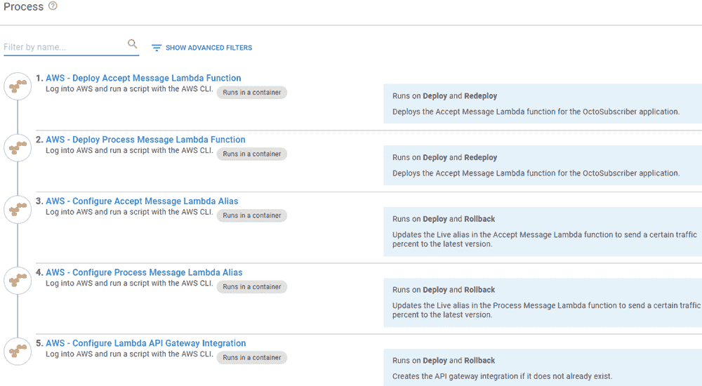](#)

### AWS -部署接受消息 Lambda 函数

向您的部署流程添加一个**AWS-Deploy Lambda Function**步骤。点击**添加步骤**，然后通过`aws`进行搜索。

[](#)

填写步骤表单字段:

*   **功能名称**:要部署的功能的名称
*   **AWS 帐户**:用于部署的 AWS 帐户变量
*   **区域**:Lambda 部署的区域
*   **包**:包含 Lambda 的包
*   **功能角色**:您为 Lambdas 创建的角色的 ARN
*   **运行时**:代码运行时，`nodejs14.x`为接受消息
*   **处理程序**:Lambda 调用来执行你的函数的方法的名字(*注意:这将根据运行时选择的*而不同)——对于**接受消息**，它是`index.handler`
*   **内存大小**:您的函数可以访问的内存大小，必须是 64MB 的倍数，**接受消息**的`128`
*   **环境变量**:sqsqsqueue =[队列名称]，SQS Region =[SQS 队列区域]

### AWS -部署流程消息 Lambda 函数

这使用了与上面相同的步骤模板，所以我只列出不同的字段:

*   **函数名**:要部署的函数名
*   **包**:包含 Lambda 的包
*   **运行时** : `dotnetcore 3.1`
*   **处理程序** : `process_message::process_message.Function::FunctionHandler`
*   **环境变量**:OCTOPUS _ SERVER _ URL =[OCTOPUS 服务器 URL]，OCTOPUS_API_KEY=[API Key]
*   **超时** : `30`(默认超时为 3 秒，不足以让 Lambda 完全处理)

### AWS -配置访问消息 Lambda 别名

AWS 支持同时部署 Lambda 的多个版本。AWS 还支持金丝雀式的流程，在这个流程中，您可以为不同版本的 Lambda 分配一定比例的流量。这是通过为一个版本配置一个别名，并告诉 Lambda 要路由多少流量给它来实现的。

向您的流程添加一个 **AWS 配置 Lambda 别名**步骤。

[](#)

填写步骤表单字段:

*   **函数名**:上面的部署步骤将为部署的函数输出 ARN，这里使用输出变量- #{Octopus。动作 [AWS -部署接受消息 Lambda 函数](#aws-deploy-accept-message-lambda-function). output .λarn }
*   **AWS 帐户**:用于部署的 AWS 帐户变量
*   **区域**:Lambda 所在的区域
*   **别名**:要使用的别名，本帖使用`Live`
*   **别名版本百分比**:该版本接收流量的百分比，本帖使用 100
*   **函数版本**:别名的函数版本，使用部署步骤- `#{Octopus.Action[AWS - Deploy Accept Message Lambda Function].Output.PublishedVersion}`的输出变量

### AWS -配置流程消息 Lambda 别名

这一步与前一步完全一样，只是针对流程消息 Lambda 进行了配置。

使用`#{Octopus.Action[AWS - Deploy Process Message Lambda Function].Output.LambdaArn}`将输出变量中的 **AWS -部署接受消息 Lambda 函数**替换为 **AWS -部署流程消息 Lambda 函数**。

### AWS -配置 Lambda API 网关集成

这一步配置 API v2 网关来连接和调用 Lambda 函数。

向您的流程添加一个**AWS-Configure Lambda API Gateway Integration**步骤:

[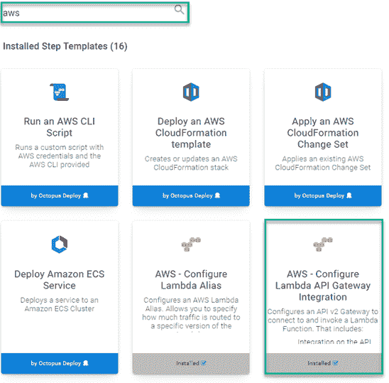](#)

填写步骤表单字段:

*   **API 网关名称**:要配置/创建的网关的名称
*   **AWS 帐户**:用于部署的 AWS 帐户变量
*   **AWS 区域**:Lambda 所在的区域
*   **路线键**:使用/创建路线，本岗位使用`/octopus/webhook`
*   **HTTP 方法**:您正在创建的路由和集成的 HTTP 方法
*   **拉姆达 ARN** :拉姆达的 ARN，这篇文章使用了创建步骤`#{Octopus.Action[AWS - Deploy Accept Message Lambda Function].Output.LambdaArn}`的输出变量
*   **Lambda 别名:**别名的名称，在本例中为`Live`
*   **净荷格式版本**:API 网关发送给 Lambda 的净荷格式

### 部署

如果 Lambdas、别名或 API 网关先前不存在，则首次部署时可能会收到警告。这很正常。

[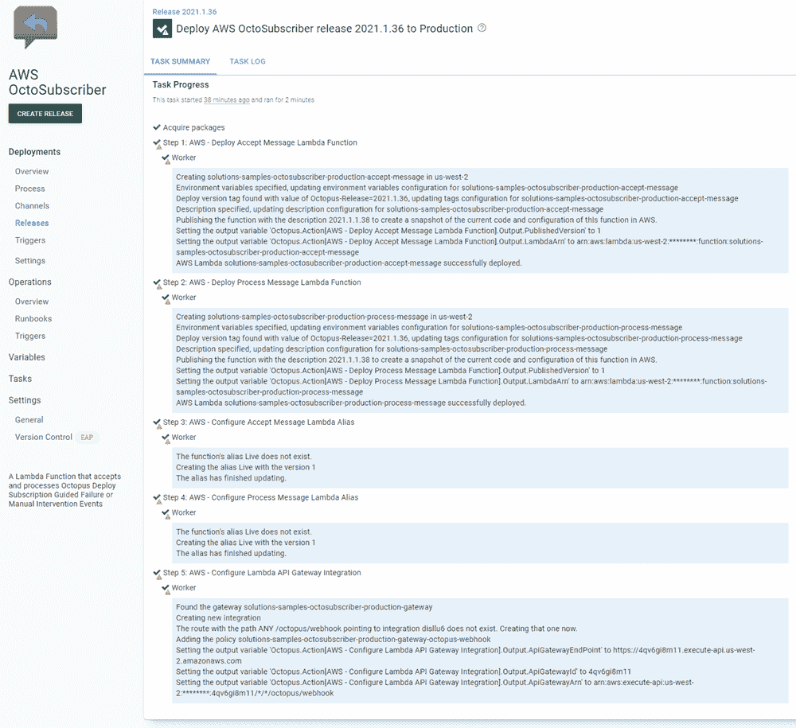](#)

## 配置剩余资源

大部分需要完成的工作已经通过使用 Terraform 的供应流程和使用 AWS 步骤模板的部署流程自动完成。但是，在解决方案准备好被调用之前，还有两个步骤:

*   创建 API 网关阶段
*   将流程消息 Lambda 连接到 SQS 队列

### 创建 API 网关阶段

创建阶段将为要调用的接受消息 Lambda 创建 URL 端点。在 AWS 中，导航到**网络&内容交付**部分，然后选择 **API 网关**。

[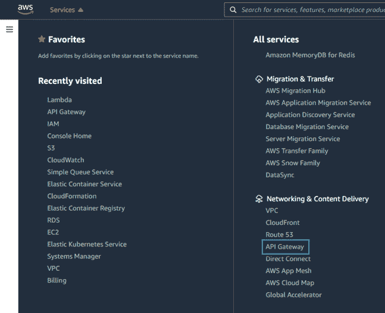](#)

点击您想要配置的 **API 网关**。加载完成后，点击**创建阶段**。

[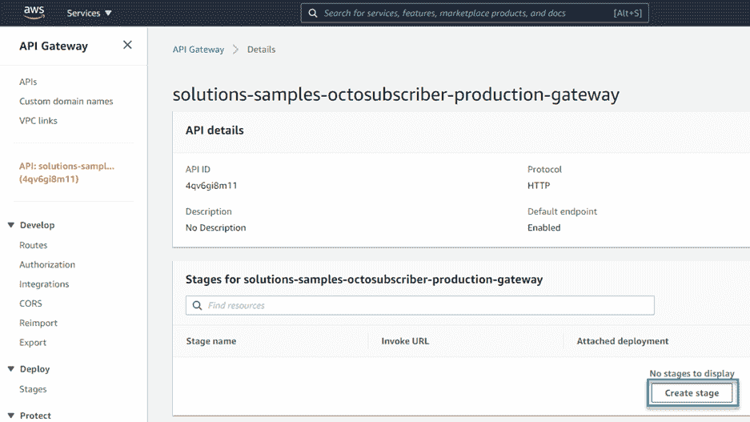](#)

给这个阶段一个**名称**，打开**启用自动部署**选项，然后点击**创建**。

[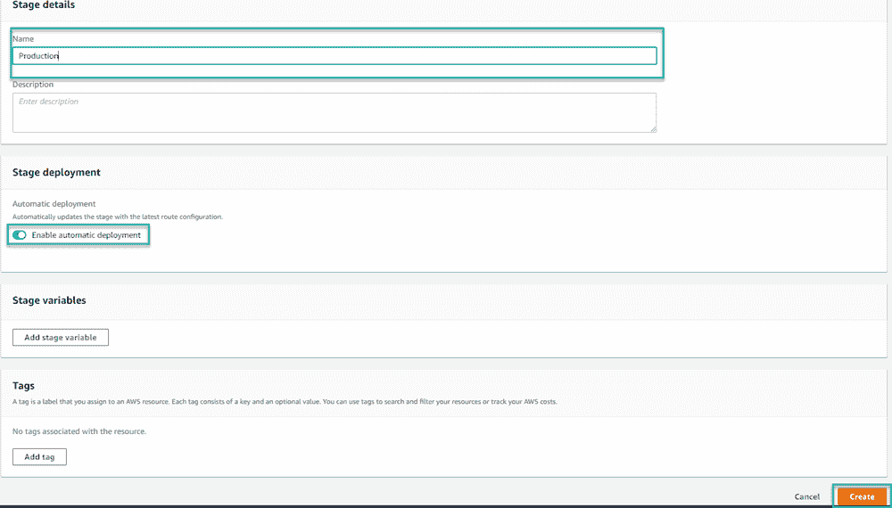](#)

创建阶段后，它将显示配置 Octopus Deploy 订阅 webhook 所需的**调用 URL** 。

[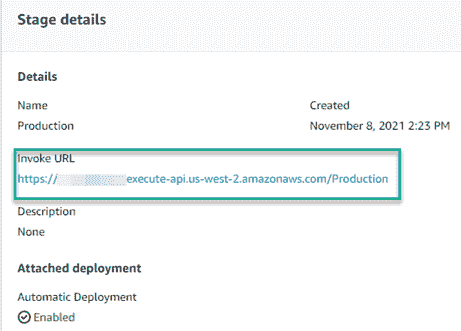](#)

### 将流程消息 Lambda 连接到 SQS 队列

现在您需要将流程消息 Lambda 配置为从 SQS 队列中触发。

导航到位于**计算**部分下的 AWS 控制台中的**λ**。

[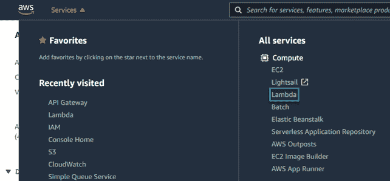](#)

选择**流程消息λ**，然后点击**配置**，然后**触发**，然后点击**添加触发**。

[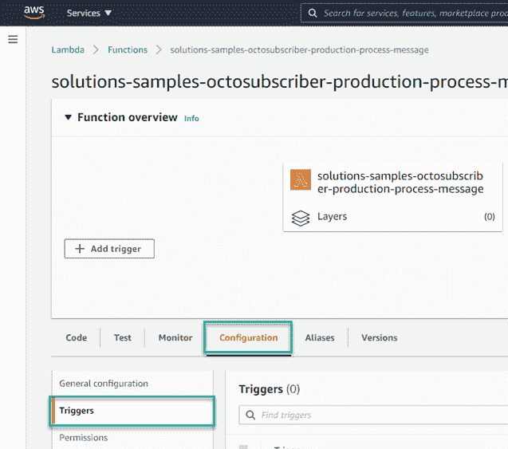](#)

从下拉菜单中选择 **SQS** 。点击 **SQS 队列**框将显示队列列表。您可以从该列表中选择或输入队列的 ARN。完成后，点击**添加**。

[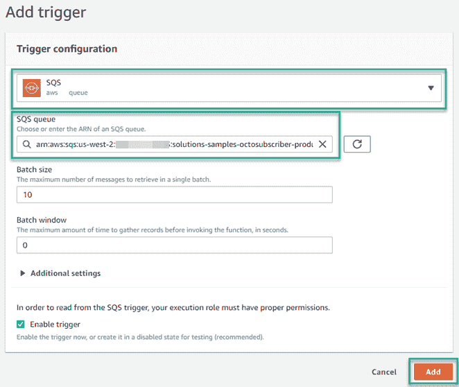](#)

## 配置 Octopus 部署订阅

现在，您已经准备好配置 Octopus Deploy，以便在发生引导失败事件时调用您的 Lambda。

导航到 Octopus Deploy 的**配置**选项卡，点击**订阅**，然后**添加订阅**。

[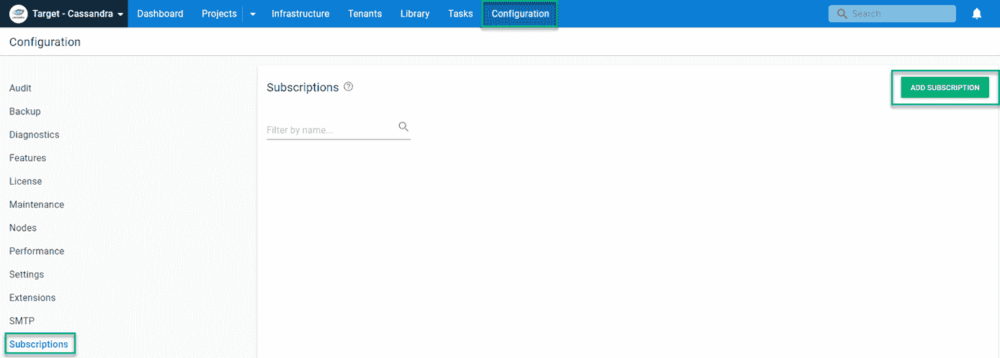](#)

为订阅输入以下信息:

*   **名称**:给订阅命名
*   **事件类别**:引发引导失败中断
*   **有效载荷 URL** : `[API Gateway Invoke URL]/octopus/webhook?type=Guidance&action=Fail`

完成后，它看起来会像这样:

[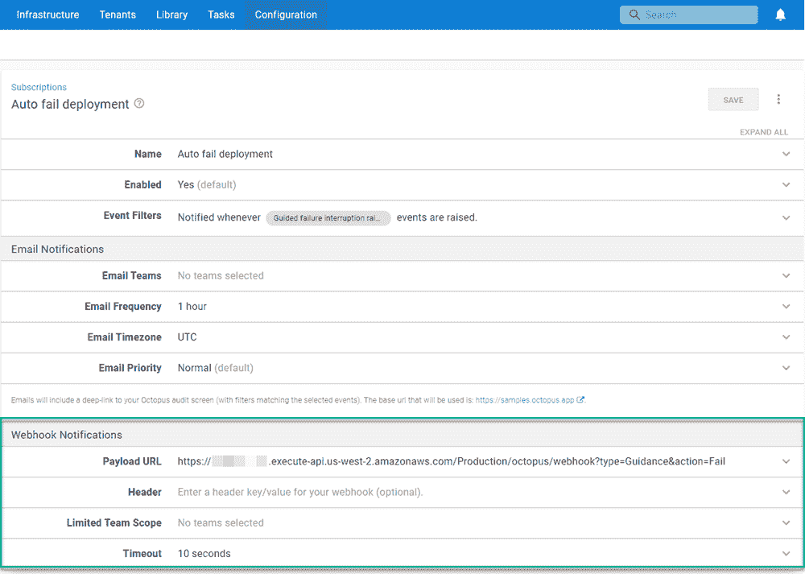](#)

## 测试解决方案

为了测试这个解决方案，我们需要做两件事:

*   启用引导失败
*   将部署配置为失败

### 启用引导式故障

可以为部署流程或操作手册启用引导式故障。

要启用部署过程，选择**设置**，然后选择**使用引导故障模式**。

[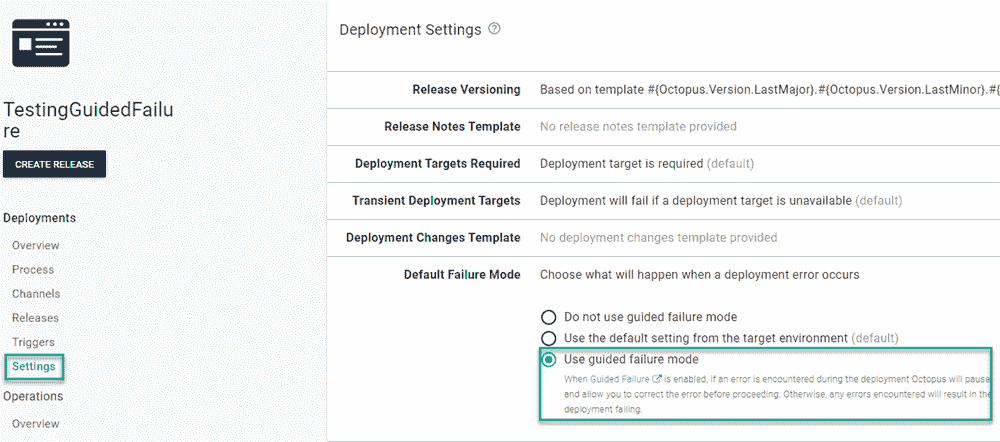](#)

### 将部署配置为失败

一种简单的方法是创建一个部署流程，其中有一个**运行脚本**步骤。为脚本输入以下内容:

```
Fail-Step "Fail on purpose" 
```

### 运行部署

部署将立即进入引导失败并等待引导。

[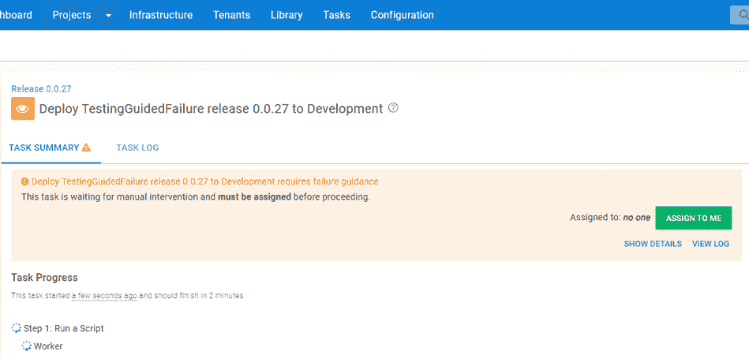](#)

几秒钟后，Octopus Deploy 将处理订阅事件，并将使部署失败。

[](#)

在 AWS 控制台中，您可以查看 CloudWatch 日志，查看 Lambda 处理了消息，然后提交给 Octopus 服务器。

[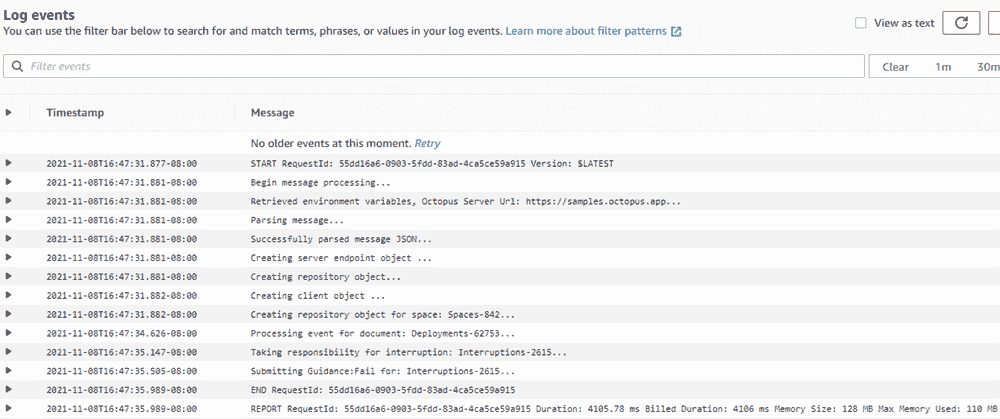](#)

## 结论

这篇文章向您展示了如何使用 Octopus Deploy **订阅**调用 AWS Lambda 来自动响应引导失败事件。虽然演示的目标是引导失败，但同样的 Lambda 也可以用于自动响应**手动干预**。

愉快的部署！