# 在基于 Linux 的 Docker 容器- Octopus Deploy 中运行 SQL Server Developer

> 原文：<https://octopus.com/blog/automate-sql-server-install-using-linux-docker>

[](#)

我的[上一篇文章](/blog/running-sql-server-developer-install-with-docker)讲述了如何让 SQL Server 在基于 Windows 的 Docker 容器中运行。然而，Docker 是为托管基于 Linux 的容器而设计的，与基于 Windows 的容器相比，它具有以下优点。

*   开销少得多。
*   更多可用功能。
*   更多图片可用。
*   更多使用中的容器示例。

SQL Server 可以在基于 Linux 的容器上运行。在本文中，我将介绍在基于 Linux 的容器中启动和运行 SQL Server 的必要条件。

## 准备工作

本文使用 [Docker 桌面](https://hub.docker.com/editions/community/docker-ce-desktop-windows)。我之前的文章介绍了[安装 Docker 桌面](/blog/running-sql-server-developer-install-with-docker)的步骤，所以我在这里不再重复。

Docker 桌面唯一的缺点是你不能同时运行基于 Windows 的容器和基于 Linux 的容器。如果您一直在使用基于 Windows 的容器，您可以通过右键单击任务栏中的 Docker 图标并选择`Switch to Linux containers...`来切换到 Linux 容器。默认情况下，Docker 桌面从 Linux 容器开始:

[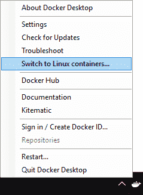](#)

Docker 将所有容器视为无状态。预计对容器所做的任何更改(如创建数据库)都将被销毁。我们将通过使用体积来解决这个问题。切换到 Linux 容器后，右键单击任务栏中的 Docker 桌面图标，然后进入设置。在设置中，选择共享驱动器选项。单击复选框，与 Docker 共享您选择的驱动器。在我的情况下，我只有`C:\`驱动器:

[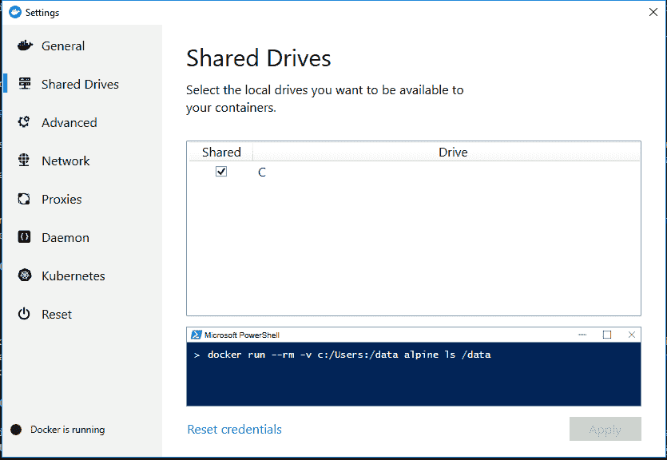](#)

我想将数据库存储在我的`C:\`驱动器上的文件夹`C:\DockerLinux\Volumes\SQLServer`中:

[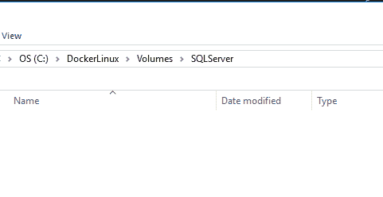](#)

## 配置 SQL Server 开发人员容器

就像以前一样，我想用这个来进行实际的开发工作。在上一篇文章中，我创建了一个 Docker 合成文件来启动 SQL Server。与其从那里开始，我想做和以前一样的过程。有条不紊地在 Linux 容器中启动并运行 SQL Server。当我最终碰壁时，采取系统化的方法会使故障诊断更容易。

1.  无需额外配置即可启动并运行容器。
2.  通过 SSMS 连接到它。
3.  持久化在容器中创建的数据库。

### 首次运行 SQL Server Developer 容器

首先，让我们运行一个简单的命令，从 Docker Hub 下载 SQL Server Windows 开发人员映像:

```
docker pull mcr.microsoft.com/mssql/server 
```

SQL Server 的基于 Windows 的映像需要很长时间才能下载。对于基于 SQL Server Linux 的容器来说，情况并非如此。我花了更长的时间来输入这一段并捕捉截图:

[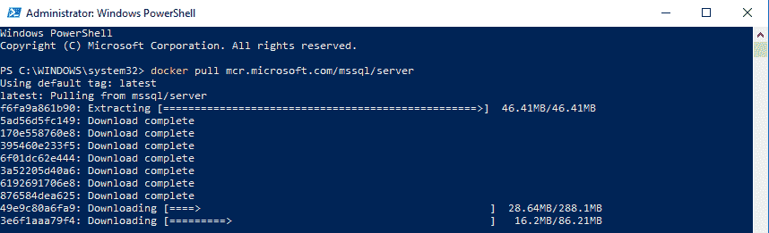](#)

为 SQL Server 的基于 Linux 的容器提供的[文档使容器的启动和运行变得很容易。请记下正在发送的`--name`参数。当我们需要弄清楚如何连接它时，这个参数将使它变得更容易。在命名实例的同时，我将端口设置为默认的 SQL Server 端口`1433`。](https://hub.docker.com/_/microsoft-mssql-server)

环境变量名区分大小写，sa_password 将不起作用，它必须是 SA_PASSWORD。

```
docker run --name SQLServerLinux -d -p 1433:1433 -e "SA_PASSWORD=Password_01" -e "ACCEPT_EULA=Y" mcr.microsoft.com/mssql/server 
```

[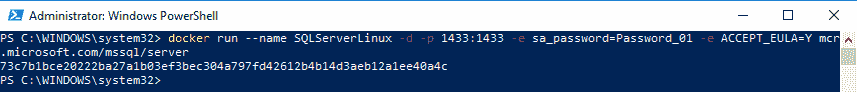](#)

### 从主机上的 SSMS 连接到容器

SQL Server 容器正在运行，但是在主机上运行的 SSMS 如何连接到它呢？在上面的命令中，我们提供了`-p`参数，该参数将端口暴露给`localhost`上的主机。要从 SSMS 连接到运行在 Linux 容器中的 SQL Server，我们只需键入`localhost`并提供 sa 用户名/密码:

[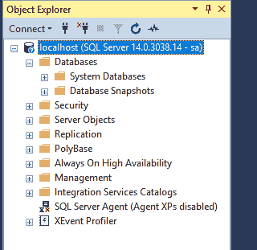](#)

就像普通的 SQL Server 一样，一切都按预期运行。我可以毫无问题地创建数据库和表格:

[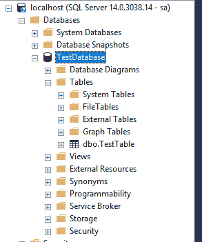](#)

### 持久化在容器中创建的数据库

如果容器需要重启会怎么样？

```
docker stop SQLServerLinux
docker start SQLServerLinux 
```

重新启动后，数据库仍然存在:

[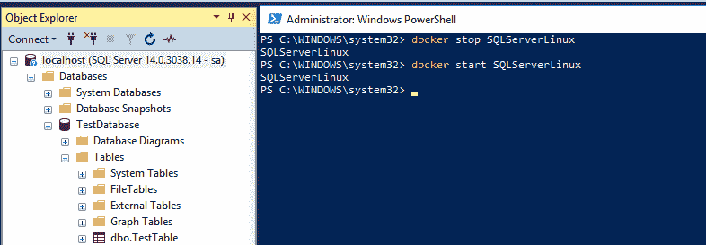](#)

如果需要重新创建容器，进行升级或配置更改，那么我们需要在停止它之后调用`rm`命令来删除它:

```
docker stop SQLServerLinux
docker rm SQLServerLinux
docker run --name SQLServerLinux -d -p 1433:1433 -e "SA_PASSWORD=Password_01" -e "ACCEPT_EULA=Y" mcr.microsoft.com/mssql/server 
```

发生这种情况时，该容器中的所有数据库都将被删除:

[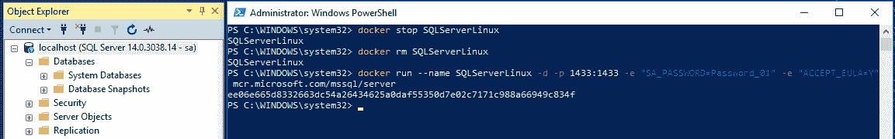](#)

如果你读过我以前的文章，这并不奇怪，就像以前一样，我们需要利用数量。Docker 的一个优点是它提供了一个抽象层。告诉 Docker 指向主机上的文件夹，`C:\DockerLinux\Volumes\SQLServer`指向存储 SQL Server 配置的 Linux 目录，`var/opt/mssql`:

```
docker stop SQLServerLinux
docker rm SQLServerLinux
docker run --name SQLServerLinux -d -p 1433:1433 -e "SA_PASSWORD=Password_01" -e "ACCEPT_EULA=Y" -v C:\DockerLinux\Volumes\SQLServer:/var/opt/mssql mcr.microsoft.com/mssql/server 
```

创建测试数据库后，它将出现在主机上的该文件夹中:

[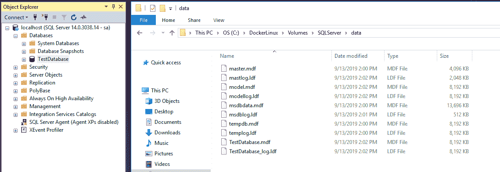](#)

当容器重新启动时，它将挂载所有那些现有的数据库，包括 TestDatabase。

## Docker 撰写

我喜欢用 [Docker 作曲](https://docs.docker.com/compose/)。将我的 Docker 容器配置存储在一个易于阅读和运行的 YAML 文件中非常好。以下是基于 Linux 的 SQL Server 容器的外观:

```
version: '3.7'
services:
 SQLServer:
 image: mcr.microsoft.com/mssql/server
 environment:
 - ACCEPT_EULA=Y
 - SA_PASSWORD=Password_01
 ports:
 - '1433:1433'
 volumes:
 - C:\DockerLinux\Volumes\SQLServer:/var/opt/mssql 
```

我把那个`docker-compose.yml`文件保存在 C:\DockerLinux 中。现在，我运行这个 PowerShell 脚本来让一切正常运行:

```
set-location C:\DockerLinux
docker-compose up 
```

如果您不想看到实时日志，将`-d`开关添加到`docker-compose up`来启动容器，而不附加它:

[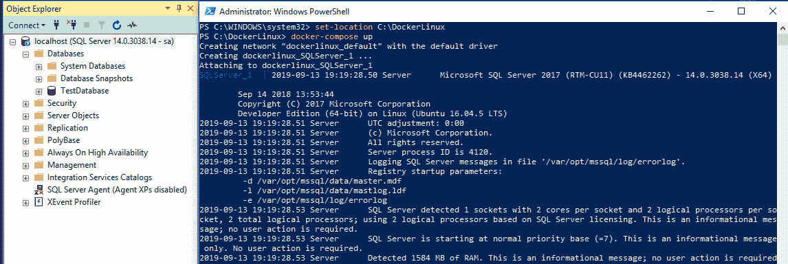](#)

## 结论

当我开始写这篇文章时，我认为我必须学习很多关于 Linux 的知识。当我了解 Linux 的一些细微差别时，我在精神上为自己准备了几天的挫折。想象一下，当我所需要做的只是切换到 Linux 容器、提取不同的映像并更改主机上的路径时，我有多惊讶。我写这篇文章花的时间比启动和运行容器花的时间还多。这是为数不多的几次学习曲线比我预期的低很多的一次。

现在，我可以选择何时需要在本地运行 SQL Server。我可以将它作为 Windows 服务、基于 Windows 的容器或基于 Linux 的容器来运行。有这样的选择真是太棒了。

下次再见，愉快的部署！