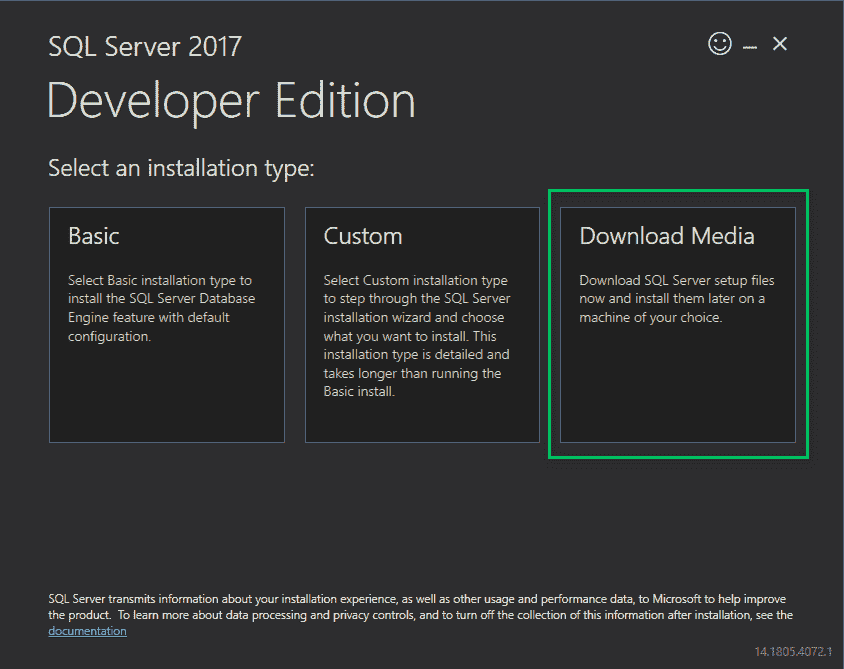
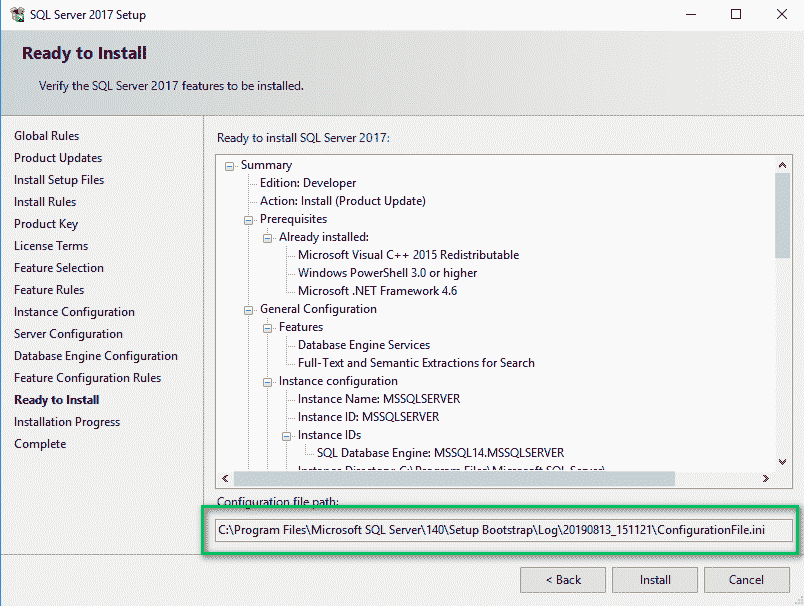

# 自动化 SQL Server Developer 安装- Octopus 部署

> 原文：<https://octopus.com/blog/automate-sql-server-install>

[](#)

几年前，我在一家公司工作，该公司使用 Redgate 的工具大力推动数据库部署自动化。我们选择了专用数据库模型，而不是共享数据库模型，这意味着公司的 100 多名开发人员都必须在他们的笔记本电脑上安装 SQL Server Developer。

我的团队是第一个采用新工具的团队。起初，我们尝试一起浏览安装向导中的每个屏幕，以确保类似的设置，但这不会扩展到 100 多名开发人员，而且我们不想每次有新的开发人员加入组织时都重复这一过程。

幸运的是，您可以使用命令行安装 SQL Server。微软的文档提供了一个很好的起点，但是文档中有很多东西需要消化。我花了相当多的时间让一切都符合我们的标准，但最终，这是值得的努力，并消除了许多潜在的头痛。

在 Octopus，我最近看到我们的一名高级工程师和一名新工程师坐在一起，帮助他们设置系统。当他们在他的机器上安装 SQL Server 时，他们通过 GUI 来选择要选择的选项。

这篇文章提供了一个 PowerShell 的工作示例，它自动安装 SQL Server Developer，使新团队成员的入职过程更加顺畅。

## 下载 SQL Server 开发人员 ISO

首先，您需要下载 SQL Server 开发人员 ISO[。下载完成后，运行。exe 文件，并选择`Download Media`选项下载。iso 文件。](https://www.microsoft.com/en-us/sql-server/sql-server-downloads)

[](#)

我建议把那个。iso 在网络上的共享目录中。这样，您可以创建一个标准的 PowerShell 安装文件供每个人使用。

## SQL server GUI 安装程序

我建议浏览 GUI 安装程序并设置您希望团队中的每个人都使用的选项，但不要使用 GUI 安装 SQL Server。这样做的原因是安装程序在你安装的时候会创建一个`ConfigurationFile.ini`，它会告诉你文件的位置。

[](#)

将`ConfigurationFile.ini`文件从该目录复制到一个新位置。那将是*主*文件的副本供他人使用。

## 修改 ConfigurationFile.ini 文件

我们需要修改*主*T2，以便它可以通过命令行工作。

首先，将静音模式开关切换到`true`并删除 UIMode 条目。

旧的配置文件:

```
QUIET="False"

; Setup will display progress only, without any user interaction.

QUIETSIMPLE="False"

; Parameter that controls the user interface behavior. Valid values are Normal for the full UI,AutoAdvance for a simplied UI, and EnableUIOnServerCore for bypassing Server Core setup GUI block.

UIMODE="Normal"

; Specify whether SQL Server Setup should discover and include product updates. The valid values are True and False or 1 and 0\. By default SQL Server Setup will include updates that are found. 
```

更新的配置文件:

```
QUIET="True"

; Setup will display progress only, without any user interaction.

QUIETSIMPLE="False"

; Parameter that controls the user interface behavior. Valid values are Normal for the full UI,AutoAdvance for a simplied UI, and EnableUIOnServerCore for bypassing Server Core setup GUI block. 
```

接下来，加上`IACCEPTSQLSERVERLICENSETERMS="True"`。我将我的添加到文件的顶部:

```
;SQL Server 2017 Configuration File
[OPTIONS]

IACCEPTSQLSERVERLICENSETERMS="True" 
```

接下来，我们需要更新当前用户帐户，该帐户在实例上设置为 admin。如您所见，该文件显示了我的当前用户:

```
; Windows account(s) to provision as SQL Server system administrators.

SQLSYSADMINACCOUNTS="HOME\bob.walker"

; The default is Windows Authentication. Use "SQL" for Mixed Mode Authentication.

SECURITYMODE="SQL" 
```

这意味着任何人谁使用这个将有我作为管理员。幸运的是，我们正在通过 PowerShell 运行它，所以在运行安装程序之前，我们可以用当前用户替换一些文本。

```
; Windows account(s) to provision as SQL Server system administrators.

SQLSYSADMINACCOUNTS="##MyUser##"

; The default is Windows Authentication. Use "SQL" for Mixed Mode Authentication.

SECURITYMODE="SQL" 
```

最后，如果我们看看文件的底部，我们可以看到 TCP 和命名数据管道被禁用:

```
; Specify 0 to disable or 1 to enable the TCP/IP protocol.

TCPENABLED="0"

; Specify 0 to disable or 1 to enable the Named Pipes protocol.

NPENABLED="0"

; Startup type for Browser Service.

BROWSERSVCSTARTUPTYPE="Automatic" 
```

在我的开发机器上，我喜欢启用 TCP 和命名管道。这样做让我的生活轻松了很多，尤其是当我试图得到。NET 来连接它。对于我的配置，我选择混合模式身份验证，这意味着我需要添加 SA 密码。默认情况下，安装程序将 SQL Server 设置为仅使用集成安全性。我个人的偏好是为我的开发机器启用这两种模式。如果您选择仅保留集成安全性，则不必添加 SA 密码:

```
; Specify 0 to disable or 1 to enable the TCP/IP protocol.

TCPENABLED="1"

; Specify 0 to disable or 1 to enable the Named Pipes protocol.

NPENABLED="1"

; Startup type for Browser Service.

BROWSERSVCSTARTUPTYPE="Automatic"

; SQL Password

SAPWD="CHANGE THIS PASSWORD" 
```

变化真大。要查看完整的示例文件，请访问 GitHub repo，在那里您将看到为这篇博文创建的示例[configuration file . ini]]([https://GitHub . com/OctopusSamples/SQL server install/blob/master/configuration file . ini](https://github.com/OctopusSamples/SQLServerInstall/blob/master/ConfigurationFile.ini))文件。

## PowerShell 脚本

在本例中，我们将从 PowerShell 运行安装程序。PowerShell 让我们能够很好地控制正在发生的事情，并提供了一些有用的内置命令来挂载和卸载 ISO 文件。

我们希望 PowerShell 脚本能够:

1.  将母版`ConfigurationFile.ini`复制到临时位置。
2.  将##MyUser##替换为克隆的`ConfigurationFile.ini`中的当前用户。
3.  装载映像。
4.  运行安装程序。
5.  捕获安装程序的输出，并将其写入 shell。
6.  卸载图像。

**请注意**:PowerShell 脚本将要运行一个安装程序。因此，您必须以管理员身份运行该脚本。

```
 $isoLocation = ## Put the location here
$pathToConfigurationFile = ## Path to original file here
$copyFileLocation = "C:\Temp\ConfigurationFile.ini"
$errorOutputFile = "C:\Temp\ErrorOutput.txt"
$standardOutputFile = "C:\Temp\StandardOutput.txt"

Write-Host "Copying the ini file."

New-Item "C:\Temp" -ItemType "Directory" -Force
Remove-Item $errorOutputFile -Force
Remove-Item $standardOutputFile -Force
Copy-Item $pathToConfigurationFile $copyFileLocation -Force

Write-Host "Getting the name of the current user to replace in the copy ini file."

$user = "$env:UserDomain\$env:USERNAME"

write-host $user

Write-Host "Replacing the placeholder user name with your username"
$replaceText = (Get-Content -path $copyFileLocation -Raw) -replace "##MyUser##", $user
Set-Content $copyFileLocation $replaceText

Write-Host "Mounting SQL Server Image"
$drive = Mount-DiskImage -ImagePath $isoLocation

Write-Host "Getting Disk drive of the mounted image"
$disks = Get-WmiObject -Class Win32_logicaldisk -Filter "DriveType = '5'"

foreach ($disk in $disks){
 $driveLetter = $disk.DeviceID
}

if ($driveLetter)
{
 Write-Host "Starting the install of SQL Server"
 Start-Process $driveLetter\Setup.exe "/ConfigurationFile=$copyFileLocation" -Wait -RedirectStandardOutput $standardOutputFile -RedirectStandardError $errorOutputFile
}

$standardOutput = Get-Content $standardOutputFile -Delimiter "\r\n"

Write-Host $standardOutput

$errorOutput = Get-Content $errorOutputFile -Delimiter "\r\n"

Write-Host $errorOutput

Write-Host "Dismounting the drive."

Dismount-DiskImage -InputObject $drive

Write-Host "If no red text then SQL Server Successfully Installed!" 
```

## 安装后

运行该脚本后，您将拥有 SQL Server Developer Edition 的全新安装。接下来，您需要决定什么将创建您的应用程序将连接到的数据库，以及根据身份验证模式，什么应该创建数据库用户？如果您的应用程序在找不到现有数据库的情况下创建了一个空数据库，您可以跳过下一节。

对于其他人，您的 PowerShell 脚本需要创建空的数据库和用户。根据您使用的数据库部署工具，您可能能够自动创建模式。我不能为每个数据库部署工具提供脚本，但是我可以提供脚本来创建数据库、用户帐户，并将该用户分配给新创建的数据库。您可以在这篇博文的示例 GitHub repo 中找到这些脚本:

## 解决纷争

安装程序的输出非常冗长。如果出现故障，请准备好滚动输出，找出故障发生的原因。好消息是安装程序非常善于让你知道哪里出错了。

如果出于某种原因，PowerShell 脚本没有输出安装日志，那么您需要找到它。通常在`C:\Program Files\Microsoft SQL Server\[Version]\Setup Bootstrap\Log\[DateTimeStamp]\`发现。该路径取决于您正在安装的版本以及 Microsoft 是否更改了日志文件的目标。版本是内部版本号。例如，SQL Server 2017 是 SQL Server 的版本 14。

## 经验教训

现在，您应该有一个完全自动化的 SQL Server 安装供开发人员运行。在结束这篇文章之前，我想分享一些我把这个脚本交给开发人员后学到的经验。

第一个教训是现实的期望有多重要。在很大程度上，脚本第一次运行是正确的；对于新安装的 Windows 来说尤其如此。计算机的年龄和我在运行这个脚本时看到的问题数量之间似乎有直接的关联。一些开发人员已经安装了一个旧版本的 SQL Server，而另一些开发人员安装应用程序时使用了一个奇怪的 D:\驱动器。

这就引出了我的第二课。我想尽可能地帮助遇到问题的开发人员，我花时间研究和修改脚本，以涵盖许多不同的场景。最终，我意识到一些开发人员的机器有如此独特的配置，花费时间和精力更新脚本来解决它是没有意义的。为了说明这一点，我提供了关于选择哪些选项的文档，如果需要，我会和开发人员坐在一起，通过 GUI 向他们演示。谢天谢地，这只是少数开发者的情况。

## 结论

尽管我们遇到了一些问题，安装还是成功的。我们在几周内就在整个公司推广了这一技术，80%的开发人员在不到 20 分钟的时间内就完成了工作。最终，这是值得的，我们标准化了我们的配置，并提供了一种自动安装 SQL Server Developer 的方法。