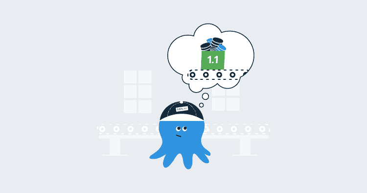
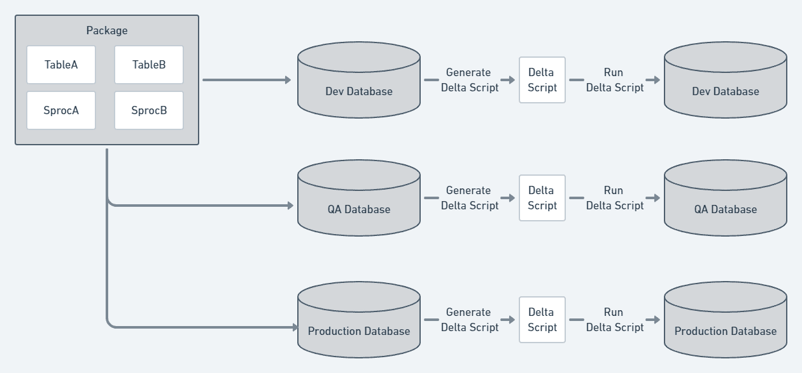
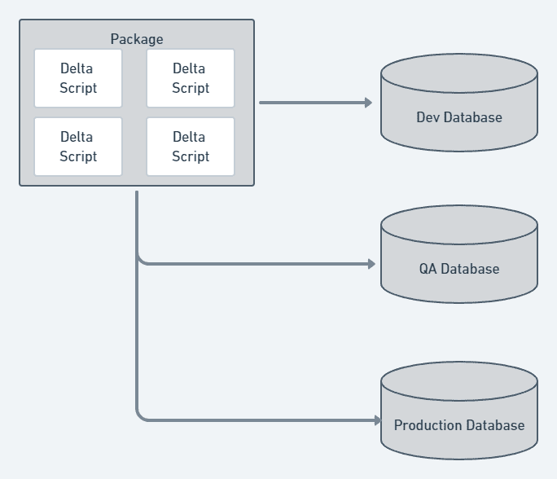
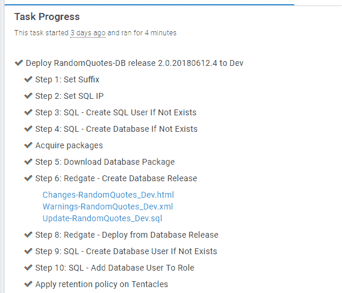

# 数据库部署自动化方法- Octopus Deploy

> 原文：<https://octopus.com/blog/automated-database-deployments-iteration-zero>

希望在阅读完[之后，为什么要考虑数据库部署自动化？](/blog/why-consider-database-deployment-automation)您已经准备好投入数据库部署自动化。根据您的公司，自动化您的数据库部署可能是一个很大的变化，它可能会引起摩擦。摩擦是变化的敌人；摩擦力越高，采用速度越慢。这篇文章的目的是帮助消除这种摩擦。

我用 Microsoft SQL Server 演示了这些原则，但是这些原则也适用于您选择的数据库技术。

这篇文章讨论了以下内容:

## 数据库部署自动化方法

部署数据库可能非常复杂，有多种方法。Octopus Deploy 集成了多种第三方工具和方法，但这种灵活性意味着有很多选择，当您评估第三方工具时，您会发现它们以两种方式之一进行部署，每种方式都有其优缺点。

### 排名第一的基于状态的数据库部署方法

使用基于状态或模型驱动的数据库部署方法，定义数据库的期望状态，并将状态保存到源代码控制中。在部署期间，该工具将所需状态与部署目标进行比较，并生成增量脚本。将为每个环境执行此过程。

数据库所需的状态作为文件存储在源代码管理中。根据您使用的工具，具有所需状态的文件可以是一系列创建脚本、XML 文件或完全不同的东西。重要的是要知道该工具将负责更新和维护这些文件。

#### 基于州的优势

基于状态方法的工具通常与您的 IDE 集成在一起。例如，Redgate 的工具与 SQL Server Management Studio 集成，微软的 SSDT 工具与 Visual Studio 集成。使用 IDE 对模式进行更改，然后由 IDE 的插件接管。它运行一个比较来确定变更和当前在源代码控制中的内容之间的差异。然后，它对文件系统上的必要脚本进行更改。

所有文件系统交互都发生在幕后。该工具跟踪所有的更改，这使您可以专注于数据库的更改和测试。在您测试了这些更改之后，您可以使用该工具来更新源代码控制中的文件。

最后，一些工具允许您将一个表标记为静态数据，数据本身被签入到源代码控制中。在部署期间，该工具将检查目标表中的数据，如果目标表缺少数据或数据不正确，增量脚本将包括数据更改 T-SQL 语句。

#### 基于州的骗局

在每个环境的部署过程中会生成一个唯一的增量脚本。这是因为一个变更可能应用于一个环境(开发)，而不是一个更高的环境(生产前或生产)。这使得工具变得更加复杂，并且每隔一段时间，该工具将生成一个包含意外更改的增量脚本，尤其是在权限设置不正确的情况下。

工具想要控制关于数据库的一切，从表到模式再到用户。您必须配置该工具以忽略数据库的某些部分。

尽管工具很聪明，但它很难处理更复杂的变化。例如，当将一个列从一个表移动到另一个表时，该工具不知道这是您的意图，它将从旧表中删除该列，并在新表中创建一个新的空列。该工具通常包括某种迁移脚本功能，您可以在其中编写自己的迁移脚本，但是迁移脚本有自己的规则，您必须遵守。

这种缺乏控制有时会成为一种负担。您可能最终会创建一个与该工具一起工作的定制流程。例如，该工具可能不支持后期部署脚本，为了获得这一点，您必须创建一个可以打包并发送给 Octopus 的后期部署文件夹。然后，您必须在 Octopus 中更新您的流程，以查找文件夹并运行它找到的任何脚本。它起作用了，但是现在你要负责维护这个过程。

### #2 数据库迁移脚本方法

数据库迁移脚本方法是手写所有必要的增量脚本。这也称为变更驱动或基于脚本。这些脚本被签入源代码控制。在部署期间，该工具将查看哪些迁移脚本尚未在目标数据库上运行，并以特定的顺序运行它们。

#### 迁移脚本优点

使用迁移脚本方法，您可以完全控制所有脚本。当部署变更时，您确切地知道将要运行什么脚本。复杂的变化更容易处理；您只需要编写脚本并将其保存到源代码控制中。一些迁移框架允许您编写代码来进行迁移，以便更容易地实现更复杂的更改。此外，从部署中排除项目要容易得多。只是不要包含您想要排除的项目的脚本。

#### 迁移脚本缺点

基于状态的方法确保整个目标数据库与期望的状态相匹配。基于脚本的方法则不然。可以在进程之外向目标数据库添加一个新表。每个有权更改数据库的人都必须参与并使用这个过程，因为一两个流氓开发人员可能会造成大混乱。

查看特定对象(如表或存储过程)的历史要困难得多。您必须进行搜索以找到对象发生更改的所有文件，而不是转到单个文件并查看历史记录。根据表更改的数量，可能很容易错过关键的更改。

最后，很多开发人员都不是 SQL 开发专家。他们使用 SQL Server Management Studio 用户界面来创建表和索引，他们不知道如何编写大量手工更改。记住 T-SQL 语法需要大量的练习。如果该工具允许您为更复杂的更改编写代码，那么理解语法和规则还有一条学习曲线。

### 选择一种方法

正确的方法是非常主观的。

当下列任一情况适用时，基于状态的方法效果最佳:

*   你正处于一个项目的早期阶段，数据库有很多变动。
*   有多个人/团队在更改数据库。
*   您的公司首次涉足自动化数据库部署。
*   你的代码库由成熟的数据库组成，你不期望有太多的变化。
*   您希望强制开发人员自动遵循该过程(如果对目标数据库进行了更改，并且没有签入，该更改将被删除；对于某人来说，只需要发生一次就可以学会)。
*   大多数将进行更改的开发人员缺乏制作复杂 T-SQL 语句的经验。

迁移脚本方法在以下情况下最有效:

*   每个做出改变的人都足够自律，总是遵循这个过程。
*   进行更改的人有进行复杂数据库更改的经验。
*   你会不断碰到基于州的方法所强加的限制。
*   每个人都想尽可能地控制过程。

如果您最初从基于状态的方法开始，几年后，决定转向变更驱动的方法，不要感到惊讶。当你选择一个供应商，红门，微软等。，确保他们提供的软件套件支持这两种方法。

## 转向专用数据库

无论您选择哪种工具，我都建议将开发人员转移到专用数据库。专用数据库的典型方法是在开发人员的笔记本电脑上安装 SQL Server，这提供了以下优势:

1.  开发人员可以尝试有风险的改变，而不必担心会影响到其他人。如果他们打碎了什么东西，只有一个人会受到影响。
2.  支持分支。对于共享模型，只有一个数据库。如果在没有相应代码更改的情况下对数据库进行了重大更改，那么每个人都将停止工作。现在，所有的更改都可以在一个分支上进行并签入，同时进行部署。
3.  开发人员在准备好的时候应用新的变更。对于共享模型，突破性的变更要求开发人员停止他们正在做的事情，并应用最新的代码变更。有了专用的数据库，他们可以专注于当前的任务，并在准备好使用它的时候进行更改。

共享模式与此相反。当使用共享模型时，您不会获得分支的灵活性；每个人都必须更新他们的代码。不要误解我的意思，共享模型也可以工作，但是它最适合使用静态数据库模式的少数开发人员。随着团队向外扩展，共享模型很快瓦解。

## 沟通

自动化数据库部署引入了一个有趣的挑战。在自动化之前，开发人员可以对共享数据库进行更改，每个人都会立即看到。这使得更难踩到对方的脚趾。但是对于自动化数据库部署和专用数据库，风险要高得多。开发人员 A 可以在他们的分支中对一个表进行更改，开发人员 B 可以在他们的分支中对同一个表进行更改，这两种更改可能会相互冲突。这意味着需要有一种机制让其他人知道正在进行什么样的更改。它可以是一些简单的事情，比如一个松散的信息或者一次日常谈话中的讨论。重要的是确保每个人都在同一页上。

## 建立信任

过去，DBA 是在生产环境中运行脚本的人，因为他们有权限。现在，一个自动化的过程将完成这项工作，这可能真的很可怕。如果出了问题，数据丢失了，就很难恢复。每个人都必须信任流程和工具。根据我的经验，建立信任的最佳方式是使用 Octopus Deploy 工件并在 SQL Server 上设置权限。

### 章鱼部署神器

使用 Octopus Deploy [工件](https://octopus.com/docs/deployment-process/artifacts)，您可以创建一个包含所有即将在触手上运行的脚本的文件，并将它上传到服务器。DBA 可以在数据库上运行脚本之前批准它。

在某些情况下，第三方提供的步骤模板直接内置了工件创建。例如，下面是使用 Redgate 部署工具的过程:

【T2 

在部署过程中，它会自动创建工件:

工件通过不允许批准过程来帮助建立信任，但是它也提供了审计历史。三个月后，我可以回到这个部署，查看数据库发生了什么变化。

### 许可

在实现自动化数据库部署时，我听到的一个常见问题是，“我们如何防止有人插入脚本来授予自己 sysadmin 权限？”使用工件是一个好的开始，但并不能完全解决问题。如果 DBA 或审批人员忙得不可开交，他们很容易错过工件中特定的 SQL 语句。防止这种情况发生的最好方法是限制执行部署的帐户的权限。[我们的文档](https://octopus.com/docs/deployment-examples/sql-server-databases#SQLServerdatabases-Permissions)提供了几个例子，从限制性最小到限制性最大。请记住，这些只是建议。我鼓励与你的团队交流，以确定你对什么满意。

## 触手安装在哪里

您不希望将触手直接安装在 SQL Server 上。SQL Server 通常是一个集群或高可用性组，触角将尝试同时将更改应用到所有节点。您不希望让部署 Windows 服务或 IIS web 应用程序的触角处理数据库部署。那些触角可能在非军事区。触手应该在特定的服务帐户下运行，并具有执行部署所需的权限。大多数工具利用端口 1433，并简单地运行一系列 T-SQL 脚本。触手可以安装在任何机器上，只要它连接到数据库。出于这些原因，我建议您使用位于 Octopus Deploy 和 SQL Server 之间的跳转框。

请参考我们的文档了解更多信息。

## 结论

乍一看，这似乎需要做很多准备工作，但重要的是要记住这些是指导方针。不要花几周的时间讨论和辩论，拿出一个初步的计划，迭代。在这个过程的开始，我们花了大约两天时间讨论和研究我们的初步计划。

我对此的建议是:

1.  讨论上述项目，并提出一个初步计划。
2.  建立一个试验团队来迭代任何问题。
3.  等待试点团队成功部署到生产环境中。
4.  一次一个地向其他项目推广。如果每次你把它推广到一个新项目时，你遇到一些新的东西，需要做一些改变，不要感到惊讶。
5.  不要害怕接触和询问专家。我们可以提供一些初步的指导，但有时，你会需要更多的帮助。在这种情况下，有几家公司提供咨询服务，可以提供帮助。

* * *

数据库部署自动化系列文章: