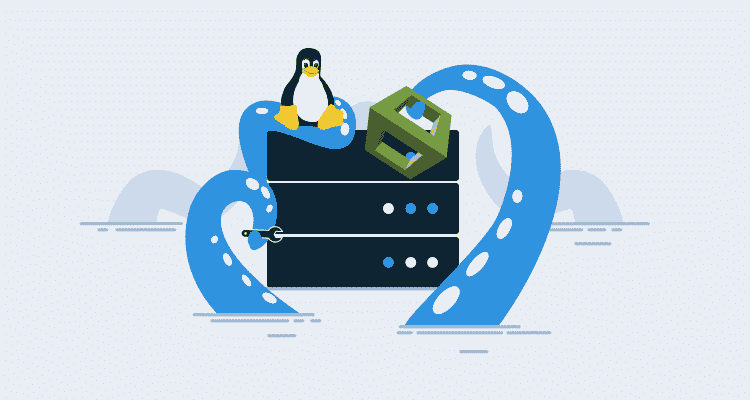
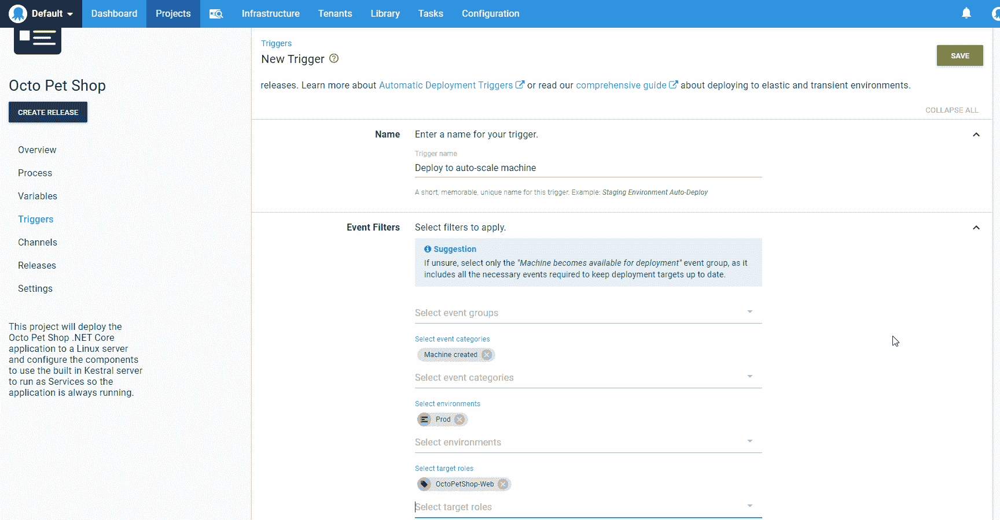

# 使用 CloudFormation 模板为 Linux 安装自动化触手——Octopus Deploy

> 原文：<https://octopus.com/blog/automating-linux-tentacle-with-cloudformation>

[](#)

在一个具有扩展能力的基于云的应用程序的世界中，实现基础架构自动化至关重要。Amazon Web Services (AWS)通过提供 CloudFormation 模板来自动提供基于云的资源，从而消除了繁重的工作，但是您仍然需要一种方法来自动将新创建的 EC2 实例连接到 Octopus Deploy，以便可以部署您的应用程序和服务。在这篇文章中，我将演示在使用基于 Linux 的 EC2 实例时，如何为 Linux 安装和配置一个触手。

## CloudFormation 模板中的用户数据

AWS 在 CloudFormation 模板中提供了一个部分，我们可以在其中包含一个名为 UserData 的脚本。在这个例子中，我创建了一个 EC2 Linux 实例来托管一个. NET 核心应用程序 [OctoPetShop](https://github.com/OctopusSamples/OctoPetShop) 。为此，我需要:

*   为 Linux 安装触手。
*   配置触手。
*   在我的章鱼服务器上注册触手。
*   创建单位文件。
*   将触手配置为作为 Linux 服务运行。
*   安装。网芯。

### 为 Linux 安装触手

在提供 EC2 实例之后，我们需要为 Linux 安装触手。首先，我们将 Octopus 公钥和 Octopus 存储库添加到 apt 的授权列表中。在这些命令运行之后，我们可以安装用于 Linux 的触手:

```
sudo apt-key adv --fetch-keys https://apt.octopus.com/public.key # Add Octopus public key to apt
sudo add-apt-repository "deb https://apt.octopus.com/ stretch main" # Add Octopus repository to apt
sudo apt-get update # Make sure everything else is up-to-date
sudo apt-get install tentacle # Install Tentacle for Linux 
```

### 配置触手

当处理可以动态启动的云托管虚拟机(VM)时，将触手配置为轮询触手是最有意义的，这样我们就不必处理那么多防火墙配置:

```
serverUrl="https://YourOctopusServer" # Url to our Octopus server
serverCommsPort=10943 # Port to use for the Polling Tentacle
apiKey="API-XXXXXXXXXXXXXXXXXXXXXXXXXXX" # API key that has permission to add machines
name=$HOSTNAME # Name of the Linux machine
environment="Dev"
role="AWS-MyApplication"
configFilePath="/etc/octopus/default/tentacle-default.config" # Location on disk to store the configuration
applicationPath="/home/Octopus/Applications/" # Location where deployed applications will be installed to

# Create a new Tentacle instance
/opt/octopus/tentacle/Tentacle create-instance --config "$configFilePath"

# Create a new self-signed certificate for secure communication with Octopus server
/opt/octopus/tentacle/Tentacle new-certificate --if-blank

# Configure the Tentacle specifying it is not a listening Tentacle and setting where deployed applications go
/opt/octopus/tentacle/Tentacle configure --noListen True --reset-trust --app "$applicationPath" 
```

### 向 Octopus 服务器注册触手

既然我们已经配置了触手，我们需要向 Octopus 服务器注册它。该脚本使用了上一节中定义的一些变量:

```
# Display that we’re going to register the Tentacle and to where with environments and roles
echo "Registering the Tentacle $name with server $serverUrl in environment $environment with role $role"

# Register the Tentacle with our Octopus server - note that we've included more environments and roles than the ones defined in variables above
/opt/octopus/tentacle/Tentacle register-with --server "$serverUrl" --apiKey "$apiKey" --name "$name" --env "$environment" --env "TearDown" --role "$role" --role "OctoPetShop-Web" --role "OctoPetShop-ProductService" --role "OctoPetShop-ShoppingCartService" --comms-style "TentacleActive" --server-comms-port $serverCommsPort 
```

### 安装并配置触手作为 Linux 服务运行

接下来，我们将触手配置为在操作系统启动时启动:

```
sudo /opt/octopus/tentacle/Tentacle service --install --start 
```

### 安装。网络核心

我们的脚本需要做的最后一件事是安装。NET 核心，因此我们的`OctoPetShop`应用程序将运行:

```
# Download and install the Microsoft packages
wget -q https://packages.microsoft.com/config/ubuntu/18.04/packages-microsoft-prod.deb -O packages-microsoft-prod.deb
sudo dpkg -i packages-microsoft-prod.deb

# Add universe repository
sudo add-apt-repository universe

# Install apt-transport-https
sudo apt-get install apt-transport-https --assume-yes

# Run an update
sudo apt-get update

# Install .NET core SDK
sudo apt-get install dotnet-sdk-2.2 --assume-yes 
```

## 样本云形成模板

以下节选自 CloudFormation 模板。完整的模板可在 octopus samples[GitHub Repo](https://github.com/OctopusSamples/CloudFormation-LinuxTentacle/blob/master/src/SampleCloudFormation.yaml)中获得。

```
Resources:
  EC2Instance:
    Type: 'AWS::EC2::Instance'
    Properties:
      InstanceType: !Ref InstanceType
      SecurityGroups:
        - !Ref InstanceSecurityGroup
      KeyName: !Ref KeyName
      ImageId: ami-06f2f779464715dc5
      UserData:
        Fn::Base64:
          !Sub |
            #!/bin/bash -xe
            serverUrl="https://YourOctopusServer"
            serverCommsPort=10943
            apiKey="API-XXXXXXXXXXXXXXXXXXXXXXXXXXX"
            name=$HOSTNAME
            environment="Dev"
            role="AWS-MyApplication"
            configFilePath="/etc/octopus/default/tentacle-default.config"
            applicationPath="/home/Octopus/Applications/"

            sudo apt-key adv --fetch-keys https://apt.octopus.com/public.key
            sudo add-apt-repository "deb https://apt.octopus.com/ stretch main"
            sudo apt-get update
            sudo apt-get install tentacle

            /opt/octopus/tentacle/Tentacle create-instance --config "$configFilePath"
            /opt/octopus/tentacle/Tentacle new-certificate --if-blank
            /opt/octopus/tentacle/Tentacle configure --noListen True --reset-trust --app "$applicationPath"
            echo "Registering the Tentacle $name with server $serverUrl in environment $environment with role $role"
            /opt/octopus/tentacle/Tentacle register-with --server "$serverUrl" --apiKey "$apiKey" --name "$name" --env "$environment" --env "TearDown" --role "$role" --role "OctoPetShop-Web" --role "OctoPetShop-ProductService" --role "OctoPetShop-ShoppingCartService" --comms-style "TentacleActive" --server-comms-port $serverCommsPort

            sudo /opt/octopus/tentacle/Tentacle service --install --start

            wget -q https://packages.microsoft.com/config/ubuntu/18.04/packages-microsoft-prod.deb -O packages-microsoft-prod.deb
            sudo dpkg -i packages-microsoft-prod.deb

            sudo add-apt-repository universe
            sudo apt-get install apt-transport-https --assume-yes
            sudo apt-get update
            sudo apt-get install dotnet-sdk-2.2 --assume-yes 
```

## 添加项目触发器

我们可以进一步自动化，在 Octopus 项目中使用[项目触发器](https://octopus.com/docs/deployment-process/project-triggers)来配置`OctoPetShop`应用程序，以便在新机器可用时自动部署。

[](#)

## 结论

现在，任何时候使用这个 CloudFormation 模板创建一个新的 EC2 实例，它都会自动下载、安装和配置用于 Linux 的触手，将触手连接到您的 Octopus 服务器，将触手设置为 Linux 服务，并安装。NET Core 使我们的新实例准备好托管`OctoPetShop`应用程序。