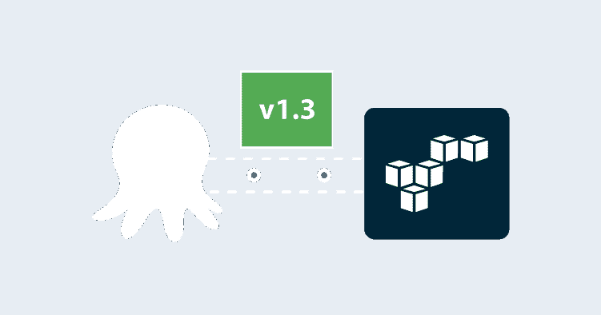
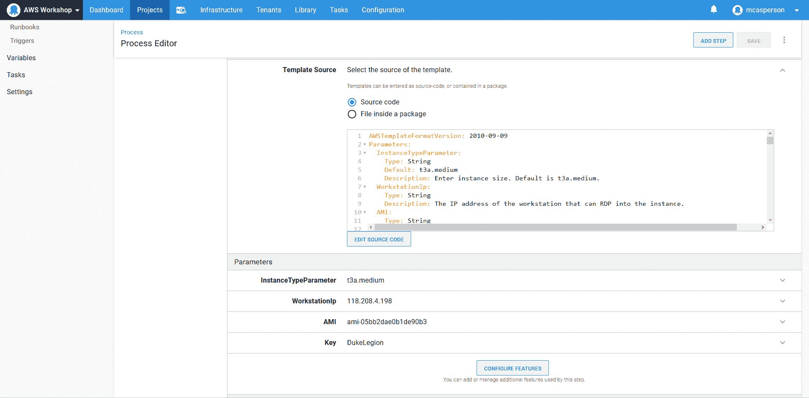
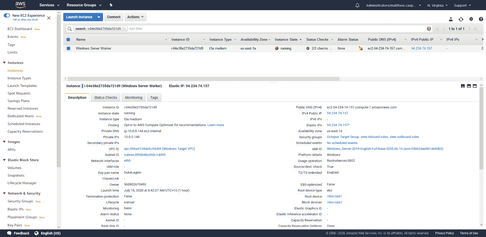

# 使用 CloudFormation - Octopus Deploy 在 AWS 中创建 EC2 实例

> 原文：<https://octopus.com/blog/aws-cloudformation-ec2-examples>

[](#)

云平台为开发人员和运营人员带来了一些非常有用的工作流。启动用于测试的临时基础架构的能力消除了维护本地虚拟机的负担，并意味着您可以扩展测试，以包括许多不同容量的机器，安全地知道您不会用洪水般的流量淹没企业网络。

在过去的美好时光中，“经典”AWS 在单一的共享网络空间中创建 EC2 虚拟机。这使得创建虚拟机变得非常容易，因为几乎不需要网络配置。

如今，最佳实践要求即使一台虚拟机也需要 VPC、互联网网关、安全组、子网和路由表。

在这篇博客文章中，我们将研究两个 CloudFormation 模板，以在它们自己的 VPC 中创建 Windows 和 Linux EC2 实例。

免费试用 Octopus，自动化您的 AWS 部署。

## Windows CloudFormation 模板

此示例 CloudFormation 模板在 VPC 中创建了一个 Windows EC2 实例:

```
AWSTemplateFormatVersion: 2010-09-09
Parameters:
  InstanceTypeParameter:
    Type: String
    Default: t3a.medium
    Description: Enter instance size. Default is t3a.medium.
  WorkstationIp:
    Type: String
    Description: The IP address of the workstation that can RDP into the instance.
  AMI:
    Type: String
    Default: ami-05bb2dae0b1de90b3
    Description: The Windows AMI to use.
  Key:
    Type: String
    Description: The key used to access the instance.
Resources:
  VPC:
    Type: AWS::EC2::VPC
    Properties:
      CidrBlock: 10.0.0.0/16
      EnableDnsSupport: true
      EnableDnsHostnames: true
      InstanceTenancy: default
      Tags:
        - Key: Name
          Value: Windows Target VPC
  InternetGateway:
    Type: AWS::EC2::InternetGateway
  VPCGatewayAttachment:
    Type: AWS::EC2::VPCGatewayAttachment
    Properties:
      VpcId: !Ref VPC
      InternetGatewayId: !Ref InternetGateway
  SubnetA:
    Type: AWS::EC2::Subnet
    Properties:
      AvailabilityZone: us-east-1a
      VpcId: !Ref VPC
      CidrBlock: 10.0.0.0/24
      MapPublicIpOnLaunch: true
  RouteTable:
    Type: AWS::EC2::RouteTable
    Properties:
      VpcId: !Ref VPC
  InternetRoute:
    Type: AWS::EC2::Route
    DependsOn: InternetGateway
    Properties:
      DestinationCidrBlock: 0.0.0.0/0
      GatewayId: !Ref InternetGateway
      RouteTableId: !Ref RouteTable
  SubnetARouteTableAssociation:
    Type: AWS::EC2::SubnetRouteTableAssociation
    Properties:
      RouteTableId: !Ref RouteTable
      SubnetId: !Ref SubnetA
  InstanceSecurityGroup:
    Type: AWS::EC2::SecurityGroup
    Properties:
      GroupName: "Octopus Target Group"
      GroupDescription: "Tentacle traffic in from hosted static ips, and RDP in from a personal workstation"
      VpcId: !Ref VPC
      SecurityGroupIngress:
        - IpProtocol: tcp
          FromPort: '10933'
          ToPort: '10933'
          CidrIp:  20.188.245.156/32
        - IpProtocol: tcp
          FromPort: '10933'
          ToPort: '10933'
          CidrIp:  52.147.25.42/32 
        - IpProtocol: tcp
          FromPort: '10933'
          ToPort: '10933'
          CidrIp:  52.147.31.180/32 
        - IpProtocol: tcp
          FromPort: '10933'
          ToPort: '10933'
          CidrIp:  20.188.244.132/32 
        - IpProtocol: tcp
          FromPort: '10933'
          ToPort: '10933'
          CidrIp:  52.147.25.94/32 
        - IpProtocol: tcp
          FromPort: '10933'
          ToPort: '10933'
          CidrIp:  52.147.25.173/32 
        - IpProtocol: tcp
          FromPort: '10933'
          ToPort: '10933'
          CidrIp:  20.188.245.171/32 
        - IpProtocol: tcp
          FromPort: '10933'
          ToPort: '10933'
          CidrIp:  20.188.245.7/32
        - IpProtocol: tcp
          FromPort: '10933'
          ToPort: '10933'
          CidrIp:  20.188.244.147/32
        - IpProtocol: tcp
          FromPort: '10933'
          ToPort: '10933'
          CidrIp:  20.188.244.240/32
        - IpProtocol: tcp
          FromPort: '3389'
          ToPort: '3389'
          CidrIp:  !Sub ${WorkstationIp}/32
      SecurityGroupEgress:
        - IpProtocol: -1
          CidrIp: 0.0.0.0/0
  ElasticIP:
    Type: AWS::EC2::EIP
    Properties:
      Domain: vpc
      InstanceId: !Ref Windows
  Windows:
    Type: 'AWS::EC2::Instance'
    Properties:
      ImageId: !Ref AMI
      InstanceType:
        Ref: InstanceTypeParameter
      KeyName: !Ref Key
      SubnetId: !Ref SubnetA
      SecurityGroupIds:
        - Ref: InstanceSecurityGroup
      BlockDeviceMappings:
        - DeviceName: /dev/sda1
          Ebs:
            VolumeSize: 250
      UserData:
        Fn::Base64: !Sub |
          <powershell>
          Write-Host "Hello World!"
          </powershell>
      Tags:
        -
          Key: Appplication
          Value:  Windows Server
        -
          Key: Domain
          Value: None
        -
          Key: Environment
          Value: Test
        -
          Key: LifeTime
          Value: Transient
        -
          Key: Name
          Value:  Windows Server Worker
        -
          Key: OS
          Value: Windows
        -
          Key: OwnerContact
          Value: "@matthewcasperson"
        -
          Key: Purpose
          Value: MattC Test Worker
        -
          Key: Source
          Value: CloudFormation Script in Octopus Deploy
Outputs:
  PublicIp:
    Value:
      Fn::GetAtt:
        - Windows
        - PublicIp
    Description: Server's PublicIp Address 
```

让我们来分解这个代码。

[模板版本](https://docs.aws.amazon.com/AWSCloudFormation/latest/UserGuide/format-version-structure.html)定义为:

```
AWSTemplateFormatVersion: 2010-09-09 
```

最终用户可能定制的任何值都被定义为参数。这里我们公开了四个参数:

*   [实例类型](https://aws.amazon.com/ec2/instance-types/)，它定义了与我们的 VM 相关联的硬件。
*   可以通过远程桌面连接到实例的工作站的 IP 地址。拥有这个 IP 意味着我们可以只限制一个工作站的访问，而不是整个互联网。
*   用于创建虚拟机的 AMI。ami 可以在 [AWS 市场](https://aws.amazon.com/marketplace/search/?filters=VendorId&VendorId=e6a5002c-6dd0-4d1e-8196-0a1d1857229b)找到。
*   用于保护实例的[密钥对](https://docs.aws.amazon.com/AWSEC2/latest/WindowsGuide/ec2-key-pairs.html)。我们希望在帐户中已经创建了一个密钥对:

```
Parameters:
  InstanceTypeParameter:
    Type: String
    Default: t3a.medium
    Description: Enter instance size. Default is t3a.medium.
  WorkstationIp:
    Type: String
    Description: The IP address of the workstation that can RDP into the instance.
  AMI:
    Type: String
    Default: ami-05bb2dae0b1de90b3
    Description: The Windows AMI to use.
  Key:
    Type: String
    Description: The key used to access the instance. 
```

模板的下一部分定义了要创建的资源。

我们从一个 [VPC](https://aws.amazon.com/vpc/) 开始，它本质上是一个保存我们资源的隔离网段。该 VPC 将保存`10.0.0.0/16`范围内的私有 IP 地址:

```
Resources:
  VPC:
    Type: AWS::EC2::VPC
    Properties:
      CidrBlock: 10.0.0.0/16
      EnableDnsSupport: true
      EnableDnsHostnames: true
      InstanceTenancy: default
      Tags:
        - Key: Name
          Value: Windows Target VPC 
```

为了让我们的 EC2 访问互联网，我们需要一个[互联网网关](https://docs.aws.amazon.com/vpc/latest/userguide/VPC_Internet_Gateway.html):

```
 InternetGateway:
    Type: AWS::EC2::InternetGateway 
```

然后将互联网网关连接到 VPC:

```
 VPCGatewayAttachment:
    Type: AWS::EC2::VPCGatewayAttachment
    Properties:
      VpcId: !Ref VPC
      InternetGatewayId: !Ref InternetGateway 
```

在 VPC 内部，我们可以有一个或多个[子网](https://docs.aws.amazon.com/vpc/latest/userguide/VPC_Subnets.html)。虽然 VPC 可以跨越多个可用性区域，但是子网是单个 AZ 中的网络地址范围。我们正在创建一个 EC2 实例，因此我们只创建一个子网来容纳它:

```
 SubnetA:
    Type: AWS::EC2::Subnet
    Properties:
      AvailabilityZone: us-east-1a
      VpcId: !Ref VPC
      CidrBlock: 10.0.0.0/24
      MapPublicIpOnLaunch: true 
```

流量路由由[路由表](https://docs.aws.amazon.com/vpc/latest/userguide/VPC_Route_Tables.html)处理:

```
 RouteTable:
    Type: AWS::EC2::RouteTable
    Properties:
      VpcId: !Ref VPC 
```

然后，我们将所有外部流量路由到互联网网关。这将为我们的 EC2 实例提供互联网访问:

```
 InternetRoute:
    Type: AWS::EC2::Route
    DependsOn: InternetGateway
    Properties:
      DestinationCidrBlock: 0.0.0.0/0
      GatewayId: !Ref InternetGateway
      RouteTableId: !Ref RouteTable 
```

路由表随后与子网相关联。其流量通过互联网网关路由的任何子网被称为[公共子网](https://docs.aws.amazon.com/vpc/latest/userguide/VPC_Subnets.html):

```
 SubnetARouteTableAssociation:
    Type: AWS::EC2::SubnetRouteTableAssociation
    Properties:
      RouteTableId: !Ref RouteTable
      SubnetId: !Ref SubnetA 
```

进出 EC2 实例的流量由一个安全组[控制。下面的规则允许在端口`10933`(监听触手端口)上访问我托管的 Octopus 实例可以使用的所有静态 IP](https://docs.aws.amazon.com/vpc/latest/userguide/VPC_SecurityGroups.html)[。](https://octopus.com/docs/octopus-cloud/static-ip)

远程桌面访问被允许从一个特定的工作站通过端口`3389`进入。这意味着只有一个工作站可以远程登录。

我们还允许所有出站流量:

这些 IP 地址将根据您的具体 Octopus Cloud 实例而变化，因此请参考[文档](https://octopus.com/docs/octopus-cloud/static-ip)中适用于您的列表。

```
 InstanceSecurityGroup:
    Type: AWS::EC2::SecurityGroup
    Properties:
      GroupName: "Octopus Target Group"
      GroupDescription: "Tentacle traffic in from hosted static ips, and RDP in from a personal workstation"
      VpcId: !Ref VPC
      SecurityGroupIngress:
        - IpProtocol: tcp
          FromPort: '10933'
          ToPort: '10933'
          CidrIp:  20.188.245.156/32
        - IpProtocol: tcp
          FromPort: '10933'
          ToPort: '10933'
          CidrIp:  52.147.25.42/32 
        - IpProtocol: tcp
          FromPort: '10933'
          ToPort: '10933'
          CidrIp:  52.147.31.180/32 
        - IpProtocol: tcp
          FromPort: '10933'
          ToPort: '10933'
          CidrIp:  20.188.244.132/32 
        - IpProtocol: tcp
          FromPort: '10933'
          ToPort: '10933'
          CidrIp:  52.147.25.94/32 
        - IpProtocol: tcp
          FromPort: '10933'
          ToPort: '10933'
          CidrIp:  52.147.25.173/32 
        - IpProtocol: tcp
          FromPort: '10933'
          ToPort: '10933'
          CidrIp:  20.188.245.171/32 
        - IpProtocol: tcp
          FromPort: '10933'
          ToPort: '10933'
          CidrIp:  20.188.245.7/32
        - IpProtocol: tcp
          FromPort: '10933'
          ToPort: '10933'
          CidrIp:  20.188.244.147/32
        - IpProtocol: tcp
          FromPort: '10933'
          ToPort: '10933'
          CidrIp:  20.188.244.240/32
        - IpProtocol: tcp
          FromPort: '3389'
          ToPort: '3389'
          CidrIp:  !Sub ${WorkstationIp}/32
      SecurityGroupEgress:
        - IpProtocol: -1
          CidrIp: 0.0.0.0/0 
```

监听触角需要静态主机名或 IP 地址。虽然我们的 EC2 实例在创建时将获得一个公共 IP 地址，但是如果实例停止并再次启动，该地址将会改变。为了确保实例总是有一个静态 IP 地址，我们创建了一个[弹性 IP](https://docs.aws.amazon.com/AWSEC2/latest/UserGuide/elastic-ip-addresses-eip.html) :

```
 ElasticIP:
    Type: AWS::EC2::EIP
    Properties:
      Domain: vpc
      InstanceId: !Ref Windows 
```

我们现在已经创建了托管 EC2 实例所需的所有网络，该实例具有 Internet 访问和静态 IP。现在我们创建 EC2 实例。

我们通过`BlockDeviceMappings`部分给了这个 EC2 实例一个更大的硬盘，而`UserData`部分保存了一个在启动时运行的[脚本。这个示例脚本不做任何事情，但是如果需要的话可以被替换:](https://docs.aws.amazon.com/AWSEC2/latest/WindowsGuide/ec2-windows-user-data.html)

```
 Windows:
    Type: 'AWS::EC2::Instance'
    Properties:
      ImageId: !Ref AMI
      InstanceType:
        Ref: InstanceTypeParameter
      KeyName: !Ref Key
      SubnetId: !Ref SubnetA
      SecurityGroupIds:
        - Ref: InstanceSecurityGroup
      BlockDeviceMappings:
        - DeviceName: /dev/sda1
          Ebs:
            VolumeSize: 250
      UserData:
        Fn::Base64: !Sub |
          <powershell>

          </powershell>
      Tags:
        -
          Key: Appplication
          Value:  Windows Server
        -
          Key: Domain
          Value: None
        -
          Key: Environment
          Value: Test
        -
          Key: LifeTime
          Value: Transient
        -
          Key: Name
          Value:  Windows Server Worker
        -
          Key: OS
          Value: Windows
        -
          Key: OwnerContact
          Value: "@matthewcasperson"
        -
          Key: Purpose
          Value: MattC Test Worker
        -
          Key: Source
          Value: CloudFormation Script in Octopus Deploy 
```

输出捕获实例 ID 和实例可用的弹性公共 IP:

```
Outputs:
  PublicIp:
    Value:
      Fn::GetAtt:
        - Windows
        - PublicIp
    Description: Server's PublicIp Address 
```

现在，我们可以在 Octopus 中通过**部署 AWS CloudFormation 模板**步骤来部署该模板:

[](#)

结果是在一个孤立的 VPC 出现了一个新的 EC2 实例:

[](#)

## Linux CloudFormation 模板

创建 Linux 虚拟机的模板非常相似:

```
AWSTemplateFormatVersion: 2010-09-09
Parameters:
  InstanceTypeParameter:
    Type: String
    Default: t3a.medium
    Description: Enter instance size. Default is t3a.medium.
  WorkstationIp:
    Type: String
    Description: The IP address of the workstation that can SSH into the instance.
  AMI:
    Type: String
    Default: ami-08f3d892de259504d
    Description: The Linux AMI to use.
  Key:
    Type: String
    Description: The key used to access the instance.
Resources:
  VPC:
    Type: AWS::EC2::VPC
    Properties:
      CidrBlock: 10.0.0.0/16
      EnableDnsSupport: true
      EnableDnsHostnames: true
      InstanceTenancy: default
      Tags:
        - Key: Name
          Value: Linux VPC
  InternetGateway:
    Type: AWS::EC2::InternetGateway
  VPCGatewayAttachment:
    Type: AWS::EC2::VPCGatewayAttachment
    Properties:
      VpcId: !Ref VPC
      InternetGatewayId: !Ref InternetGateway
  SubnetA:
    Type: AWS::EC2::Subnet
    Properties:
      AvailabilityZone: us-east-1a
      VpcId: !Ref VPC
      CidrBlock: 10.0.0.0/24
      MapPublicIpOnLaunch: true
  RouteTable:
    Type: AWS::EC2::RouteTable
    Properties:
      VpcId: !Ref VPC
  InternetRoute:
    Type: AWS::EC2::Route
    DependsOn: InternetGateway
    Properties:
      DestinationCidrBlock: 0.0.0.0/0
      GatewayId: !Ref InternetGateway
      RouteTableId: !Ref RouteTable
  SubnetARouteTableAssociation:
    Type: AWS::EC2::SubnetRouteTableAssociation
    Properties:
      RouteTableId: !Ref RouteTable
      SubnetId: !Ref SubnetA
  InstanceSecurityGroup:
    Type: AWS::EC2::SecurityGroup
    Properties:
      GroupName: "Internet Group"
      GroupDescription: "SSH and web traffic in, all traffic out."
      VpcId: !Ref VPC
      SecurityGroupIngress:
        - IpProtocol: tcp
          FromPort: '10933'
          ToPort: '10933'
          CidrIp:  20.188.245.156/32
        - IpProtocol: tcp
          FromPort: '10933'
          ToPort: '10933'
          CidrIp:  52.147.25.42/32 
        - IpProtocol: tcp
          FromPort: '10933'
          ToPort: '10933'
          CidrIp:  52.147.31.180/32 
        - IpProtocol: tcp
          FromPort: '10933'
          ToPort: '10933'
          CidrIp:  20.188.244.132/32 
        - IpProtocol: tcp
          FromPort: '10933'
          ToPort: '10933'
          CidrIp:  52.147.25.94/32 
        - IpProtocol: tcp
          FromPort: '10933'
          ToPort: '10933'
          CidrIp:  52.147.25.173/32 
        - IpProtocol: tcp
          FromPort: '10933'
          ToPort: '10933'
          CidrIp:  20.188.245.171/32 
        - IpProtocol: tcp
          FromPort: '10933'
          ToPort: '10933'
          CidrIp:  20.188.245.7/32
        - IpProtocol: tcp
          FromPort: '10933'
          ToPort: '10933'
          CidrIp:  20.188.244.147/32
        - IpProtocol: tcp
          FromPort: '10933'
          ToPort: '10933'
          CidrIp:  20.188.244.240/32
        - IpProtocol: tcp
          FromPort: '22'
          ToPort: '22'
          CidrIp:  !Sub ${WorkstationIp}/32
      SecurityGroupEgress:
        - IpProtocol: -1
          CidrIp: 0.0.0.0/0
  ElasticIP:
    Type: AWS::EC2::EIP
    Properties:
      Domain: vpc
      InstanceId: !Ref Linux
  Linux:
    Type: 'AWS::EC2::Instance'
    Properties:
      SubnetId: !Ref SubnetA
      ImageId: !Ref AMI
      InstanceType:
        Ref: InstanceTypeParameter
      KeyName: !Ref Key
      SecurityGroupIds:
        - Ref: InstanceSecurityGroup
      BlockDeviceMappings:
        - DeviceName: /dev/xvda
          Ebs:
            VolumeSize: 250
      Tags:
        -
          Key: Appplication
          Value: Linux Server
        -
          Key: Domain
          Value: None
        -
          Key: Environment
          Value: Test
        -
          Key: LifeTime
          Value: Transient
        -
          Key: Name
          Value: Linux Server
        -
          Key: OS
          Value: Linux
        -
          Key: OwnerContact
          Value: "@matthewcasperson"
        -
          Key: Purpose
          Value: Support Test Instance
        -
          Key: Source
          Value: CloudForation Script in Octopus Deploy
      UserData:
        Fn::Base64: |
          #cloud-boothook
          #!/bin/bash
          echo "Hello World!"
Outputs:
  PublicIp:
    Value:
      Fn::GetAtt:
        - Linux
        - PublicIp
    Description: Server's PublicIp Address 
```

该模板的大部分内容与 Windows 模板相同。有一些小差异值得一提:

*   `InstanceSecurityGroup`现在定义了一个规则，允许工作站在端口`22` (SSH)而不是端口`3389` (RDP)上。
*   EC2 实例中的`BlockDeviceMappings`改变它映射到 Linux 主机的路径。
*   `UserData`脚本现在是 Bash 脚本，而不是 PowerShell。

## 结论

这些模板多年来为我提供了很好的服务，作为 AWS 中自助服务 Windows 和 Linux 虚拟机的一种方式。通过创建一个 VPC 来保存虚拟机，我们可以访问更新的实例类型，这些类型[不支持 EC2-Classic 环境](https://docs.aws.amazon.com/AWSEC2/latest/UserGuide/ec2-classic-platform.html)。VPC 还允许我们创建两个或更多可以相互通信但仍与任何其他虚拟机隔离的虚拟机。