# 将容器部署到 AWS Fargate - Octopus Deploy

> 原文：<https://octopus.com/blog/aws-fargate>

[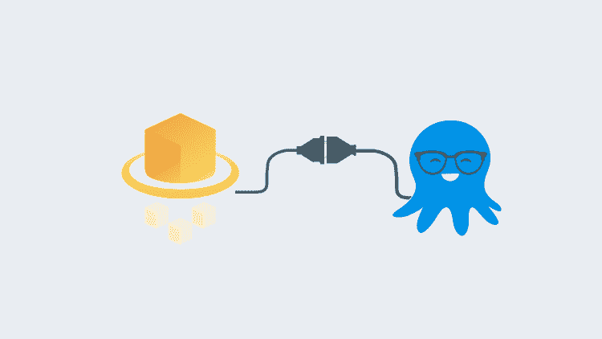](#)

亚马逊网络服务(AWS) Fargate 已经成为部署容器化应用的流行技术，而无需担心后端基础设施管理。我的团队经常被问到，你能用 Octopus Deploy 搭配 AWS Fargate 吗？答案是，可以！不仅可以使用 Fargate，还可以使用 AWS 弹性容器注册中心(ECR)作为 Octopus Deploy 的外部提要。在本文中，我使用 TeamCity、ECR、Octopus Deploy 和弹性容器服务(ECS) Fargate 演示了整个 CI/CD 管道。

## 创建 AWS 资源

对于这篇文章，我们需要在 AWS 中创建一些资源:

*   资格证书
*   ECR 回购
*   VPC
*   子网
*   安全组
*   ECS 集群

### 创建 AWS 凭据

TeamCity 和 Octopus Deploy 都需要凭证才能使用 AWS 服务。您需要做的第一件事是登录到 [AWS 管理控制台](https://aws.amazon.com/console/)，并使用身份和访问管理(IAM)创建一个帐户。创建帐户后，点击用户，然后点击**安全凭证**来创建一个`Access Key`。

[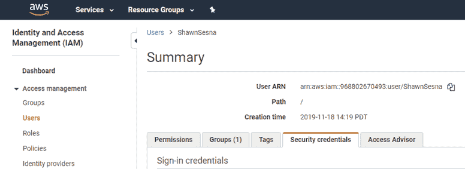](#)

创建访问密钥后，保存`Secret Key`，因为*值只会显示一次*。`Access Key`和`Secret Key`的组合用于向 AWS 认证。

除了 Octopus 将外部 feed 部署到 ECR 之外，可以将 AWS IAM 角色用于 TeamCity 和 Octopus Deploy。因此，这篇文章使用了访问密钥/秘密密钥的方法。

### 检索 AWS ECR 注册表信息

您创建的每一个容器都将在其特定区域的 ECR repo 中结束。回购 URI 由以下部分组成:

```
<RegistryId>.dkr.ecr.<RegionName>.amazonaws.com/<RepoName> 
```

`RegistryId`和`RegionName`将用于我们将在 TeamCity 中创建的连接，当我们标记我们的图像时，将使用整个 URI。

要检索这些值，导航到 AWS 控制台中的**弹性容器注册表**。

在**查找服务**框中输入`ecr`会让你更快到达那里。

如果您没有任何 ECR 存储库，请点击**开始**按钮:

[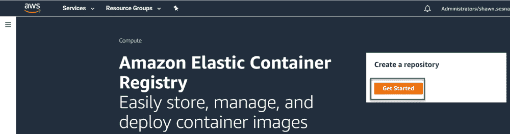](#)

如果您有现有的 ECR 存储库，点击**创建存储库**按钮或复制现有存储库的 URI:

[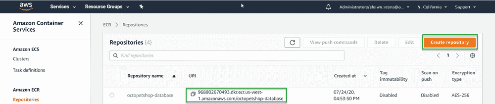](#)

### 创建或使用现有的 VPC

Fargate 不需要唯一的虚拟私有云(VPC)，因此不需要创建新的 VPC；然而，使用现有的 VPC 就可以了。这篇文章假设你已经对 AWS 有了一些了解，并且知道如果需要的话如何创建 VPC。

### 创建或使用现有子网

除了 VPC，Fargate 不需要定义子网。就像 VPC 一样，法盖特可以使用现有的物品。同样，本文假设您已经知道如何根据需要创建子网。

### 创建或使用现有的安全组

您可能需要考虑创建新的安全组，因为您可能需要定义端口来访问您的容器，而这些端口对于其他 AWS 资源来说是不必要的。

Octo Pet Shop 应用程序是一个. NET 核心应用程序，其中 web 前端使用内置的 Kestrel web 服务器，该服务器使用默认端口`5000`。Octo 宠物店前端配置为自动将 HTTP 流量重定向到 HTTPS 和端口`5001`。这两个端口没有被任何其他资源使用，所以我为 Octo Pet Shop 创建了一个新的安全组。

要创建新的安全组，导航到 AWS 控制台中的 **VPC** 服务，并单击左侧的**安全组**。如果您正在关注这篇文章，请为端口`5000`和`5001`创建两个入站规则。

[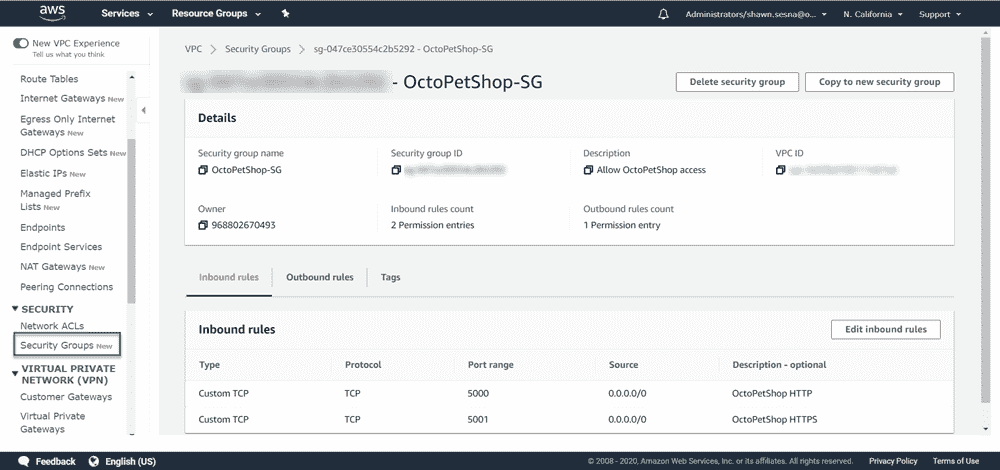](#)

### 创建 ECS 群集

我们需要的最后一个资源是一个 ECS 集群来托管我们的容器。

1.  在 AWS 控制台中导航到 ECS。
2.  选择**创建集群**。
3.  在下一个屏幕上，选择**仅联网**模板。
4.  点击**下一步**。
5.  给你的集群命名，然后点击**创建**。

这个过程非常快，所以最多需要一分钟就可以完成。

随着 AWS 资源的创建，我们可以继续构建了。

## 定义我们的团队建设

在这篇文章中，我使用 TeamCity 作为构建服务器来构建 Octo Pet Shop 应用程序作为 Docker 容器，并将它们推送到 AWS ECR。

### 创建项目连接

为了将我们的容器映像推送到 ECR，我们需要配置一个连接到 AWS ECR 的 TeamCity 项目。这是通过以下步骤实现的:

1.  点击**项目**。
2.  选择要添加连接的项目。
3.  点击**编辑项目**。

[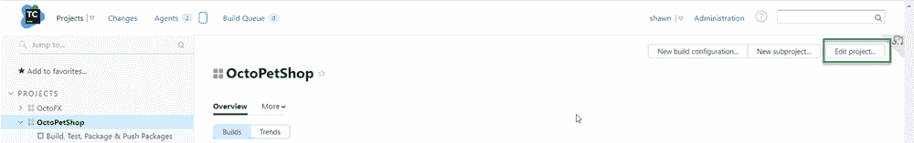](#)

4.  点击**连接**然后**添加连接**。
5.  从下拉菜单中选择`Amazon ECR`，并填写以下值:

*   AWS 区域
*   访问密钥 ID
*   秘密访问密钥
*   注册表 Id

[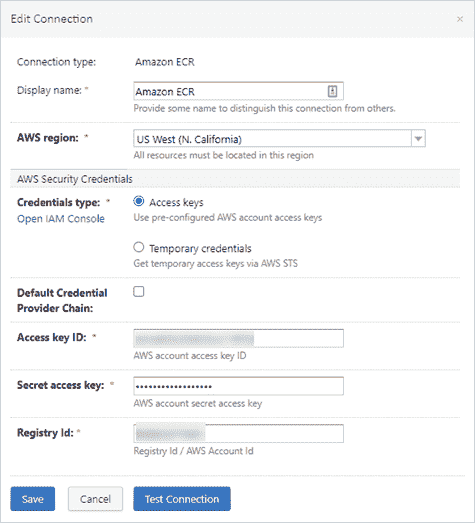](#)

### 启用构建功能

在为 Docker 容器创建了构建定义之后，您需要启用 Docker 支持构建特性。为此，导航到您的构建定义并单击**构建特性**选项卡。点击**添加构建特征**按钮，选择**对接支持**。选择您为 ECR 创建的注册表并点击**保存**。

### 添加您的构建步骤

Octo Pet Shop 应用程序由四个主要组件组成:

*   Web 前端
*   产品服务
*   购物车服务
*   DbUp 数据库迁移器

我的构建只包含六个步骤:

1.  设置版本号
2.  构建网站
3.  建立产品服务
4.  构建购物车服务
5.  构建 DbUp
6.  将 Docker 图像推送到 ECR

第二步到第五步构建各自的 Docker 图像，然后使用下面的模式`octopetshop-<component>:%build.number% 968802670493.dkr.ecr.us-west-1.amazonaws.com/octopetshop-<component>:%build.number%`标记它们。例如，这是 web 前端的标记方式:

```
octopetshop-web:%build.number% 968802670493.dkr.ecr.us-west-1.amazonaws.com/octopetshop-web:%build.number% 
```

第六步在一个步骤中将 Docker 映像推送到 ECR。它不使用`build`选项，而是使用`push`选项，如下所示:

```
968802670493.dkr.ecr.us-west-1.amazonaws.com/octopetshop-web:%build.number%
968802670493.dkr.ecr.us-west-1.amazonaws.com/octopetshop-productservice:%build.number%
968802670493.dkr.ecr.us-west-1.amazonaws.com/octopetshop-shoppingcartservice:%build.number%
968802670493.dkr.ecr.us-west-1.amazonaws.com/octopetshop-database:%build.number% 
```

### 运行构建

执行构建时，您应该会得到类似于以下内容的输出:

```
Step 6/6: Push OctoPetShop-Web (Docker)
15:57:57
  Starting: /bin/sh -c "docker push  968802670493.dkr.ecr.us-west-1.amazonaws.com/octopetshop-web:1.0.20226.225747 && docker push  968802670493.dkr.ecr.us-west-1.amazonaws.com/octopetshop-productservice:1.0.20226.225747 && docker push  968802670493.dkr.ecr.us-west-1.amazonaws.com/octopetshop-shoppingcartservice:1.0.20226.225747 && docker push  968802670493.dkr.ecr.us-west-1.amazonaws.com/octopetshop-database:1.0.20226.225747"
15:57:57
  in directory: /opt/buildagent/work/7f2634c2d5e5df05
15:57:57
  The push refers to repository [968802670493.dkr.ecr.us-west-1.amazonaws.com/octopetshop-web]
15:57:57
  dae5c6c2d080: Preparing
15:57:57
  92dbf6df1786: Preparing
15:57:57
  9d32e62891bc: Preparing
15:57:57
  b22206f4fa7b: Preparing
15:57:57
  b701a024aaa5: Preparing
15:57:57
  0b565516ff7f: Preparing
15:57:57
  91ab7edbc80b: Preparing
15:57:57
  9262398ff7bf: Preparing
15:57:57
  804aae047b71: Preparing
15:57:57
  5d33f5d87bf5: Preparing
15:57:57
  4e38024e7e09: Preparing
15:57:57
  0b565516ff7f: Waiting
15:57:57
  91ab7edbc80b: Waiting
15:57:57
  9262398ff7bf: Waiting
15:57:57
  804aae047b71: Waiting
15:57:57
  5d33f5d87bf5: Waiting
15:57:57
  4e38024e7e09: Waiting
15:58:00
  b22206f4fa7b: Pushed
15:58:01
  9d32e62891bc: Pushed
15:58:01
  dae5c6c2d080: Pushed
15:58:04
  92dbf6df1786: Pushed
15:58:16
  804aae047b71: Pushed
15:58:16
  91ab7edbc80b: Pushed
15:58:31
  5d33f5d87bf5: Pushed
15:58:52
  0b565516ff7f: Pushed
15:58:56
  9262398ff7bf: Pushed
15:59:02
  4e38024e7e09: Pushed
15:59:24
  b701a024aaa5: Pushed 
```

将图像推送到 ECR 后，我们可以跳到 Octopus Deploy 来创建部署流程。

## 章鱼部署

为了使用在我们的部署过程中被推送到 ECR 的图像，我们需要在 Octopus Deploy 中配置一个指向我们的 ECR 注册中心的外部提要。

### 创建 ECR 外部进料

在 Octopus Deploy 中创建外部提要非常容易。首先，导航到**库**，然后选择**外部馈送**。在**外部进给**屏幕上，点击**添加进给**。从下拉框中选择 **AWS 弹性容器注册表**，并填写以下内容:

*   名字
*   存取关键字
*   秘密钥匙
*   地区

然后点击**保存**。

### 创建 AWS 帐户

因为我使用访问密钥/秘密密钥组合方法对 AWS 进行认证，所以我需要在 Octopus 中创建一个 AWS 帐户来引用。

1.  导航至**基础设施**，然后点击**账户**。
2.  在**账户**屏幕上，点击**添加账户**按钮并选择 **AWS 账户**。
3.  填写所需的值:

*   名字
*   存取关键字
*   秘密钥匙

4.  点击**保存**。

### 定义部署流程

这篇文章假设你对 Octopus Deploy 足够熟悉，可以创建一个[项目](https://octopus.com/docs/projects)，并将重点放在部署的 AWS Fargate 特定组件上。

#### 变量

在开始添加步骤之前，我们首先需要添加一些在流程中使用的变量。我创建了一个库变量集来保存 AWS 的公共变量:

*   `AWS.Account`:这引用了我们在创建 AWS 帐户部分创建的 AWS 帐户。
*   `AWS.Region.name`:我们正在使用的地区名称。
*   `AWS.SecurityGroup.Id`:我们为 Octo 宠物店创建的安全组的 ID。
*   (可选)`AWS.Subnet1.Id`:要使用的子网 1 的 ID。
*   (可选)`AWS.Subnet.Id`:要使用的子网 2 的 ID。

其余的变量是项目变量:

*   `Project.AWS.ECS.Cluster.Name`:集群名称(如`OctpousSamples-ECS`)。
*   `Project.AWS.ECS.Service.Name`:要创建或更新的服务的名称(例如`octopetshop`)。
*   `Project.AWS.Task.Database.Name`:任务定义的数据库容器的名称(如`octopetshop-database`)。
*   `Project.AWS.Task.ProductService.Name`:任务定义的产品服务容器的名称(如`octopetshop-productservice`)。
*   `Project.AWS.Task.ShoppingCartService.Name`:任务定义的购物车服务容器的名称(如`octopetshop-shoppingcartservice`)。
*   `Project.AWS.Task.Web.Name`:任务定义的 web 容器名称(如`octopetshop-web`)。
*   `Project.Container.Environment.ConnectionString`:用作容器环境变量的数据库连接字符串(如`Data Source=localhost;Initial Catalog=OctoPetShop; User ID=#{Project.Database.User.Name}; Password=#{Project.Database.User.Password}`)。
*   `Project.Database.User.Name`:数据库连接的用户名(如`sa`)。
*   `Project.Database.User.Password`:数据库连接的密码(如`My$uper$3cretPassw0rd!`)。

#### 步伐

以下过程可以通过使用[部署 Amazon ECS 服务](https://octopus.com/blog/octopus-release-2021-q4#ecs-integration)步骤来替代(参见我们的[示例](https://samples.octopus.app/app#/Spaces-103/projects/aws-ecs/deployments/process)以获取详细信息。)下面的脚本步骤是出于历史目的而保留的。

这个部署将包括两个步骤，它们都使用**运行一个 AWS CLI 脚本**。在撰写本文时，还没有任何 ECS 或 Fargate 特定的模板可用。

*   创建任务定义
*   运行任务

##### 创建任务定义

此步骤为 ECS 运行创建任务定义。为了部署我们上传到 ECR 的图像，这个步骤将所有的图像作为包引用添加进来。这允许将来自 ECR 的图像添加到 Fargate 容器定义集合中。如果被引用的服务不存在，它将创建它，但是如果它存在，它将更新现有的服务。在注册任务定义之后，它将`TaskDefinitionArn`保存到一个输出变量中，以便在下一步中使用:

[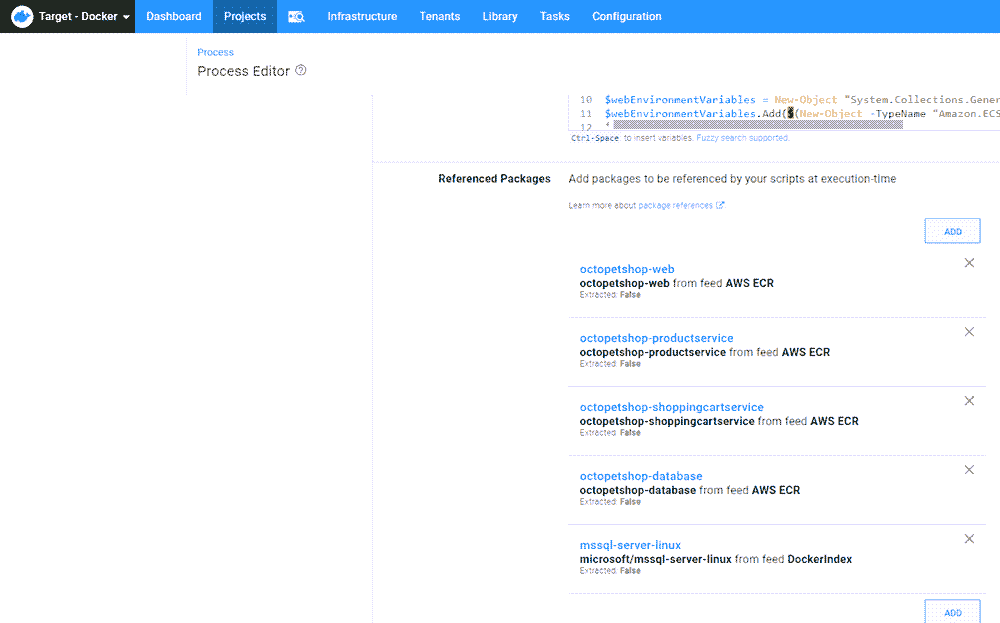](#)

使用 Fargate 时，HostPort 和 ContainerPort 值*必须*匹配，否则将报告错误。

在步骤中引用包时，请务必将其标记为`The package will not be acquired`。

```
$Region = $OctopusParameters["Octopus.Action.Amazon.RegionName"]
$TaskName = $OctopusParameters["Project.AWS.Task.Web.Name"]
$ExecutionRole = $(Get-IAMRole -RoleName "ecsTaskExecutionRole").Arn

# Add web settings
$webPortMappings = New-Object "System.Collections.Generic.List[Amazon.ECS.Model.PortMapping]"
$webPortMappings.Add($(New-Object -TypeName "Amazon.ECS.Model.PortMapping" -Property @{ HostPort=5000; ContainerPort=5000; Protocol=[Amazon.ECS.TransportProtocol]::Tcp}))
$webPortMappings.Add($(New-Object -TypeName "Amazon.ECS.Model.PortMapping" -Property @{ HostPort=5001; ContainerPort=5001; Protocol=[Amazon.ECS.TransportProtocol]::Tcp}))

$webEnvironmentVariables = New-Object "System.Collections.Generic.List[Amazon.ECS.Model.KeyValuePair]"
$webEnvironmentVariables.Add($(New-Object -TypeName "Amazon.ECS.Model.KeyValuePair" -Property @{ Name="ProductServiceBaseUrl"; Value="http://localhost:5011"}))
$webEnvironmentVariables.Add($(New-Object -TypeName "Amazon.ECS.Model.KeyValuePair" -Property @{ Name="ShoppingCartServiceBaseUrl"; Value="http://localhost:5012"}))

$ContainerDefinitions = New-Object "System.Collections.Generic.List[Amazon.ECS.Model.ContainerDefinition]"
$ContainerDefinitions.Add($(New-Object -TypeName "Amazon.ECS.Model.ContainerDefinition" -Property @{ `
Name=$OctopusParameters['Project.AWS.Task.Web.Name'];`
Image=$OctopusParameters["Octopus.Action.Package[octopetshop-web].Image"]; `
PortMappings=$webPortMappings; `
Environment=$webEnvironmentVariables;}))

# Add product service settings
$productServicePortMappings = New-Object "System.Collections.Generic.List[Amazon.ECS.Model.PortMapping]"
$productServicePortMappings.Add($(New-Object -TypeName "Amazon.ECS.Model.PortMapping" -Property @{ ContainerPort=5011; Protocol=[Amazon.ECS.TransportProtocol]::Tcp}))

$serviceEnvironmentVariables = New-Object "System.Collections.Generic.List[Amazon.ECS.Model.KeyValuePair]"
$serviceEnvironmentVariables.Add($(New-Object -TypeName "Amazon.ECS.Model.KeyValuePair" -Property @{ Name="OPSConnectionString"; Value=$OctopusParameters['Project.Container.Environment.ConnectionString']}))

$ContainerDefinitions.Add($(New-Object -TypeName "Amazon.ECS.Model.ContainerDefinition" -Property @{ `
Name=$OctopusParameters['Project.AWS.Task.ProductService.Name']; `
Image=$OctopusParameters["Octopus.Action.Package[octopetshop-productservice].Image"]; `
PortMappings=$productServicePortMappings; `
Environment=$serviceEnvironmentVariables;}))

# Add shopping cart service settings
$shoppingCartServicePortMappings = New-Object "System.Collections.Generic.List[Amazon.ECS.Model.PortMapping]"
$shoppingCartServicePortMappings.Add($(New-Object -TypeName "Amazon.ECS.Model.PortMapping" -Property @{ ContainerPort=5012; Protocol=[Amazon.ECS.TransportProtocol]::Tcp}))

$ContainerDefinitions.Add($(New-Object -TypeName "Amazon.ECS.Model.ContainerDefinition" -Property @{ `
Name=$OctopusParameters['Project.AWS.Task.ShoppingCartService.Name']; `
Image=$OctopusParameters["Octopus.Action.Package[octopetshop-shoppingcartservice].Image"]; `
PortMappings=$shoppingCartServicePortMappings; `
Environment=$serviceEnvironmentVariables;}))

# Add sql server settings
$sqlPortMappings = New-Object "System.Collections.Generic.List[Amazon.ECS.Model.PortMapping]"
$sqlPortMappings.Add($(New-Object -TypeName "Amazon.ECS.Model.PortMapping" -Property @{ HostPort=1433; ContainerPort=1433; Protocol=[Amazon.ECS.TransportProtocol]::Tcp}))

$sqlEnvironmentVariables = New-Object "System.Collections.Generic.List[Amazon.ECS.Model.KeyValuePair]"
$sqlEnvironmentVariables.Add($(New-Object -TypeName "Amazon.ECS.Model.KeyValuePair" -Property @{ Name="ACCEPT_EULA"; Value="Y"}))
$sqlEnvironmentVariables.Add($(New-Object -TypeName "Amazon.ECS.Model.KeyValuePair" -Property @{ Name="SA_PASSWORD"; Value=$OctopusParameters['Project.Database.User.Password']}))

$ContainerDefinitions.Add($(New-Object -TypeName "Amazon.ECS.Model.ContainerDefinition" -Property @{ `
Name="sqlserver"; `
Image=$OctopusParameters["Octopus.Action.Package[mssql-server-linux].Image"]; `
PortMappings=$sqlPortMappings; `
Environment=$sqlEnvironmentVariables;}))

# Add DBUp project
$dbupEnvironmentVariables = New-Object "System.Collections.Generic.List[Amazon.ECS.Model.KeyValuePair]"
$dbupEnvironmentVariables.Add($(New-Object -TypeName "Amazon.ECS.Model.KeyValuePair" -Property @{ Name="DbUpConnectionString"; Value=$OctopusParameters['Project.Container.Environment.ConnectionString']}))

$ContainerDefinitions.Add($(New-Object -TypeName "Amazon.ECS.Model.ContainerDefinition" -Property @{ `
Name="octopetshop-database"; `
Image=$OctopusParameters["Octopus.Action.Package[octopetshop-database].Image"]; `
Essential=$false; `
Environment=$dbupEnvironmentVariables;}))

$TaskDefinition = Register-ECSTaskDefinition `
-ContainerDefinition $ContainerDefinitions `
-Cpu 512 `
-Family $TaskName `
-TaskRoleArn $ExecutionRole `
-ExecutionRoleArn $ExecutionRole `
-Memory 4096 `
-NetworkMode awsvpc `
-Region $Region `
-RequiresCompatibility "FARGATE"

if(!$?)
{
    Write-Error "Failed to register new task definition"
    Exit 0
}

$ClusterName = $OctopusParameters["Project.AWS.ECS.Cluster.Name"]
$ServiceName = $OctopusParameters["Project.AWS.ECS.Service.Name"]

# Check to see if there is a service already
$service = (Get-ECSService -Cluster $ClusterName -Service $ServiceName)

if ($service.Services.Count -eq 0)
{
    Write-Host "Service $ServiceName doesn't exist, creating ..."
    $ServiceCreate = New-ECSService `
        -Cluster $ClusterName `
        -ServiceName $ServiceName `
        -TaskDefinition $TaskDefinition.TaskDefinitionArn `
        -DesiredCount 1 `
        -AwsvpcConfiguration_Subnet @($OctopusParameters['AWS.Subnet1.Id'], $OctopusParameters['AWS.Subnet2.Id']) `
        -AwsvpcConfiguration_SecurityGroup @($OctopusParameters['AWS.SecurityGroup.Id'])
}
else
{
    $ServiceUpdate = Update-ECSService `
        -Cluster $ClusterName `
        -ForceNewDeployment $true `
        -Service $ServiceName `
        -TaskDefinition $TaskDefinition.TaskDefinitionArn `
}

if(!$?)
{
    Write-Error "Failed to register new task definition"
    Exit 0
}

# Save task definition to output variable
Set-OctopusVariable -Name "TaskDefinitionArn" -Value $TaskDefinition.TaskDefinitionArn 
```

##### 运行任务

注册任务定义后，我们使用另一个`Run an AWS CLI script`步骤来创建在 Fargate 中运行的任务:

```
# Assign local variables
$clusterName = $OctopusParameters['Project.AWS.ECS.Cluster.Name']
$securityGroups = @($OctopusParameters['AWS.SecurityGroup.Id'])
$subnets = @($OctopusParameters['AWS.Subnet1.Id'], $OctopusParameters['AWS.Subnet2.Id'])
$taskDefinitionArn = $OctopusParameters['Octopus.Action[Create task definition].Output.TaskDefinitionArn']

# Create launch type object
$launchType = $(New-Object -TypeName "Amazon.ECS.Launchtype" -ArgumentList "FARGATE")

# Create Public IP object
$assignPublicIp = $(New-Object -TypeName "Amazon.ECS.AssignPublicIp" -ArgumentList "ENABLED")

# Create new task
New-ECSTask -Cluster $clusterName `
    -AwsvpcConfiguration_SecurityGroup $securityGroups `
    -AwsvpcConfiguration_Subnet $subnets `
    -TaskDefinition $taskDefinitionArn `
    -LaunchType $launchType `
    -AwsvpcConfiguration_AssignPublicIp $assignPublicIp 
```

[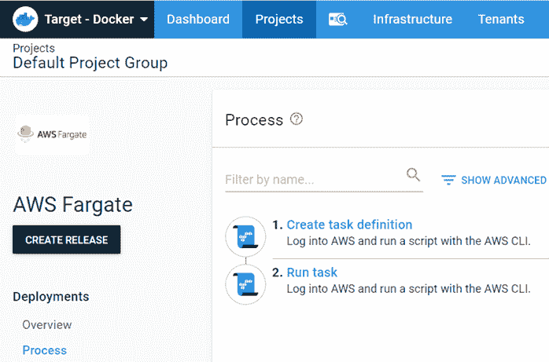](#)

#### 部署

部署完成后，您将看到部署的任务摘要:

[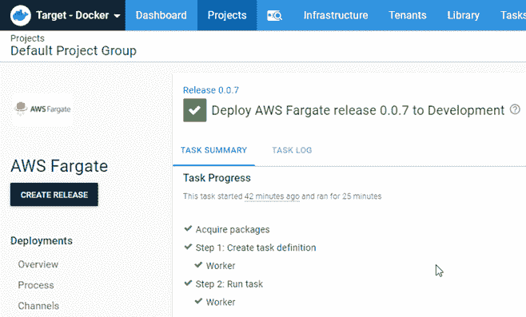](#)

## 法尔盖特

部署完成后，任务将显示为挂起状态。给任务一些时间达到运行状态。在数据库容器达到停止状态后，Octo Pet Shop 应用程序将可用。

【T2 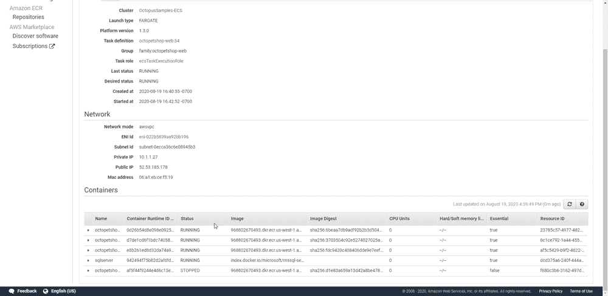

此时，我们可以打开浏览器，进入`http://[PublicIP]:5000`。在此导航会自动将我们重定向到`https://[PublicIP]:5001`。你会看到一个关于无效证书的警告，但是 Octo 宠物店使用的是自签名证书，所以这个警告是正常的，去 Octo 宠物店是安全的！

[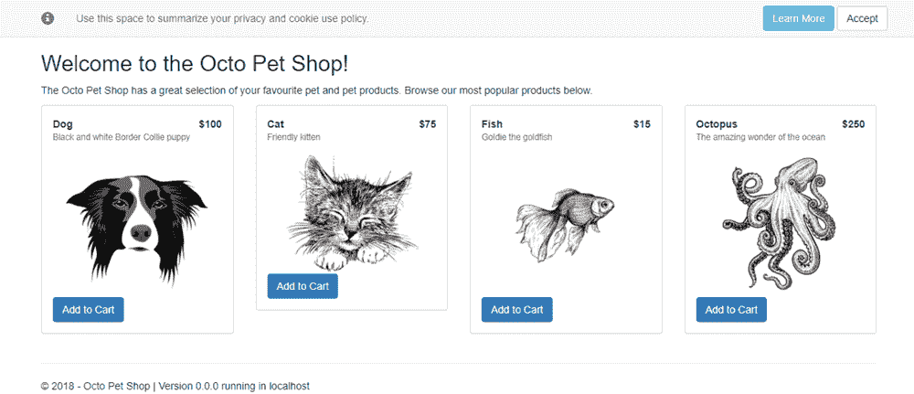](#)

## 结论

在本文中，我带您创建了一个 CI/CD 流程，将 Octo Pet Shop 应用程序部署到 AWS Fargate。
愉快的部署！