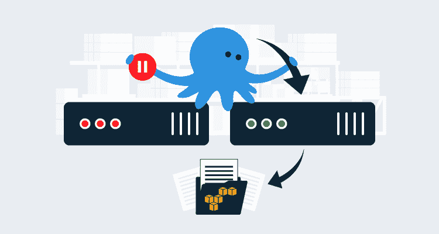
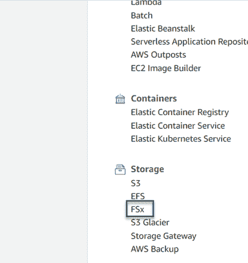
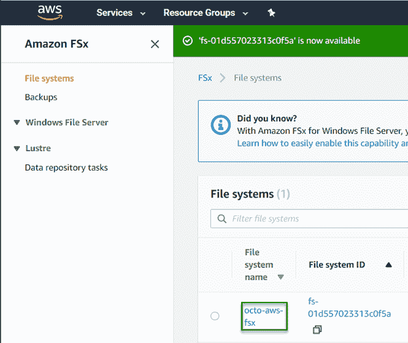
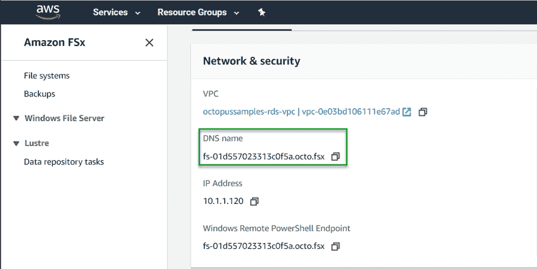
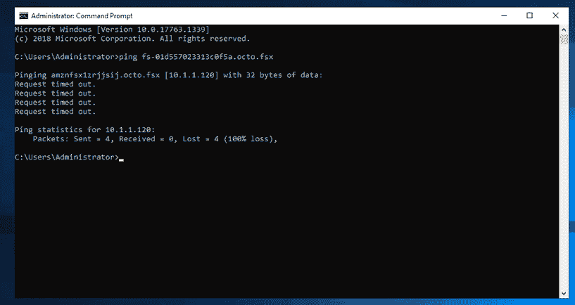

# 使用 AWS FSx - Octopus Deploy 配置 Octopus 服务器高可用性

> 原文：<https://octopus.com/blog/aws-fsx-ha>

[](#)

当你为 Octopus 在 AWS 上配置[高可用性时，你需要像微软 DFS 这样的共享存储(如文档所述)或者你可以使用亚马逊的 FSx。在本文中，我演示了如何将 FSx 与安装在 EC2 实例上的 Octopus Deploy 一起使用。](https://octopus.com/docs/administration/high-availability/configuring-octopus-for-high-availability#shared-storage-in-amazon-aws)

## 亚马逊 FSx

FSx 是一种网络文件系统，有两种类型:

在这篇文章中，我们使用 FSx 的 Windows 文件服务器。

## 配置 FSx

像许多其他亚马逊 AWS 产品一样，FSx 附带了一个方便易用的配置向导。首先，打开您的 [AWS 管理控制台](https://aws.amazon.com/console)并点击位于存储类别下的 FSx。

与 AWS 拥有的其他文件存储选项不同，用于 Windows 文件服务器的 FSx**需要** Active Directory。如果您正在创建活动目录，请注意活动目录服务不是免费的，请参考他们的[定价](https://aws.amazon.com/directoryservice/pricing/)页面了解详情。

### 步骤 1:选择文件系统类型

这个过程的第一步是选择您将要使用的文件系统类型。如前所述，您的选择是:

*   用于 Windows 文件服务器的 FSx
*   这篇文章使用的是 Windows 文件服务器的 FSx。

### 步骤 2:指定文件系统详细信息

接下来，您将定义由几个部分组成的文件系统细节。

#### 文件系统详细信息

本节定义了以下内容:

*   部署类型
*   存储类型
    *   （同 solid-statedisk）固态（磁）盘
    *   HDD(单 AZ 文件系统不支持)
*   存储容量(最低 32 GB)

#### 网络与安全

在本部分中，您将选择网络和安全组(防火墙)组件:

*   VPC
*   VPC 安全集团
*   子网络

#### Windows 身份验证

对于此部分，您需要选择活动目录的详细信息。您可以选择:

*   AWS 管理的 Microsoft Active Directory
*   自我管理的 Microsoft Active Directory

您还可以创建新的活动目录(如果使用 AWS 管理的 Microsoft 活动目录)。

#### 加密

这是您定义加密密钥的部分，以便您的数据在静态时得到保护。您的选择是:

接下来的两个部分是可选的:

*   备份和维护首选项
*   标签

### 步骤 3:检查和创建

该过程的最后一步是在创建之前检查您为文件服务器选择的选项。在此页面上，它将向您显示在创建文件系统后哪些选项可以更改，哪些不能编辑。当您对自己的选择感到满意时，点击**创建文件系统**。

## 连接到共享

创建 FSx 文件系统后，它将在 Active Directory 网络上可用。

### 获取 DNS 名称

为了连接到共享，我们需要知道端点是什么。创建文件系统后，单击`Storage`类别下的`FSx`:

[](#)

找到您创建的文件系统，然后单击名称链接:

[](#)

复制文件系统共享的 DNS 名称:

[](#)

### 连接到 FSx

现在我们有了 FSx 文件系统的 DNS 名称，我们可以使用该 DNS 名称连接到它。

RDP 呼叫章鱼服务器。登录后，打开命令提示符，并确保通过 pinging 名称可以访问 FSx 文件系统:

[](#)

根据您的安全组，ping 命令可能会失败，但我们可以看到它解析到了正确的 IP 地址。现在我们知道 EC2 实例可以找到 FSx 文件系统，打开一个文件资源管理器窗口，UNC 到 FSx。FSx 的默认共享名是简单的`share`，所以您的 UNC 命令将如下所示:

```
\\fs-01d557023313c0f5a.octo.fsx\share 
```

## 配置 Octopus Deploy 以使用 FSx

一旦配置完成，FSx 就像一个文件服务器。这意味着您加入域的 EC2 实例可以通过 UNC 引用它。使用配置[高可用性(HA)](https://octopus.com/docs/administration/high-availability/configuring-octopus-for-high-availability) 共享存储的指导，我们可以将 Octopus 存储工件、任务日志、内置存储库和遥测数据的位置从 EC2 实例转移到 FSx。配置共享存储有两个选项:

*   设置根共享存储目录。
*   单独设置每个目录。

要设置共享存储根目录，请执行以下操作:

```
Octopus.Server.exe path --clusterShared \\fs-01d557023313c0f5a.octo.fsx\share 
```

要单独设置每个文件夹:

```
Octopus.Server.exe path --artifacts \\fs-01d557023313c0f5a.octo.fsx\share\Artifacts
Octopus.Server.exe path --taskLogs \\fs-01d557023313c0f5a.octo.fsx\share\TaskLogs
Octopus.Server.exe path --nugetRepository \\fs-01d557023313c0f5a.octo.fsx\share\Packages
Octopus.Server.exe path --telemetry \\fs-01d557023313c0f5a.octo.fsx\share\Telemetry 
```

如果您的 Octopus 服务器不是一个全新的实例，您需要将工件、任务日志和包文件夹中的内容复制到新的位置，以便它们在 Octopus 中显示。

现在，您的 Octopus 服务器使用共享位置，您就可以添加新节点来配置 HA 了！

## 结论

在这篇文章中，我向您展示了如何创建和配置 AWS FSx，并将其与 Octopus Deploy 连接。愉快的部署！