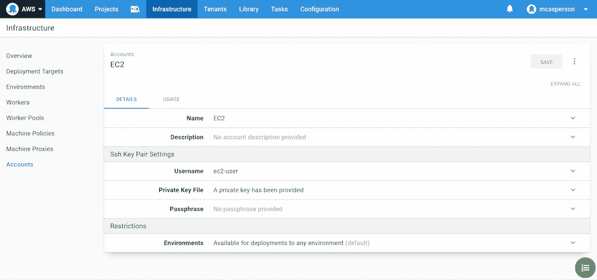
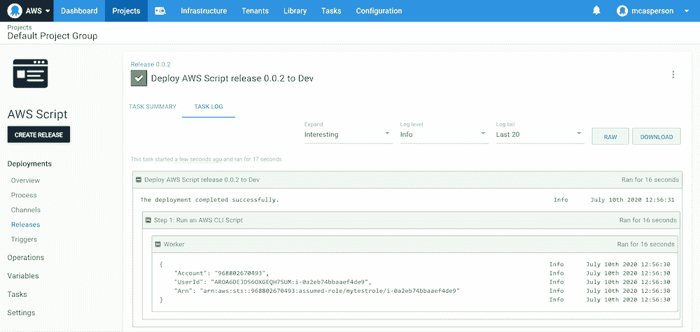

# 在 Octopus - Octopus 部署中使用 AWS IAM 角色

> 原文：<https://octopus.com/blog/aws-iam-roles>

[](#)

管理云提供商的凭证是一项挑战，尤其是当您考虑到您没有足够的物理安全性时，这意味着一个泄露的管理密钥就可以允许从世界任何地方访问您的整个帐户。云帐户也不能幸免于众所周知的“rm -rf”场景，即管理员帐户意外删除了他们不应该删除的资源。

IAM 角色可用于提供特定于任务的授权，当角色被分配给 EC2 实例时，有权访问该 VM 的用户可以继承该角色。

在这篇博文中，我们将看看 AWS 中的 IAM 角色，并了解如何在 Octopus 中使用它们。

## 创建一个角色

可以在 AWS IAM 控制台中创建角色。当您创建一个新角色时，您将看到该角色将应用到的服务列表。在默认选择 **AWS 服务**的情况下，点击 **EC2** 链接:

[](#)

我们不会为该角色附加任何权限或标签，因此请跳到最后，为该角色命名并创建它:

[](#)

打开新创建的角色，点击**信任关系**选项卡，点击**编辑信任关系**:

[](#)

信任关系是一个 JSON 结构，它配置哪个服务或用户可以继承角色。因为我们在创建角色时选择了 EC2 服务，所以 EC2 服务被授予了承担该角色的能力:

```
{
  "Version": "2012-10-17",
  "Statement": [
    {
      "Effect": "Allow",
      "Principal": {
        "Service": "ec2.amazonaws.com"
      },
      "Action": "sts:AssumeRole"
    }
  ]
} 
```

## 将角色分配给 EC2 实例

在创建新的 EC2 实例时，可以将该角色分配给它:

[](#)

当您登录到这个实例时，可以从[实例元数据](https://docs.aws.amazon.com/AWSEC2/latest/UserGuide/ec2-instance-metadata.html) HTTP 接口获得分配给虚拟机的角色名称，命令如下:

```
curl http://169.254.169.254/latest/meta-data/iam/security-credentials/ 
```

我们还可以通过 AWS CLI 使用以下命令来验证角色:

```
aws sts get-caller-identity 
```

在这两种情况下，我们都看到了角色 **mytestrole** :

[](#)

这意味着知道实例元数据 HTTP 接口的工具可以使用分配给 EC2 实例的角色进行操作。只要您能够访问 VM，就可以使用关联的 IAM 角色与 AWS 进行交互。

AWS CLI 是了解实例元数据的工具的一个例子，Octopus Tentacles 和 Workers 是另一个例子。我们可以利用 EC2 IAM 角色和 Octopus Workers 在没有任何 AWS 凭证的情况下对 AWS 服务运行命令。

## EC2 作为八达通工人

为了连接到 Linux 虚拟机，我们需要用创建虚拟机时使用的证书创建一个 **SSH 密钥对**帐户。对于使用 Amazon AMIs 创建的虚拟机，用户名为 **ec2-user** :

[](#)

然后，我们可以创建一个 SSH 工作线程并连接到虚拟机:

[](#)

现在，我们可以添加一个**运行 AWS CLI 脚本**步骤，设置脚本在包含我们刚刚创建的 worker 的 Worker 池上运行，并选择选项**使用 AWS 服务角色执行 EC2 实例**:

[](#)

现在，如果我们在这个脚本中运行命令`aws sts get-caller-identity`，我们会看到与之前相同的结果:

[](#)

我们现在能够执行部署和脚本，而不需要通过 Worker 和 IAM 角色共享 AWS 凭据，它从底层虚拟机中承担 IAM 角色。

## 承担 Kubernetes 目标的角色

使用 Octopus 2020.4.0，还可以使用与虚拟机关联的 IAM 角色与 EKS 集群进行交互。

但是，为了让 IAM 角色在 Kubernetes 集群中拥有任何权限，我们需要将 IAM 角色映射到 Kubernetes 角色。这个映射是在`kube-system`名称空间中的`aws-auth`配置映射中完成的。

该文件的默认内容类似于下面的例子。但是，请注意，现有的角色映射特定于每个 EKS 集群，因为它允许分配给节点的角色访问集群。您需要从集群中修改配置映射，而不是复制并粘贴如下所示的配置映射，因为直接使用此示例会导致错误:

```
apiVersion: v1
data:
  mapRoles: |
    - groups:
      - system:bootstrappers
      - system:nodes
      rolearn: arn:aws:iam::968802670493:role/eksctl-k8s-cluster-nodegroup-ng-1-NodeInstanceRole-1FI6JXPS9MDWK
      username: system:node:{{EC2PrivateDNSName}}
  mapUsers: |
    []
kind: ConfigMap
metadata:
  name: aws-auth
  namespace: kube-system 
```

在我的例子中，我在`mytestrole` IAM 角色和 Kubernetes `system:masters`角色之间添加了一个新的角色映射:

```
apiVersion: v1
data:
  mapRoles: |
    - groups:
      - system:bootstrappers
      - system:nodes
      rolearn: arn:aws:iam::968802670493:role/eksctl-k8s-cluster-nodegroup-ng-1-NodeInstanceRole-1FI6JXPS9MDWK
      username: system:node:{{EC2PrivateDNSName}}
    - rolearn: arn:aws:iam::968802670493:role/mytestrole
      username: admin
      groups:
        - system:masters
  mapUsers: |
    []
kind: ConfigMap
metadata:
  name: aws-auth
  namespace: kube-system 
```

在应用了这个配置映射之后，我们可以使用 EC2 实例的 AWS 服务角色将我们的 Kubernetes 目标配置为**执行**:

[](#)

我们还需要确保目标使用 Worker 连接到应用了 IAM 角色的 EC2 实例:

[](#)

我们的 Kubernetes 目标现在将在没有任何 AWS 凭证的情况下完成运行状况检查，取而代之的是，使用分配给虚拟机的 IAM 角色，工作人员连接到:

[](#)

## 结论

在本文中，我们创建了一个可以分配给 EC2 实例的 IAM 角色。我们登录到 EC2 实例，并验证 AWS CLI 显示本地用户具有 EC2 角色。然后，我们将一个 Worker 连接到 EC2 实例，并从 Octopus 运行 AWS CLI 脚本和 Kubernetes 健康检查，Octopus 还承担了分配给 EC2 实例的角色。

为 EC2 实例分配角色是消除共享 AWS 凭证需求的一种便捷方式，在 Octopus 2020.4 中，在 steps 和 Kubernetes 目标中提供了对承担这些角色的完全支持。