# 使用 Octopus - Octopus Deploy 部署 AWS SAM 模板

> 原文：<https://octopus.com/blog/aws-sam-and-octopus>

[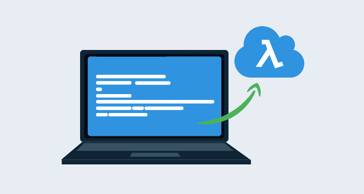](#)

随着微服务等开发模式越来越受欢迎，云提供商正在大力投资无服务器计算平台，作为管理和执行许多小型独立应用程序的一种方式。

AWS 无服务器应用程序模型(AWS SAM)将部署无服务器应用程序时常用的 AWS 服务联系在一起。AWS SAM 构建在 CloudFormation 之上，删除了许多常见的样板代码，使得无服务器应用程序的部署变得快速而简单。

在这篇博客文章中，我们将探讨如何从 AWS SAM 提供的简单部署流程过渡到 Octopus 中跨多个环境的可重复部署。

这篇博文的源代码是[这里](https://github.com/OctopusDeploy/AWSSamExample)。

## Hello World 应用程序

我们将从使用 SAM CLI 工具创建的 Python Hello World 应用程序开始。创建该应用程序的过程记录在[这里](https://docs.aws.amazon.com/serverless-application-model/latest/developerguide/serverless-getting-started-hello-world.html#serverless-getting-started-hello-world-initialize)。

由 SAM CLI 命令`sam init --runtime python3.7`和`sam build`生成的样本代码已经提交给了一个 [GitHub repo](https://github.com/OctopusDeploy/AWSSamExample) ，我们将使用这个 repo 作为我们部署过程的起点。

## 用 Github 动作构建应用程序

如果您遵循典型的 AWS SAM 工作流，在运行了`sam init`和`sam build`之后，您将运行类似于`sam package --s3-bucket <yourbucket>`的命令，这将:

*   将您的源代码与任何依赖项捆绑在一起。
*   将包上传到 S3。
*   将 SAM 模板中的`CoreUri`字段替换为文件在 S3 的位置。

值得注意的是，CloudFormation 和 SAM 不会从您的本地 PC 部署代码；一切都必须上传到 S3。`sam package`命令的好处是它为您自动完成工作，产生一个经过处理的模板，然后您可以用 CloudFormation 部署它。

然而，当您需要跨多个环境实现可重复的部署时,`sam package`命令可能有点笨拙。上传的 S3 文件有一个类似于`fecddec7c6c40bd9de28f1775cd11e0e`的随机生成的名字，这使得几乎不可能找出哪个代码包是为给定版本部署的。您还负责保存一份处理过的模板文件的副本(也就是更新了`CoreUri`字段的那个)，这样您就可以跟踪哪个模板与哪个代码相关联。

或者[引用 SAM 开发者自己的话](https://github.com/awslabs/aws-sam-cli/issues/648#issuecomment-419538378):

> 是的，“山姆包”是初步的。真正的解决方案是创建一个更好的包命令，更好地进行内容寻址(可以使用 git sha、content sha 或客户提供的命名函数)。

我们将采用稍微不同的方法，管理打包和上传包，并创建一个通用模板文件，可以在部署期间由 Octopus 更新。这将为我们提供合理的文件名，并创建可重用的模板。

我们将通过 GitHub 操作实现这一点，工作流 YAML 如下:

```
name: Python package

on: [push]

jobs:
  build:
    runs-on: ubuntu-latest
    steps:
    - uses: actions/checkout@v1
    - name: Get Git Version
      uses: docker://mcasperson/gitversion:5.0.2-linux-centos-7-netcoreapp2.2
      with:
        args: /github/workspace /nofetch /exec /bin/sh /execargs "-c \"echo $GitVersion_FullSemVer > /github/workspace/version.txt\""
    - name: Set up Python 3.7
      uses: actions/setup-python@v1
      with:
        python-version: 3.7
    - name: Package dependencies
      # Permissions are documented at
      # https://docs.aws.amazon.com/lambda/latest/dg/deployment-package-v2.html
      run: |
        python -m pip install --upgrade pip
        cd hello_world
        pip download -r requirements.txt
        unzip \*.whl
        rm *.whl
        chmod 644 $(find . -type f)
        chmod 755 $(find . -type d)
    - name: Extract Octopus Tools
      run: |
        mkdir /opt/octo
        cd /opt/octo
        wget -O /opt/octo/octopus.zip https://download.octopusdeploy.com/octopus-tools/6.12.0/OctopusTools.6.12.0.portable.zip
        unzip /opt/octo/octopus.zip
        chmod +x /opt/octo/Octo
    - name: Pack Application
      run: |
        cd /home/runner/work/AWSSamExample/AWSSamExample/hello_world
        zip -r /home/runner/work/AWSSamExample/AWSSamExample/AwsSamLambda.$(cat /home/runner/work/AWSSamExample/AWSSamExample/version.txt).zip *
    - name: Push to Octopus
      run: >-
        /opt/octo/Octo push
        --server ${{ secrets.MATTC_URL }}
        --apiKey ${{ secrets.MATTC_API_KEY }}
        --package /home/runner/work/AWSSamExample/AWSSamExample/AwsSamLambda.$(cat /home/runner/work/AWSSamExample/AWSSamExample/version.txt).zip
        --overwrite-mode IgnoreIfExists
        --space Lambda
    - name: Pack Templates
      run: >-
        /opt/octo/Octo pack
        --outFolder /home/runner/work/AWSSamExample/AWSSamExample
        --basePath /home/runner/work/AWSSamExample/AWSSamExample
        --id AwsSamLambdaTemplates
        --version $(cat /home/runner/work/AWSSamExample/AWSSamExample/version.txt)
        --include s3bucket.yaml
        --include template.yaml
        --format zip
    - name: Push to Octopus
      run: >-
        /opt/octo/Octo push
        --server ${{ secrets.MATTC_URL }}
        --apiKey ${{ secrets.MATTC_API_KEY }}
        --package /home/runner/work/AWSSamExample/AWSSamExample/AwsSamLambdaTemplates.$(cat /home/runner/work/AWSSamExample/AWSSamExample/version.txt).zip
        --overwrite-mode IgnoreIfExists
        --space Lambda 
```

这个工作流程有两个部分，允许我们复制由`sam package`命令提供的功能。

第一部分是下载 Python 依赖项，提取它们，并在文件上设置[权限。我们使用`pip`命令下载依赖项并提取下载的车轮文件(或`whl`文件，它们是具有不同扩展名的 ZIP 文件)，其中包含依赖项代码:](https://docs.aws.amazon.com/lambda/latest/dg/deployment-package-v2.html)

```
- name: Package dependencies
  # Permissions are documented at
  # https://docs.aws.amazon.com/lambda/latest/dg/deployment-package-v2.html
  run: |
    python -m pip install --upgrade pip
    cd hello_world
    pip download -r requirements.txt
    unzip \*.whl
    rm *.whl
    chmod 644 $(find . -type f)
    chmod 755 $(find . -type d) 
```

第二部分是我们创建带有有意义的版本号的 zip 文件。如果你回头看看工作流 YAML，你会看到我们已经使用 GitVersion 生成了这个版本号。博客文章[向你的 GitHub 动作添加版本](https://octopus.com/blog/versioning-with-github-actions)更详细地介绍了版本控制是如何工作的。

我们使用`zip`工具打包 Python 代码，而不是`octo` cli，因为 AWS 对 zip 文件中文件的[权限](https://docs.aws.amazon.com/lambda/latest/dg/deployment-package-v2.html)非常挑剔。`zip`工具创建正确的权限，而`octo pack`命令会产生一个无法部署的 ZIP 文件。

```
- name: Pack Application
  run: |
    cd /home/runner/work/AWSSamExample/AWSSamExample/hello_world
    zip -r /home/runner/work/AWSSamExample/AWSSamExample/AwsSamLambda.$(cat /home/runner/work/AWSSamExample/AWSSamExample/version.txt).zip * 
```

我们创建第二个包来保存模板。我们这里有两个模板(`s3bucket.yaml`和`template.yaml`)。稍后将更详细地介绍这些模板:

```
- name: Pack Templates
  run: >-
    /opt/octo/Octo pack
    --outFolder /home/runner/work/AWSSamExample/AWSSamExample
    --basePath /home/runner/work/AWSSamExample/AWSSamExample
    --id AwsSamLambdaTemplates
    --version $(cat /home/runner/work/AWSSamExample/AWSSamExample/version.txt)
    --include s3bucket.yaml
    --include template.yaml
    --format zip 
```

然后这些包通过任务调用`octo push`被推送到 Octopus 服务器。

至此，我们已经将应用程序代码和模板上传到 Octopus 服务器，准备进行部署。我们已经复制了`sam package`命令的捆绑功能，下一步是复制到 S3 的推送。

## 用八达通上传包裹

在我们推进到 S3 之前，我们将创建 S3 桶。这将通过标准的云形成模板来实现。在此模板中，我们将指定在一定时间后删除此 S3 存储桶中的文件。

通常情况下，`sam package`命令会将文件推送到 S3，并永久保存在那里。然而，一旦该文件被用于完成部署，它就不再是必需的了，并且由于这些文件花费了我们的钱，所以在一段时间后清理它们是有意义的。

如果我们需要重新部署某个版本的应用程序，Octopus 会重新上传文件:

```
AWSTemplateFormatVersion: 2010-09-09
Description: Creates an S3 bucket that cleans up old files
Resources:
  CodeBucket:
    Type: AWS::S3::Bucket
    Properties:
      BucketName: "#{S3BucketName}"
      AccessControl: Private
      VersioningConfiguration:
        Status: Enabled
      LifecycleConfiguration:
        Rules:
          - NoncurrentVersionExpirationInDays: 3
            ExpirationInDays: 5
            Status: Enabled 
```

注意`BucketName`属性已经被定义为一个章鱼变量。在部署期间，标记`#{S3BucketName}`将被替换为`S3BucketName`章鱼变量的值。

该模板与`Deploy an AWS CloudFormation template`步骤一起部署。

CloudFormation 设置将区域和堆栈名称定义为变量。随着我们转向跨多个环境的部署，这一点将非常重要:

[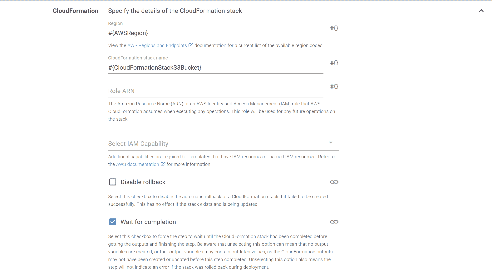](#)

CloudFormation 模板来自名为`AwsSamLambdaTemplates`的包，包中有一个名为`s3bucket.yaml`的文件:

[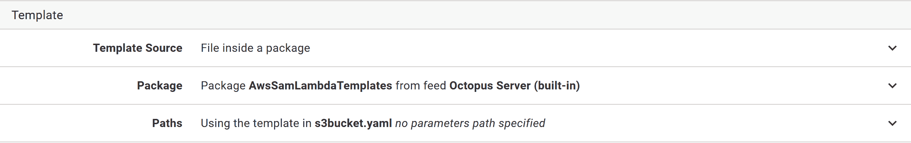](#)

创建了 bucket 之后，应用程序包将通过`Upload a package to an AWS S3 bucket`步骤上传。

在这一步中唯一需要注意的是，我们再次为时段名称和 AWS 区域使用了一个变量:

[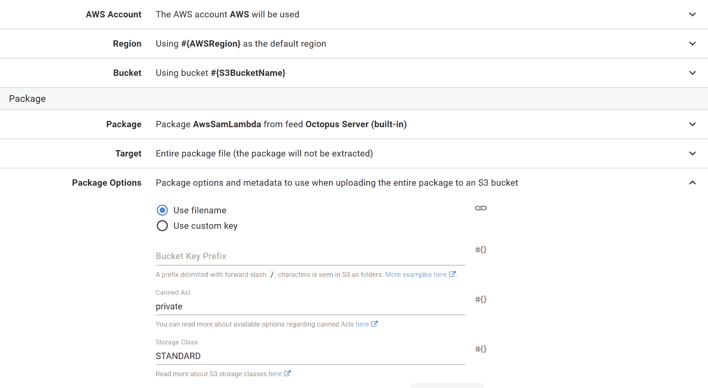](#)

至此，我们已经复制了`sam package`命令的功能，使用 GitHub Actions 捆绑了一个自包含的应用程序包，并使用 Octopus 将其推送到 S3。

我们还确保了我们上传的包有像`AwsSamLambda.0.1.0+71.zip`这样易读的名字，这清楚地表明了它们包含的应用程序和版本。从下面的截图可以看出，我们(`AwsSamLambda.0.1.0+xx.zip`)上传的包比`sam package` ( `fecddec7c6c40bd9de28f1775cd11e0e`)上传的包提供了更多的上下文:

[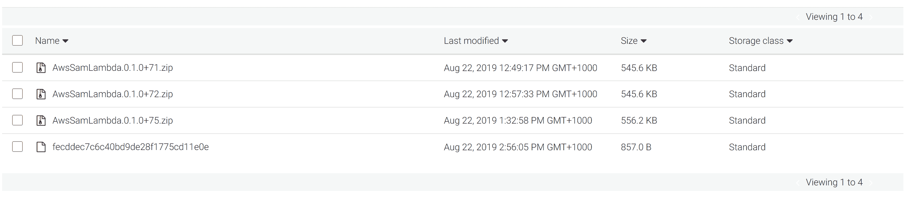](#)

## 用 Octopus 部署模板

最后一步是将 SAM 模板部署为 CloudFormation 模板。

这个模板几乎是由`sam init --runtime python3.7`命令生成的模板的翻版。

第一个区别是我们将`OpenApiVersion`的值设置为`2.0`。这修复了这里描述的[问题](https://github.com/awslabs/serverless-application-model/issues/191)，SAM 创建了第二个不需要的 API 网关阶段`Staging`。

第二个区别是我们将`CodeUri`属性设置为`"s3://#{Octopus.Action[Upload Lambda to S3].Aws.S3.BucketName}/#{Octopus.Action[Upload Lambda to S3].Output.Package.FileName}"`。这些变量替换组合起来为我们提供了在前面的`Upload Lambda to S3`步骤中上传到 S3 的文件的名称。

```
AWSTemplateFormatVersion: '2010-09-09'
Transform: AWS::Serverless-2016-10-31
Description: Example SAM application

# More info about Globals: https://github.com/awslabs/serverless-application-model/blob/master/docs/globals.rst
Globals:
  Api:
    OpenApiVersion: '2.0'
  Function:
    Timeout: 3

Resources:
  HelloWorldFunction:
    Type: AWS::Serverless::Function # More info about Function Resource: https://github.com/awslabs/serverless-application-model/blob/master/versions/2016-10-31.md#awsserverlessfunction
    Properties:
      CodeUri: "s3://#{Octopus.Action[Upload Lambda to S3].Aws.S3.BucketName}/#{Octopus.Action[Upload Lambda to S3].Output.Package.FileName}"
      Handler: app.lambda_handler
      Runtime: python3.7
      Events:
        HelloWorld:
          Type: Api # More info about API Event Source: https://github.com/awslabs/serverless-application-model/blob/master/versions/2016-10-31.md#api
          Properties:
            Path: /hello
            Method: get

Outputs:
  # ServerlessRestApi is an implicit API created out of Events key under Serverless::Function
  # Find out more about other implicit resources you can reference within SAM
  # https://github.com/awslabs/serverless-application-model/blob/master/docs/internals/generated_resources.rst#api
  HelloWorldApi:
    Description: "API Gateway endpoint URL for Prod stage for Hello World function"
    Value: !Sub "https://${ServerlessRestApi}.execute-api.${AWS::Region}.amazonaws.com/Prod/hello/"
  HelloWorldFunction:
    Description: "Hello World Lambda Function ARN"
    Value: !GetAtt HelloWorldFunction.Arn
  HelloWorldFunctionIamRole:
    Description: "Implicit IAM Role created for Hello World function"
    Value: !GetAtt HelloWorldFunctionRole.Arn 
```

和以前一样，这个模板是通过`Deploy an AWS CloudFormation template`步骤部署的。然而，我们需要启用`CAPABILITY_IAM`的附加功能，因为该模板创建 IAM 资源，而`CAPABILITY_AUTO_EXPAND`是因为 CloudFormation 需要将 SAM 模板转换成标准的 CloudFormation 模板。

因为我们已经为`CodeUri`字段使用了变量，Octopus 会将模板指向正确的 S3 文件。这样，我们复制了由`sam package`命令提供的第二部分功能，它通常会生成一个处理过的 YAML 文件，其中包含更新后的 S3 位置。

SAM 模板不需要任何特殊的工具来部署。标准的 CloudFormation 工具可以部署 SAM 模板，只要定义了`CAPABILITY_AUTO_EXPAND`功能。

[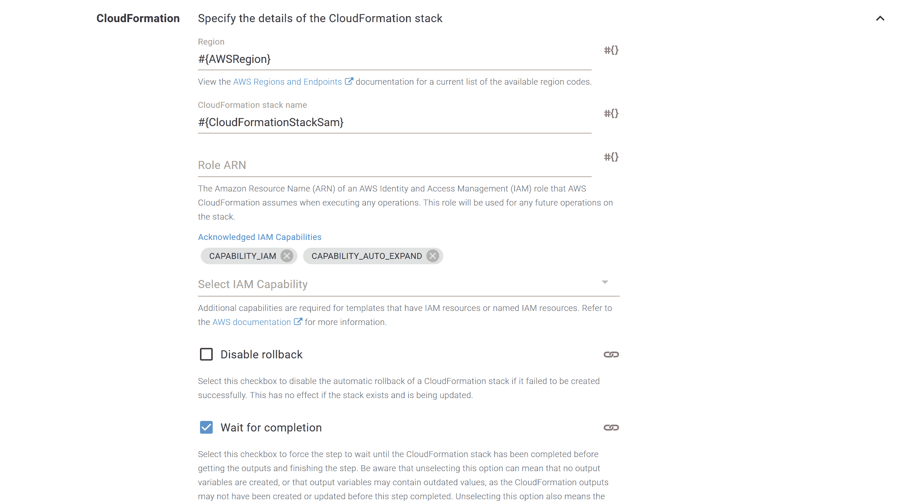](#)

和以前一样，CloudFormation 模板将从一个文件部署。同样，我们使用了`AwsSamLambdaTemplates`包，但是这一次，我们部署了`template.yaml`文件。

[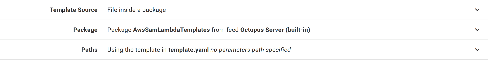](#)

## 章鱼变量

在整个模板和步骤中，我们使用了变量来定义 AWS 区域、S3 桶名称和云形成堆栈名称:

[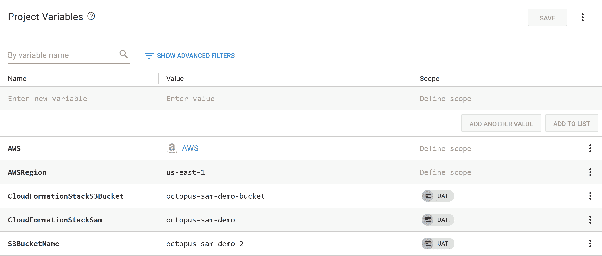](#)

下表描述了这些变量。

| 名字 | 描述 |
| --- | --- |
| AWSRegion | AWS 区域。 |
| CloudFormationStackS3Bucket 桶 | 用于创建 S3 桶的云生成堆栈的名称。 |
| 云格式堆栈 Sam | 将部署 SAM 应用程序的 CloudFormation 堆栈的名称。 |
| S3BucketName | 将上载应用程序的 S3 存储桶的名称。 |

## 部署到单一环境

现在我们已经拥有了使用 Octopus 将 SAM 应用程序部署到一个环境(称为`UAT`)所需的一切。

[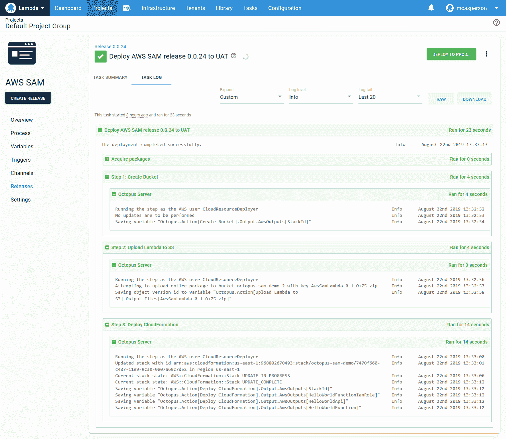](#)

我们已经在 Octopus 中成功创建了一个部署流程，该流程复制了 SAM CLI 工具的功能。

能够在单个环境中执行可重复的部署是很棒的，但是 Octopus 的真正优势是可以扩展到多个环境。

## 部署到第二个环境

因为我们已经将所有特定于环境的配置转移到 Octopus 变量中，所以更新我们的项目以部署到第二个环境就像将变量值作用于新环境一样简单。

在这种情况下，我们为下一个名为`Prod`的环境中的`CloudFormationStackS3Bucket`、`CloudFormationStackSam`和`S3BucketName`变量添加新值。

这意味着新的`Prod`环境将创建其自己的特定云形成堆栈，以创建新的 S3 桶，并为 SAM 应用程序创建第二个特定于环境的云形成堆栈:

[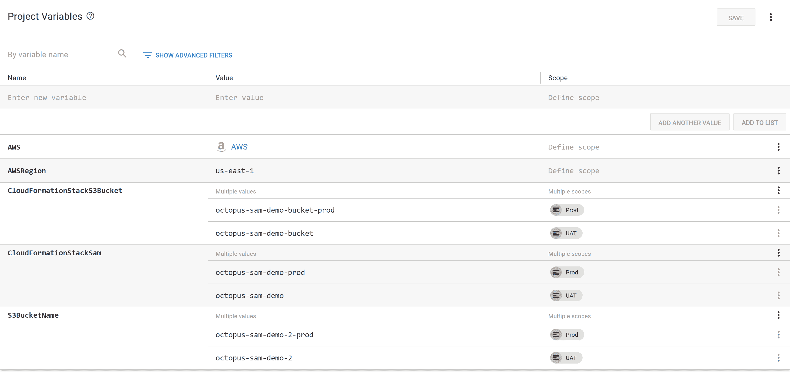](#)

通过这些少量的更改，我们能够将应用程序的独立副本部署到两个不同的环境中:

[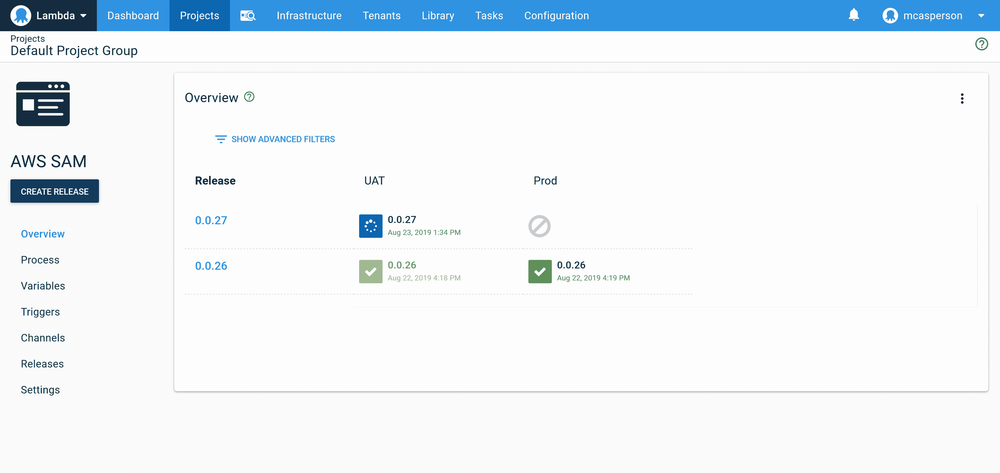](#)

## 结论

SAM CLI 工具是引导和部署无服务器应用程序堆栈的便捷方式。通过简化部署无服务器应用程序的常见任务，您可以使用以下命令部署“hello world”应用程序:

*   `sam init --runtime python3.7`
*   `sam build`
*   `sam package --output-template packaged.yaml --s3-bucket bucketname`
*   `sam deploy --template-file packaged.yaml --region region --capabilities CAPABILITY_IAM --stack-name aws-sam-getting-started`

在这篇博文中，我们已经看到了如何使用由`sam init`和`sam build`生成的代码和模板，并用 GitHub Actions 和 Octopus Deploy 替换`sam package`和`sam deploy`命令。

最终结果是一个 CI/CD 管道，它创建了跨多个环境的版本化、可重复的部署。然后，可以轻松扩展该管道，以满足生产环境的需求。