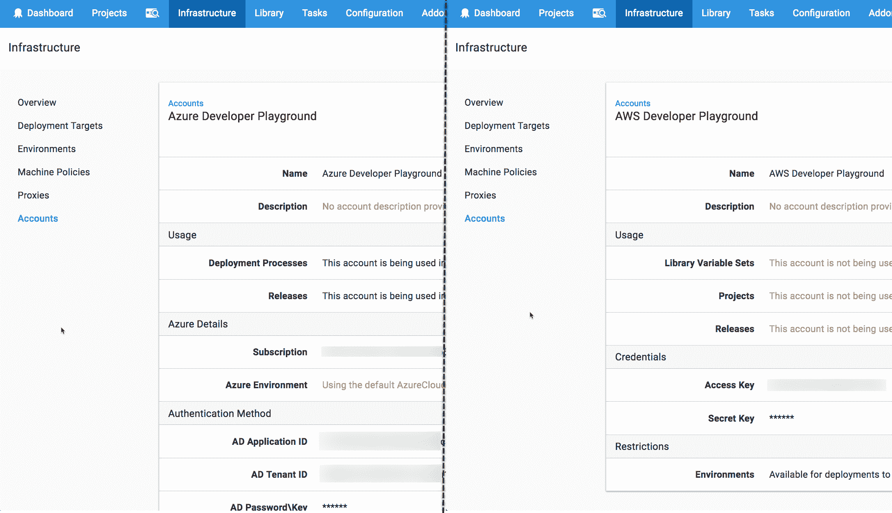

# 深入探讨- Azure 应用程序集成和八达通帐户-八达通部署

> 原文：<https://octopus.com/blog/azure-app-integration>

Octopus Deploy 集成了流行的云服务，如[亚马逊网络服务(AWS)](https://aws.amazon.com/) 和[微软的 Azure 平台](https://azure.microsoft.com/)，可以轻松安全地部署您的应用程序。与 Amazon 集成就像添加你的 AWS 访问密钥和秘密密钥一样简单，然而，Azure 需要更多的细节，并且如何设置还不是很明显。这是通过 Azure Active Directory (AD)注册的应用程序(或应用程序注册)实现的，但设置起来可能很棘手，因此我们将深入探讨并完成整个过程。

Octopus 中的 Azure 帐户需要四个值，用于对 Azure 进行身份验证并与之安全交互。

*   Azure 订阅 ID
*   Azure AD 租户 ID
*   Azure AD 注册的应用程序 ID
*   Azure AD 注册的应用程序密码/密钥

前三个值是 GUIDs，最后一个是密码。这些值可以在 Azure 门户或通过 Powershell 找到。就我个人而言，我从来不记得所有的值是在哪里找到的，所以我们录制了一个视频来帮助大家！

## 章鱼深潜

[https://www.youtube.com/embed/KnN-ahD6nN4](https://www.youtube.com/embed/KnN-ahD6nN4)

VIDEO

## 进一步阅读

查看我们的 [Azure 文档](https://octopus.com/docs/infrastructure/azure)获取更多信息，包括如何[创建 Octopus Azure 账户](https://octopus.com/docs/infrastructure/azure/creating-an-azure-account/creating-an-azure-service-principal-account)的逐步说明以及其他重要问题，如[安全和许可](https://octopus.com/docs/infrastructure/azure/creating-an-azure-account/creating-an-azure-service-principal-account#note-on-least-privilege)。

## 总结

现在你可以走了。您可以将所有这些值输入到 Octopus 中，或者在您自己的应用程序中使用它们来与 Azure 集成。如果你曾经很难添加一个八达通 Azure 帐户，我希望这有所帮助！如果章鱼的另一部分让你困惑，请在评论中告诉我们，我们会更深入地研究。

不要忘记订阅我们的 [YouTube](https://youtube.com/octopusdeploy) 频道，因为我们会定期添加新视频。愉快的部署！😃