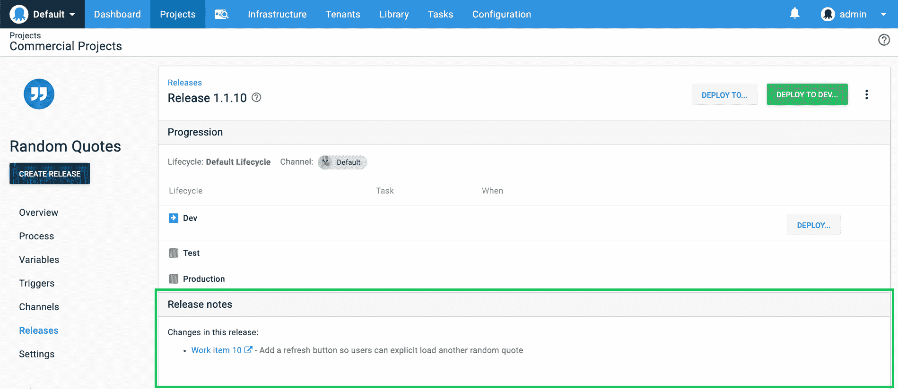
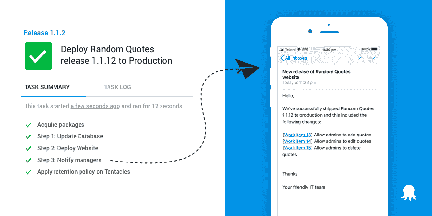
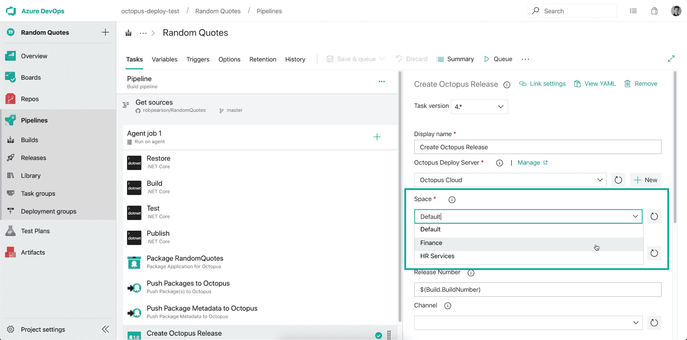

# 与 Azure DevOps - Octopus Deploy 更好地集成 Octopus

> 原文：<https://octopus.com/blog/azure-devops-extension-v4>

Octopus 补充了 Azure DevOps 服务套件，我们最近发布了一个针对 Azure DevOps 的 Octopus Deploy 集成的更新，以使集成更好。对于团队来说，使用 Azure Pipelines 来构建他们的应用程序，并使用 Octopus 来部署它们是非常常见的。这种方法利用了这两种工具的优势，它们一起使团队能够更好地从想法到产品获得对其软件管道的端到端可见性。

这个版本使我们的 Azure DevOps 扩展与我们的 TeamCity 和 Bamboo 插件不相上下。我们添加了对构建信息和工作项跟踪的支持，这开启了一些奇妙的新场景:

这个版本还包括 **[增强空间的支持](/blog/azure-devops-extension-v4#improved-spaces-support)** ，这样队伍可以更容易地选择自己队伍的空间。

了解如何[安装或更新扩展](/blog/azure-devops-extension-v4#how-to-install-or-update-your-azure-devops-extension)。

## 查看版本详细信息，包括新功能和修复

对于使用 Azure DevOps 的团队来说，使用其工作项跟踪(包括看板和积压工作)来计划和组织他们的项目是很常见的。此更新支持识别与 Azure DevOps 版本和 Octopus 版本相关的工作项，从而提供从工作项到部署的端到端可追溯性。你也可以点击 Azure DevOps 了解更多信息。这有助于识别将 bug 引入到版本中的变更。

注:八达通还支持 [GitHub 发行](https://octopus.com/docs/deployment-process/issue-tracking/github)和[吉拉发行](https://octopus.com/docs/deployment-process/issue-tracking/jira)。[阅读我们的文档](https://octopus.com/docs/deployment-process/issue-tracking)了解更多信息。

## 查看生产中的新功能

要弄清楚自上次部署到环境中以来发生了什么变化，有时可能需要一点猜测。现在不再是这种情况了，因为 Octopus 可以智能地确定自上次部署以来哪些工作项发生了更改。此功能使您能够查看生产或任何其他环境中的“新特性”,并且它汇总了发行说明和所有相关的更改。

这有助于一目了然地了解部署过程中发生了什么变化，并且在处理大型项目和查看其他团队做出的变化时非常方便。

## 与您的团队和经理共享发行说明

编写发布说明通常是一项手动任务，虽然使用像 [Azure Boards](https://azure.microsoft.com/en-us/services/devops/boards/) 或[吉拉](https://www.atlassian.com/software/jira)这样的工具更容易，但仍然很耗时。集成 Octopus 和 Azure DevOps 使这一过程完全自动化。Octopus 知道哪些问题已经部署到环境中，因此它可以快速生成发布说明，显示测试或生产环境中的新内容。

用 Octopus 阅读发布说明很方便，但通过电子邮件、Slack 或其他媒介分享更好。使用我们的电子邮件步骤、Slack 或 Microsoft Teams 步骤模板，您可以在每次成功部署到生产环境后向您的团队或经理发送发布说明。这个特性使得每个人都很容易了解情况。

## 改进的空间支持

我们更新的扩展包括完全支持从你的章鱼服务器中检索所有的[空间](https://octopus.com/docs/administration/spaces)，所以现在很容易为你的团队选择一个。

## 如何安装或更新您的 Azure DevOps 扩展

如果你正在使用 Azure DevOps，但还没有安装 Octopus Deploy 扩展，可以在 Visual Studio Marketplace 上免费获得:**[Octopus Deploy integration for Azure devo PS](https://marketplace.visualstudio.com/items?itemName=octopusdeploy.octopus-deploy-build-release-tasks)**。

如果你的团队已经在使用 Azure DevOps 和 Octopus Deploy，我强烈推荐升级到我们扩展的最新版本。这个版本将扩展的版本从 v3 提升到 v4，因此您需要为每个任务选择较新的版本。阅读我们的文档了解更多信息。

如果你正在使用 Azure DevOps 并希望改进你的部署，你可以安装[我们的扩展](https://marketplace.visualstudio.com/items?itemName=octopusdeploy.octopus-deploy-build-release-tasks)和[免费试用 Octopus Deploy](https://octopus.com/trial)。

## 总结

总之， [Azure DevOps](https://dev.azure.com) 和 [Octopus Deploy](https://octopus.com) 协同工作，为您提供从创意到生产的软件管道的更好的端到端可视性。

愉快的部署！