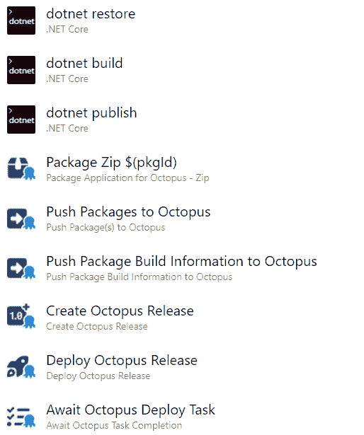
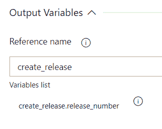
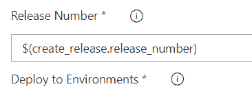
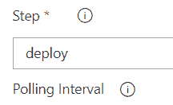

# 用于 Octopus Deploy v6 的 Azure DevOps 中的新功能- Octopus Deploy

> 原文：<https://octopus.com/blog/azure-devops-octopus-v6>

在这篇文章中，你将了解 Octopus Azure DevOps 插件 v6 的新特性，了解更新中的一些决定，并快速浏览一下[更新后的插件](https://marketplace.visualstudio.com/items?itemName=octopusdeploy.octopus-deploy-build-release-tasks)。

这些更新包括:

*   Octopus CLI 不再是*必需的*，同样，也不再是。NET 框架
*   Octopus 2022.3+现在是一个依赖项(这只适用于 v6 的步骤，不适用于早期版本)
*   运行 Runbook 有了新的步骤

如果你阅读了我们的第三个版本，我们为 Octopus Deploy 开发的 GitHub Actions。

## 不再需要 Octopus CLI

移除对 Octopus CLI 的依赖是 Octopus Azure DevOps 插件版本 6 最大的架构变化。

我们的步骤不再使用 Octopus CLI 来执行工作。相反，它们直接从 TypeScript 与 Octopus API 交互。这意味着您的管道启动和执行比以前快得多。

这也意味着步骤的 v6 依赖于 Octopus Server 2022.3+，因为它引入了[执行 API](https://octopus.com/blog/faster-deployments-with-the-executions-api) 。

您仍然可以使用 Octopus CLI，但是如果您只需要使用我们的其他步骤，就不再需要在您的管道中包含 **Octopus CLI 安装程序**。

如果你有自己需要的脚本，Octopus CLI 安装程序仍然可以使用。详见下一节。

我们实现了完全 NodeJS 支持的长期目标，消除了对。NET 框架。这消除了由于各种。NET Framework 版本，这在过去一直困扰着客户。向 NodeJS 的过渡意味着更平滑、更可靠的软件发布。

## Octopus CLI 安装程序现在安装基于 Go 的 CLI

我们最近将 CLI 实现从 C#转移到了 Go(关于原因的更多信息，请参见[构建 Octopus CLI vNext](https://octopus.com/blog/building-octopus-cli-vnext) )。Octopus CLI ( `octo`)将继续得到支持，直到 2023 年年中。

**Octopus CLI 安装程序** v5 将继续安装 Octopus CLI ( `octo`)。如果您有使用基于 C#的 CLI 的现有管道，您可以继续使用 v5。

**Octopus CLI 安装程序** v6(或更高版本)将只安装新的基于 Go 的 CLI ( `octopus`)。如果您正在编写新的管道，我们推荐使用 v6。基于 Go 的 CLI ( `octopus`)具有基于 C#的 CLI 所没有的新特性和改进，但是，也有一些微小的差异。如有必要，您可以同时使用这些 CLI。也就是说，您可以在同一个管道中包含该步骤的 v5 和 v6，以获得两个 CLI。

我们没有将**调用 Octopus CLI 命令**步骤更新到 v6。新 Go CLI 的设计倾向于脚本概念，如链接输入/输出，您可以在脚本步骤中直接使用它，因此我们决定不更新**调用 Octopus CLI 命令**步骤。我们建议在您的管道中使用脚本步骤，并直接调用`octopus`。

## 部署和运行手册运行

在插件的早期版本中，**创建发布**步骤支持来自 Octopus CLI ( `octo`)的`deploy-to`参数。不幸的是，这带来了 Octopus CLI ( `octo`)支持的所有其他与部署相关的问题。然而，这些额外问题的开关并不是直接可用的。您必须知道您需要哪些开关，并将它们直接输入到“附加参数”中，这使得步骤变得复杂和混乱。

[执行 API](https://www.octopus.com/blog/faster-deployments-with-the-executions-api) 的一个关键设计考虑是简化事情并形式化特定动作的需求/输入。对 Azure DevOps 步骤的 v6 更新直接反映了这些变化，现在有了所有支持设置的显式字段。

需要注意的关键事项:

*   **创建章鱼释放**只是创建一个释放
*   **Deploy Octopus Release** 只是对一个部署进行排队(新的 **Deploy Octopus Release to 租户**步骤也是如此，我们稍后会详细讨论)
*   新的**跑步章鱼跑手册**步排队跑步
*   如果您想等待您排队等待部署或 runbook 运行的任务，您可以使用新的**等待 Octopus 任务完成**

租赁部署与“标准”部署具有不同的语义。首先，它们支持您可以部署到的环境的不同多样性(标准版可以部署到多个环境，租用版只能部署到一个环境)。为了使这一点更清楚，我们将它们分成单独的步骤，在字段上有清晰的名称，以使每个步骤支持的内容更清楚。同样，这也直接反映了执行 API 的工作方式。

虽然这是其中一些步骤的初始版本，但我们决定将它们全部发布为 v6，以便更容易将它们作为匹配集进行推理。随着时间的推移，版本可能会再次出现分歧，因为我们会对各个步骤分别进行修补和更新。

## 链接是一种内置功能

现在，许多步骤都会产生输出，从而实现链接。输出如下:

| 步骤 | 输出 | 描述 |
| --- | --- | --- |
| `Pack`(Zip 和 NuGet) | `package_file_path` | 创建的包的完整路径 |
|  | `package_filename` | 只是创建的包的文件名 |
| `Create Octopus Release` | `release_number` | 创建的发布号(版本) |
| `Deploy Octopus Release` | `server_tasks` | 带有`serverTaskId`和`environmentName`的 JSON 对象数组 |
| `Deploy Octopus Release to Tenants` | `server_tasks` | 带有`serverTaskId`和`tenantName`的对象的 JSON 数组 |
| `Run Octopus Runbook` | `server_tasks` | 带有`serverTaskId`、`environmentName`和`tenantName`的对象的 JSON 数组 |
| `Await Octopus Deploy Task` | `completed_successfully` | 任务是否成功完成 |
|  | `server_task_results` | 任务及其成功的 JSON 表示。架构:{ "serverTaskId": <task id="">，" tenantName": <tenant name="">，" environmentName": <environment name="">，" successful": <真/假> }。这是为错误处理等场景提供的。例如，如果您有一个后续步骤，有条件地在该步骤失败时运行，它可以使用 JSON 来记录日志、向 Slack 发送消息等</environment></tenant></task> |
|  | `<context>.completed_successfully` | 使用环境或租户名称的每个任务的上下文成功标志，例如`Production.completed_successfully`或`UAT_Tenant_A.completed_successfully`。名称中的空格被替换为下划线 |

我们将在下面的例子中更详细地展示如何使用输出。

## 其他变化

### 包装已被分割

出于与上述类似的原因，我们决定将 Zip 和 NuGet 包的创建步骤分开。将 2 放在一个步骤中会导致配置字段列表更加复杂和混乱。

### 没有选择器了

除了 Octopus 服务连接选择器，我们在 v6 版本的步骤中删除了所有选择器。选择器需要 Azure DevOps 本身来连接 Octopus 实例。对于在防火墙后面有一个自托管 Octopus 实例的客户来说，这是令人困惑的，看起来好像不能工作，但是如果他们只是在字段中键入一个名称，它可能在运行时工作(也就是说，当使用自托管构建代理时，如果该代理在防火墙后面并且可以连接到 Octopus，它可能工作)。

对于一些客户来说，这种潜在的小收益感觉过于复杂，所以我们将所有字段恢复为字符串。

### 创建发布项目名称

在执行这些步骤时，我们注意到**创建发布**字段的命名不一致。在经典视图中，你不会注意到这一点，但当你使用 YAML 时，这一点就变得很明显了。**创建发布**步骤使用了`ProjectName`，但是所有其他步骤都使用`Project`作为该字段的名称。

我们决定，虽然这对于升级来说有点不方便，但是在 **Create Release** 步骤中重命名该字段会使将来的工作更加容易。

## 迁移到 v6

没有更改任何现有的步骤版本。你应该不会在插件升级时遇到任何行为改变。

但是，当从旧版本迁移到 v6 时，您会遇到一些变化。我们试图尽量减少这种情况，同时兼顾一致性和易用性。

在经典编辑器中，如果没有保存管道，则没有丢失任何数据。因此，如果您切换到 v6 并且丢失了一些东西或者对新的设置不满意，您可以刷新页面以重新加载原始版本和数据。在 YAML，你只需回复文本更改即可返回。

### 字段使用名称而不是 id

任何在前面的步骤中使用经典视图，然后查看其 YAML 表示的人可能会注意到有些字段包含名称，有些包含 id。有些甚至两者都有，这是选择器的副作用。如果您从列表中选择一个值，如果您直接在同一字段中键入，它将包含一个 ID，尽管您可能会输入一个名称(就像您在 YAML 可能会做的那样)。

Executions API 只支持名称，不支持 id，从而消除了大量查找的需要。因此，步骤现在也只支持名称。

如果您正在将一个早期版本的 step 升级到经典管道中的 v6，并且在过去使用了一个选择器，那么您将会看到一个 ID 出现在字段中，并且您必须将该值编辑为名称。

当**构建信息**特性首次发布时，它被称为**包元数据**。为了向后兼容，我们保留了一些残余内容。这在今天的 YAML 步骤中是可见的，在这里您使用`OctopusMetadata`作为步骤标识符。

从 v6 开始，该步骤的 YAML ID 将为`OctopusBuildInformation`。(`OctopusMetadata`将继续为 v4 和 v5 工作，因此现有管道不应受到影响)。

在经典编辑器中，您将无法从现有 v4/v5 步骤的下拉列表中选择 v6。插件现在认为它们是独立的，你必须添加一个新的**构建信息**步骤(在标题/描述中没有`legacy`的步骤)并复制这些值。

对于由此造成的任何不便，我们深表歉意，因为我们权衡了这一点与今后理解的难易程度，特别是考虑到 YAML 管道的普遍存在。

### 附加参数

在先前版本的步骤中，该字段用作输入未由特定字段表示的参数的后备选项。随着从 CLI 的过渡，此字段已过时，不再推荐使用。尽管它已经过时，但还是决定保留该领域的步骤，在这些步骤中，它可能被用来最大限度地减少干扰。

对于关键的东西，比如发布创建期间的包和部署发布时的变量，我们尽力解析现有的值，并将数据合并到这些值的新字段所提供的数据中。您将在日志中看到一条警告，让您知道这种情况已经发生，我们建议您在方便的时候尽早将值移动到新字段中。

## 管道演练示例

在本演练中，我们使用一个简单的 ASP.NET web 应用程序作为示例。在高层次上，管道是:

*   使用“包装”。网络工具
*   使用 Octopus Pack 步骤将输出放入 Octopus 可以使用的包文件中
*   将这个包文件以及一些构建信息推送到 Octopus
*   使用该包创建一个版本
*   该版本的排队部署
*   等待那些排队的任务完成

为了简洁起见，我们包括了。NET 构建/打包步骤，但是跳过经典模式中相同步骤的屏幕截图。

让我们从完整的 YAML 开始，然后我们会提到感兴趣的部分。

```
steps:
- task: DotNetCoreCLI@2
  displayName: 'dotnet restore'
  inputs:
    command: restore
    projects: 'source'

- task: DotNetCoreCLI@2
  displayName: 'dotnet build'
  inputs:
    command: build
    projects: 'source'
    arguments: '--configuration Release'

- task: DotNetCoreCLI@2
  displayName: 'dotnet publish'
  inputs:
    command: publish
    projects: 'source'
    arguments: '--configuration Release --output $(build.artifactstagingdirectory)'
    publishWebProjects: false
    zipAfterPublish: false
    modifyOutputPath: false

- task: OctopusPackZip@6
  name: pkg
  displayName: 'Package Zip'
  inputs:
    PackageId: $(pkgId)
    PackageVersion: '$(Build.BuildNumber)'
    SourcePath: '$(build.artifactstagingdirectory)'
    OutputPath: drop

- task: OctopusPush@6
  displayName: 'Push Packages to Octopus'
  inputs:
    OctoConnectedServiceName: $(connectionName)
    Space: $(spaceName)
    Packages: '$(pkg.package_file_path)'

- task: OctopusBuildInformation@6
  displayName: 'Push Package Build Information to Octopus'
  inputs:
    OctoConnectedServiceName: $(connectionName)
    Space: $(spaceName)
    PackageId: $(pkgId)
    PackageVersion: '$(Build.BuildNumber)'

- task: OctopusCreateRelease@6
  name: create_release
  displayName: 'Create Octopus Release'
  inputs:
    OctoConnectedServiceName: $(connectionName)
    Space: $(spaceName)
    Project: $(octoProject)
    Packages: '$(pkgId):$(Build.BuildNumber)'

- task: OctopusDeployRelease@6
  name: deploy
  displayName: 'Deploy Octopus Release'
  inputs:
    OctoConnectedServiceName: $(connectionName)
    Space: $(spaceName)
    Project: $(octoProject)
    ReleaseNumber: '$(create_release.release_number)'
    Environments: |
     Dev
     Staging

- task: OctopusAwaitTask@6
  displayName: 'Await Octopus Deploy Task'
  inputs:
    OctoConnectedServiceName: $(connectionName)
    Space: $(spaceName)
    Step: deploy 
```

需要注意的关键技术是:

*   您想要引用输出变量的步骤必须定义一个`name`，例如`name: create_release`。然后在后面的步骤中使用该名称引用该变量。例如，`ReleaseNumber: '$(create_release.release_number)'`
*   Await 步骤理解由我们的 deploy/runbook 运行步骤发出的输出变量的结构，并在内部处理变量绑定。因此，您只需要向它提供 deploy/runbook 运行步骤的名称，而不是变量绑定
*   具有复数名称的输入支持多个值，每个值作为单独一行输入(见示例中的`Environments`)

命名变量时要小心。我们艰难地认识到，声明一个名为`packageId`的变量对`dotnet restore`有特殊的意义。

### 经典管道

下面是在传统管道中建模的相同流程的视图。

[](#)

为了简洁起见，我们将只挖掘重要的细节。它们每个都包含与 YAML 管道中所示的输入对齐的字段。对于经典的管道，理解输出变量链接是如何工作的很重要。在支持输出变量的步骤中，您会在步骤的底部找到以下面板。

[](#)

这是 Azure DevOps 检测到我们声明的步骤支持输出变量，并提供了一种将步骤连接在一起的方法。它要求获得与 YAML 的`name`属性相当的名称，这是该步骤中的唯一名称。然后，在变量绑定的后续步骤中使用该名称，就像在 YAML 中引用它们一样。

[](#)

正如在 YAML 的例子中所提到的，Await 步骤具有来自 deploy/runbook 运行步骤的输出变量结构的内部知识，因此您使用步骤引用名。

[](#)

## 结论

Octopus Azure DevOps 插件的新步骤和更新改进了部署过程、任务执行和包创建的自动化。这为您提供了更高的一致性和更无缝的用户体验。

为了帮助您使用 YAML 管道，我们还更新了市场列表，提供了所有输入和输出变量的详细信息。

此版本的目标是为您提供强大且用户友好的步骤来管理您的部署，我们相信它将显著增强您的体验。

愉快的部署！