# 通过 Octopus Deploy 实现更好的多租户- Octopus Deploy

> 原文：<https://octopus.com/blog/better-multi-tenancy-with-octopus>

大多数使用 Octopus 的人会将项目部署到一个或多个环境中。对于提供软件即服务(SaaS)应用程序的客户，他们通常需要为每个客户部署应用程序的多个实例。

幸运的是，自从 [Octopus 3.4](https://octopus.com/blog/whats-new-multi-tenant-deployments) 以来就有一个专门为这些类型的部署设计的功能，即[多租户](https://octopus.com/docs/tenants)。

在本文中，我将介绍两种在没有租户的情况下部署应用程序的方法，并讨论使用多租户特性的好处。

## 介绍

这篇文章假设读者了解一些关键的 Octopus 概念，包括:

*   项目
*   环境
*   变量
*   生活过程

如果你是章鱼的新手，我推荐你阅读我们的[章鱼指南](https://octopus.com/docs/getting-started)。

为了演示如何使用 Octopus 对一个应用程序的多个实例的部署进行建模，我使用了一个名为 **Vet Clinic** 的虚构公司，部署 Java 应用程序 [Pet Clinic](https://github.com/spring-projects/spring-petclinic) 。

## 无租户部署

在为每个客户部署同一应用程序的多个实例时，我们看到了两种主要的实现方式:

1.  使用[多个项目](#using-multiple-projects)
2.  使用[多种环境](#using-multiple-environments)

虽然易于设置，但它们不能很好地扩展，并且可能导致重复。

### 使用多个项目

在这个场景中，您用多个项目配置 Octopus，每个项目代表您的一个客户。

[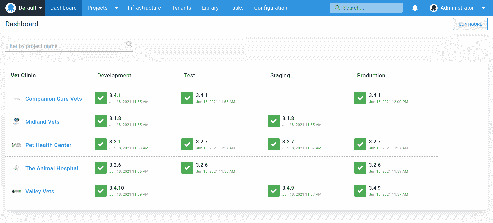](#)

新客户入职通常需要在 Octopus 中创建为客户成功部署所需的所有资源，包括:

此外，应用程序部署过程中的任何公共步骤都需要在新项目中重复。这些通常是手动干预和通知步骤。

#### 多个项目优势

那么为什么要选择多个 Octopus 项目来为每个客户部署一个应用程序的实例呢？

1.  **清除客户发布仪表板概述**

    这种方法允许您在仪表板概览上看到每个客户的哪个版本部署到了哪个环境。

2.  **变量和部署过程隔离**

    多个项目允许对客户的变量和部署过程进行完全隔离。例如，对一个项目的过程进行变更只会影响到那个客户。您还可以根据客户注册的功能为他们定制部署流程。

    在以下示例中，只有**首都动物医院**有一个应用定制品牌的步骤:

    【T2 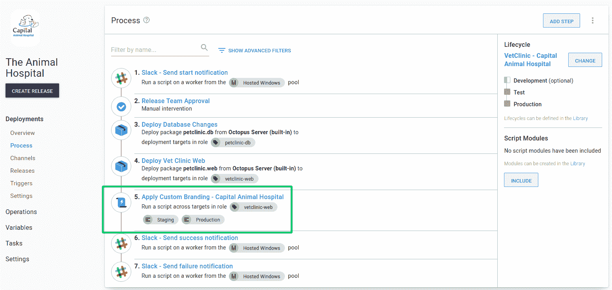

3.  **更简单的环境和变量范围**

    不需要为每个客户复制环境，从而简化了生命周期配置。变量也可以被限定在每个环境中，而不会有选择错误的“客户”范围的风险。

    [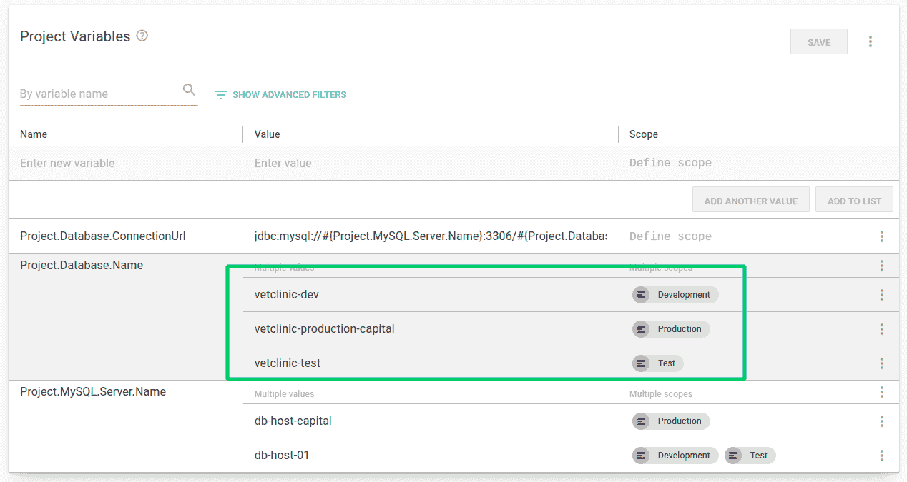](#)

#### 多个项目缺点

虽然可以使用多个项目来分别部署客户实例，但是这种方法存在许多问题。

1.  **重复的项目配置**

    对于每个客户项目，您最终会复制项目配置。这些包括变量、部署流程步骤、操作手册、渠道和生命周期。随着复制而来的是不一致性和管理这种不一致性的开销。例如，如果您想要修改所有客户的部署过程，您需要更改多个项目。

2.  **每个客户不同的部署目标角色**

    如果您的客户有独立的基础设施，您需要一种独特的方式让 Octopus 知道哪些部署目标属于您要部署到的客户。这导致每个客户的部署目标都需要包含每个客户的独特优势的目标角色。这通常是客户名称、代码或 ID。

    [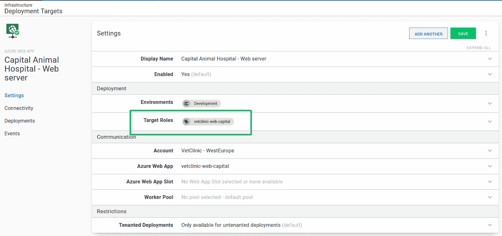](#)

3.  **每个客户多个项目无法扩展**

    当您有很多客户时，基于项目的方法就不能很好地扩展。如果您为每个客户部署更多的应用程序，这可能会有问题。每个应用程序都需要建模`n times`，其中`n`是您拥有的客户数量。

4.  **没有护栏确保提供变量**

    使用多个项目时，没有护栏来确保所有项目配置设置正确。例如，如果没有添加变量(或者变量的值不正确)，您可能直到部署客户的实例时才发现问题。

### 使用多种环境

没有租户的部署的一种替代方法是对每个应用程序使用一个 Octopus 项目，并用一组客户部署到的环境对每个客户进行建模。

[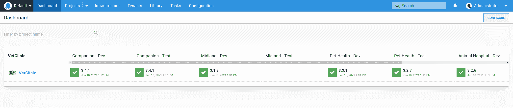](#)

新客户入职通常包括:

*   创建一组新的[环境](https://octopus.com/docs/infrastructure/environments)，以客户命名。
*   创建一组新的[部署目标](https://octopus.com/docs/infrastructure/deployment-targets)，或者重用现有的部署目标，并用相关的客户环境标记它们。
*   添加新的[环境范围变量](https://octopus.com/docs/projects/variables/#scoping-variables)。
*   更新项目生命周期以包括新的客户环境。

#### 多种环境优势

那么为什么要在 Octopus 中选择一个或多个环境来代表你的客户呢？

1.  **单组项目资源管理**

    与多个项目相比，这种方法只需要管理一个项目、一个部署过程、一组变量和一个生命周期。当需要更改时，可以一次完成，而不是按项目完成。

    例如，如果您想要添加一个所有客户都需要的步骤，比如在部署到生产环境之前添加一个**手动干预步骤**，那么它可以被快速而轻松地添加。

2.  **明确模拟客户环境**

    使用这种方法，必须明确地对客户环境建模。当添加新客户时，必须创建他们部署到的环境，以允许为该客户进行部署。还可以在控制面板概览的一行中看到客户可以部署到哪个环境。

#### 多重环境冲突

尽管您可以使用多种客户环境，但这种方法通常会带来许多问题:

1.  **为每个客户创建多个环境**

    对于每个客户，您需要为每个客户环境创建一个新的环境记录，这是不可伸缩的。例如，如果您有 10 个客户和 4 个环境(开发、测试、试运行和生产)，您需要创建 40 个客户环境。

2.  **复杂的变量范围**

    因为每个应用程序只有一个项目，所以需要使用不同的环境范围来处理每个客户的多个变量值。这可能会很快变得势不可挡。添加新值或编辑现有值必须小心谨慎，以确保对每个值应用正确的范围。在这种模式下，跨租户通信的风险很高。

    【T2 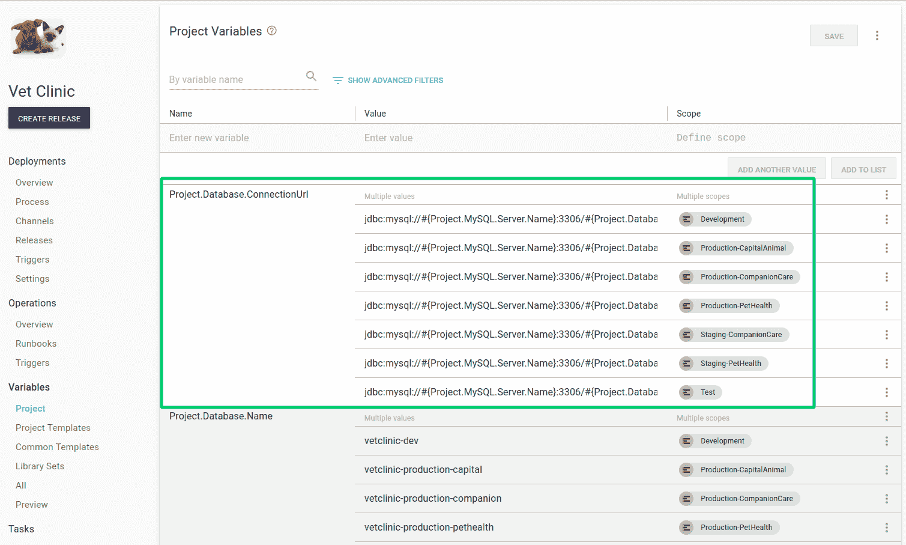

3.  **刚性部署流程**

    在使用多个客户的项目中定制部署过程需要您为需要为特定客户运行的每个步骤添加[环境运行条件](https://octopus.com/docs/projects/steps/conditions#environments)。这不灵活，也不可扩展，因为当您添加新客户或更改环境时，您需要每一步都修改这些条件。

    [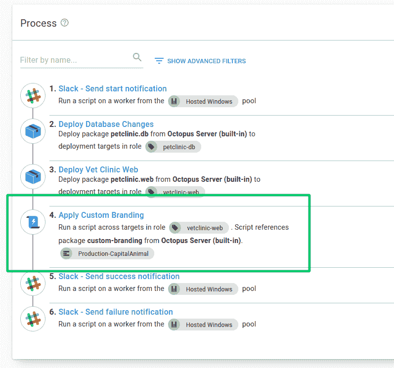](#)

4.  **不明确的客户发布仪表板概述**

    与每个项目的客户模型相比，如果没有无休止的滚动，很难在仪表板和项目概览屏幕上一眼看出哪个版本已经部署给了哪个客户。

5.  **复杂、笨拙的生命周期**

    随着新客户的加入，您通常会将新的客户环境添加到项目的生命周期中。然后，您必须定义笨拙的生命周期阶段，以适应每个客户(现有的和新的)所需的环境。通常，这是通过一个阶段来处理的，该阶段允许在进入下一个阶段之前部署任何一个客户环境。随着客户数量的增长，生命周期及其阶段的复杂性也在增加。

    [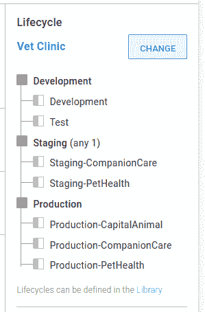](#)

## 与租户一起部署

在 Octopus 中使用租户允许您轻松地创建客户特定的部署管道，而无需复制项目配置。您可以在单个 Octopus 项目中管理多个环境中应用程序的单独实例。

使用我们的**兽医诊所**公司，以下是使用租户为每个客户建模的仪表板概览:

[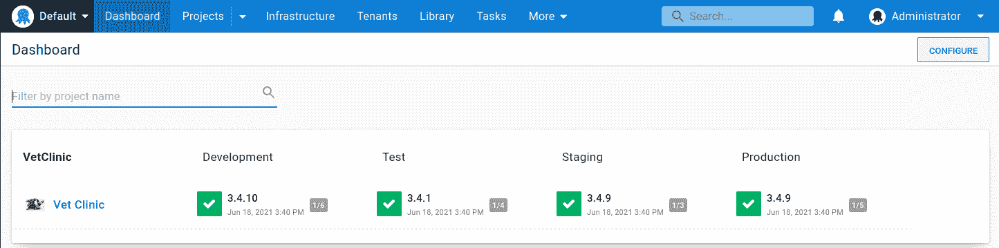](#)

这给了我们一个简明的概述，显示了哪个版本在哪个环境中。不再是每个客户项目有多行，取而代之的是已经部署到每个环境的租户的离散计数。

如果我们导航到该项目，我们会看到一个更细粒度的概述，这次显示了每个环境中哪个租户拥有哪个版本:

[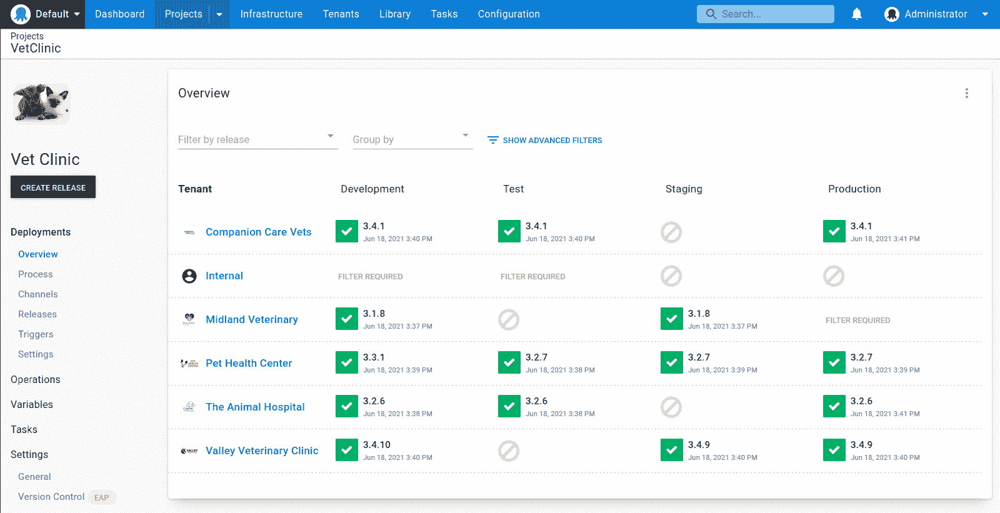](#)

**样本 Octopus 项目**
您可以在我们的[样本实例](https://g.octopushq.com/PatternTenantsSampleVetClinic)中看到兽医诊所租赁项目的示例。

有许多多租户功能协同工作来实现这一点:

### 房客

Octopus 中的租户是多租户功能的支柱。他们通常代表您的应用程序的客户，尤其是当涉及到 SaaS 产品时。

[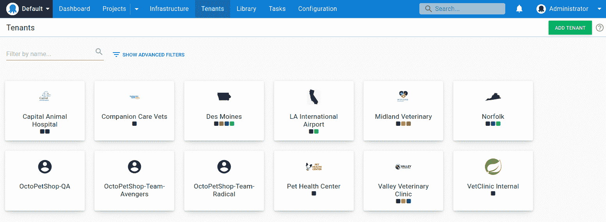](#)

虽然我们在这篇文章中讨论了使用租户来模拟客户，但是我们将租户设计为通用的，以便它们可以满足多种用例。租户还可以代表:

*   地理区域或数据中心
*   开发人员、测试人员或团队
*   特征分支

租户概览提供了一个中心位置来管理哪些项目连接到租户，以及哪些环境。

[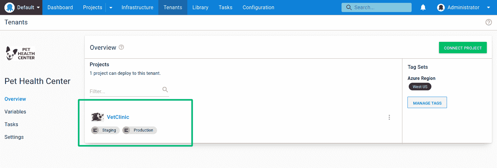](#)

请注意，每个项目都可以控制它与租户的交互。默认情况下，多租户部署功能处于禁用状态。您可以允许有/没有租户的部署，这是一种混合模式，在您过渡到完全多租户项目时非常有用。

还有一种模式，您可以要求所有部署都有租户，这将禁用该项目的未租户部署。

[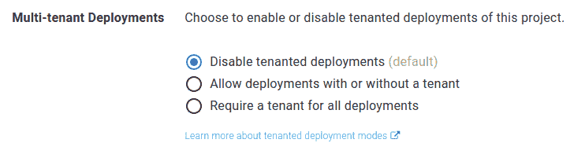](#)

在 Octopus 中，让新客户成为租户非常简单，只需创建您的租户，将您的项目连接到每个适用的环境，输入您的变量值，然后进行部署。

在 Octopus 中，[租户标签](https://octopus.com/docs/tenants/tenant-tags)帮助您使用自定义标签对租户进行分类，并为您的项目和环境定制租赁部署。

租户标签还使租户作为一个组而不是个人工作变得更加容易。由于租户标签是完全可定制的，因此您可以将有意义的元数据应用于租户。这允许您使用自己的术语描述它们，并根据它们的需求定制部署过程。

在下面的租户概述中，**首都动物医院**包含了`Branding`标签:

[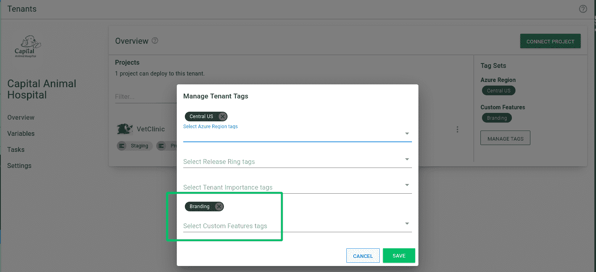](#)

这表明他们已经决定加入他们的**兽医诊所**应用程序实例的定制品牌。

当您构建部署流程时，您可以包含一个租户标记作为运行条件，以便为您的客户定制流程。通过将标记应用于步骤，您能够指定只应为匹配所选租户标记的客户运行的步骤。

[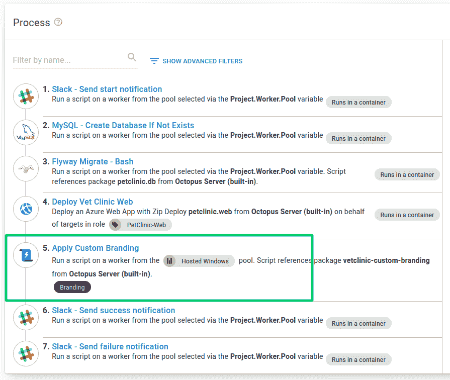](#)

您可以将多个租户与同一个标记相关联。这将自动将这些租户分组在一起，并使任何带有`Branding`标记的租户都能够将定制品牌步骤作为该租户的任何部署的一部分。

租户标记还可以用于将多个租户与部署目标和通道相关联，甚至可以选择部署到哪些租户。它们是帮助您简化和扩展部署的强大方法。

### 租户变量

您通常希望为每个客户定义不同的变量值。例如:

*   数据库服务器名称或连接字符串
*   特定于租户的 URL
*   租户的联系方式

使用未租用的项目，您可以在项目本身中定义这些值。对于租赁的项目，您可以直接在租户上为任何连接的项目设置这些值。

对于租户，您可以指定两种类型的变量:

*   **项目变量模板**
*   **常见变量**。

这两者都使用了[变量模板](https://octopus.com/docs/projects/variables/variable-templates)功能。

#### 项目变量模板

项目变量允许您指定租户可以更改的变量。一个完美的例子是连接字符串或数据库服务器。对于项目变量，您可以使用[项目模板](https://octopus.com/docs/projects/variables/variable-templates#project-templates)在项目级别定义它们。

[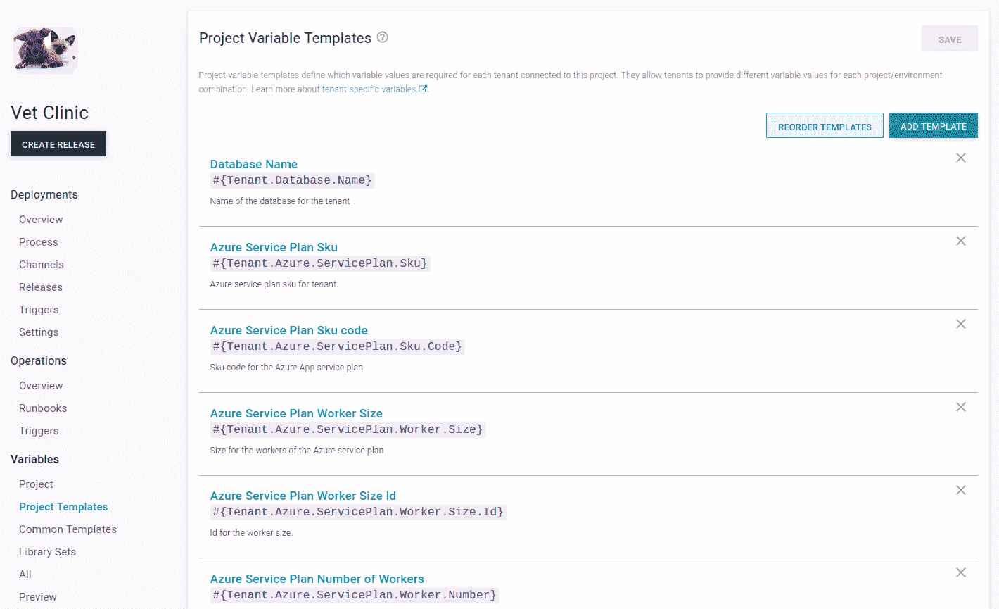](#)

您可以为项目模板指定变量类型，就像常规变量一样。您还可以提供租户可以覆盖的默认值。

[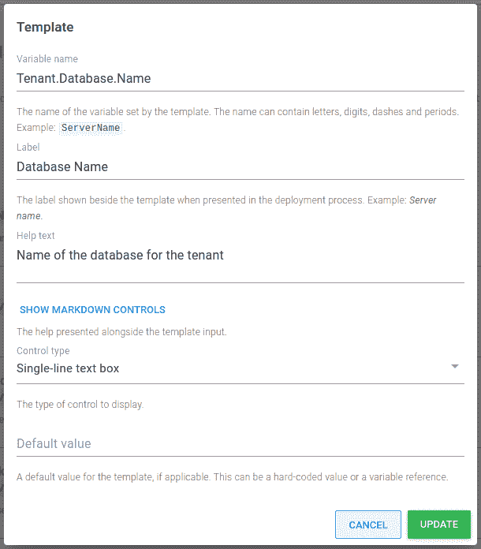](#)

然后，在租户变量屏幕上，您可以设置这些变量。

#### 公共变量

公共变量类似于项目变量。主要的区别是公共变量可以跨多个项目使用，并且它们不限于环境。使用[库变量集模板](https://octopus.com/docs/projects/variables/variable-templates#adding-a-variable-template)定义公共变量

例如，要定义租户在部署或运行手册中使用的缩写，您可以为库集配置一个变量模板。

[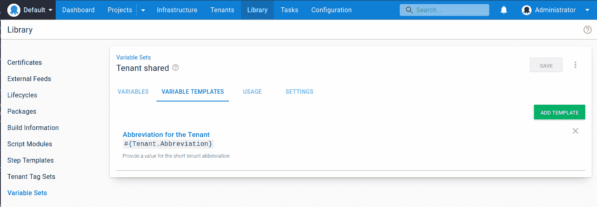](#)

要包含租户的公共变量，必须在租户连接项目中添加库变量集。

就像项目变量一样，公共变量值是在租户级别提供的。

[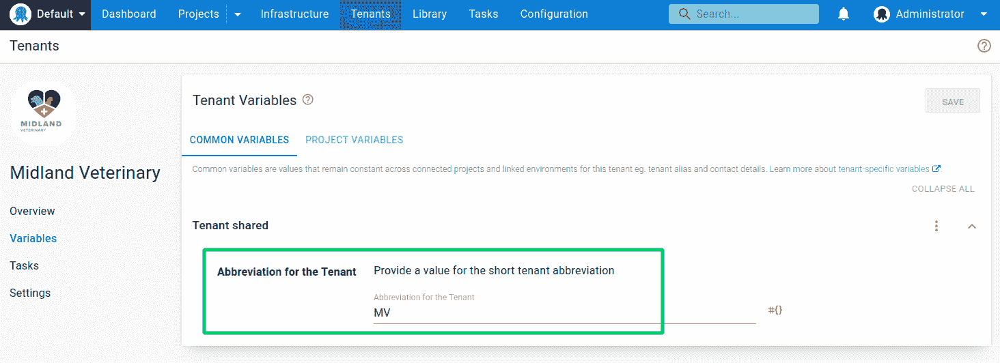](#)

#### 可变快照

当您[创建一个发布版本](https://octopus.com/docs/octopus-rest-api/octopus-cli/create-release)时，Octopus 会对部署过程和[项目变量](https://octopus.com/docs/projects/variables)的当前状态进行快照。

然而，租户变量*不包含在任何快照中。这很有帮助，因为您可以随时添加新的租户并部署到它们，而无需创建新的版本。*

这也意味着您对租户变量所做的任何更改都将立即生效。

#### 缺少变量

租户变量的一大优点是它们为您的部署设置了防护栏。定义没有默认值的项目模板或公共变量意味着任何租户都必须为该变量提供值。Octopus 不允许部署没有一个:

[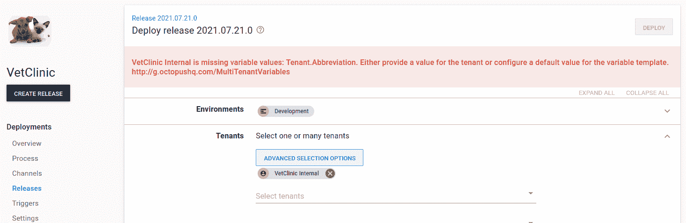](#)

但是这些护栏并不只是在部署时才开始。Octopus 还会警告您租户变量概览中的任何缺失值:

[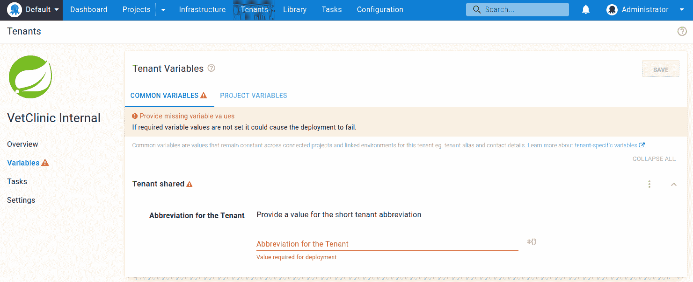](#)

这种安全级别降低了由于缺少变量值或变量值不正确而导致租户部署失败的可能性。

### 租赁部署目标

您为同一项目的多个实例托管基础设施的方式通常因您的应用程序和客户而异。我们看到的两种常见实现是:

1.  **专用托管**:您为每个客户都制定了专用的部署目标。
2.  **共享托管**:您创建服务器场或服务器池来托管您的所有客户，实现更高的密度。

如果您的客户有独立的基础设施，在一个未租用的配置中，您需要在 Octopus 中定义唯一的目标角色，以确保没有跨客户的通信，即把一个客户的应用程序部署到另一个客户的基础设施中。

使用租户，不需要特定于客户的目标角色。您可以选择目标可以参与的部署:

*   从租赁部署中排除(默认)-部署目标永远不会包括在租赁部署中。
*   仅包括在租用的部署中-部署目标将仅包括在关联租户的部署中。它将被排除在未租用的部署之外。
*   包括在已出租和未出租的部署中-部署目标将包括在未出租的部署和对关联租户的部署中。

[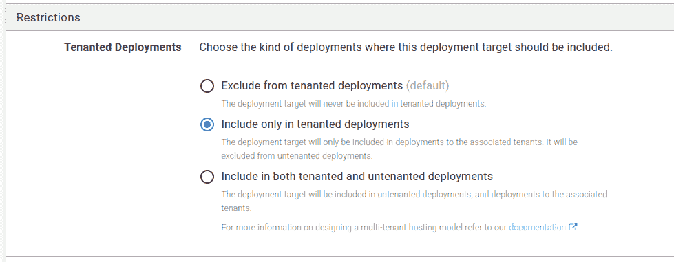](#)

要选择将哪些租户与部署目标相关联，请执行以下操作:

1.  导航到部署目标的 **限制➜关联租户** 部分。
2.  选择允许单独部署到的一个或多个租户，或者从任何已配置的租户标记中进行选择。

[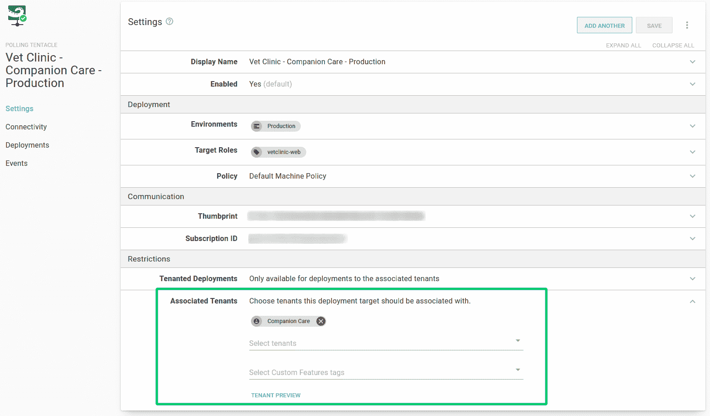](#)

我们建议将租用的和未租用的部署目标分开，尤其是在生产环境中。您可以对其他环境使用相同的部署目标，但是通常最好避免这种情况。

## 结论

这篇文章介绍了当客户为每个没有租户的客户部署同一个应用程序的多个实例时的常见方法。它还详细介绍了如何使用多租户特性对此进行建模。

我希望您能看到 Octopus 多租户特性如何解决在没有租户的情况下部署时出现的一些问题，以及如何利用它进行可伸缩、可重用、简化的部署。

## 了解更多信息

## 观看网络研讨会:使用 Octopus Deploy 实现更好的多租户部署

[https://www.youtube.com/embed/dD8psiK1wL4](https://www.youtube.com/embed/dD8psiK1wL4)

VIDEO

我们定期举办网络研讨会。请参见[网络研讨会第](https://octopus.com/events)页，了解过去的网络研讨会和即将举办的网络研讨会的详细信息。

愉快的部署！