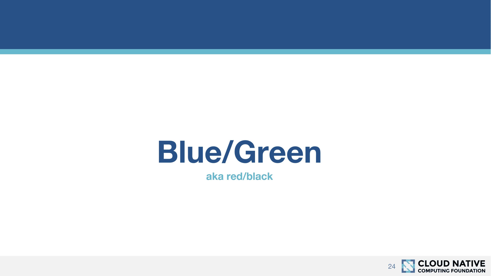

# 蓝/绿和红/黑部署有什么区别？-章鱼部署

> 原文：<https://octopus.com/blog/blue-green-red-black>

当部署新版本的集中式应用程序(如 web 服务)时，有一种策略可以用来在成功部署和测试新版本后将生产流量定向到新版本。这种策略被称为蓝/绿或红/黑，每种颜色代表目标环境的一个副本。流量被路由到一种颜色或另一种颜色(或者在金丝雀部署中或在 A/B 测试期间，但这是另一个故事)。让两个环境并行运行，托管不同版本的应用程序，意味着如果发现问题，流量可以切换，然后再切换回来，几乎不停机。

那么为什么这个策略同时被称为绿/蓝和红/黑呢？这些颜色是否暗示了技术差异？

## StackOverflow 说...

我们的第一站是 StackOverflow，在那里我们发现了一个问题[红/黑部署和蓝/绿部署有什么区别？](https://stackoverflow.com/questions/45259589/whats-the-difference-between-red-black-deployment-and-blue-green-deployment)。

投票率最高的答案表明这两个术语之间确实存在差异:

> 在蓝绿色部署中，两个版本可能会暂时同时收到请求，而在红黑色部署中，在任一时间点只有一个版本收到流量

答案接着说:

> 但是红黑部署是一个较新的术语，由网飞、Istio 和其他支持容器编排的框架/平台使用

我经常看到红/黑这个术语被归因于网飞和容器平台创建的工具，所以让我们去看看他们的文档，看看他们是如何定义这些策略的。

## 网飞，库伯内特斯和伊斯迪奥说...

Spinnaker 是由网飞编写的部署工具，它是开源的，任何人都可以使用。该工具包括一些关于其实现的概念的文档，包括关于[部署策略](https://www.spinnaker.io/concepts/#deployment-strategies)的部分:

> Spinnaker 支持红/黑(又名蓝/绿)策略，滚动红/黑和金丝雀策略正在积极开发中。

因此，与 StackOverflow 上的答案相反，网飞把蓝/绿和红/黑视为同一事物。文档甚至包括一个漂亮的蓝色和绿色的图表来说明这一点。

由云计算原生计算基金会制作的名为[在 Kubernetes](https://www.cncf.io/wp-content/uploads/2018/03/CNCF-Presentation-Template-K8s-Deployment.pdf) 上的部署策略的 Kubernetes 演示文稿中的幻灯片也记录了蓝色/绿色和红色/黑色的同义词。

同样地， [Istio 博客](https://istio.io/blog/2017/0.1-canary/)将蓝色/绿色和红色/黑色视为同一事物:

> 这种方法只有在我们拥有想要部署的经过适当测试的版本时才有用，也就是说，更多的是蓝色/绿色，也就是红色/黑色，而不是“把脚伸进水里”的金丝雀部署。

## 结论

这些年来，我听到了很多关于蓝/绿和红/黑之间区别的不同描述。有些涉及如何定向流量(DNS 与负载平衡器)，有些参考了针对物理服务器与容器化应用程序的解决方案，有些区分了所有流量的硬切换与会话流失。然而，我从未见过这些区别被一致地使用，事实上，当你深入研究实现它们的工具是如何使用蓝/绿和红/黑这样的术语时，它们经常被互换使用，或者被明确地称为可互换的。

可以肯定地说，您不能可靠地确定部署策略的特定技术方面，仅仅因为它被称为实现蓝/绿或红/黑策略。在高层次上(在 Spinnaker、Kubernetes 和 Istio 等工具的产品文档中明确指出)，这两个术语指的是同一个东西，两者之间的任何技术差异可能只在特定的团队或公司中有意义。