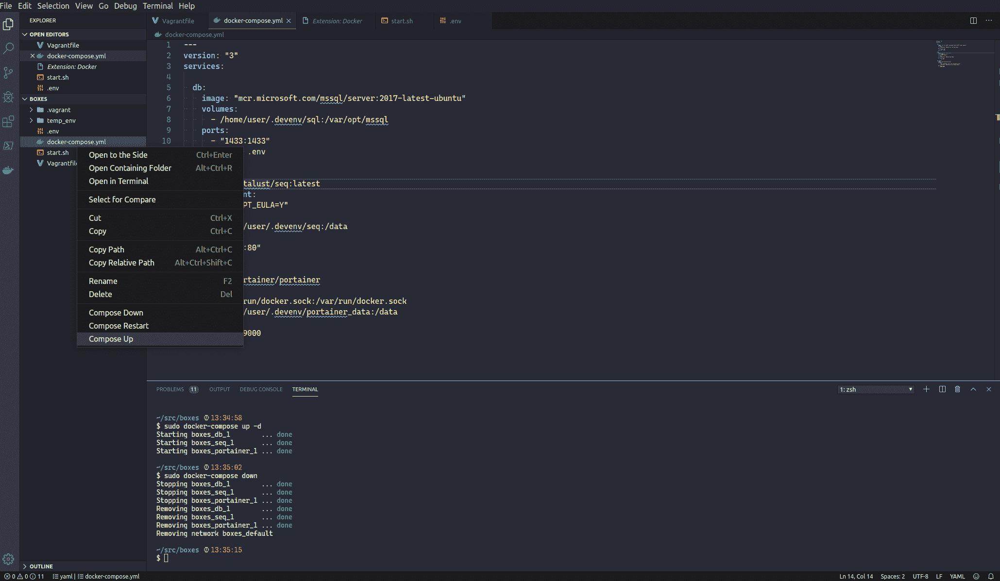
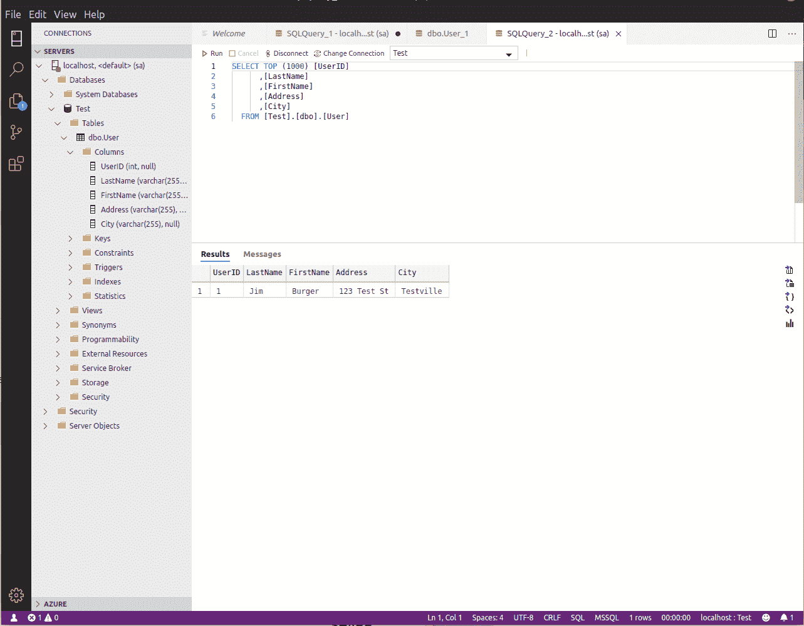
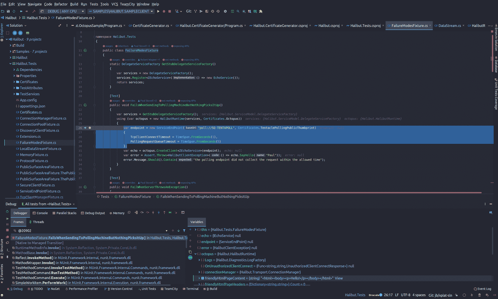

# Bootstrap 一个用于 Linux - Octopus 部署的. NET 核心开发环境

> 原文：<https://octopus.com/blog/bootstrap-dotnet-core-dev-on-linux>

[](#)

微软。NET Core 有很大的跨平台支持，给。NET 开发人员能够在 Linux 发行版或 macOS 上进行大部分开发。在这篇文章中，我将介绍如何开始以及有哪些工具可以支持开发人员。

## 在这篇文章中

在 Octopus Deploy 工作，我真正欣赏的一件事是，我被鼓励以我选择的方式工作，最大限度地提高我的快乐和效率。

今年早些时候，我决定将我的日常工作环境切换到 Linux，我并不后悔。类似 Unix 的操作系统一直是我喜欢的东西，但是作为一名. NET 开发人员，我从来没有能够在开发工作中选择它。

我将讨论一些选择。NET 开发人员，并向您展示我是如何将我的堆栈和一些我经常使用的脚本组合在一起的。

## 使用容器管理开发时数据库和日志服务器

很像我的同事[鲍勃·沃克](https://octopus.com/blog/automate-sql-server-install-using-linux-docker#docker-compose)，我个人喜欢使用`docker-compose`来加速处理依赖关系的过程，比如我的 SQL &日志服务器。我最喜欢它的什么？数据库和日志服务器的设置不到 20 行 YAML！

例如，这让我可以快速启动一个 [SQL server](https://www.microsoft.com/en-us/sql-server/) 和 [Seq](https://datalust.co/seq) ，这是我们在开发、测试和生产中使用的首选日志记录工具:

```
---
version: "3"
services:
  # this is my database, there are many others like it, but this one is mine
  db:
    image: "mcr.microsoft.com/mssql/server:2017-latest-ubuntu"
    volumes: # Mount volumes like this: host/dir:container/dir
      - /home/user/.devenv/sql:/var/opt/mssql
    ports:   # Expose ports like this: host_port:container_port
      - "1433:1433"
    env_file: .env  # more on this later ;)

  # seq is an easy to use log server - how simple is this?
  seq:
    image: datalust/seq:latest
    environment: # declare environment variabels inline
      - "ACCEPT_EULA=Y"
    volumes:
      - /home/user/.devenv/seq:/data
    ports:
      - "5341:80" 
```

您可能还会注意到，这个文件中没有数据库密码或 API 键。那是因为我可以用一个`.env`文件把那些敏感的东西藏起来。环境文件是`docker-compose`支持的，所以你可以在一个地方声明你的环境变量。

`.env`文件是由换行符分隔的键值对:

```
SA_PASSWORD=ForYourEyesOnly007#
ACCEPT_EULA=true
MSSQL_PID=Developer 
```

要调出环境，请使用`docker-compose up`。您可以通过提供`-d`来保持您的 shell 在以后可用:

```
docker-compose up -d
docker stats        # show how the containers are operating (CTRL+C to exit)
docker-compose down # stop the stack you've created 
```

如果你喜欢，微软有一个相当不错的 [VS 代码扩展](https://github.com/microsoft/vscode-docker)来给你那种右击菜单的感觉！

[](#)

基于此，我创建了一个[便利脚本](https://github.com/jburger/devenv)的集合来演示一些可能性，并且我录制了一个[截屏](https://asciinema.org/a/AUXSaRj6hfqQS1QQqflrITrX0)来展示如何使用它们。

### 数据库管理

当然，微软 SQL Server 并不是 Linux 上唯一的游戏，远非如此。然而，如果你像我一样，并且你的家乡是 MS SQL，那么你会很高兴知道有一些工业级的选择来使用它。

我使用的是 Datagrip，这是一个非常棒的工具，可以处理各种各样的数据库，并且具有强大的智能感知和重构功能。我最喜欢的特性是能够为每个数据库连接分配一种颜色(例如，测试时为绿色，生产时为红色)。

微软提供的一款免费的 SQL Server 替代产品是 [`Azure Data Studio`](https://docs.microsoft.com/en-us/sql/azure-data-studio/download?view=sql-server-ver15#get-azure-data-studio-for-linux) 。它为那些不想花钱买更重的工具的人提供了一个美好而简单的体验。

[](#)

开发工具有很多选择，但这里是我喜欢使用的。八达通部署的网络工程。

### 集成开发环境(IDE)

有一些很好的 IDE 选项。NET 开发者现在就上 Linux！

我个人很喜欢 IDE 和数据库工具的`Jetbrains` [工具箱](https://www.jetbrains.com/toolbox-app/)。`Rider`、`Datagrip`、`Webstorm`是我每天*到*的工具。我也在业余时间用`Clion`来学习铁锈的发展。我发现的一个好处是，每一个都是根据他们所代表的开发风格定制的，同时保持一致的键盘快捷键方案。

如果我确实需要使用 Windows，我也可以把它们安装在那里，而不必重新学习任何击键。Rider 有一个很棒的可视化调试器和许多与 Visual Studio 相当的特性。

[](#)

我也喜欢用`VS Code`来完成不需要调试器的任务，比如解析日志和写博客或文档。

#### 不会吧！Vim 或半身像。

好吧，所以，如果你在这个营地，你可能已经知道你在做什么！也就是说，我可以证实。使用 lofi 工具箱，净生产率是可能的。如果你有兴趣探索这个选项，这里有一些工具可以帮助你开始。

[](#)

### Git 源代码控制

对于简单的事情，我仍然坚持在命令行使用 Git，`zsh`为[提供了一个可爱的插件，几乎涵盖了一切](https://github.com/robbyrussell/oh-my-zsh/wiki/Plugins)，包括 Git。

对于处理复杂的树，我认为 [GitKraken](https://www.gitkraken.com/) 是一个非常巧妙的选择，它看起来很棒，性能很好，并且与 GitHub 集成。

### 从命令行安装应用程序

Windows 开发者信誓旦旦地用 [boxstarter](https://boxstarter.org/) 和 [chocolatey](https://chocolatey.org/) 安装自己喜欢的工具是很常见的。这使得他们可以保存自己喜欢的工具的脚本，并在新机器上运行它们。你可以在 Linux 上做同样的事情。

大多数发行版都有自己的[包管理器](https://www.linode.com/docs/tools-reference/linux-package-management/)用于安装工具，每个包都有自己的命令界面。还有 [snapd](https://snapcraft.io) 这是一个交叉分布选项。

在 Ubuntu 和其他支持它的发行版上，你可以使用`snapd`来安装一些流行的工具。如果你不喜欢他们，他们会干净地卸载:

```
sudo snap install --classic code
sudo snap install gitkraken

# optional non-free IDE options
sudo snap install --classic rider
sudo snap install --classic datagrip
sudo snap install --classic webstorm 
```

要移除物品:

```
sudo snap remove dont_want_this 
```

开始使用 [snapd 很容易](https://snapcraft.io/docs/getting-started)，它带有一些[有趣的安全特性](https://snapcraft.io/docs/snap-confinement)并且是 Linux 生态系统独有的！

## 用于隔离环境的流浪箱

容器很棒，但是它们不像虚拟机那样孤立。例如，当我在 triage 期间处理一些不可信的二进制文件时，我将使用一台独立于我的主开发环境的机器。我喜欢使用 HashiCorp 的[vagger](https://www.vagrantup.com/)来管理临时的虚拟机生存期；这几乎和使用 docker 一样简单！

下面是一个轻量级 Arch Linux 环境的例子。它有一些基本的东西，可以随时调整、使用，然后销毁:

*   i3:一个轻量级的平铺窗口管理器
*   sakura:一个轻量级终端仿真器
*   火狐浏览器
*   饭桶
*   dotnet sdk
*   一个文本编辑器(如果你喜欢，用你最喜欢的编辑器替换掉`vim`)

只需根据自己的喜好调整`config.vm.provision`中的脚本，然后运行`vagrant up`来构建它:

```
Vagrant.configure("2") do |config|
  config.vm.box = "archlinux/archlinux" # from their official repository

  config.vm.provider "virtualbox" do |vb|
    # show console
    vb.gui = true
    # RAM
    vb.memory = 4096
    # CPU
    vb.cpus = 2
  end

  # Hook the provision event and run an inline shell script to install your favorite tools here
  config.vm.provision "shell", inline: <<-SHELL
    echo "installing tools"
      pacman -Sy \
      xorg-server \
      xorg-xinit \
      xorg-apps \
      lxdm \
      i3 \
      dmenu \
      firefox \
      sakura \
      git \
      vim \
      dotnet-sdk \
      --noconfirm
      sed -i 's|# session=/usr/bin/startlxde|session=/usr/bin/i3|g' /etc/lxdm/lxdm.conf

    systemctl enable lxdm
    systemctl start lxdm
  SHELL
end 
```

vagger CLI 提供了从脚本或命令行快速自动化虚拟机各种操作所需的所有工具:

```
# change into a directory with a Vagrant file
cd /my/box/
# bring it up
vagrant up
# push a new snapshot onto the stack
vagrant snapshot push
# Tweak a Vagrant file and re-provision while a VM is running
vagrant provision
# easy login via ssh
vagrant ssh
# rollback to the previous snapshot
vagrant snapshot pop
# bring it down
vagrant halt
# save a named snapshot
vagrant snapshot save [vm_name] [snapshot-name]
# rollback to a named snapshot
vagrant snapshot restore [vm_name] [snapshot-name] 
```

## 浅谈非官方流浪乞讨人员救助箱的使用

如果可以的话，最好使用官方邮箱。虽然从图书馆使用别人的盒子非常方便，但也有一定的风险。如果他们在上面安装了密码挖掘器呢？

如果你因为这种风险而被困住了，通过一点额外的工作，你可以创作你自己的图片。我强烈推荐看一下 Matt Hodgkins 写的这篇关于使用 Hashicorp `packer`最佳实践来构建你自己的图像的文章，你可以在《流浪》中使用它。

## 包扎

感谢阅读。如果你对让 Linux 成为你的家庭操作系统感兴趣，或者对在你喜欢的操作系统中利用`docker`和`vagrant`感兴趣，我希望这篇文章能在某种程度上帮助你开始。请在评论中告诉我们你最喜欢的工具！