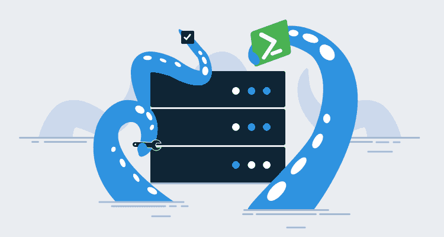
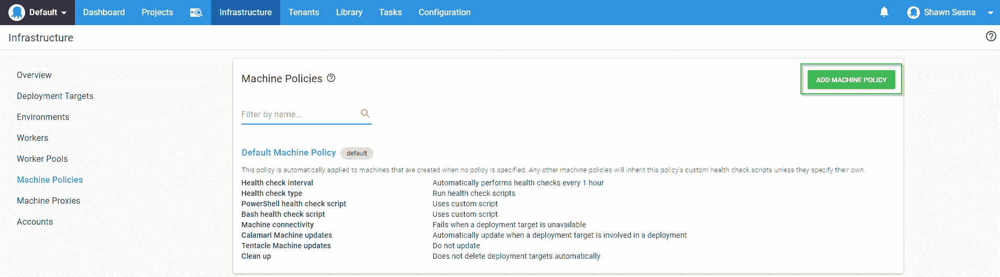
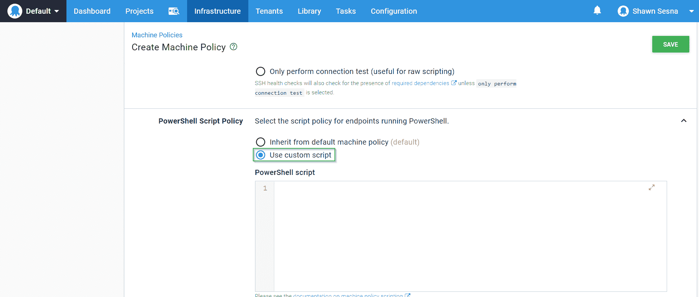

# Powershell DSC - Octopus 部署的引导触手安装

> 原文：<https://octopus.com/blog/bootstrap-tentacle-powershell-dsc>

[](#)

当您有少量机器时，在部署目标上手动安装触角是相当容易的，只需几次点击就可以完成。然而，随着 Octopus Deploy 的采用越来越普遍，尤其是在大型组织中，机器数量呈指数级增长并不罕见。在更高级的实现中，目标有时是动态创建的，手动安装触角是不可行的。这就是基础设施即代码(IaC)派上用场的地方。

作为代码的基础设施是一个可怕而强大的概念。它使您能够以编程方式定义应该如何设置基础设施，从而实现应用程序部署的一致性和可预测性。IaC 的一种方法是 PowerShell 期望状态配置(DSC)。DSC 不仅可以配置机器，它还为我们提供了额外的好处，可以监控机器的漂移，并使用 Octopus 自动将机器返回到所需的状态。在这篇文章中，我将带你使用 OctopusDSC 模块来安装和配置一个触手机器。

## 安装 NuGet 包提供程序

使用 DSC 有一个缺点，在 DSC 脚本运行之前，您使用的任何外部模块都需要存在于机器上。这意味着您必须将外部模块的安装与 DSC 脚本本身分开。

为了下载外部模块，我们首先需要安装 NuGet 包提供程序。根据您的服务器配置，可能需要包括 TLS 1.2:

```
# Include use of TLS 1.2
[System.Net.ServicePointManager]::SecurityProtocol = [System.Net.ServicePointManager]::SecurityProtocol -bor [System.Net.SecurityProtocolType]::Tls12

# check to see if Nuget is installed
if($null -eq (Get-PackageProvider | Where-Object {$_.Name -eq "NuGet"}))
{
    # install the nuget package provider
    Install-PackageProvider -Name NuGet -Force
} 
```

## 下载 OctopusDSC 模块

现在我们已经安装了 NuGet 包提供程序，我们可以联系 PowerShell gallery 下载并安装我们需要的模块:

```
if ($null -eq (Get-Package | Where-Object {$_.Name -eq "OctopusDSC"}))
{
    # download specified module
    Install-Module -Name "OctopusDSC" -Force
} 
```

## 设置 DSC 资源

既然我们已经处理了先决条件组件，那么是时候设置我们的 OctopusDSC cTentacleAgent 资源了。这里有一堆我们可以传递给这个资源的参数。对于这个例子，我们将配置一个监听触手作为部署目标。如果我们希望它成为一个 worker，我们将清空角色和环境数组，并在 WorkerPools 数组中定义我们想要的条目:

```
 # configure Ocotpus Deploy
Configuration OctopusSetup
{
    # define parameters
    Param([string]$OctopusAPIKey,
        [string[]]$OctopusRoles,
        [string[]]$OctopusEnvironments,
        [string]$OctopusServerUrl,
        [string]$DefaultApplicationDirectory,
        [string]$TentacleHomeDirectory,
        [string[]]$WorkerPools,
        [PSCredential]$TentacleServiceCredential,
        [string]$TentacleInstanceName = "Default",
        [ValidateSet("Listen", "Poll")]
        [string]$CommunicationMode = "Listen",
        [ValidateSet("PublicIp", "FQDN", "ComputerName", "Custom")]
        [string]$PublicHostNameConfiguration = "ComputerName"
    )

    # import necessary resources
    Import-DscResource -Module OctopusDSC
    Import-DscResource -ModuleName PSDesiredStateConfiguration

    # create localhost configuration node
    Node 'localhost'
    {
        cTentacleAgent OctopusTentacle
        {
            Name = $TentacleInstanceName
            DisplayName = $env:COMPUTERNAME
            Ensure = "Present"
            State = "Started"
            ApiKey = $OctopusAPIKey
            OctopusServerUrl = $OctopusServerUrl
            Environments = $OctopusEnvironments
            Roles = $OctopusRoles
            CommunicationMode = $CommunicationMode
            DefaultApplicationDirectory = $DefaultApplicationDirectory
            TentacleHomeDirectory = $TentacleHomeDirectory
            WorkerPools = $WorkerPools
            PublicHostNameConfiguration = $PublicHostNameConfiguration
            TentacleServiceCredential = $TentacleServiceCredential
        }
    }
}

# Example roles
$OctopusRoles = @("ExampleRole")

# Example Environments
$OctopusEnvironments = @("Development")

# Example worker pools
$WorkerPools = @()

# Set the APIKey
$OctopusAPIKey = "API-XXXXXXXXXXXXXXXXXXXXXX"

# Set the Octopus Server URL
$OctopusServerUrl = "https://<YourOctoupsServer>"

# Set directories
$DefaultApplicationDirectory = "c:\octopus"
$TentacleHomeDirectory = "c:\octopus\tentaclehome"

# run configuration
OctopusSetup -OctopusAPIKey $OctopusAPIKey -OctopusRoles $OctopusRoles -OctopusEnvironments $OctopusEnvironments -OctopusServerUrl $OctopusServerUrl -OutputPath "c:\dsc" -DefaultApplicationDirectory $DefaultApplicationDirectory -TentacleHomeDirectory $TentacleHomeDirectory -WorkerPools $WorkerPools -TentacleServiceCredential $serviceCredential

# start the configuration
Start-DscConfiguration -Path "c:\dsc" -Verbose -Wait 
```

## 把所有的放在一起

到目前为止，我们已经设置了单独的组件来演示我们想要实现的目标。现在，让我们将所有这些放入一个脚本中。

尽管我们将在远程计算机上运行脚本块，但是 PowerShell 首先在本地计算机上进行评估。如果您还记得，DSC 资源必须存在才能工作，这意味着我们需要在运行脚本的机器上有 OctopusDSC 资源。我知道这很烦人，但事情就是这样。

```
# Get credentials that have rights to the server
$elevatedCredentials = Get-Credential

# Create remote session
$remoteSession = New-PSSession -ComputerName <ComputerName> -Credential $elevatedCredentials

# Download and install the Nuget package provider
Invoke-Command -Session $remoteSession -ScriptBlock {
    # Include use of TLS 1.2
    [System.Net.ServicePointManager]::SecurityProtocol = [System.Net.ServicePointManager]::SecurityProtocol -bor [System.Net.SecurityProtocolType]::Tls12

    # check to see if Nuget is installed
    if((Get-PackageProvider | Where-Object {$_.Name -eq "NuGet"}) -eq $null)
    {
        # install the nuget package provider
        Install-PackageProvider -Name NuGet -Force
    }
}

# Download and install the OctopusDSC module
Invoke-Command -Session $remoteSession -ScriptBlock{
    if ($null -eq (Get-Package | Where-Object {$_.Name -eq "OctopusDSC"}))
    {
        # download specified module
        Install-Module -Name "OctopusDSC" -Force
    }
}

# Run the DSC configuration
Invoke-Command -Session $remoteSession -ScriptBlock{

    # configure Ocotpus Deploy
    Configuration OctopusSetup
    {
        # define parameters
        Param([string]$OctopusAPIKey,
            [string[]]$OctopusRoles,
            [string[]]$OctopusEnvironments,
            [string]$OctopusServerUrl,
            [string]$DefaultApplicationDirectory,
            [string]$TentacleHomeDirectory,
            [string[]]$WorkerPools,
            [PSCredential]$TentacleServiceCredential,
            [string]$TentacleInstanceName = "Default",
            [ValidateSet("Listen", "Poll")]
            [string]$CommunicationMode = "Listen",
            [ValidateSet("PublicIp", "FQDN", "ComputerName", "Custom")]
            [string]$PublicHostNameConfiguration = "ComputerName"
        )

        # import necessary resources
        Import-DscResource -Module OctopusDSC
        Import-DscResource -ModuleName PSDesiredStateConfiguration

        # create localhost configuration node
        Node 'localhost'
        {
            cTentacleAgent OctopusTentacle
            {
                Name = $TentacleInstanceName
                DisplayName = $env:COMPUTERNAME
                Ensure = "Present"
                State = "Started"
                ApiKey = $OctopusAPIKey
                OctopusServerUrl = $OctopusServerUrl
                Environments = $OctopusEnvironments
                Roles = $OctopusRoles
                CommunicationMode = $CommunicationMode
                DefaultApplicationDirectory = $DefaultApplicationDirectory
                TentacleHomeDirectory = $TentacleHomeDirectory
                WorkerPools = $WorkerPools
                PublicHostNameConfiguration = $PublicHostNameConfiguration
                TentacleServiceCredential = $TentacleServiceCredential
            }
        }
    }

    # Example roles
    $OctopusRoles = @("ExampleRole")

    # Example Environments
    $OctopusEnvironments = @("Development")

    # Example worker pools
    $WorkerPools = @()

    # Set the APIKey
    $OctopusAPIKey = "API-XXXXXXXXXXXXXXXXXXXXXX"

    # Set the Octopus Server URL
    $OctopusServerUrl = "https://YourOctopusServer"

    # Set directories
    $DefaultApplicationDirectory = "c:\octopus"
    $TentacleHomeDirectory = "c:\octopus\tentaclehome"

    # run configuration
    OctopusSetup -OctopusAPIKey $OctopusAPIKey -OctopusRoles $OctopusRoles -OctopusEnvironments $OctopusEnvironments -OctopusServerUrl $OctopusServerUrl -OutputPath "c:\dsc" -DefaultApplicationDirectory $DefaultApplicationDirectory -TentacleHomeDirectory $TentacleHomeDirectory -WorkerPools $WorkerPools -TentacleServiceCredential $serviceCredential

    # start the configuration
    Start-DscConfiguration -Path "c:\dsc" -Verbose -Wait
} 
```

使用这个脚本，我们可以安装和配置一个触手机器，而不必 RDP 到它。这在动态扩展基础设施时尤其有用。

## 漂移和 Octopus 机器策略测试

顾名思义，DSC 就是我们想要的状态。例如，上面的配置将触手配置为具有 ExampleRole 的角色(并且只有角色)。如果有人给这个触手添加了额外的角色，它将不再处于期望的状态。我们可以通过运行以下命令来确定:

```
(Test-DscConfiguration -Detailed).ResourcesNotInDesiredState 
```

使用 Octopus Deploy 的机器策略功能，我们可以创建一个新的策略，如果检测到漂移，它将自动纠正。

为此，导航到基础架构选项卡并单击机器策略。在那里，单击“添加机器策略”按钮:

[](#)

选择“使用自定义脚本”单选按钮，然后粘贴以下内容:

[](#)

```
$tentacleConfiguration = (Test-Configuration -Detailed)

if ($null -ne $tentacleConfiguration.ResourcesNotInDesiredState)
{
    # Display what resources are not in desired state
    foreach ($resource in $tentacleConfiguration.ResourcesNotInDesiredState)
    {
        Write-Warning "Resource $($resource.ResourceId) is not in desired state!"
    }

    Write-Output "Running last DSC configuration to correct drift..."
    Start-DscConfiguration -Path "c:\dsc"
} 
```

现在，当检测到漂移时，它将自动运行最后一次 DSC 配置，并将机器恢复到所需状态。在上面的例子中，如果有人向一个触手添加了一个额外的角色，这个策略将检测到这个变化并删除这个添加的角色。如果您需要这个角色，您可以将它添加到我们原始脚本中的`$OctopusRoles`变量中，然后运行新的配置来设置新的期望状态。

## 结论

在这篇文章中，我用一个简单的脚本演示了如何安装和配置一个触手机器，以及检测和纠正漂移的方法。使用像 DSC 这样的方法有助于确保所有的安装都是一致的。