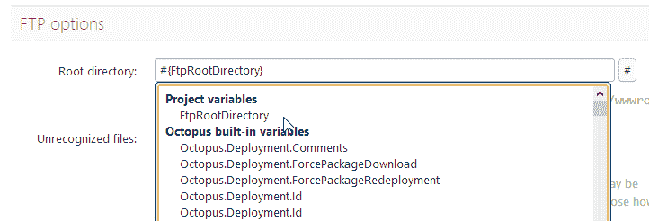
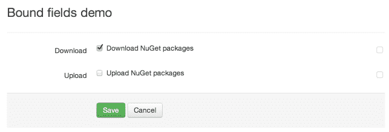
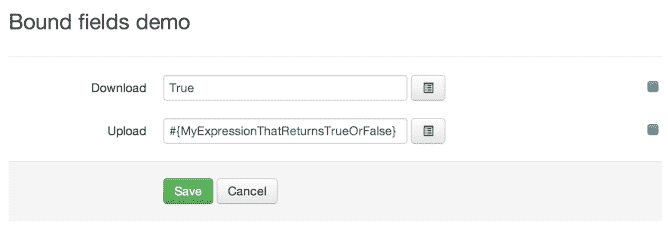

# 章鱼 2.0:绑定领域 UX -章鱼部署

> 原文：<https://octopus.com/blog/bound-fields-ux>

现在，Octopus 已经支持在定义步骤属性时引用变量的能力。例如，当定义一个 FTP 步骤时，我们会询问您应该将文件上传到哪个根目录。



您可以键入原始值:

```
/websites/foo 
```

或者您可以引用一个变量:

```
/website/#{path} 
```

这是一个强大的特性，因为您引用的变量可以在不同的环境中使用*范围*。这样，您可以在每个环境中使用不同的根目录路径。

然而这个特性的一个限制是**它只适用于显示为文本框**的值。对于通常显示为复选框、单选按钮或选择框的值，我们没有办法让您将这些字段“绑定”到表达式。对于八达通 2.0，我想改变这一点。

这是我目前掌握的情况。默认情况下，我们仍将这些字段显示为复选框:



但是如果你需要做一些更高级的事情，你可以点击右边的“绑定灯”按钮，并将其绑定到一个自定义表达式:



下面是嵌入的 JSFiddle:

几乎所有的步骤属性都可以像这样绑定。复选框、选择框、自动完成、单选按钮组和其他任何东西都有一个绑定灯，允许您输入自定义表达式。

UX 还能改进吗？请在下面的框中留下您的评论。