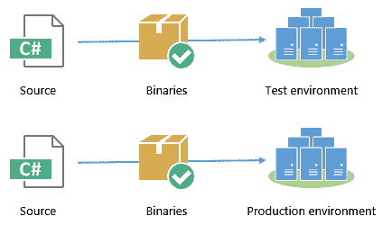
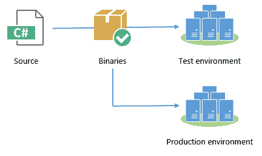

# 你构建二进制文件一次吗？-章鱼部署

> 原文：<https://octopus.com/blog/build-your-binaries-once>

不管你的软件交付管道看起来像什么，如果你正在使用编译语言，你的软件交付过程可能包含这些共同的步骤:

1.  从源代码控制中获取代码
2.  编译它(假设您使用的是编译语言)
3.  配置软件并将其部署到特定环境中的机器上

对于任何重要的应用程序，您都需要将软件部署到多个环境中。这意味着您需要选择:是一次性构建二进制文件，还是在每次部署之前构建它们？

第一个策略是在每次部署之前进行构建。这个过程看起来像下面的图表，其中代码被获取、编译和(希望如此！)在每次部署前进行测试。为了确保相同的特性/修复在每个部署中都得到体现，您可能每次都要构建一个特定的修订版或标签。

或者，您可能决定遵循更类似于下图的方法，其中构建发生一次，并且在部署到每个环境时重用相同的二进制文件集(可部署的工件)。

虽然一次构建二进制文件可以节省效率，但在我看来，这样做的主要原因是为了降低风险。如果您在每次部署之前进行编译，您将冒新的服务包或库更新偷偷进入的风险，从而导致最终部署到每个环境的内容之间的微小差异(漂移)。生产前和生产部署之间保持的一致性越强，生产部署就越有可能顺利进行。

重要的是要认识到构建过程不仅仅是“代码输入”、“二进制代码输出”的确定性函数。生成的二进制文件不仅仅依赖于输入的代码，还依赖于库、编译器、操作系统更新以及许多其他可能随时间变化的环境因素。

可能导致问题的变化的真实例子是。NET framework 4.0 和 4.5。如果在编译后部署测试。在没有安装 4.5 的机器上安装. NET 4.0，然后安装。NET 4.5(因为您计划在即将发布的版本中使用它)，然后尝试在升级到生产之前进行编译，除非您非常明确您正在编译的版本，否则输出结果之间会有[微小的差异](http://marcgravell.blogspot.com.au/2012/09/iterator-blocks-missing-methods-and-net.html)，这可能会导致代码在测试中完美运行，而在生产中失败。

构建一次二进制文件可能有点复杂，因为它需要在两次部署之间的某个地方存储工件。然而，这不一定是一件坏事；在任何时间点，都可以轻松找到旧版本的应用程序，而不必构建它们。如果您需要回滚，这非常方便，尤其是如果您同时对构建服务器进行了更改。

部署自动化的目的是提高我们将工作软件更可靠、更频繁地投入生产的能力。构建一次二进制文件是一个简单的实践，可以帮助实现这一点。