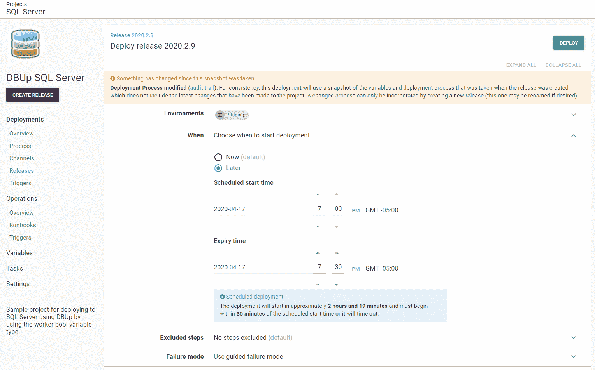
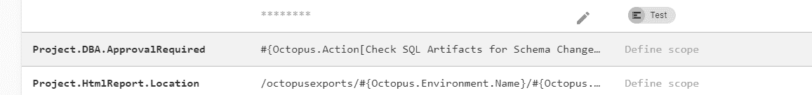
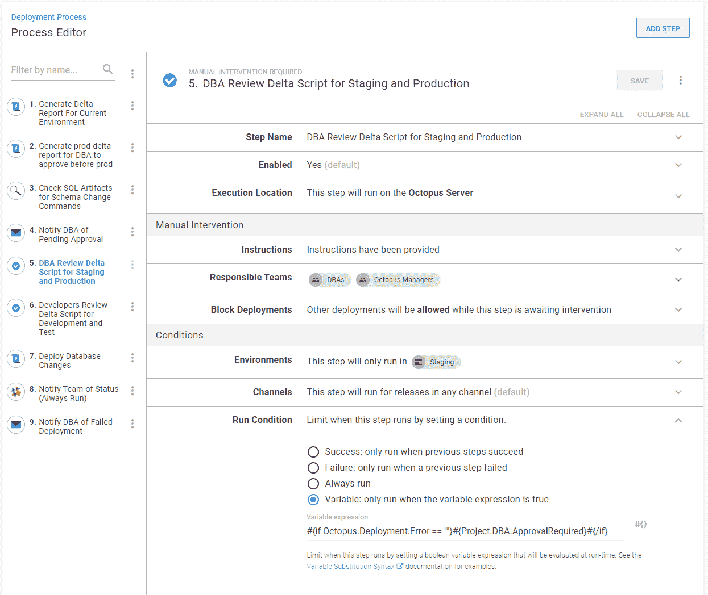

# 在自动化数据库部署过程中建立信任- Octopus Deploy

> 原文：<https://octopus.com/blog/building-trust-in-automated-db-deployments>

[](#)

当我开始自动化数据库部署时，我担心工具会在不应该的时候删除列或表。我不禁总在想，我是不是把一切都配置正确了？核心问题是我没有在我的数据库部署过程中包括建立信任的必要步骤。在这篇博文中，我介绍了一些我用来帮助建立信任的技术和配置，这样我就可以放心地自动部署数据库。

## 假设第一天的信任为零

本文重点介绍如何使用数据库工具和 Octopus Deploy 在部署管道中建立信任。

请注意，诸如验证数据库更改在语法上是否正确，或者数据库更改是否通过了静态分析之类的任务应该在 CI 或构建服务器上完成，这超出了本文的范围。

在设计和实现自动化数据库部署过程时，我从这种心态开始:

> 我需要向我自己和我团队中的每个人证明，部署会导致数据丢失或生产中断的是 ***而不是*** 。

在本文中，我从头开始创建了一个自动化的数据库部署过程。每一节都建立在前一节的基础上，利用 Octopus Deploy 中的一个新特性。我意识到很容易忘记每个特性，所以为了使事情变得简单，下面是本文将使用的特性列表:

*   [手动干预](https://octopus.com/docs/deployment-process/steps/manual-intervention-and-approvals)暂停部署，等待某人批准或拒绝变更。
*   [工件](https://octopus.com/docs/deployment-process/artifacts)存储增量脚本，供 DBA 在手动干预期间审查。
*   [运行条件](https://octopus.com/docs/deployment-process/conditions#run-condition)始终将部署结果通知开发团队，并在生产失败时呼叫数据库管理员。
*   [自定义日志级别](https://octopus.com/docs/deployment-examples/custom-scripts/logging-messages-in-scripts)由运行脚本步骤使用，用于通知数据库管理员脚本中的潜在问题。
*   [电子邮件和其他通知选项](https://octopus.com/docs/deployment-process/steps/email-notifications)让批准者了解待定的变更。
*   [引导故障模式](https://octopus.com/docs/managing-releases/guided-failures)暂停故障部署，让人们调查故障，并可能再次尝试。
*   [输出变量](https://octopus.com/docs/projects/variables/output-variables)以跳过部署中不必要的步骤。例如，如果工具报告没有数据库变更，那么运行部署数据库变更步骤就没有意义。
*   [审计日志](https://octopus.com/docs/administration/managing-users-and-teams/auditing)了解谁启动了部署、谁批准了部署，以及部署是何时发生的。
*   [用户和团队](https://octopus.com/docs/administration/managing-users-and-teams)仅允许 DBA 启动生产部署，但仍允许开发人员部署到较低的环境中。

## 基本部署流程

如果我们完全信任这个过程，我们将只需要部署步骤。让我们从那里开始。

本文使用 [DbUp](https://dbup.github.io/) ，一个跨平台的数据库部署工具来处理数据库部署。本文的核心概念适用于任何数据库服务器的任何数据库部署工具。

[](#)

现在，这个过程将获取包中的脚本，并在数据库上运行它们。如果能知道这些脚本是什么就好了。让我们添加一个生成增量脚本或报告的步骤。

[](#)

`Create Delta Report`步骤在脚本末尾有这样一行，它将脚本作为工件上传到 Octopus Deploy:

```
New-OctopusArtifact -Path "$generatedReport" -Name "$environmentName.UpgradeReport.html" 
```

创建增量报告的方法将根据您的数据库部署工具而有所不同。请查阅该工具的文档来了解如何操作。在某些情况下，我们的[文档](https://octopus.com/docs/deployment-examples/database-deployments)提供了您可以利用的示例。

在部署期间，该工件将出现在屏幕上的两个地方。

[](#)

点击其中任何一个都会下载神器。

部署屏幕还显示谁启动了部署以及何时启动的。该审计日志和工件都将保留到时间结束，除非您已经配置了[保留策略](https://octopus.com/docs/administration/retention-policies)，在这种情况下，它们将只保留到部署被保留策略删除。

现在我们有所进展；我们有一份 delta 报告，只要该版本存在，它就会被保留，供任何人(包括审计员)下载和审查。

## 批准

但是如果 delta 报告显示一个带有类似于`drop table`或`drop column`的命令的脚本呢？可以吗？也许是，也许不是。断然拒绝剧本是没有意义的。更有意义的做法是暂停部署，检查脚本，如果有些事情看起来不对劲，找到创建脚本的人并与他们讨论。为此，我们可以添加手动干预。

当创建手动干预时，一个有趣的想法出现了。必须选择一个团队。我知道你在想什么。“团队应该是 DBA！”这一步将在所有环境中运行。DBA 应该在什么时候审查变更？他们正忙于保持数据库服务器正常运行。不得不审查*每个*部署的*每个*增量脚本将是一项全职工作。

将开发人员和数据库管理员分成两个团队是行不通的，因为这意味着开发人员**或数据库管理员**可以批准部署。这对于`Development`和`Test`环境来说是可以接受的，但对于`Production`来说却不是:

[](#)

在这个例子中，DBA 批准`Staging`和`Production`的增量脚本是有意义的。同时，开发人员可以批准`Development`和`Test`的增量脚本。

我喜欢在所有人工干预中加入章鱼经理团队。这样，如果所有数据库管理员都不可用，他们可以在紧急情况下承担责任。

[](#)

最终的部署过程将有两个手动干预步骤。

[](#)

根据我的经验，在 delta 脚本运行之前暂停并检查它的能力对建立信任大有帮助。如果批准者看到他们不同意的东西，他们可以中止部署。更好的是，负责批准的人在审计日志中。我们可以看到我开始了部署并批准了它(这在演示/测试环境之外是一个大禁忌)。

[](#)

## 通知

DBA 很可能不会每天都整天看着 Octopus 部署。他们需要被告知他们所负责的审批。但是他们在批准部署后应该做什么呢？看完？那可能要花很长时间。这似乎不是对他们时间的有效利用。如果部署成功，他们可能不需要做任何其他事情。部署失败是一件大事；应该通知他们。

对于这个例子，我将电子邮件通知直接包含在流程中。您还可以利用 Octopus Deploy 中的[订阅](https://octopus.com/docs/administration/managing-infrastructure/subscriptions)特性。

电子邮件表单中的初始字段相当简单。主题和正文是导致我停顿的原因。数据库管理员可能一天会收到几十封这样的电子邮件。他们应该很容易批准部署，所以主题行应该包括关于部署的详细信息。如果有些事情看起来不对劲，他们可以将电子邮件转发给您，并提供他们的反馈。正文应包含一个深层链接，供审批者点击。

[](#)

重新输入截图中的内容并不好玩。下面是主题和正文的文本。

```
Subject:
Pending approval for #{Octopus.Project.Name} #{Octopus.Release.Number} to #{Octopus.Environment.Name}

Body:
Please approve the release #{Octopus.Project.Name} #{Octopus.Release.Number} to #{Octopus.Environment.Name} here:

#{Octopus.Web.DeploymentLink} 
```

失败通知有点不同。电子邮件的优先级需要从正常更改为高，并且运行条件应该配置为仅在失败时运行步骤。

[](#)

这个示例使用电子邮件通知，但是您也可以利用其他工具，例如 Slack、Teams、VictorOps 等等。

最后，负责应用程序的团队应该总是被告知部署的状态。如果部署团队使用 Slack，我们可以在他们的 Slack 通道中发送类似的消息。这个例子使用了库中的 [Slack - Send 简单通知](https://library.octopus.com/step-templates/99e6f203-3061-4018-9e34-4a3a9c3c3179/actiontemplate-slack-send-simple-notification)步骤模板。

[](#)

现在我们向关键人物发出通知。典型地，关键人物也是忙碌的人；如果您需要拨入通知来降低信噪比，请不要感到惊讶。

## 帮助审批者

随着时间的推移，数据库管理员必须批准的部署数量将呈指数级增长。这是自动化的本质。当团队对工具感到满意并信任流程时，他们自然会进行更多的部署。

部署多了是把双刃剑；不利的一面是审查数据库变更的时间变少了。DBA 或开发人员可能会错过导致重大损失的模式更改，但是这个过程应该对他们有所帮助。幸运的是，Octopus Deploy 是一个 API 优先的应用程序，使用该 API 可以下载 delta 报告或 SQL 工件来查找任何潜在的破坏性语句:

```
$CommandsToLookFor = "Drop Table,Drop Column,Alter Table,Create Table,Create View"

$OctopusURL = ## YOUR URL
$APIKey = ## YOUR API KEY
$FileExtension = "SQL"
$SpaceId = $OctopusParameters["Octopus.Space.Id"]
$DeploymentId = $OctopusParameters["Octopus.Deployment.Id"]

Write-Host "Commands to look for: $CommandsToLookFor"
Write-Host "Octopus Url: $OctopusUrl"
Write-Host "SpaceId: $SpaceId"
Write-Host "DeploymentId: $DeploymentId"
Write-Host "File Extension: $FileExtension"

$header = @{ "X-Octopus-ApiKey" = $APIKey }

[Net.ServicePointManager]::SecurityProtocol = [Net.SecurityProtocolType]::Tls12
$artifactUrl = "$OctopusUrl/api/$SpaceId/artifacts?take=2147483647&regarding=$DeploymentId&order=asc"
Write-Host "Getting the artifacts from $artifactUrl"
$artifactResponse = Invoke-RestMethod $artifactUrl -Headers $header
$fileListToCheck = @()

foreach ($artifact in $artifactResponse.Items)
{
    $fileName = $artifact.Filename

    if ($fileName.EndsWith($FileExtension))
    {       
        Write-Host "The artifact is a SQL Script, downloading"
        $artifactId = $artifact.Id
        $artifactContentUrl = "$OctopusUrl/api/$SpaceId/artifacts/$artifactId/content"
        Write-Host "Pulling the content from $artifactContentUrl"
        $fileContent += Invoke-RestMethod $artifactContentUrl -Headers $header
        Write-Host "Finished downloading the file $fileName"

        $sqlFileToCheck = @{
            FileName = $fileName;
            Content = $fileContent;
        }

        $fileListToCheck += $sqlFileToCheck                
    }    
}

if ($fileListToCheck.Length -le 0)
{
    Write-Highlight "No sql files were found"

    Exit 0
}

Write-Host "Looping through all commands"
$commandsToCheck = $CommandsToLookFor -split ","
foreach ($sqlFile in $fileListToCheck)
{       
    foreach ($command in $commandsToCheck)
    {
        Write-Host "Checking $($sqlFile.FileName) for command $command"
        $foundCommand = $sqlFile.Content -match "$command"

        if ($foundCommand)
        {
            Write-Highlight "$($sqlFile.FileName) has the command '$command'"            
        }
    }
} 
```

当找到某些命令时，脚本将利用 Octopus Deploy 提供的`Write-Highlight` [日志命令](https://octopus.com/docs/deployment-examples/custom-scripts/logging-messages-in-scripts)。该消息将出现在部署日志中。

[](#)

希望看到这些消息能让审批者轻松一点。

## 处理错误和故障

错误和失败将会发生。其中许多是由于 Octopus Deploy 无法控制的情况而发生的，例如，网络故障、SQL Server 重启、不正确的权限和帐户丢失是最常见的情况。问题解决后，最好再次尝试失败的步骤，避免不必要的返工。如果 DBA 已经批准了一个脚本，他们不需要再次批准它。

[引导性故障](https://octopus.com/docs/managing-releases/guided-failures)就是为这样的场景设计的。可以为每个项目或每个环境启用引导式故障。对于本例，它是在项目级别启用的:

[](#)

就像手动干预一样，当检测到故障时，部署将暂停。Octopus Deploy 提供了选择`Fail`、`Ignore`或`Retry`的步骤。

[](#)

通过这个小小的改变，我们给了用户优雅地处理失败的机会。

## 关注点分离

关注点分离是一种常见的做法。修改代码的人不应该是批准它或者将它部署到`Production`的人。请注意，开发人员应该能够部署到`Development`和`Test`，在 Octopus Deploy 中，可以配置团队来支持这一点。

在 Octopus Deploy 中有五个角色可以帮助实现这一点。

*   部署创建者:被分配到这个角色的人可以开始部署。在本例中，DBA 将被分配到`Production`的这个角色。
*   **项目参与者**:被分配到这个角色的人可以编辑项目，但是不能创建或部署发布。在本例中，开发人员将被分配到`Production`的这个角色。
*   **项目部署者**:被分配到这个角色的人可以做项目贡献者可以做的任何事情，包括部署一个发布。在这个例子中，开发人员将被分配到较低环境的这个角色。
*   **项目查看者**:分配给这个角色的人对项目有一个只读视图。非常适合 QA、企业主和其他没有权限更改流程但仍想查看状态的人。

[](#)

开发团队用户角色将包括:

[](#)

DBA 的权限包括:

[](#)

## 调整数据库管理员在流程中的角色

有了这些权限，DBA 在这个过程中的角色仍然有点奇怪。是他们触发了对`Production`的部署。他们是否也必须手动批准部署？乍一看，很有道理。他们应该批准一个`Production`版本。

真正的问题是:在`Production`部署期间，开发团队多久会因为 DBA 发现他们不喜欢的东西而改变一些东西？

答案大概是永远不会。当中断窗口已经传达给用户和客户时，`Production`部署对于 DBA 来说已经太晚了，无法表达他们的担忧。除非数据库管理员能够 100%确定某个问题将会发生，否则生产部署将会继续进行。

对于 DBA 来说，部署已经太晚了。更好的方法是在`Staging`部署期间为`Production`创建一个增量脚本。这样，DBA 就可以同时批准这两个项目。

[](#)

当 DBA 创建`Production`部署时，他们还可以查看在`Staging`部署期间生成的增量报告。额外的好处是数据库管理员现在可以安排部署，他们不必在线。

[](#)

也就是说，不要期望 DBA 在开始时安排部署并且不在线。在他们信任团队、信任过程、信任自己理解工具之前，需要进行相当多的部署。

## 未来迭代

所有的人工批准和通知都会产生噪音。刚开始时，这种噪音是好的。团队仍在学习工具。最终，团队将会对工具感到满意，而手工批准和通知将会困扰并最终阻碍团队。

取消这些通知和批准是不明智的。在拉取请求过程中可能会出现一些破坏性的东西。流程有一个自动发现潜在问题的步骤`Check SQL Artifacts for Schema Change Commands`。可以修改该脚本来设置[输出变量](https://octopus.com/docs/projects/variables/output-variables)。如果发现潜在的破坏性命令，则部署必须经过批准过程:

```
$ApprovalRequired = $false
Write-Host "Looping through all commands"
$commandListToCheck = $CommandsToLookFor -split ","
foreach ($sqlFile in $fileListToCheck)
{       
    foreach ($command in $commandListToCheck)
    {
        Write-Host "Checking $($sqlFile.FileName) for command $command"
        $foundCommand = $sqlFile.Content -match "$command"

        if ($foundCommand)
        {
            Write-Highlight "$($sqlFile.FileName) has the command '$command'"
            $ApprovalRequired = $true
        }
    }
}

if ($approvalRequired -eq $false)
{
    Write-Highlight "All scripts look good"
}
else
{
    Write-Highlight "One of the specific commands we look for has been found"
}

Set-OctopusVariable -name "DBAApprovalRequired" -value $ApprovalRequired 
```

输出变量有点冗长。为了使它们更容易使用，为结果设置另一个变量。

[](#)

在通知和手动干预步骤中，变量运行条件可以设置为:

```
#{if Octopus.Deployment.Error == ""}#{Project.DBA.ApprovalRequired}#{/if} 
```

[](#)

## 防止坏演员

这个过程中的一个缺陷是，它假设开发人员不会进入部署过程并禁用或删除手动干预步骤。信任，但验证是我们推荐的方法。

首先，我们正在开发一个与 Git 集成的代码为的*流程。如果它与 Git 集成，那么它可以通过一个拉请求过程。*

[本视频](https://www.youtube.com/watch?v=i4qYdsYyu9s&list=PLAGskdGvlaw3-cd9rPiwhwfUo7kDGnOBh&index=19&t=0s)还概述了自动审计项目的流程。

最后，您可以配置[订阅](https://octopus.com/docs/administration/managing-infrastructure/subscriptions)以便在发生更改时通知管理员。

## 结论

在文章的开头，我设定了这个目标:

> 我需要向我自己和我团队中的每个人证明，特定的部署将 ***而不是*** 导致数据丢失或生产中断。

本文中创建的流程通过执行以下操作来帮助实现这一目标:

1.  它生成一个 delta 报告，并将其作为 Octopus 工件发布，供任何人查看。
2.  跟踪谁触发了部署，谁批准了部署，以及一切发生的时间。
3.  一个脚本将下载增量报告并寻找潜在的问题命令。
4.  除了`Production`之外，部署将在每个环境中暂停，以便批准者审查和批准增量报告。
5.  通知会在流程的不同时间发送给关键人员。
6.  开发人员有权部署到`Development`、`Test`和`Staging`，但是数据库管理员必须批准部署到`Staging`。
7.  在`Staging`部署期间，DBA 批准并审查`Staging`和`Production`的变更。这给了他们更多的时间来回顾变化，并在`Production`推动之前提出任何问题。

我在以前的公司工作时也实现了类似的东西。这比之前的流程好多了，之前的流程是一封电子邮件，说“请运行这些 SQL 脚本。”我对即将进行的数据库更改充满信心，最终，DBA 也是如此。他们会说“我会把它安排在晚上 7 点，我不会在线，但如果有任何问题，它会传呼我，我会跳上去。”

我没有天真到相信这将解决所有潜在的信任问题。这个过程并不完美；例如，它没有与生产变更请求系统集成，也没有与问题跟踪器集成。虽然很重要，但我觉得这些东西把本文的水搅浑了。本文的目标是为您提供一些技巧和技术，让您有信心开始自己的 POC 或自动化数据库部署试点。

本文中的部署过程可以在我们的[示例实例](https://samples.octopus.app/app#/Spaces-106/projects/dbup-sql-server/deployments)中找到。

下次再见，愉快的部署！