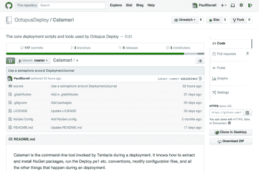
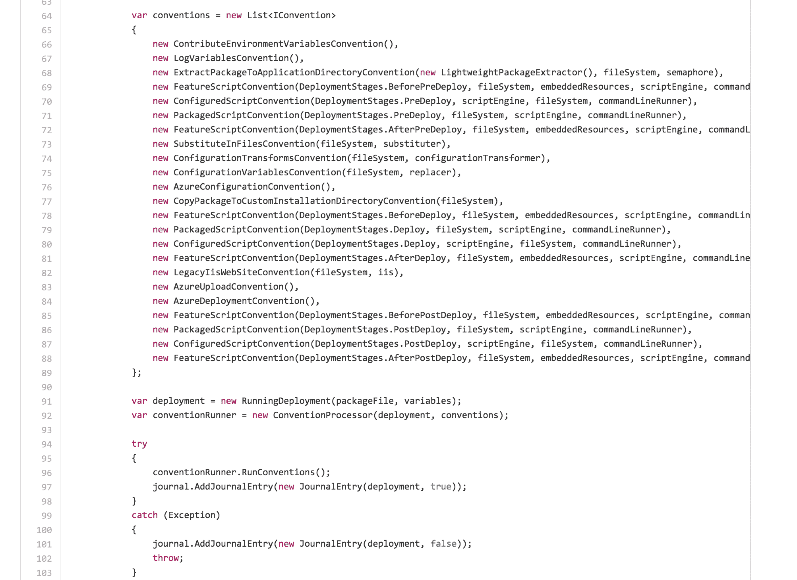

# 卡拉马里:开源触手部署-章鱼部署

> 原文：<https://octopus.com/blog/calamari>

我最近写了关于作为 Octopus 3.x 一部分的[新部署目标，我解释说我们将把触手变成一个“壳”:](http://octopusdeploy.com/blog/deployment-targets-in-octopus-3)

> 从 3.0 开始，除了支持轮询和监听模式之外，可以把触手看作 SSH 的面向 Windows 的版本。它只知道如何执行 PowerShell 脚本或传输文件。其他的东西——配置转换的东西，IIS 的东西——将是 PowerShell 脚本，Octopus 将确保在部署执行之前存在于 Octopus 服务器上。

这导致了一个合乎逻辑的结论:

> 既然我们将触手*的通信通道*与触手*的部署引擎*分离，我们获得了一个新的可能性:触手在部署期间执行的所有脚本和部署逻辑现在都可以开源

在过去的几个月里，实现这一点一直是我们的主要关注点，并且表现为 [Calamari](https://github.com/OctopusDeploy/Calamari) ，一个开源的、约定驱动的部署运行器:

[](https://github.com/OctopusDeploy/Calamari)

从一开始，我们就认为部署管道需要大量的时间投入，并且对团队的运作至关重要。因此，避免供应商锁定非常重要。Octopus 一直建立在开放/标准技术上，如 NuGet 和 PowerShell，以尽量减少您对 Octopus 的依赖——开源 Calamari 和我们在部署期间使用的所有约定是这一目标的自然发展。

Calamari 是一个控制台应用程序，包含许多命令，例如:

```
Calamari deploy-package --package MyPackage.nupkg --variables Variables.json 
```

这个包是一个 NuGet 包，变量 JSON 文件如下所示:

```
{
    "MyVariableA": "My value A",
    "MyVariableB": "My value B"
} 
```

部署现在是这样工作的:

1.  Octopus 获取包并生成变量文件
2.  这些被推到触手上
3.  触手被告知运行一个 PowerShell 脚本，该脚本只调用 Calamari
4.  卡拉马里负责部署，并终止

现在，Calamari 是开源的，它可能有助于回答您在触手上部署期间发生的任何问题。例如，你有没有想过惯例是按照什么顺序运行的？

[](https://github.com/OctopusDeploy/Calamari/blob/master/source/Calamari/Commands/DeployPackageCommand.cs)

或者你可能一直想知道[触手(现在的卡拉马里)如何调用 PowerShell，并传递变量给它](https://github.com/OctopusDeploy/Calamari/tree/master/source/Calamari/Integration/Scripting/WindowsPowerShell)？

Calamari 是在 Apache 许可下发布的，我们将继续在公开的环境中开发它。我最喜欢这个架构的一个特点是，你可以派生项目，做出自己的改变，然后告诉你的 Octopus 3.0 服务器使用你自己的 Calamari 包。