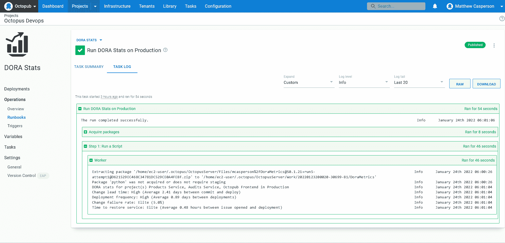

# 使用 Runbooks - Octopus Deploy 计算 DORA 指标

> 原文：<https://octopus.com/blog/calculating-dora-metrics-runbooks>

[devo PS Research and Assessment(DORA)](https://www.devops-research.com/research.html)年度报告收集了全球数千名专业人士的意见，并使用四个关键指标对软件开发团队的表现进行了排名:

*   部署频率——一个组织成功发布产品的频率。
*   变更的交付周期——投入生产所需的时间。
*   变更失败率-导致生产失败的部署的百分比。
*   恢复服务的时间-组织从生产故障中恢复需要多长时间。

团队面临的挑战是如何计算这些指标。幸运的是，Octopus 捕获了生成这些指标所需的大部分原始信息。

在本文中，您将学习如何查询 Octopus API 来生成带有自定义 runbook 的 DORA 记分卡。

## 入门指南

这篇文章使用 GitHub Actions 作为 CI 服务器。GitHub Actions 对公共 git 库是免费的，所以你只需要一个 GitHub 账户就可以开始了。

示例 runbook 脚本是针对 Python 3 编写的，可以从 Python 网站下载[。](https://www.python.org/downloads/)

示例 runbook 源代码可以在 [GitHub](https://github.com/OctopusSamples/DoraMetrics) 上找到。对脚本的调整和更新可以在 GitHub repo 上找到，所以一定要查看最新版本。

## 生成构建信息

[构建信息](https://octopus.com/docs/packaging-applications/build-servers/build-information)为 Octopus 部署或 runbook 中引用的包提供额外的元数据。构建信息包是存储在 Octopus 服务器上的单独的工件，具有与它们所代表的包相同的包 ID 和版本。这使得 Octopus 可以跟踪各种包的元数据，无论是存储在内置提要中还是托管在外部存储库中。

构建信息捕获信息，例如包含在编译的工件中的提交，以及关闭的工作项列表(在 GitHub 中称为问题)。

XO-energy/action-octopus-build-information 动作提供了创建和上传构建信息包的能力。以下步骤显示了一个操作示例:

```
 - name: Generate Octopus Deploy build information
      uses: xo-energy/action-octopus-build-information@v1.1.2
      with:
        octopus_api_key: ${{ inputs.octopus_api_token }}
        octopus_project: Products Service
        octopus_server: ${{ inputs.octopus_server_url }}
        push_version: 0.1.${{ inputs.run_number }}${{ env.BRANCH_NAME != 'master' && format('-{0}', env.BRANCH_NAME) || ''  }}
        push_package_ids: com.octopus.octopub:products-service
        push_overwrite_mode: OverwriteExisting
        output_path: octopus
        octopus_space: "Octopub"
        octopus_environment: "Development" 
```

Octopus 只需要推送构建信息包就可以将元数据链接到发行版。当构建信息包 ID 和版本与 Octopus 步骤中使用的包相匹配时，构建信息被链接到发布。

随着提交和工作项目现在与每个 Octopus 版本相关联，下一个任务是确定如何使用这些信息来度量四个关键指标。

## 解读 DORA 指标

DORA 指标是高层次的，没有定义具体的衡量规则。这是有意义的，因为每个团队和工具链对什么是部署，或者什么是生产失败有稍微不同的解释。

因此，要计算度量标准，您必须首先决定如何用您现有的数据准确地度量它们。

出于本文的目的，DORA 指标计算如下:

*   部署频率——部署到生产环境的频率。
*   变更的交付周期——与发布相关的最早提交和部署到生产环境之间的时间。
*   变更失败率——解决问题的生产环境部署的百分比。
*   恢复服务的时间-问题打开和关闭之间的时间。

您会注意到，为了方便起见，其中的一些测量已经被简化了。

例如，变更失败率指标在技术上跟踪导致问题的部署，而不是解决问题的部署，正如我们在这里定义的那样。然而，构建信息包所公开的数据使得跟踪给定版本中已解决的问题变得容易，并且我们假设部署解决问题的速度是部署引入问题的速度的良好代理。

此外，恢复服务的时间指标假定所有问题都代表部署到生产环境中的错误或倒退。事实上，问题倾向于跟踪从 bug 到增强的大范围变化。然而，这里给出的解决方案没有进行这种区分。

只要您在问题跟踪平台中创建了所需的自定义字段，并努力填充它们，就一定可以跟踪哪些部署导致了生产问题。还可以区分记录 bug 的问题和代表增强的问题。然而，这种级别的跟踪不会在这篇文章中讨论。

## 计算指标

用于生成 DORA 指标的完整脚本如下所示:

```
import sys
from datetime import datetime
from functools import cmp_to_key
from requests.auth import HTTPBasicAuth
from requests import get
import argparse
import pytz

parser = argparse.ArgumentParser(description='Calculate the DORA metrics.')
parser.add_argument('--octopusUrl', dest='octopus_url', action='store', help='The Octopus server URL',
                    required=True)
parser.add_argument('--octopusApiKey', dest='octopus_api_key', action='store', help='The Octopus API key',
                    required=True)
parser.add_argument('--githubUser', dest='github_user', action='store', help='The GitHub username',
                    required=True)
parser.add_argument('--githubToken', dest='github_token', action='store', help='The GitHub token/password',
                    required=True)
parser.add_argument('--octopusSpace', dest='octopus_space', action='store', help='The Octopus space',
                    required=True)
parser.add_argument('--octopusProject', dest='octopus_project', action='store',
                    help='A comma separated list of Octopus projects', required=True)
parser.add_argument('--octopusEnvironment', dest='octopus_environment', action='store', help='The Octopus environment',
                    required=True)

args = parser.parse_args()

headers = {"X-Octopus-ApiKey": args.octopus_api_key}
github_auth = HTTPBasicAuth(args.github_user, args.github_token)

def parse_github_date(date_string):
    if date_string is None:
        return None
    return datetime.strptime(date_string.replace("Z", "+0000"), '%Y-%m-%dT%H:%M:%S%z')

def parse_octopus_date(date_string):
    if date_string is None:
        return None
    return datetime.strptime(date_string[:-3] + date_string[-2:], '%Y-%m-%dT%H:%M:%S.%f%z')

def compare_dates(date1, date2):
    date1_parsed = parse_octopus_date(date1["Created"])
    date2_parsed = parse_octopus_date(date2["Created"])
    if date1_parsed < date2_parsed:
        return -1
    if date1_parsed == date2_parsed:
        return 0
    return 1

def get_space_id(space_name):
    url = args.octopus_url + "/api/spaces?partialName=" + space_name.strip() + "&take=1000"
    response = get(url, headers=headers)
    spaces_json = response.json()

    filtered_items = [a for a in spaces_json["Items"] if a["Name"] == space_name.strip()]

    if len(filtered_items) == 0:
        sys.stderr.write("The space called " + space_name + " could not be found.\n")
        return None

    first_id = filtered_items[0]["Id"]
    return first_id

def get_resource_id(space_id, resource_type, resource_name):
    if space_id is None:
        return None

    url = args.octopus_url + "/api/" + space_id + "/" + resource_type + "?partialName=" \
          + resource_name.strip() + "&take=1000"
    response = get(url, headers=headers)
    json = response.json()

    filtered_items = [a for a in json["Items"] if a["Name"] == resource_name.strip()]
    if len(filtered_items) == 0:
        sys.stderr.write("The resource called " + resource_name + " could not be found in space " + space_id + ".\n")
        return None

    first_id = filtered_items[0]["Id"]
    return first_id

def get_resource(space_id, resource_type, resource_id):
    if space_id is None:
        return None

    url = args.octopus_url + "/api/" + space_id + "/" + resource_type + "/" + resource_id
    response = get(url, headers=headers)
    json = response.json()

    return json

def get_deployments(space_id, environment_id, project_id):
    if space_id is None or environment_id is None or project_id is None:
        return None

    url = args.octopus_url + "/api/" + space_id + "/deployments?environments=" + environment_id + "&take=1000"
    response = get(url, headers=headers)
    json = response.json()

    filtered_items = [a for a in json["Items"] if a["ProjectId"] == project_id]
    if len(filtered_items) == 0:
        sys.stderr.write("The project id " + project_id + " did not have a deployment in " + space_id + ".\n")
        return None

    sorted_list = sorted(filtered_items, key=cmp_to_key(compare_dates), reverse=True)

    return sorted_list

def get_change_lead_time():
    change_lead_times = []
    space_id = get_space_id(args.octopus_space)
    environment_id = get_resource_id(space_id, "environments", args.octopus_environment)
    for project in args.octopus_project.split(","):
        project_id = get_resource_id(space_id, "projects", project)
        deployments = get_deployments(space_id, environment_id, project_id)
        for deployment in deployments:
            earliest_commit = None
            release = get_resource(space_id, "releases", deployment["ReleaseId"])
            for buildInfo in release["BuildInformation"]:
                for commit in buildInfo["Commits"]:
                    api_url = commit["LinkUrl"].replace("github.com", "api.github.com/repos") \
                        .replace("commit", "commits")
                    commit_response = get(api_url, auth=github_auth)
                    date_parsed = parse_github_date(commit_response.json()["commit"]["committer"]["date"])
                    if earliest_commit is None or earliest_commit > date_parsed:
                        earliest_commit = date_parsed
            if earliest_commit is not None:
                change_lead_times.append((parse_octopus_date(deployment["Created"]) - earliest_commit).total_seconds())
    if len(change_lead_times) != 0:
        return sum(change_lead_times) / len(change_lead_times)
    return None

def get_time_to_restore_service():
    restore_service_times = []
    space_id = get_space_id(args.octopus_space)
    environment_id = get_resource_id(space_id, "environments", args.octopus_environment)
    for project in args.octopus_project.split(","):
        project_id = get_resource_id(space_id, "projects", project)
        deployments = get_deployments(space_id, environment_id, project_id)
        for deployment in deployments:
            deployment_date = parse_octopus_date(deployment["Created"])
            release = get_resource(space_id, "releases", deployment["ReleaseId"])
            for buildInfo in release["BuildInformation"]:
                for work_item in buildInfo["WorkItems"]:
                    api_url = work_item["LinkUrl"].replace("github.com", "api.github.com/repos")
                    commit_response = get(api_url, auth=github_auth)
                    created_date = parse_github_date(commit_response.json()["created_at"])
                    if created_date is not None:
                        restore_service_times.append((deployment_date - created_date).total_seconds())
    if len(restore_service_times) != 0:
        return sum(restore_service_times) / len(restore_service_times)
    return None

def get_deployment_frequency():
    deployment_count = 0
    earliest_deployment = None
    latest_deployment = None
    space_id = get_space_id(args.octopus_space)
    environment_id = get_resource_id(space_id, "environments", args.octopus_environment)
    for project in args.octopus_project.split(","):
        project_id = get_resource_id(space_id, "projects", project)
        deployments = get_deployments(space_id, environment_id, project_id)
        deployment_count = deployment_count + len(deployments)
        for deployment in deployments:
            created = parse_octopus_date(deployment["Created"])
            if earliest_deployment is None or earliest_deployment > created:
                earliest_deployment = created
            if latest_deployment is None or latest_deployment < created:
                latest_deployment = created
    if latest_deployment is not None:
        # return average seconds / deployment from the earliest deployment to now
        return (datetime.now(pytz.utc) - earliest_deployment).total_seconds() / deployment_count
        # You could also return the frequency between the first and last deployment
        # return (latest_deployment - earliest_deployment).total_seconds() / deployment_count
    return None

def get_change_failure_rate():
    releases_with_issues = 0
    deployment_count = 0
    space_id = get_space_id(args.octopus_space)
    environment_id = get_resource_id(space_id, "environments", args.octopus_environment)
    for project in args.octopus_project.split(","):
        project_id = get_resource_id(space_id, "projects", project)
        deployments = get_deployments(space_id, environment_id, project_id)
        deployment_count = deployment_count + len(deployments)
        for deployment in deployments:
            release = get_resource(space_id, "releases", deployment["ReleaseId"])
            for buildInfo in release["BuildInformation"]:
                if len(buildInfo["WorkItems"]) != 0:
                    # Note this measurement is not quite correct. Technically, the change failure rate
                    # measures deployments that result in a degraded service. We're measuring
                    # deployments that included fixes. If you made 4 deployments with issues,
                    # and fixed all 4 with a single subsequent deployment, this logic only detects one
                    # "failed" deployment instead of 4.
                    #
                    # To do a true measurement, issues must track the deployments that introduced the issue.
                    # There is no such out of the box field in GitHub actions though, so for simplicity
                    # we assume the rate at which fixes are deployed is a good proxy for measuring the
                    # rate at which bugs are introduced.
                    releases_with_issues = releases_with_issues + 1
    if releases_with_issues != 0 and deployment_count != 0:
        return releases_with_issues / deployment_count
    return None

def get_change_lead_time_summary(lead_time):
    if lead_time is None:
        print("Change lead time: N/A (no deployments or commits)")
    # One hour
    elif lead_time < 60 * 60:
        print("Change lead time: Elite (Average " + str(round(lead_time / 60 / 60, 2))
                         + " hours between commit and deploy)")
    # Every week
    elif lead_time < 60 * 60 * 24 * 7:
        print("Change lead time: High (Average " + str(round(lead_time / 60 / 60 / 24, 2))
                         + " days between commit and deploy)")
    # Every six months
    elif lead_time < 60 * 60 * 24 * 31 * 6:
        print("Change lead time: Medium (Average " + str(round(lead_time / 60 / 60 / 24 / 31, 2))
                         + " months between commit and deploy)")
    # Longer than six months
    else:
        print("Change lead time: Low (Average " + str(round(lead_time / 60 / 60 / 24 / 31, 2))
                         + " months between commit and deploy)")

def get_deployment_frequency_summary(deployment_frequency):
    if deployment_frequency is None:
        print("Deployment frequency: N/A (no deployments found)")
    # Multiple times per day
    elif deployment_frequency < 60 * 60 * 12:
        print("Deployment frequency: Elite (Average " + str(round(deployment_frequency / 60 / 60, 2))
                         + " hours between deployments)")
    # Every month
    elif deployment_frequency < 60 * 60 * 24 * 31:
        print("Deployment frequency: High (Average " + str(round(deployment_frequency / 60 / 60 / 24, 2))
                         + " days between deployments)")
    # Every six months
    elif deployment_frequency < 60 * 60 * 24 * 31 * 6:
        print("Deployment frequency: Medium (Average " + str(round(deployment_frequency / 60 / 60 / 24 / 31, 2))
                         + " months bbetween deployments)")
    # Longer than six months
    else:
        print("Deployment frequency: Low (Average " + str(round(deployment_frequency / 60 / 60 / 24 / 31, 2))
                         + " months between commit and deploy)")

def get_change_failure_rate_summary(failure_percent):
    if failure_percent is None:
        print("Change failure rate: N/A (no issues or deployments found)")
    # 15% or less
    elif failure_percent <= 0.15:
        print("Change failure rate: Elite (" + str(round(failure_percent * 100, 0)) + "%)")
    # Interestingly, everything else is reported as High to Low
    else:
        print("Change failure rate: Low (" + str(round(failure_percent * 100, 0)) + "%)")

def get_time_to_restore_service_summary(restore_time):
    if restore_time is None:
        print("Time to restore service: N/A (no issues or deployments found)")
    # One hour
    elif restore_time < 60 * 60:
        print("Time to restore service: Elite (Average " + str(round(restore_time / 60 / 60, 2))
                         + " hours between issue opened and deployment)")
    # Every month
    elif restore_time < 60 * 60 * 24:
        print("Time to restore service: High (Average " + str(round(restore_time / 60 / 60, 2))
                         + " hours between issue opened and deployment)")
    # Every six months
    elif restore_time < 60 * 60 * 24 * 7:
        print("Time to restore service: Medium (Average " + str(round(restore_time / 60 / 60 / 24, 2))
                         + " hours between issue opened and deployment)")
    # Technically the report says longer than six months is low, but there is no measurement
    # between week and six months, so we'll say longer than a week is low.
    else:
        print("Deployment frequency: Low (Average " + str(round(restore_time / 60 / 60 / 24, 2))
                         + " hours between issue opened and deployment)")

print("DORA stats for project(s) " + args.octopus_project + " in " + args.octopus_environment)
get_change_lead_time_summary(get_change_lead_time())
get_deployment_frequency_summary(get_deployment_frequency())
get_change_failure_rate_summary(get_change_failure_rate())
get_time_to_restore_service_summary(get_time_to_restore_service()) 
```

让我们分解这段代码，了解它在做什么。

### 处理参数

您的脚本接受来自命令行参数的参数，使其可以跨多个 Octopus 实例和空间重用。参数由 [argparse 模块](https://docs.python.org/3/library/argparse.html)解析。你可以在 Real Python 关于主题的帖子中找到更多关于使用`argparse` [的信息:](https://realpython.com/command-line-interfaces-python-argparse/)

```
parser = argparse.ArgumentParser(description='Calculate the DORA metrics.')
parser.add_argument('--octopusUrl', dest='octopus_url', action='store', help='The Octopus server URL',
                    required=True)
parser.add_argument('--octopusApiKey', dest='octopus_api_key', action='store', help='The Octopus API key',
                    required=True)
parser.add_argument('--githubUser', dest='github_user', action='store', help='The GitHub username',
                    required=True)
parser.add_argument('--githubToken', dest='github_token', action='store', help='The GitHub token/password',
                    required=True)
parser.add_argument('--octopusSpace', dest='octopus_space', action='store', help='The Octopus space',
                    required=True)
parser.add_argument('--octopusProject', dest='octopus_project', action='store',
                    help='A comma separated list of Octopus projects', required=True)
parser.add_argument('--octopusEnvironment', dest='octopus_environment', action='store', help='The Octopus environment',
                    required=True)

args = parser.parse_args() 
```

### API 认证

该脚本向 Octopus 和 GitHub APIs 发出许多请求，所有请求都需要认证。

Octopus API 使用`X-Octopus-ApiKey`头来传递用于认证请求的 API 密钥。你可以在 [Octopus 文档](https://octopus.com/docs/octopus-rest-api/how-to-create-an-api-key)中找到更多关于如何创建 API 的信息。

GitHub API 使用标准的 HTTP 基本认证，密码使用个人访问令牌。GitHub 文档提供了创建令牌的细节。

下面的代码捕获包含凭证的对象，这些凭证通过脚本的其余部分随每个 API 请求传递:

```
headers = {"X-Octopus-ApiKey": args.octopus_api_key}
github_auth = HTTPBasicAuth(args.github_user, args.github_token) 
```

### 日期处理

GitHub API 以特定的格式返回日期。`parse_github_date`函数获取这些日期，并将其转换为 Python datetime 对象:

```
def parse_github_date(date_string):
    if date_string is None:
        return None
    return datetime.strptime(date_string.replace("Z", "+0000"), '%Y-%m-%dT%H:%M:%S%z') 
```

Octopus API 以自己特定的格式返回日期。`parse_octopus_date`函数将 Octopus 日期转换成 Python 日期时间对象。

Octopus API 以 ISO 8601 格式返回日期，类似于`2022-01-04T04:23:02.941+00:00`。不幸的是， [Python 3.6 不支持包含冒号](https://bugs.python.org/issue15873)的时区偏移量，所以您需要在解析和比较日期之前去掉冒号:

```
def parse_octopus_date(date_string):
    if date_string is None:
        return None
    return datetime.strptime(date_string[:-3] + date_string[-2:], '%Y-%m-%dT%H:%M:%S.%f%z') 
```

`compare_dates`函数将两个日期作为字符串，将它们解析为 datetime 对象，并返回一个值`1`、`0`或`-1`，指示`date1`与`date2`相比如何:

```
def compare_dates(date1, date2):
    date1_parsed = parse_octopus_date(date1["Created"])
    date2_parsed = parse_octopus_date(date2["Created"])
    if date1_parsed < date2_parsed:
        return -1
    if date1_parsed == date2_parsed:
        return 0
    return 1 
```

### 查询章鱼资源

这个脚本(以及大多数使用 Octopus API 的脚本)中使用的一个常见模式是查找命名资源的 ID。`get_space_id`函数获取 Octopus 空间的名称，并查询 API 以返回空间 ID:

```
def get_space_id(space_name): 
```

`/api/spaces`端点返回 Octopus 服务器中定义的空间列表。`partialName`查询参数将结果限制为名称包含所提供值的空格，而`take`参数被设置为一个较大的数字，因此您不需要循环任何分页的结果:

```
 url = args.octopus_url + "/api/spaces?partialName=" + space_name.strip() + "&take=1000" 
```

对端点发出 GET HTTP 请求，包括 Octopus 身份验证头，JSON 结果被解析到 Python 嵌套字典中:

```
 response = get(url, headers=headers)
    spaces_json = response.json() 
```

返回的结果可以匹配名称为或包含所提供的空间名称的任何空间。这意味着如果我们搜索名为`MySpace`的空间，将返回名为`MySpace`和`MySpaceTwo`的空间。

为了确保用正确的名称返回空间的 ID，一个[列表理解](https://docs.python.org/3/tutorial/datastructures.html#list-comprehensions)将返回的空间过滤为与提供的空间名称完全匹配的空间:

```
 filtered_items = [a for a in spaces_json["Items"] if a["Name"] == space_name.strip()] 
```

如果没有空格与提供的空格名称匹配，该函数将返回`None`:

```
 if len(filtered_items) == 0:
        sys.stderr.write("The space called " + space_name + " could not be found.\n")
        return None 
```

如果有匹配的空格，则返回 ID:

```
 first_id = filtered_items[0]["Id"]
    return first_id 
```

空间是 Octopus 中的顶级资源，而您在该脚本中与之交互的所有其他资源都是空间的子资源。正如您对`get_space_id`函数所做的一样，`get_resource_id`函数将一个已命名的 Octopus 资源转换成它的 id。这里唯一的区别是所请求的端点在路径中包含了空间 ID，并且提供了资源类型来构建路径中的第二个元素。否则`get_resource_id`遵循与`get_space_id`功能相同的模式:

```
def get_resource_id(space_id, resource_type, resource_name):
    if space_id is None:
        return None

    url = args.octopus_url + "/api/" + space_id + "/" + resource_type + "?partialName=" \
        + resource_name.strip() + "&take=1000"
    response = get(url, headers=headers)
    json = response.json()

    filtered_items = [a for a in json["Items"] if a["Name"] == resource_name.strip()]
    if len(filtered_items) == 0:
        sys.stderr.write("The resource called " + resource_name + " could not be found in space " + space_id + ".\n")
        return None

    first_id = filtered_items[0]["Id"]
    return first_id 
```

您需要访问完整的 Octopus 发布资源来检查构建信息元数据。`get_resource`函数使用上述函数返回的资源 id 从 Octopus API 返回一个完整的资源定义:

```
def get_resource(space_id, resource_type, resource_id):
    if space_id is None:
        return None

    url = args.octopus_url + "/api/" + space_id + "/" + resource_type + "/" + resource_id
    response = get(url, headers=headers)
    json = response.json()

    return json 
```

`get_deployments`函数返回在给定项目的给定环境中执行的部署列表。对部署列表进行排序，以确保最新的部署是列表中的第一项:

```
def get_deployments(space_id, environment_id, project_id):
    if space_id is None or environment_id is None or project_id is None:
        return None

    url = args.octopus_url + "/api/" + space_id + "/deployments?environments=" + environment_id + "&take=1000"
    response = get(url, headers=headers)
    json = response.json()

    filtered_items = [a for a in json["Items"] if a["ProjectId"] == project_id]
    if len(filtered_items) == 0:
        sys.stderr.write("The project id " + project_id + " did not have a deployment in " + space_id + ".\n")
        return None

    sorted_list = sorted(filtered_items, key=cmp_to_key(compare_dates), reverse=True)

    return sorted_list 
```

### 计算变更的提前期

现在已经有了代码来查询 Octopus API 的部署和发布，并使用这些信息来计算 DORA 指标。

要解决的第一个指标是变更的交付时间，它是在`get_change_lead_time`函数中计算的:

```
def get_change_lead_time(): 
```

计算每次部署的交付时间，并获取数组中的值。这使您可以计算平均提前期:

```
 change_lead_times = [] 
```

空间和环境名称被转换为 id:

```
 space_id = get_space_id(args.octopus_space)
    environment_id = get_resource_id(space_id, "environments", args.octopus_environment) 
```

项目参数是以逗号分隔的项目名称列表。因此，您必须对每个单独的项目进行循环，并将项目名称转换为 ID:

```
 for project in args.octopus_project.split(","):
        project_id = get_resource_id(space_id, "projects", project) 
```

收集空间和环境的项目部署列表:

```
 deployments = get_deployments(space_id, environment_id, project_id) 
```

这是您计算每次部署的交付时间的地方:

```
 for deployment in deployments: 
```

变更的交付周期度量与将提交部署到生产中所花费的时间有关。您必须找到与部署相关联的最早提交:

```
 earliest_commit = None 
```

一个部署代表一个版本在一个环境中的执行。它是包含构建信息元数据的发布，而构建信息元数据又包含与发布中包含的任何包相关联的提交的细节。您必须从部署持有的发布 ID 中获取发布资源:

```
 release = get_resource(space_id, "releases", deployment["ReleaseId"]) 
```

版本包含一个数组，该数组包含零个或多个构建信息对象。您必须循环遍历该数组以返回提交的详细信息:

```
 for buildInfo in release["BuildInformation"]: 
```

每个构建信息对象包含零个或多个提交。您必须循环遍历该数组，寻找最早的提交:

```
 for commit in buildInfo["Commits"]: 
```

当使用 GitHub 提交时，与每个提交相关联的 URL 链接回一个可以用 web 浏览器打开的页面。这些链接看起来像:[https://github . com/OctopusSamples/OctoPub/commit/dcaf 638037503021 de 696d 13 B4 C5 c 41 ba 6952 e 9 f](https://github.com/OctopusSamples/OctoPub/commit/dcaf638037503021de696d13b4c5c41ba6952e9f)。

GitHub 维护一组并行的 URL，这些 URL 公开了用于查询 GitHub 资源的 API。API 使用的 URL 通常类似于可公开浏览的 URL。在这种情况下，API URL 看起来像:[https://API . github . com/repos/OctopusSamples/OctoPub/commits/dcaf 638037503021 de 696d 13 B4 C5 c 41 ba 6952 e 9 f](https://github.com/OctopusSamples/OctoPub/commit/dcaf638037503021de696d13b4c5c41ba6952e9f)。因此，您将可浏览链接转换为 API 链接:

```
 api_url = commit["LinkUrl"].replace("github.com", "api.github.com/repos") \
                        .replace("commit", "commits") 
```

然后查询提交的详细信息:

```
 commit_response = get(api_url, auth=github_auth) 
```

您需要以 Python datetime 对象的形式返回提交日期:

```
 date_parsed = parse_github_date(commit_response.json()["commit"]["committer"]["date"]) 
```

然后保存最早提交的日期:

```
 if earliest_commit is None or earliest_commit > date_parsed:
                        earliest_commit = date_parsed 
```

假设上面的代码找到了提交日期，则部署日期和提交日期之间的差值计算如下:

```
 if earliest_commit is not None:
                change_lead_times.append((parse_octopus_date(deployment["Created"]) - earliest_commit).total_seconds()) 
```

假设在构建信息元数据中找到任何提交，则计算并返回最早提交和部署日期之间的平均时间:

```
 if len(change_lead_times) != 0:
        return sum(change_lead_times) / len(change_lead_times) 
```

如果没有发现提交，或者发布没有相关的构建信息，则返回`None`:

```
 return None 
```

### 计算恢复服务的时间

下一个要计算的指标是恢复服务的时间。

正如引言中所提到的，这个指标被认为是通过部署一个解决了问题的版本所花费的时间来衡量的。`get_time_to_restore_service`函数用于计算该值:

```
def get_time_to_restore_service(): 
```

同样，您维护一个值数组来计算平均值:

```
 restore_service_times = [] 
```

空间和环境名称被转换为它们的 id:

```
 space_id = get_space_id(args.octopus_space)
    environment_id = get_resource_id(space_id, "environments", args.octopus_environment) 
```

项目以逗号分隔的列表形式提供，您可以在该列表中循环:

```
 for project in args.octopus_project.split(","): 
```

项目名称被转换为一个 ID，并返回该环境的项目部署列表:

```
 project_id = get_resource_id(space_id, "projects", project)
        deployments = get_deployments(space_id, environment_id, project_id) 
```

返回与每个部署相关的发布，遍历所有的构建信息对象，然后遍历与发布中的每个包相关的所有工作项(在 GitHub 中称为问题):

```
 for deployment in deployments:
            deployment_date = parse_octopus_date(deployment["Created"])
            release = get_resource(space_id, "releases", deployment["ReleaseId"])
            for buildInfo in release["BuildInformation"]:
                for work_item in buildInfo["WorkItems"]: 
```

可浏览问题的 URL 被转换为 API URL，通过 API 查询问题，并返回创建日期:

```
 api_url = work_item["LinkUrl"].replace("github.com", "api.github.com/repos")
                    commit_response = get(api_url, auth=github_auth)
                    created_date = parse_github_date(commit_response.json()["created_at"]) 
```

问题的创建和部署之间的时间是这样计算的:

```
 if created_date is not None:
                        restore_service_times.append((deployment_date - created_date).total_seconds()) 
```

如果发现任何问题，则计算问题创建和部署之间的平均时间:

```
 if len(restore_service_times) != 0:
        return sum(restore_service_times) / len(restore_service_times) 
```

如果没有发现问题，则返回`None`:

```
 return None 
```

### 计算部署频率

部署频率是最容易计算的指标，因为它只是生产部署之间的平均时间。这是由`get_deployment_frequency`函数计算的:

```
def get_deployment_frequency(): 
```

部署频率的计算方法是执行部署的持续时间除以部署次数:

```
 deployment_count = 0
    earliest_deployment = None
    latest_deployment = None 
```

空间、环境和项目名称被转换为 id:

```
 space_id = get_space_id(args.octopus_space)
    environment_id = get_resource_id(space_id, "environments", args.octopus_environment)
    for project in args.octopus_project.split(","):
        project_id = get_resource_id(space_id, "projects", project) 
```

返回在环境中执行的部署:

```
 deployments = get_deployments(space_id, environment_id, project_id) 
```

计算部署的次数:

```
 deployment_count = deployment_count + len(deployments) 
```

找到最早和最新的部署:

```
 for deployment in deployments:
            created = parse_octopus_date(deployment["Created"])
            if earliest_deployment is None or earliest_deployment > created:
                earliest_deployment = created
            if latest_deployment is None or latest_deployment < created:
                latest_deployment = created 
```

假设找到了任何部署，则部署间隔时间除以部署次数。

注意:您可以用几种不同的方法来测量这个值。未注释的代码测量从最早的部署到当前时间点之间的平均部署时间。

另一种方法是测量最早部署和最近部署之间的平均时间:

```
 if latest_deployment is not None:
        # return average seconds / deployment from the earliest deployment to now
        return (datetime.now(pytz.utc) - earliest_deployment).total_seconds() / deployment_count
        # You could also return the frequency between the first and last deployment
        # return (latest_deployment - earliest_deployment).total_seconds() / deployment_count
    return None 
```

### 计算变更失败率

最后一个指标是变更失败率。

正如简介中所提到的，这段代码度量的是解决问题的部署数量，而不是引入问题的部署数量。使用构建信息捕获的信息来计算前一个度量是微不足道的，而后一个度量需要更多的元数据才能被问题公开。

尽管存在技术上的差异，但是您可以假设度量解决问题的部署是引入问题的部署的良好代理。减少生产问题会提高这两个分数，虽然“坏”部署在此逻辑中代表不足，因为单个版本可以解决许多问题，但“坏”部署在需要多次部署来解决单个先前部署的问题时代表过多。

`get_change_failure_rate`函数用于计算变更失败率:

```
def get_change_failure_rate(): 
```

失败率是指出现问题的部署数量与部署总数的比率:

```
 releases_with_issues = 0
    deployment_count = 0 
```

空间、环境和项目名称被转换为 id:

```
 space_id = get_space_id(args.octopus_space)
    environment_id = get_resource_id(space_id, "environments", args.octopus_environment)
    for project in args.octopus_project.split(","):
        project_id = get_resource_id(space_id, "projects", project) 
```

返回在环境中执行的部署，并累计部署总数:

```
 deployments = get_deployments(space_id, environment_id, project_id)
        deployment_count = deployment_count + len(deployments) 
```

然后，您需要找到与部署相关的任何问题，如果找到任何问题，您将增加有问题的部署的计数:

```
 for deployment in deployments:
            release = get_resource(space_id, "releases", deployment["ReleaseId"])
            for buildInfo in release["BuildInformation"]:
                if len(buildInfo["WorkItems"]) != 0:
                    # Note this measurement is not quite correct. Technically, the change failure rate
                    # measures deployments that result in a degraded service. We're measuring
                    # deployments that included fixes. If you made 4 deployments with issues,
                    # and fixed all 4 with a single subsequent deployment, this logic only detects one
                    # "failed" deployment instead of 4.
                    #
                    # To do a true measurement, issues must track the deployments that introduced the issue.
                    # There is no such out of the box field in GitHub actions though, so for simplicity
                    # we assume the rate at which fixes are deployed is a good proxy for measuring the
                    # rate at which bugs are introduced.
                    releases_with_issues = releases_with_issues + 1 
```

如果发现任何有问题的部署，将返回有问题的部署占部署总数的比率:

```
 if releases_with_issues != 0 and deployment_count != 0:
        return releases_with_issues / deployment_count 
```

如果没有发现有问题的部署，则返回`None`:

```
 return None 
```

### 衡量部署绩效

每个指标的测量分为四类:

DORA 报告描述了如何对每个测量进行分类，并且`get_change_lead_time_summary`、`get_deployment_frequency_summary`、`get_change_failure_rate_summary`和`get_time_to_restore_service_summary`函数打印结果:

```
def get_change_lead_time_summary(lead_time):
    if lead_time is None:
        print("Change lead time: N/A (no deployments or commits)")
    # One hour
    elif lead_time < 60 * 60:
        print("Change lead time: Elite (Average " + str(round(lead_time / 60 / 60, 2))
                         + " hours between commit and deploy)")
    # Every week
    elif lead_time < 60 * 60 * 24 * 7:
        print("Change lead time: High (Average " + str(round(lead_time / 60 / 60 / 24, 2))
                         + " days between commit and deploy)")
    # Every six months
    elif lead_time < 60 * 60 * 24 * 31 * 6:
        print("Change lead time: Medium (Average " + str(round(lead_time / 60 / 60 / 24 / 31, 2))
                         + " months between commit and deploy)")
    # Longer than six months
    else:
        print("Change lead time: Low (Average " + str(round(lead_time / 60 / 60 / 24 / 31, 2))
                         + " months between commit and deploy)")

def get_deployment_frequency_summary(deployment_frequency):
    if deployment_frequency is None:
        print("Deployment frequency: N/A (no deployments found)")
    # Multiple times per day
    elif deployment_frequency < 60 * 60 * 12:
        print("Deployment frequency: Elite (Average " + str(round(deployment_frequency / 60 / 60, 2))
                         + " hours between deployments)")
    # Every month
    elif deployment_frequency < 60 * 60 * 24 * 31:
        print("Deployment frequency: High (Average " + str(round(deployment_frequency / 60 / 60 / 24, 2))
                         + " days between deployments)")
    # Every six months
    elif deployment_frequency < 60 * 60 * 24 * 31 * 6:
        print("Deployment frequency: Medium (Average " + str(round(deployment_frequency / 60 / 60 / 24 / 31, 2))
                         + " months bbetween deployments)")
    # Longer than six months
    else:
        print("Deployment frequency: Low (Average " + str(round(deployment_frequency / 60 / 60 / 24 / 31, 2))
                         + " months between commit and deploy)")

def get_change_failure_rate_summary(failure_percent):
    if failure_percent is None:
        print("Change failure rate: N/A (no issues or deployments found)")
    # 15% or less
    elif failure_percent <= 0.15:
        print("Change failure rate: Elite (" + str(round(failure_percent * 100, 0)) + "%)")
    # Interestingly, everything else is reported as High to Low
    else:
        print("Change failure rate: Low (" + str(round(failure_percent * 100, 0)) + "%)")

def get_time_to_restore_service_summary(restore_time):
    if restore_time is None:
        print("Time to restore service: N/A (no issues or deployments found)")
    # One hour
    elif restore_time < 60 * 60:
        print("Time to restore service: Elite (Average " + str(round(restore_time / 60 / 60, 2))
                         + " hours between issue opened and deployment)")
    # Every month
    elif restore_time < 60 * 60 * 24:
        print("Time to restore service: High (Average " + str(round(restore_time / 60 / 60, 2))
                         + " hours between issue opened and deployment)")
    # Every six months
    elif restore_time < 60 * 60 * 24 * 7:
        print("Time to restore service: Medium (Average " + str(round(restore_time / 60 / 60 / 24, 2))
                         + " hours between issue opened and deployment)")
    # Technically the report says longer than six months is low, but there is no measurement
    # between week and six months, so we'll say longer than a week is low.
    else:
        print("Deployment frequency: Low (Average " + str(round(restore_time / 60 / 60 / 24, 2))
                         + " hours between issue opened and deployment)") 
```

最后一步是计算指标并将结果传递给上面的函数:

```
print("DORA stats for project(s) " + args.octopus_project + " in " + args.octopus_environment)
get_change_lead_time_summary(get_change_lead_time())
get_deployment_frequency_summary(get_deployment_frequency())
get_change_failure_rate_summary(get_change_failure_rate())
get_time_to_restore_service_summary(get_time_to_restore_service()) 
```

## 在操作手册中运行脚本

第一步是公开传递给脚本的两个变量:

*   `GitHubToken`是一个保存 GitHub 个人访问令牌的秘密，用于认证 GitHub API 调用。
*   `ReadOnlyApiKey`是分配给对 Octopus 服务器具有只读访问权限的帐户的 Octopus API 密钥(因为这个脚本只查询 API，从不修改任何资源)。

runbook 是一个单独的**运行脚本**步骤，包含以下 bash 脚本:

```
cd DoraMetrics

echo "##octopus[stdout-verbose]"
python3 -m venv my_env
. my_env/bin/activate
pip --disable-pip-version-check install -r requirements.txt
echo "##octopus[stdout-default]"

python3 main.py \
    --octopusUrl https://tenpillars.octopus.app \
    --octopusApiKey "#{ReadOnlyApiKey}" \
    --githubUser mcasperson \
    --githubToken "#{GitHubToken}" \
    --octopusSpace "#{Octopus.Space.Name}" \
    --octopusEnvironment "#{Octopus.Environment.Name}" \
    --octopusProject "Products Service, Audits Service, Octopub Frontend" 
```

这个脚本中发生了一些有趣的事情，所以让我们来分析一下。

您输入 Octopus 解压包含 Python 脚本的包的目录:

```
cd DependencyQuery 
```

打印[服务消息](https://octopus.com/docs/deployments/custom-scripts/logging-messages-in-scripts#service-message) `##octopus[stdout-verbose]`指示 Octopus 将所有后续日志消息视为冗余:

```
echo "##octopus[stdout-verbose]" 
```

创建并激活一个名为`my_env`的新 [Python 虚拟环境](https://realpython.com/python-virtual-environments-a-primer/)，并安装脚本依赖项:

```
python3 -m venv my_env
. my_env/bin/activate
pip --disable-pip-version-check install -r requirements.txt 
```

服务消息`##octopus[stdout-default]`被打印，指示 Octopus 再次以默认级别处理后续日志消息:

```
echo "##octopus[stdout-default]" 
```

然后执行 Python 脚本。有些参数，如`octopusUrl`、`githubUser`、`octopusProject`，需要根据您的具体用例进行定制。将`octopusSpace`和`octopusEnvironment`参数设置为运行 runbook 的空间和环境，可以让您在运行 runbook 的任何环境中计算 DORA 指标:

```
python3 main.py \
    --octopusUrl https://tenpillars.octopus.app \
    --octopusApiKey "#{ReadOnlyApiKey}" \
    --githubUser mcasperson \
    --githubToken "#{GitHubToken}" \
    --octopusSpace "#{Octopus.Space.Name}" \
    --octopusEnvironment "#{Octopus.Environment.Name}" \
    --octopusProject "Products Service, Audits Service, Octopub Frontend" 
```

## 执行操作手册

当 runbook 被执行时，它会扫描每个项目以获取当前环境的最新部署，从构建信息中找到 GitHub Action run 链接，下载依赖项工件，提取工件，并扫描文本文件以获取搜索文本。

只需点击一下**运行**按钮，您就可以快速衡量项目的绩效:

[](#)

## Octopus 中的 DORA 度量

[](#)

Octopus Deploy 2022.3+包括对内置 DORA 指标的 DevOps Insights 的支持。该内置报告通过呈现 4 个关键的 DORA 指标，让您更好地了解贵公司的开发运维绩效:

*   部署提前期
*   部署失败率
*   部署频率
*   平均恢复时间

这些指标有助于您做出明智的决策，以改进和庆祝您的成果。

项目洞察可用于所有 Octopus 项目，包括现有项目。

**空间级洞察**可用于[企业](https://octopus.com/pricing)客户的[空间](https://octopus.com/docs/administration/spaces)级，并涵盖该空间中的所有项目。

空间级洞察可通过 **Insights** 选项卡获得，并为跨一组项目、环境或租户的更复杂场景提供可操作的 DORA 指标。这使经理和决策者能够根据他们的业务环境，如团队、组合或平台，更深入地了解他们组织的 DevOps 性能。

空间层面的见解:

*   汇总整个空间的数据，以便您可以比较和对比项目间的指标，从而确定哪些可行，哪些不可行
*   为更好的决策提供信息:发现问题，跟踪改进，庆祝成功
*   根据数据显示的实际情况，帮助您量化 DevOps 性能

这些指标一起帮助您在您的项目和投资组合中鉴定您的 DevOps 性能的结果。

[了解更多关于 DevOps Insights 的信息](https://octopus.com/docs/insights)。

## 结论

DORA 指标代表了可用于衡量您团队的 DevOps 绩效的少数经过严格研究的见解之一。在 Octopus build 信息包和 GitHub Actions 等问题跟踪平台捕获的信息之间，您可以将您的表现与全球数千个其他软件开发团队进行比较。

在本文中，您看到了一个示例 Python 脚本，它查询 Octopus 和 GitHub APIs 来计算四个 DORA 指标，然后将该脚本作为 Octopus runbook 运行。该示例脚本可以很容易地应用于任何使用 GitHub Actions 的团队，或者修改为查询其他源代码控制和问题跟踪平台。

阅读我们的 [Runbooks 系列](https://octopus.com/blog/tag/Runbooks%20Series)的其余部分。

愉快的部署！