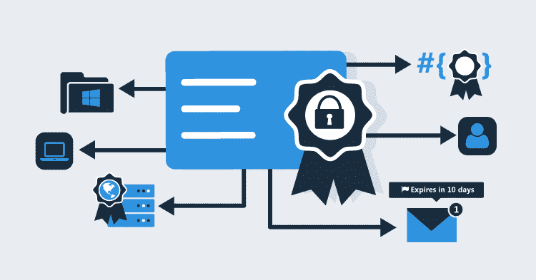
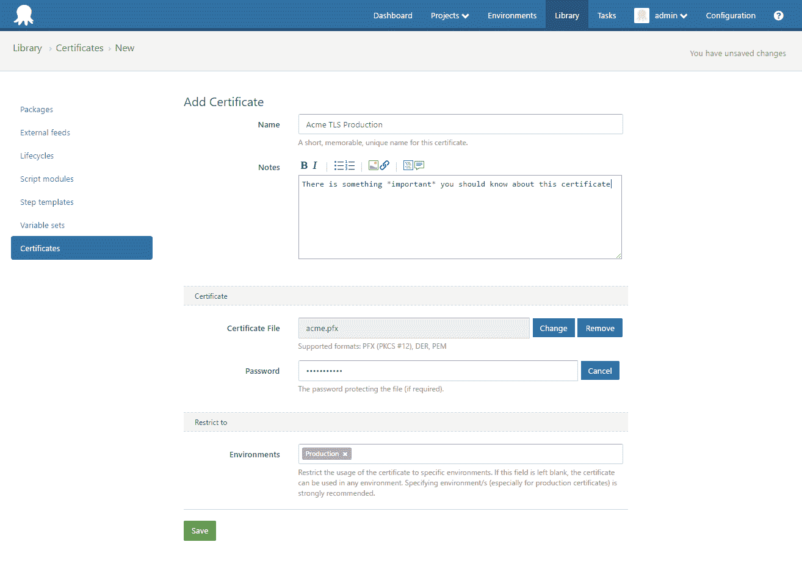
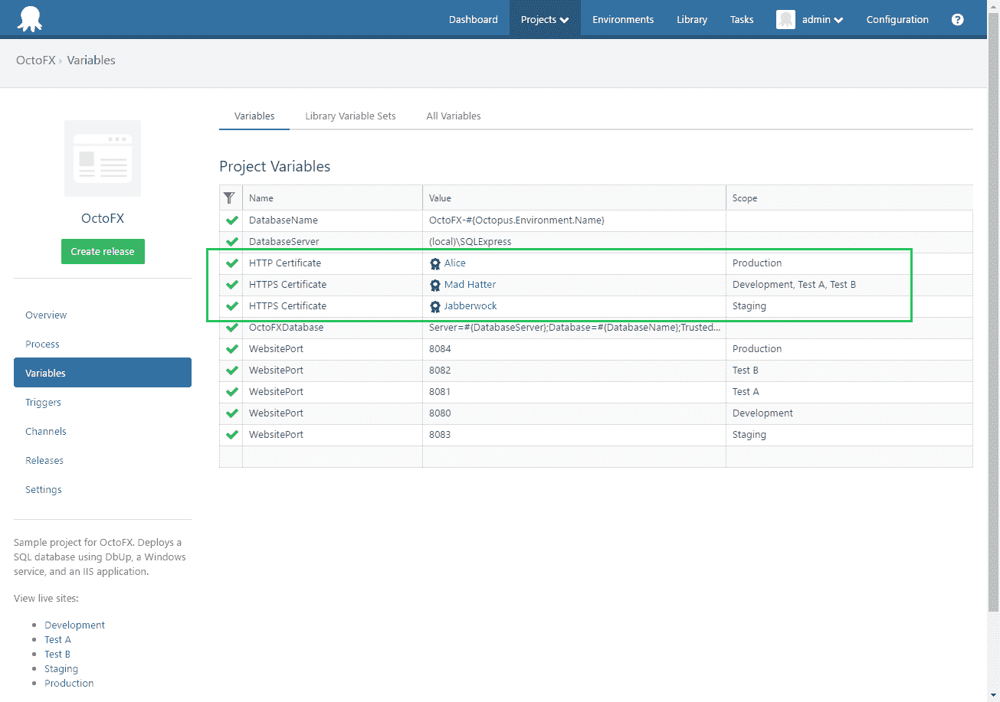
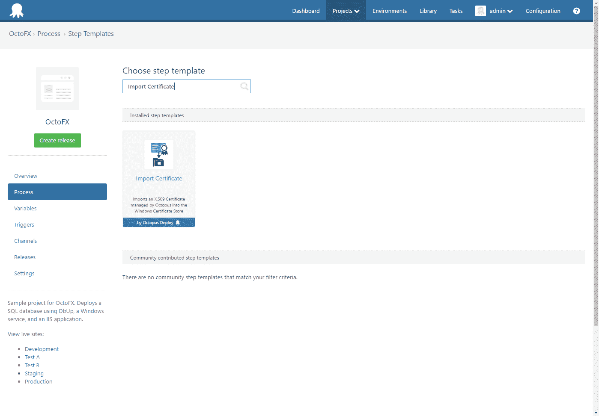
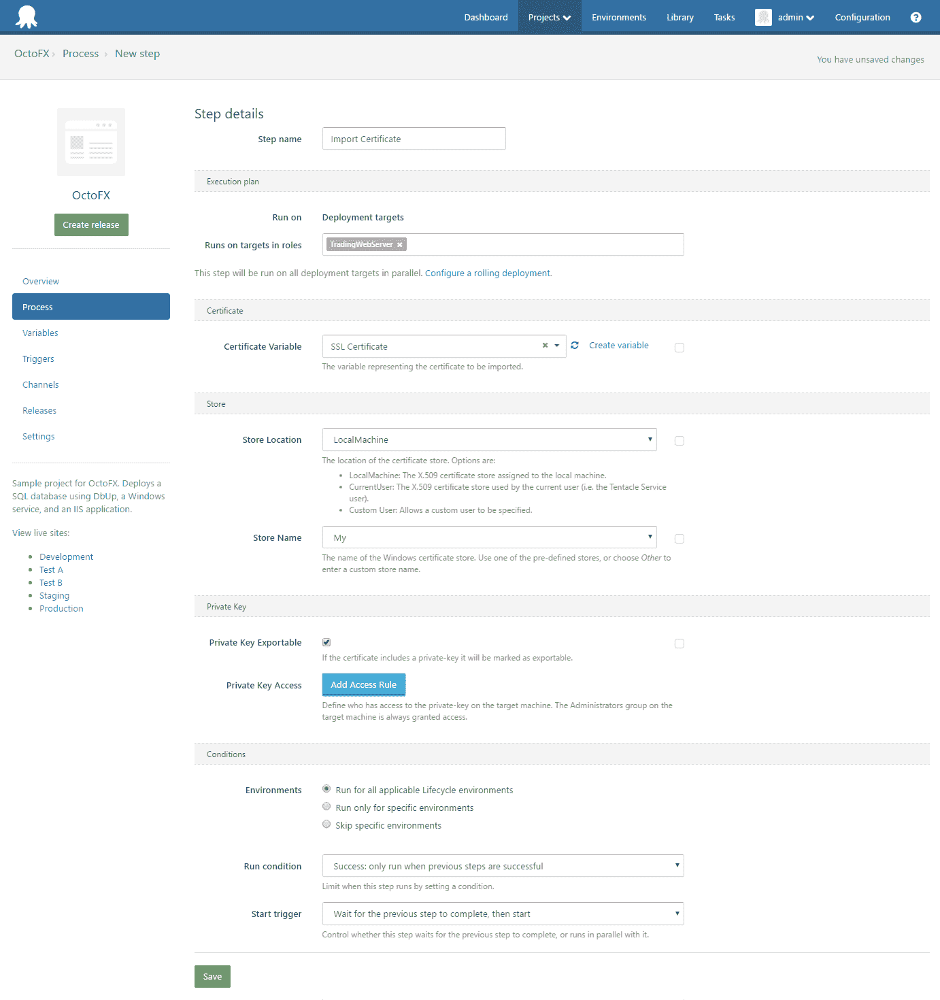
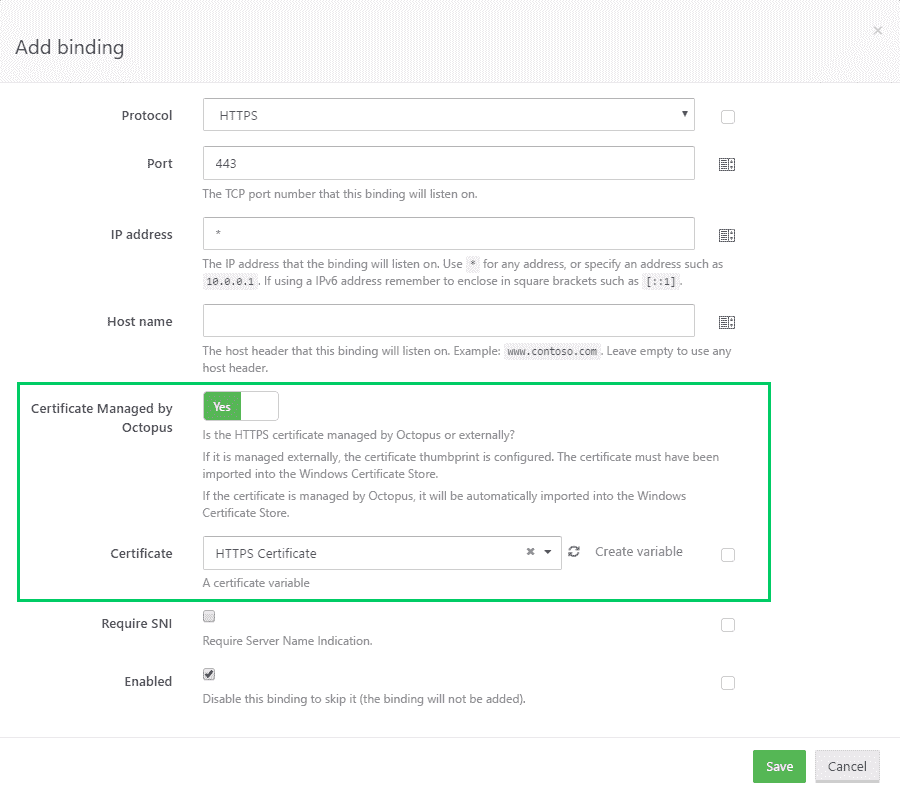
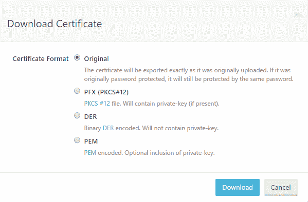

# 证书功能-八达通部署

> 原文：<https://octopus.com/blog/certificates-feature>

### 3.11 版证书成为一流的八达通公民！

[去年，我们就此功能的初始设计征求了您的反馈](https://octopus.com/blog/rfc-certificate-management)。反应是积极的，很多。很明显，自动化证书是一个棘手的问题...部署管道。希望我们能稍微缓解一下。

证书功能允许您:

## 商店证书

证书可以以 PFX、PEM 或 DER 格式上传，并且可能包含私钥。它们的范围可以是环境和/或租户。您可以搜索证书，当证书即将到期时，它们会提供直观的指示。

## 证书变量

您可以使用证书作为值来创建变量。

这种类型化变量的概念对 Octopus 来说是新的。理解变量的类型打开了许多可能性，这些可能性在变量只是文本时是不存在的。你可以期待在未来看到其他类型的变量。

证书变量由新的导入证书步骤使用，也可以在 IIS 绑定配置中使用。

它们也可以用在您自己的自定义脚本中。正如我们在 RFC 文章中对该特性的建议，在部署时，证书变量被扩展成许多变量，本质上是使用点符号模拟 O-O 属性。有关可用属性，请参见我们的文档。

## 导入证书部署步骤

我们添加了一个新的导入证书步骤，使得将由 Octopus 管理的证书导入 Windows 证书存储成为部署过程的一部分变得更加容易。

## 配置 HTTPS 绑定时引用证书变量

你可以...正如上面的标题所暗示的。

## 出口证书

证书可以以 PFX、PEM 或 DER 格式导出。或者，您可以完全按照它们最初上传时的样子导出它们。

对于 PEM 格式，您可以选择是否包含私钥。

## 配置到期通知

[可以创建 Octopus 订阅](https://octopus.com/docs/administration/managing-infrastructure/subscriptions)以在证书到期后 20 天、到期后 10 天或到期时触发。

订阅可以配置为发送电子邮件或张贴到 URL。请参见下面的[集成部分](#integration)了解这方面的一些想法。

## 更换证书

当获得即将过期的证书的替换时，您可能希望用新证书替换过期证书的所有用法。替换功能通过允许您上传新的证书文件来支持这一点。新证书将继承旧证书的所有 Octopus 属性(名称、环境等)，包括 ID。这使得所有引用变量现在都指向新证书。以前的证书被赋予了一个新的 ID 并被存档(因此如果需要，您仍然可以访问它)。

## 综合

像 Octopus 中的所有东西一样，证书功能通过我们的 HTTP REST API 公开，并可通过我们的[使用。NET 客户端库](https://octopus.com/docs/octopus-rest-api/octopus.client)。这应该可以将 Octopus 证书集成到您的组织用来管理 X.509 证书的任何流程中。

特别是，通过订阅的到期通知，结合 Replace API 端点，应该会带来一些有趣的可能性。这是我们希望在未来进一步写的东西。

## 反馈

一如既往，请告诉我们您的想法。我们喜欢听取用户的意见。

*愉快的(密码安全)部署！*