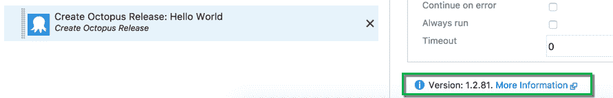
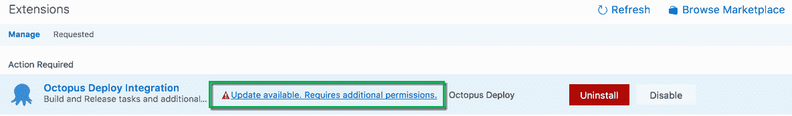
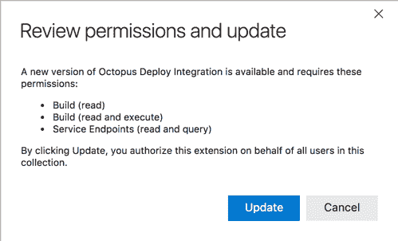
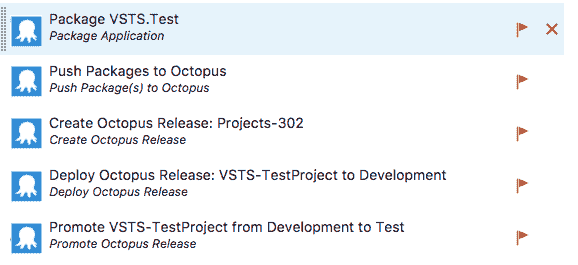
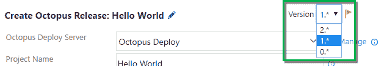
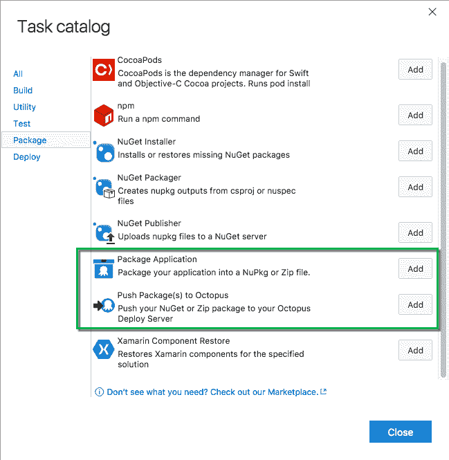
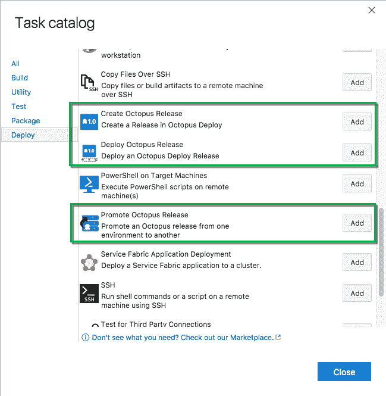
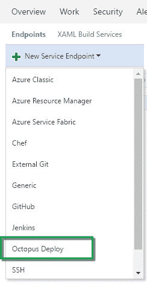
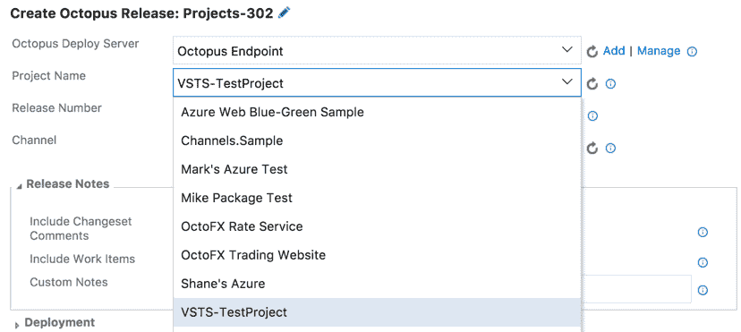

# 更改 TFS/VSTS 扩展- Octopus 部署

> 原文：<https://octopus.com/blog/changes-to-vsts-extension>

如果您是许多使用 [Octopus Deploy 构建和发布任务](https://marketplace.visualstudio.com/items?itemName=octopusdeploy.octopus-deploy-build-release-tasks)扩展的 Visual Studio Team Services (VSTS)或 Team Foundation Server (TFS)用户之一，您可能会注意到一些变化。我想我应该花一点时间来解释这些变化，并让您知道我们在该领域的其他工作。

## 等等，什么新版本？

该扩展的新版本是`2.0.6`(在撰写本文时)，但是如果您当前使用的是该扩展的版本`1.2.81`，您不会马上看到变化。

VSTS 的部分 UI(包括构建任务和扩展)仍然在快速变化，最近的一些变化都是关于一个更安全的更新过程来打破变化。简而言之，如果一个扩展的主要版本发生了变化，在使用它之前，您必须*显式地*更新这个扩展。

新版本要求您

[establish a new connection to Octopus](#octopus-endpoint)

。如果您没有权限从 VSTS 生成新的 API 密钥，

**it's still safe to update!**

您可以继续使用旧版本的构建步骤，直到您准备好为止。

要获得新版本，您必须转到**管理扩展**页面进行更新。

单击告诉您需要更新的链接。

最后，检查更改和更新。当然，要做到这一点，您需要有正确的权限。

## 使用新版本

如果您已经在构建定义中使用了 Octopus Deploy 步骤，现在您会在这些步骤旁边看到一个小小的粉红色标记(您可能需要在浏览器中强制刷新)。这表明您可以使用构建和发布步骤的新版本。次要版本和补丁版本更新将自动应用，我保证我们不会在没有更新主要版本的情况下做出任何突破性的改变！

要移动到最新版本，在每个步骤的配置中，您会看到一个新版本下拉列表。这允许您选择想要使用的步骤版本。

这些步骤的旧版本将继续工作，但是当您从“添加构建步骤”菜单添加一个步骤时，它将默认为最新版本。感谢[杰斯，你可能还会注意到漂亮的新标识！](https://octopus.com/company/team#jess-ross)

要开始使用新的步骤，您必须从一个新的 Octopus 连接开始。

## 八达通服务端点

我们的扩展现在包括了 Octopus 的特定服务端点类型！

拥有我们自己的端点使得连接的目的更加清晰，并且将 API 密匙放在“API 密匙”字段而不是密码字段中也有明显的优势，但是在幕后还有更多的事情要做。

定义一个特定的 Octopus 端点让我们能够提供可以在 VSTS 的各个地方使用的“数据源”。目前，我们使用这些来为构建和发布步骤中的下拉列表提供信息([见下面的](#step-dropdowns))，毫无疑问，我们将在未来更多地使用它们。

## 任务域中的下拉列表

使用新服务端点的一大优势是能够从 Octopus 服务器检索数据，并在 VSTS UI 中公开这些数据。

这意味着，当您在使用构建和发布任务时选择 Octopus 端点时，项目名称字段(现在是一个下拉列表)会填充您的 Octopus 服务器上的所有项目。如果环境、渠道和租户适用于您的场景，情况也是如此。这样你就不用打开 Octopus 来确保你得到了正确的答案，而且应该会让你更难打错字！

## 关于安全性的简要说明

每当 VSTS/TFS 连接到 Octopus 时，它就使用您为新的服务端点提供的 API 密钥。这意味着您只能看到该用户可以看到的项目、环境、渠道和租户。如果用户的权限受到了限制，那么您应该期望通过该端点进行类似的限制。

该扩展从两个不同的地方与 Octopus 对话——VSTS UI(当您配置您的构建/发布时),以及构建/发布代理本身(当构建/发布正在运行时)。

当您在 UI 中配置任务时，是 VSTS 或 TFS 服务器与 Octopus 进行通信。这意味着为了让新的下拉框正常工作，服务器必须能够访问 Octopus。如果没有，你可以直接输入详细信息。

这与您执行构建或发布时是不同的。在这种情况下，是*代理*连接到 Octopus。如果您不想让 Octopus 对云托管的构建代理可用，您可以使用本地代理。这个本地代理可以存在于你的网络中，因此它可以访问 Octopus 和你可能需要的其他资源。

## 那么下一步是什么？

我们计划很快推出一个仪表板小部件，这样您就可以在不离开 VSTS 的情况下看到您的部署状态。

在 VSTS 还有很多其他可用的扩展点，所以我们很想听听您还会发现什么有用的东西！接下来我们该看什么？