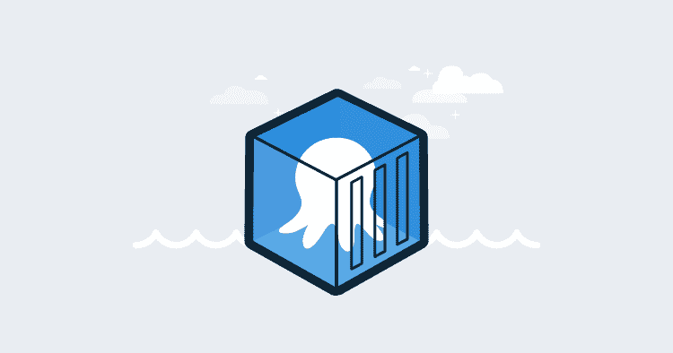
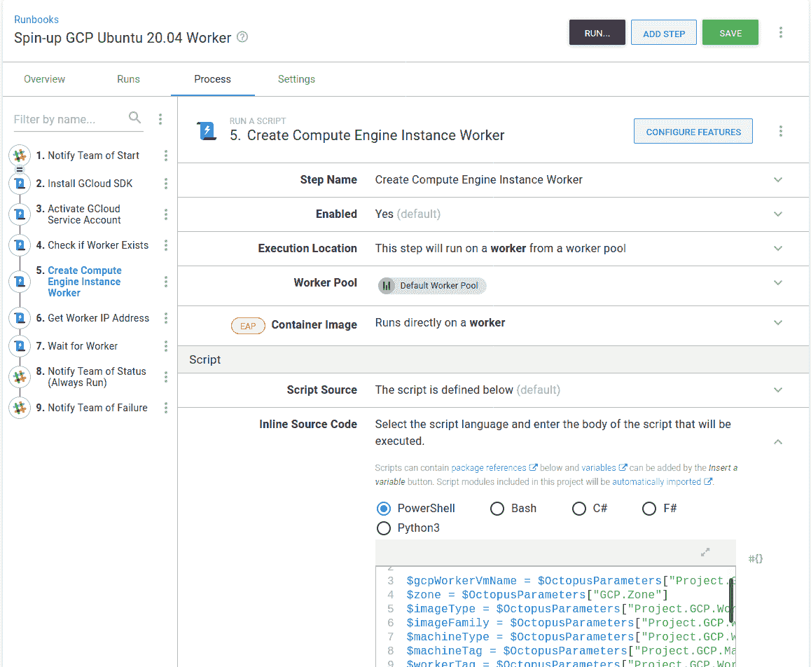
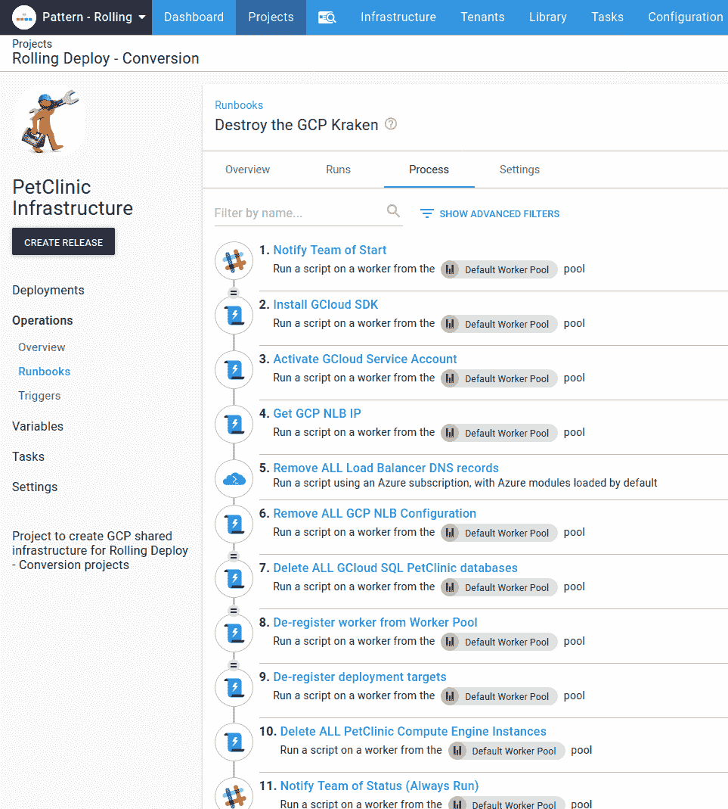
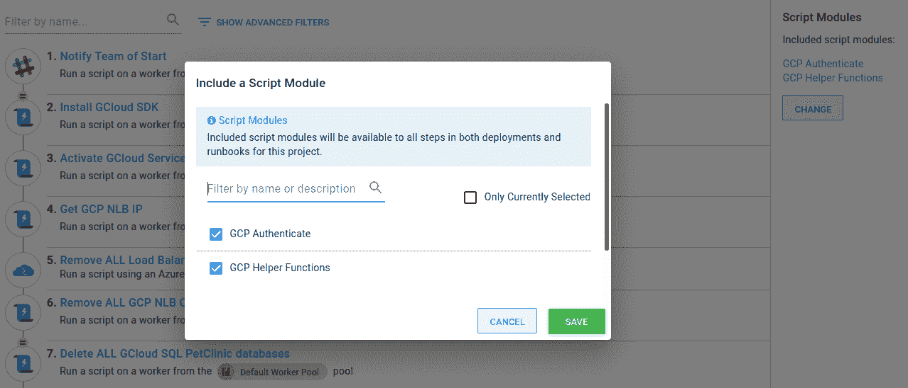
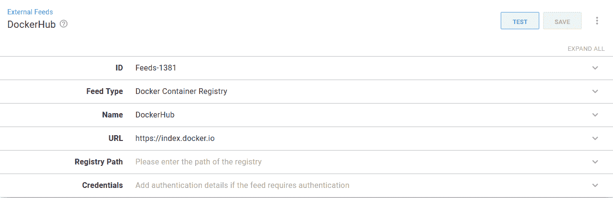
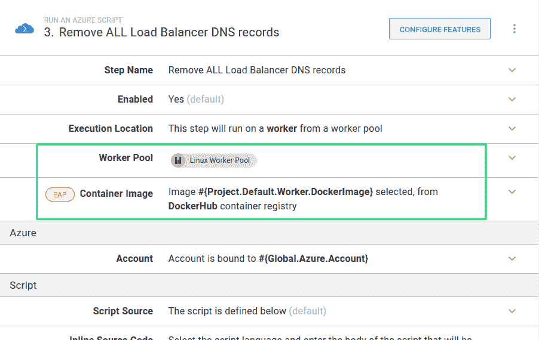
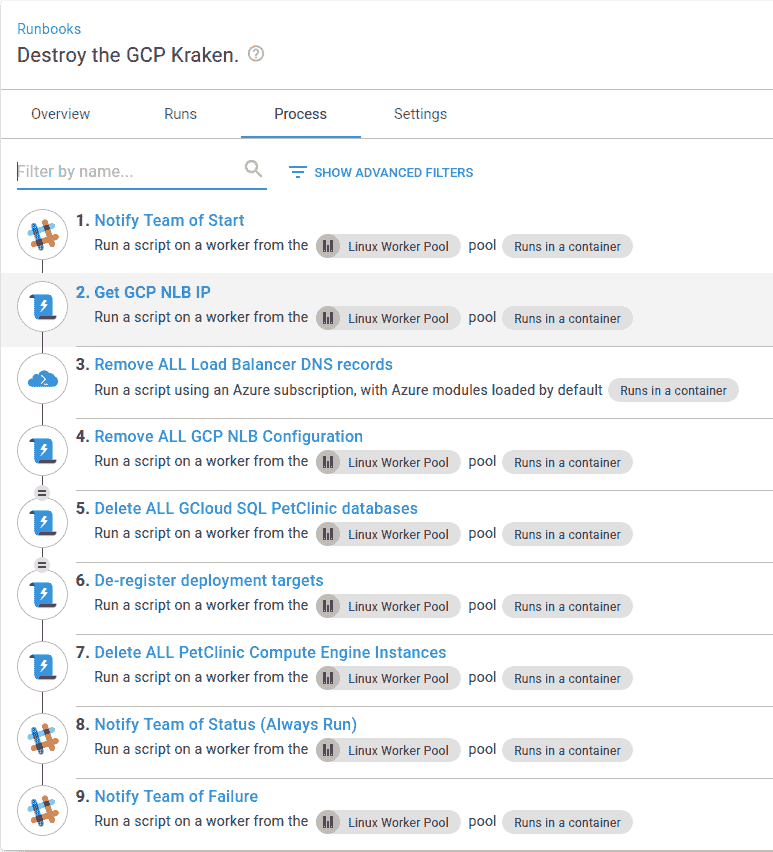

# 更改 runbook 流程以使用执行容器- Octopus Deploy

> 原文：<https://octopus.com/blog/changing-a-runbook-to-use-exec-containers>

[](#)

继我的上一篇文章[workers](https://octopus.com/blog/extending-octopus-execution-container)的执行容器之后，我想将一本操作手册从直接在 worker 上运行步骤改为使用[执行容器](https://g.octopushq.com/ExecutionContainersForWorkers)。这样做意味着我可以在我的工作机器上安装最少的软件，而不是在我用作执行容器的 Docker 映像中维护软件版本。

我正在使用项目 [PetClinic Infrastructure](https://g.octopushq.com/PatternRollingSamplePetClinicIacRunbooks) ，它加速了 Google Cloud (GCP)基础设施，以便其他项目部署到我们的示例实例上的**模式滚动**空间中。

## 设置工作机

该项目已经使用了它启动的特定工作机，我将使用创建工作机的 [runbook](https://samples.octopus.app/app#/Spaces-45/projects/petclinic-infrastructure/operations/runbooks/Runbooks-445/process/RunbookProcess-Runbooks-445) 并确保它安装了 Docker。为此，我需要更新在新创建的 GCP 虚拟机上用作启动脚本的引导脚本。我采用了一个在新机器上安装所需软件的现有脚本，并添加了以下内容来安装 Docker:

```
# Install Docker
apt-get update
apt-get -y install apt-transport-https ca-certificates curl software-properties-common
curl -fsSL https://download.docker.com/linux/ubuntu/gpg | sudo apt-key add -
add-apt-repository "deb [arch=amd64] https://download.docker.com/linux/ubuntu bionic stable"
apt-get update
apt-get -y install docker-ce docker-ce-cli containerd.io 
```

完整的脚本可以在 GitHub 上找到。

然后，为了让 runbook 使用新脚本，我更新了`Project.GCP.Targets.StartupScriptUrl`项目变量以指向原始版本:[https://raw . githubusercontent . com/OctopusSamples/IaC/master/GCP/bootstrap/GCP-Linux-listening-tentacle-wildly . sh](https://raw.githubusercontent.com/OctopusSamples/IaC/master/gcp/bootstrap/gcp-linux-listening-tentacle-wildfly.sh)。该变量由`Create Compute Engine Instance Worker`步骤使用。

[](#)

## 创建 Docker 图像

我正在做的项目中的大部分工作都使用了[谷歌云(GCP)](https://cloud.google.com/) 。这个项目中的所有脚本都在 PowerShell 中，对于第一次更新，我将坚持使用它。这意味着我需要一个带有 [Google SDK](https://cloud.google.com/sdk/install) 和 [PowerShell](https://github.com/powershell/powershell) 的图片。这是我的文档:

```
FROM ubuntu:18.04

ARG DEBIAN_FRONTEND=noninteractive
ARG Azure_Cli_Version=2.9.0\*
ARG Powershell_Version=7.0.0\*

# get `wget` & utils & software-properties-common
# https://docs.microsoft.com/en-us/powershell/scripting/install/installing-powershell-core-on-linux?view=powershell-7#ubuntu-1804
RUN apt-get update && \ 
    apt-get install -y wget apt-utils curl && \
    apt-get install -y software-properties-common 

# get powershell for 18.04
RUN wget -q https://packages.microsoft.com/config/ubuntu/18.04/packages-microsoft-prod.deb && \
    dpkg -i packages-microsoft-prod.deb && \
    apt-get update && \
    add-apt-repository universe && \
    apt-get install -y powershell=${Powershell_Version}

# Install Google SDK
RUN echo "deb [signed-by=/usr/share/keyrings/cloud.google.gpg] https://packages.cloud.google.com/apt cloud-sdk main" | tee -a /etc/apt/sources.list.d/google-cloud-sdk.list && \
  apt-get -y install apt-transport-https ca-certificates gnupg && \
  curl https://packages.cloud.google.com/apt/doc/apt-key.gpg | apt-key --keyring /usr/share/keyrings/cloud.google.gpg add - && \
  apt-get update && apt-get -y install google-cloud-sdk

RUN apt-get clean 
```

我已经构建了它，并将其发布到 Docker hub 上的 Docker 存储库中:`octocrock/gcp-tools`。

## 更新 runbook 以使用执行容器

我要转换成使用执行容器的操作手册是**摧毁 GCP 北海巨妖**。该操作手册删除了所有部署目标基础设施。

[](#)

该 runbook 还会注销并删除工作机。重构的一部分是将这些步骤提取到一个单独的操作手册中。我已经创建了一个新的 runbook， **Destroy Ubuntu worker** 来做这个，我可以复制任何有用的步骤。

### 谷歌云软件开发套件

在上面的 Dockerfile 文件中，我安装了`google-cloud-sdk`。在 runbook 中，有一个在工作机器上安装 SDK 的步骤。因为我将使用 Docker 映像作为执行容器，所以不再需要安装 SDK。在我将这个步骤复制到我的**销毁 Ubuntu worker** runbook 之后，我将删除**安装 GCloud SDK** 步骤。

### 证明

runbook 有一个设置认证范围的步骤。这需要改变，因为我们需要在每个步骤上设置身份验证范围。我们可以将其重构为一个可重用的脚本模块。

我将前往 **库➜脚本模块➜添加脚本模块** ，并添加以下我从**激活 GCloud 服务帐户**步骤中复制的 PowerShell 代码:

```
function Set-GCPAuth() {
  $JsonKey = $OctopusParameters["GCP.ServiceAccount.Key"]
  $JsonFile = [System.IO.Path]::GetTempFileName()

  if (Test-Path $JsonFile)
  {
      Remove-Item $JsonFile -Force
  }

  New-Item $JsonFile -Type "File" -Force

  $JsonKey | Set-Content $JsonFile
  $gcpServiceAccountEmail = $OctopusParameters["GCP.ServiceAccount.Email"]
  $gcpProjectName = $OctopusParameters["Project.GCP.ProjectName"]
  Write-Host "Activating service account $gcpServiceAccountEmail"

  Write-Host "##octopus[stderr-progress]"
  gcloud auth activate-service-account $gcpServiceAccountEmail --key-file=$JsonFile --project=$gcpProjectName --quiet
  Test-LastExit "gcloud auth activate-service-account"

  if (Test-Path $JsonFile)
  {
      Write-Host "Clearing up temp auth file"
      Remove-Item $JsonFile -Force
  }
} 
```

然后我只需要进入我的操作手册，通过点击`Change`并选择 **GCP 认证**来包含新创建的脚本模块:

[](#)

现在，在我将步骤复制到我的**销毁 Ubuntu worker** runbook 之后，我可以删除步骤**激活 GCloud 服务帐户**。

### 指定执行容器

我要使用执行容器的第一步是**获取 GCP·NLB 的 IP** 。在使用容器之前，我必须为 [DockerHub](https://hub.docker.com/) 设置一个[外部进料](https://g.octopushq.com/DockerRegistries)。为此，导航至 **库➜外部进给➜添加进给** 。

[](#)

在 runbook 中，大多数步骤都在运行 GCP 脚本，但有一个步骤使用 Azure CLI 来管理 DNS。我将设置两个变量来指定 Docker 图像。

*   `Project.Default.Worker.DockerImage`:该值为`octopusdeploy/worker-tools:1.0-ubuntu.18.04`。我将使用的默认图像是 Octopus [worker-tools](https://hub.docker.com/r/octopusdeploy/worker-tools/) 图像。这将运行 Azure CLI 步骤。不过，该映像没有安装 GCP 命令行界面。
*   `Project.GCP.Worker.DockerImage`:它的值为`octocrock/gcp-tools:1.0.0`，指向从上面创建的 Dockerfile 创建的图像。

**获取 GCP·NLB IP**run book 步骤运行一个使用 GCloud 的脚本。我可以设置步骤来使用 Worker 池，该池包含我配置的安装了 Docker 的机器。我选择 **Linux 工人池**。我还通过指定`Project.GCP.Worker.DockerImage`变量来设置要使用的容器图像。

[T32](#)

正如我上面提到的，每个步骤都需要通过 GCP 认证，所以现在我们需要在脚本中设置它。该步骤的当前脚本代码是:

```
CheckForGCPSDK

$projectName = $OctopusParameters["Project.GCP.ProjectName"]
$loadbalancerIPName = $OctopusParameters["Project.GCP.LoadBalancer.ExternalIP.Name"]

Write-Host "Getting compute address matching name: $loadbalancerIPName"
Write-Host "##octopus[stderr-progress]"
$ipAddress=(& $GCloudExecutable compute addresses list --project=$projectName --filter="name=($loadbalancerIPName)" --format="get(address)" --quiet)
Test-LastExit "gcloud compute addresses list"

if( -not ([string]::IsNullOrEmpty($ipAddress))) 
{
    Write-Highlight "Found $loadbalancerIPName of: $ipAddress"
    Set-OctopusVariable -name "IPAddress" -value $ipAddress
}
else {
    Set-OctopusVariable -name "IPAddress" -value "" 
```

这里的第一个命令现在已经过时，正在安装 GCP 检查，因为我们知道它包含在我们正在使用的 Docker 映像中。我将用一个对为 GCP 认证创建的函数`Set-GCPAuth`的调用来替换它。

接下来，因为我们直接在容器中使用 GCP CLI，我可以将引用`$GCloudExecutable`改为`gcloud`。

更新后的脚本如下所示:

```
Set-GCPAuth

$projectName = $OctopusParameters["Project.GCP.ProjectName"]
$loadbalancerIPName = $OctopusParameters["Project.GCP.LoadBalancer.ExternalIP.Name"]

Write-Host "Getting compute address matching name: $loadbalancerIPName"
Write-Host "##octopus[stderr-progress]"
$ipAddress=(& gcloud compute addresses list --project=$projectName --filter="name=($loadbalancerIPName)" --format="get(address)" --quiet)
Test-LastExit "gcloud compute addresses list"

if( -not ([string]::IsNullOrEmpty($ipAddress))) 
{
    Write-Highlight "Found $loadbalancerIPName of: $ipAddress"
    Set-OctopusVariable -name "IPAddress" -value $ipAddress
}
else {
    Set-OctopusVariable -name "IPAddress" -value ""
} 
```

这就是我们在容器中运行这个步骤所需要的全部内容。使用 GCP 脚本的所有其他步骤都需要进行相同的更改。

### Azure CLI 步骤

此 runbook 引用的 DNS 记录在 Microsoft Azure 中管理。删除 DNS 记录的步骤需要安装了 Azure CLI 的不同 Docker 映像。

我将设置**删除所有负载平衡器 DNS 记录**步骤，以使用我在上面设置的`Project.Default.Worker.DockerImage`变量。

[](#)

这个 Docker 图像也可以用于松弛消息步骤。

正如我上面提到的，有一个新的 run book**Destroy Ubuntu worker**，它会拆掉 worker 机器。除了前面的步骤之外，我还复制了通知步骤，并将**从工人池中注销工人**步骤从**销毁北海巨妖**操作手册中移走。

[](#)

最后，我们需要确保在**销毁 GCP 北海巨妖**运行手册中删除计算引擎实例时，不会从 GCP 中删除该工人。这包括更改选择计算资源的行以忽略工作机:

```
 $instanceList=(& gcloud compute instances list --project=$gcpProjectName --filter="tags.items=$machineTag AND -tags.items=$workerTag" --format="get(name)" --quiet) 
```

通过添加`AND -tags.items=$workerTag`子句，查询发生了变化，带有我们的 worker machine 标签的项目将不会被选择。

相反，在**销毁 Ubuntu worker** runbook 中，删除 worker compute 实例的步骤中的行只选择那些带有`$workerTag`的资源:

```
 $instanceList=(& $GCloudExecutable compute instances list --project=$gcpProjectName --filter="tags.items=$workerTag" --format="get(name)" --quiet) 
```

#### 收尾工作

这是完成的**摧毁北海巨妖**的操作手册:

[](#)

## 结论

将这个 runbook 转换成使用执行容器是非常直接的。我们现在可以在其他地方使用 GCP Docker 映像，相信通过更新映像的版本以在变量中选择，工具版本的更新将在所有项目中获得。为了进一步减少步骤，我们可以设置一个库变量集并全局设置值。我们甚至可以将版本设置为`latest`，尽管不建议这样做，因为对于何时吸收对图像所做的更改控制较少。