# 使用 Chocolatey、PowerShell 和 Octopus Runbooks 配置 Windows 服务器- Octopus Deploy

> 原文：<https://octopus.com/blog/chocolatey-powershell-and-runbooks>

Runbooks 自动执行日常任务。其中一项任务是设置和安装 Windows 服务器。

在这篇文章中，我演示了如何使用 Octopus Runbooks 在 Windows 服务器上设置和安装开发者依赖。可以执行 runbook 来设置任意数量的 Windows 机器。

## 什么是巧克力？

Chocolatey 是一个用于 Windows 的软件包管理器。这是一个开源项目，它为开发人员、操作人员以及介于两者之间的所有人提供了一种管理、安装和升级其 Windows 资产中的软件的方法。

Chocolatey 致力于使 Windows 软件变得更简单、更流畅，让每个使用 Windows 计算机的人都能使用。要了解更多关于不使用 runbooks 安装 Chocolatey 的信息，请查看 [Chocolatey 安装文档](https://chocolatey.org/install)。

### 使用巧克力

你不需要 runbooks 来使用 Chocolatey，它就像打开一个管理员 Windows PowerShell 窗口并运行一个脚本来安装 Google Chrome 这样的东西一样简单:

```
choco install googlechrome -y 
```

如果您想要安装多个应用程序，可以编写 PowerShell 脚本并在本地执行它们:

```
Write-Host "Installing Chocolatey Apps"
choco install sql-server-management-studio sql-server-2019 github-desktop git firefox -y 
```

您可以将它扩展到所有需要的应用程序，并在某个具有读取权限的地方对脚本进行源代码控制，以便脚本可以由用户运行或在机器供应期间运行。这将自动化您的大部分应用程序安装。

### 巧克力包装

Chocolatey 是一个开源工具，你可以从网站上获得很多预先配置好的软件包。然而，根据我的经验，大多数组织都编写自己的包，你也可以这样做。如果你不熟悉这个过程，请提供关于[创建你自己的巧克力包](https://chocolatey.org/blog/create-chocolatey-packages)的信息。

编写自己的包的主要原因是:

*   您的公司购买了需要包含在软件包中的许可证
*   自定义配置(如备份代理)需要从站点 B 复制到站点 A
*   社区包可能不存在

如果你正在[创建自己的包](https://chocolatey.org/docs/create-packages)，考虑与 Chocolatey 社区共享它。

您可以从 Chocolatey 软件包中安装 Octopus。一旦有了新版本，我们会尽快发布。这是在我们的网站上发布后，从我们的[TeamCity](https://www.jetbrains.com/teamcity/)构建服务器自动生成的。阅读更多关于[章鱼部署巧克力套装](https://chocolatey.org/packages/OctopusDeploy)的信息。

要将 Octopus Deploy 安装为 Chocolatey 软件包，请运行以下命令:

```
choco install OctopusDeploy -y 
```

## 为什么要用 Runbooks 和 Chocolatey？

Runbooks 是我最喜欢的章鱼功能。凭借我的运营背景，我很欣赏它如何自动化平凡而耗时的运营任务。

说实话，你能安装多少次 [IIS](https://www.iis.net/) 或者 [SQL](https://en.wikipedia.org/wiki/Microsoft_SQL_Server) 才变得繁琐且容易出错？

Chocolatey with Octopus Runbooks 还支持自助申请。您可以授予人们访问 Octopus 项目和 runbook 的权限，这样他们就可以运行自己安装的 Chocolatey 软件包。

您可以使用 [runbooks](https://octopus.com/docs/runbooks) 来自动化以下任务，这样您就可以专注于更有趣的问题:

这篇文章不包括在你的 Windows 服务器上安装操作系统。有很棒的工具可以用来加载最新的 Windows 桌面和服务器操作系统，这篇文章假设你在这个过程中添加了 [Octopus 触手](https://octopus.com/docs/infrastructure/deployment-targets/windows-targets)。

我在准备 Windows 服务器时使用的一些工具包括:

通常，公共云提供商也提供基础架构即代码(IaC)工具，例如:

### 准备

开始之前，你需要在你的服务器上安装一个[章鱼触手](https://octopus.com/docs/infrastructure/deployment-targets/windows-targets)。

我正在使用 Octopus [示例实例](https://samples.octopus.app)。

接下来，添加一个名为 **Target - Windows** 的新空间。

作为新空间配置的一部分，我执行了以下操作:

[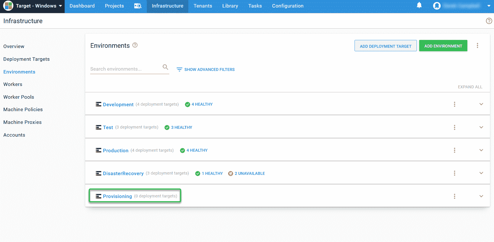](#)

[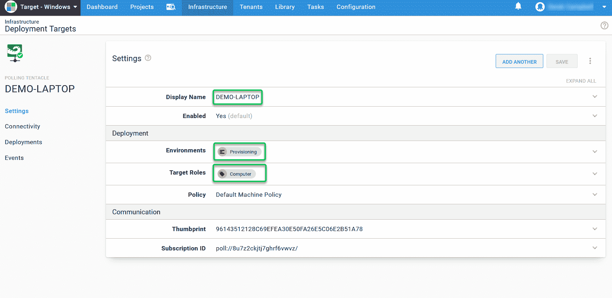](#)

*   检查了显示我的 Windows 服务器的**基础架构**选项卡，它运行正常:

[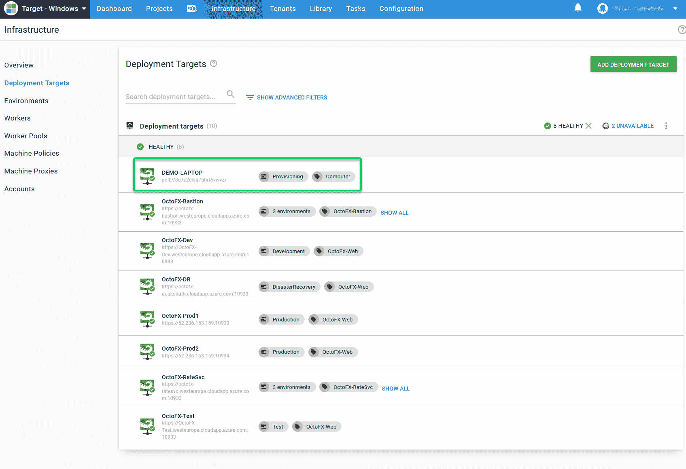](#)

*   创建了一个名为`Computer Provisioning`的[项目](https://octopus.com/docs/projects):

[](#)

*   创建了一个名为`Computer Lifecycle`的[生命周期](https://octopus.com/docs/getting-started-guides/lifecycle)并为其添加了**供应**环境，然后将其分配给项目:

[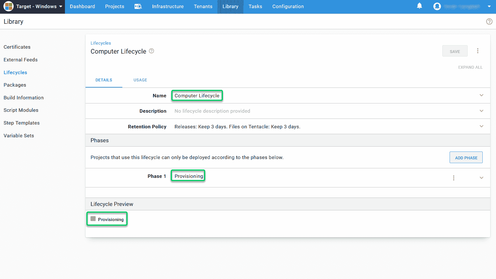](#)

## 运行手册配置

首先，您需要找到项目并添加操作手册:

[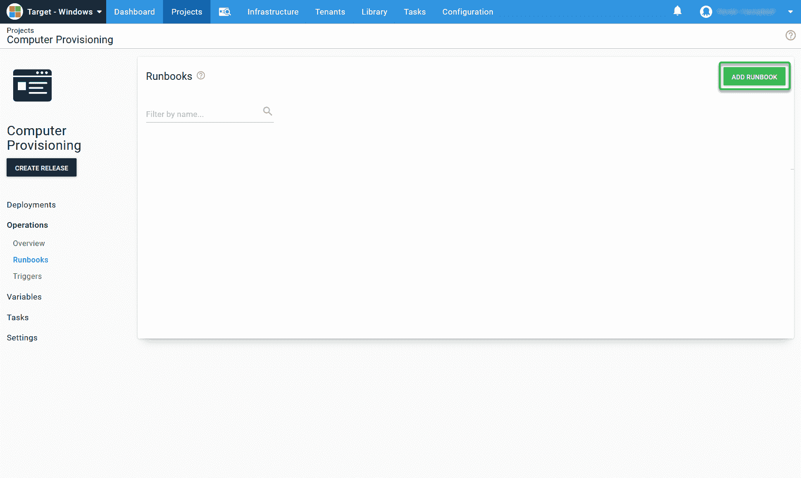](#)

我制作了一本名为`Install Developer Machine Dependencies`的手册:

[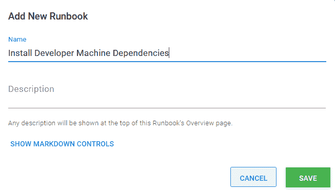](#)

### 设置时区、输入和区域

设置 Windows 时，配置非默认区域可能会令人沮丧。我使用 PowerShell 脚本为所有服务器设置这个。您可以使用我下面的示例，并根据您的需求进行调整:

```
#Set home location to the United Kingdom
Set-WinHomeLocation 0xf2

#override language list with just English GB
$1 = New-WinUserLanguageList en-GB
$1[0].Handwriting = 1
Set-WinUserLanguageList $1 -force

#Set system local
Set-WinSystemLocale en-GB

#Set the timezone
Set-TimeZone "GMT Standard Time" 
```

美国东海岸的一个类似的地方看起来会是这样的:

```
#Set home location to the United States
Set-WinHomeLocation 0xf4

#override language list with just English US
$1 = New-WinUserLanguageList en-US
$1[0].Handwriting = 1
Set-WinUserLanguageList $1 -force

#Set system local
Set-WinSystemLocale en-US

#Set the timezone
Set-TimeZone "Eastern Time Zone" 
```

### 检查是否安装了 Chocolatey

接下来，我使用了一个社区贡献的步骤模板，名为 [Chocolatey -确保安装了](https://library.octopus.com/step-templates/c364b0a5-a0b7-48f8-a1a4-35e9f54a82d3/actiontemplate-chocolatey-ensure-installed)。这一步检查是否安装了 Chocolatey，如果没有，就安装它。

[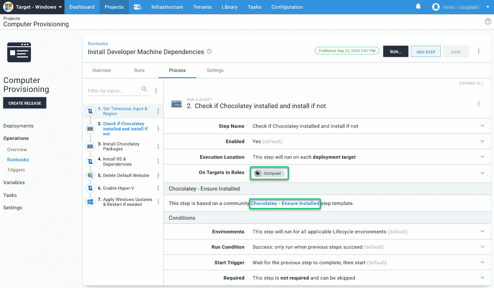](#)

### 安装 Chocolatey 软件包步骤

Chocolatey 的 Paul Broadwith 更新了 [Chocolatey 社区步骤模板](https://library.octopus.com/step-templates/b2385b12-e5b5-440f-bed8-6598c29b2528/actiontemplate-chocolatey-install-package)，以便在一个步骤中安装所有的 Chocolatey 软件包。

我在 Windows 服务器上需要的应用程序有:

```
git vscode sql-server-management-studio slack github-desktop rdmfree googlechrome firefox dotnetfx dotnetcore 7zip visualstudio2019professional nordvpn lastpass-chrome lastpass docker-desktop chromium googledrive google-drive-file-stream kubernetes-helm kubernetes-cli minikube zoom notepadplusplus nugetpackageexplorer sdio virtualbox jre8 vlc python foxitreader putty.install sysinternals snagit vagrant packer terraform 
```

[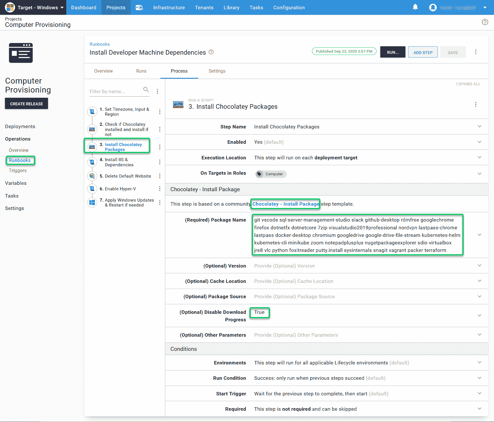](#)

### 安装 Chocolatey 软件包步骤参数

以下参数可用:

*   **版本(可选)**:您可以使用它来指定您想要安装的软件版本。如果您在每个步骤中使用了多个软件包，并且想要设置特定的软件版本，那么您需要配置 Chocolatey 安装并在附加步骤中添加版本。
*   **缓存位置(可选)**:您可以使用它来指定一个非默认的缓存位置。这在安装 SQL 时很有用，不需要让触手以管理员身份运行。如果不以本地管理员的身份运行触手服务，SQL 的安装可能会很棘手。您可以指定一个像`C:\Octopus\Applications`这样的文件夹作为缓存，本地系统用户可以完全访问它。
*   **包来源(可选)**:这是本步骤中*最关键的参数。如果您在家里做这个，使用 Chocolatey 包存储库可能是可以接受的，这是默认设置。然而，如果你是为一家公司做这件事，请考虑使用你自己的包源代码库，比如 [Nexus](https://www.sonatype.com/nexus/repository-pro) 、 [Artifactory](https://jfrog.com/artifactory/) 或者 [MyGet](https://www.myget.org/) 。*

Chocolatey 包资源是社区为社区而建的。如果您使用社区存储库进行企业或大规模软件包安装，您可能会受到[费率限制](https://chocolatey.org/docs/community-packages-disclaimer#rate-limiting)。小心，善待社区。

您可以在日志中指定是否要禁用下载进度。我通常启用这个选项来避免数千个日志文件。最后一个选项允许您指定附加参数:

【T2 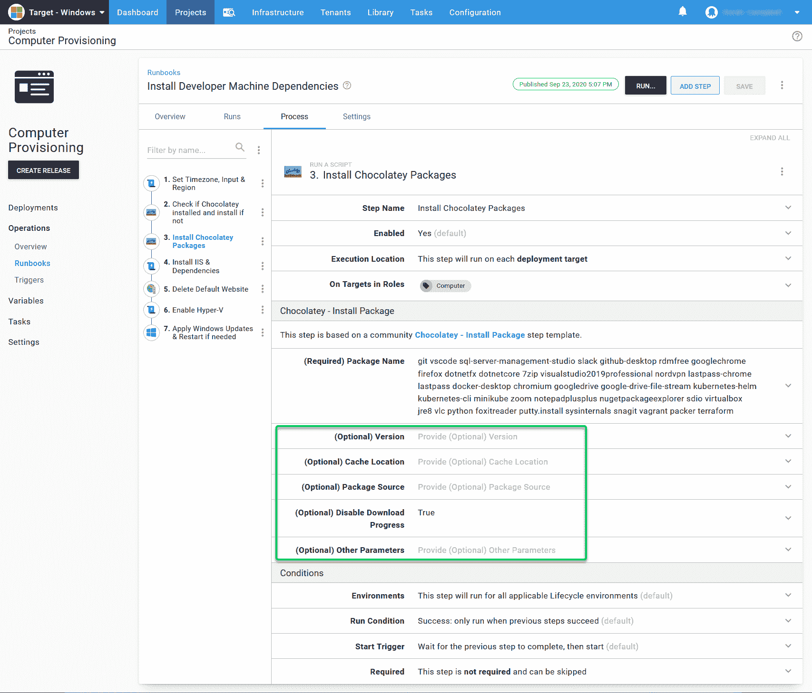

### 安装 IIS 和依赖项

下一步是配置 IIS 及其依赖项。我使用了我们的[IIS run book](https://octopus.com/docs/runbooks/runbook-examples/routine/iis-runbooks)示例并运行了这个安装 IIS 及其所有功能。

### 可选步骤

我更喜欢避免 IIS 中的默认网站，所以我默认移除它。我使用名为 [IIS 网站的社区步骤模板——删除](https://library.octopus.com/step-templates/a032159b-0742-4982-95f4-59877a31fba3/actiontemplate-iis-website-delete)然后指定`Default Web Site`。它在 Octopus 中删除了默认网站作为该供应操作手册的一部分。

我尽可能使用 [HyperV](https://docs.microsoft.com/en-us/windows-server/virtualization/hyper-v/hyper-v-technology-overview) 作为虚拟机管理程序，并在服务器配置过程中启用它。我使用这个任务的**运行脚本**内置模板，并使用 PowerShell 来启用 HyperV:

```
Enable-WindowsOptionalFeature -Online -FeatureName Microsoft-Hyper-V -All 
```

最后，如果我的服务器准备好了，我会避免安装所有发布的 Windows 更新。我使用一个名为[Windows-Apply Windows Updates](https://library.octopus.com/step-templates/3472f207-3934-44db-a4ac-1390167cf7ed/actiontemplate-windows-apply-windows-updates)的社区步骤模板，如果您将参数设置为`True`，它会自动安装并重启您的机器。

## 出版操作手册

运行手册可以处于草稿或已发布状态。在执行之前，您需要发布操作手册。

## 运行操作手册

在 Octopus 中，您拥有空间、项目、生命周期、环境、服务器和操作手册。下一步是运行和测试 runbook，以确保它能达到您的要求。

要运行操作手册:

1.  打开 runbook 项目
2.  选择**操作**，然后选择**运行手册**
3.  选择您创建的运行手册

[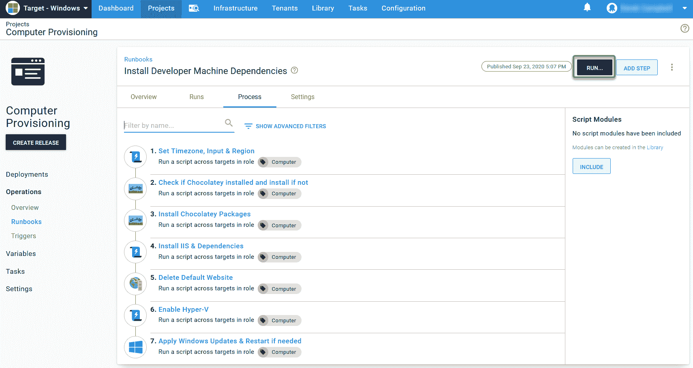](#)

4.  选择**运行**
5.  选择环境
6.  点击**运行**按钮

[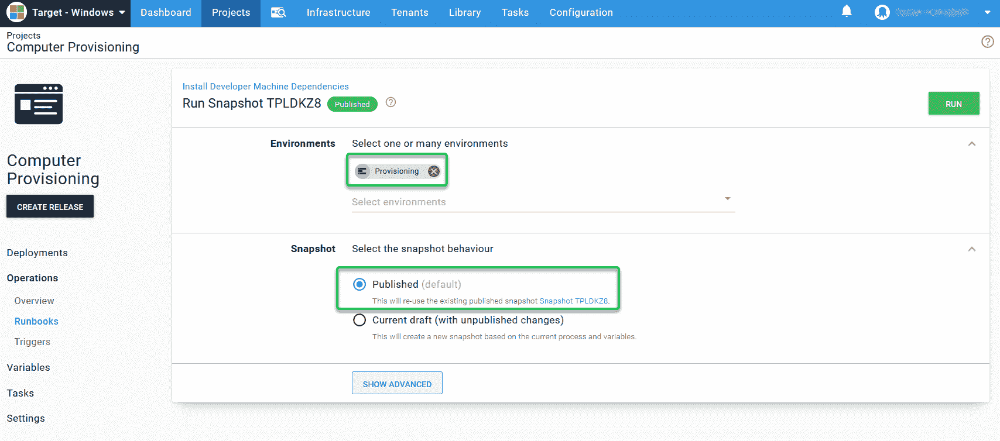](#)

您现在可以喝杯咖啡了，因为安装应用程序和依赖项需要时间。喝完咖啡后，操作手册应该就完成了。您的服务器将得到完全配置，您可以避免下一步、下一步、完成安装和应用程序配置的痛苦。

[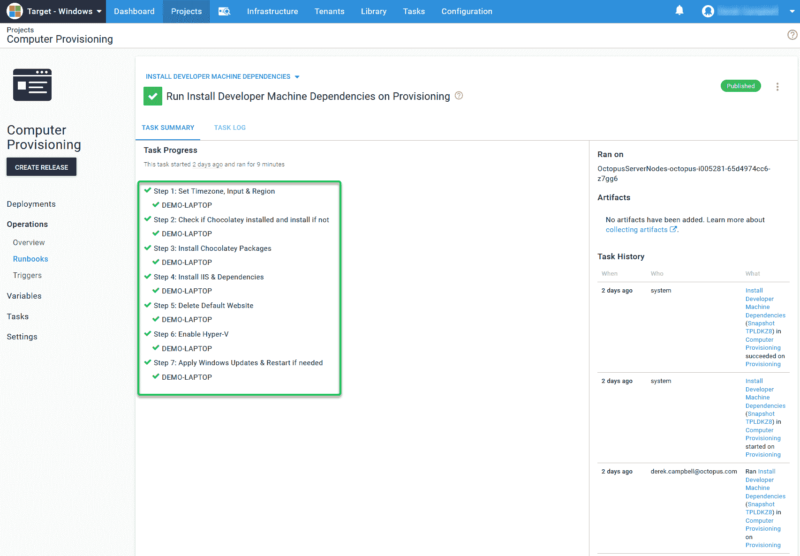](#)

现在，您可以看到服务器上安装的所有新应用程序。

## 在其他情况下使用操作手册

Runbooks 对于安装应用程序非常有用，不仅对于 ops、DevOps 和开发人员如此，对于其他工作类型也是如此。您可以为需要不同应用程序的其他作业类型创建额外的操作手册。例如，业务分析师可能想要 [PowerBI](https://powerbi.microsoft.com/en-us/) ，而 DBA 可能希望安装 [SQL Toolbelt](https://chocolatey.org/packages/SqlToolbelt) 。您甚至可以允许人们访问 runbooks 来安装和配置预先批准的软件。

您也可以对所有的服务器使用这种方法，这样您就可以在数据库服务器上安装 [SQL](https://chocolatey.org/packages/sql-server-2019) ，或者在 web 服务器上安装 [Tomcat](https://chocolatey.org/packages/Tomcat) 。

安装 SQL 时，创建自己的 Chocolatey 包。SQL 的安装比较棘手，因为它需要一个管理员帐户才能快速安装，并且您需要配置默认用户、组以及数据库和日志文件的位置。

使用 Octopus 安装 SQL Developer Edition 或 SQL Express 时，无需触手以本地管理员身份运行即可完成。您仍然需要使用文件的可选位置。

另一个问题是，如果您在具有指定服务帐户的服务帐户下运行安装，默认情况下，它会使用该用户作为默认的 SQL 管理员。您需要使用该帐户进行连接，以获得访问权限。

## 升级巧克力套装

我最喜欢的 chocolatey 功能之一是[只需一个命令就可以将](https://chocolatey.org/docs/commandsupgrade)软件升级到最新版本:

```
choco upgrade all -y 
```

这个命令在服务器上运行，根据您配置的 Chocolatey 存储库检查最新版本，下载新的包并安装它。这就像一个 Windows 更新，但你的巧克力包。您可以使用 runbooks 进行设置，使用**部署脚本步骤**，并使用升级命令:

【T2 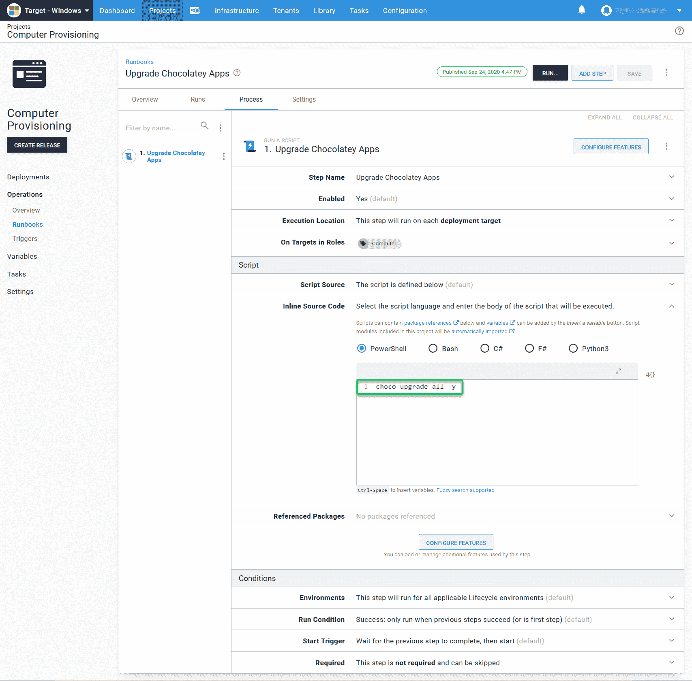

创建 runbook 后，选择 **Run** ，它将运行 Chocolatey 脚本并升级您的所有应用程序:

[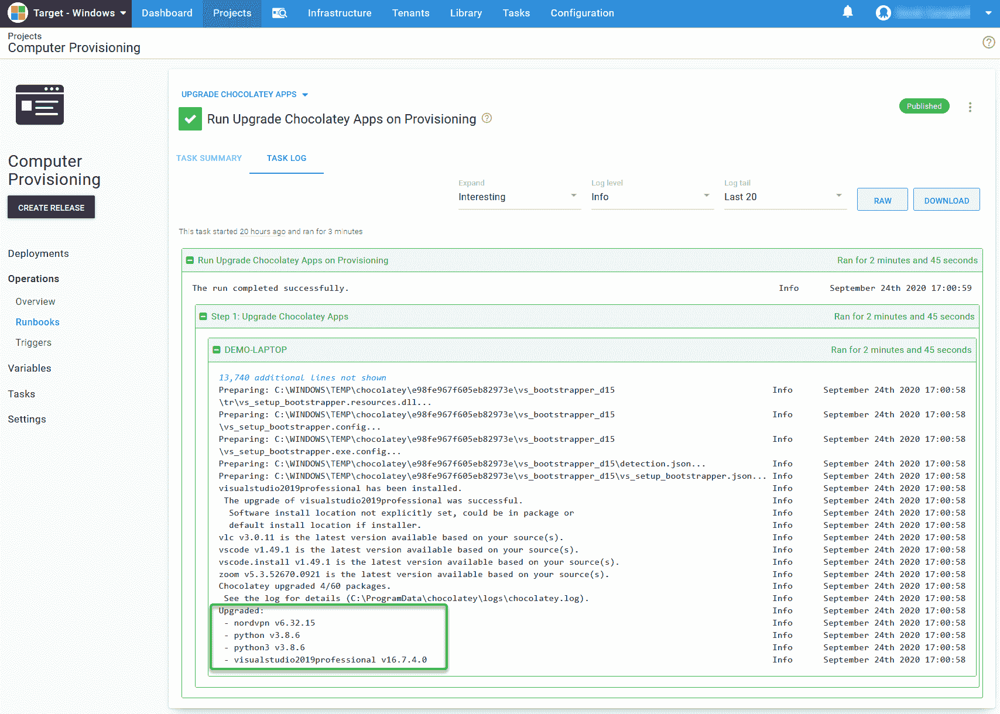](#)

### 在预定触发器上升级 Chocolatey 包

随着升级的 Chocolatey runbook 的工作，您可以发布 runbook 并设置执行脚本的时间表，这很像一个 [CRON 作业](https://en.wikipedia.org/wiki/Cron)或一个 [Windows 任务调度器](https://en.wikipedia.org/wiki/Windows_Task_Scheduler)。

为此，选择**操作**下的触发器选项，并选择**添加预定触发器**。

[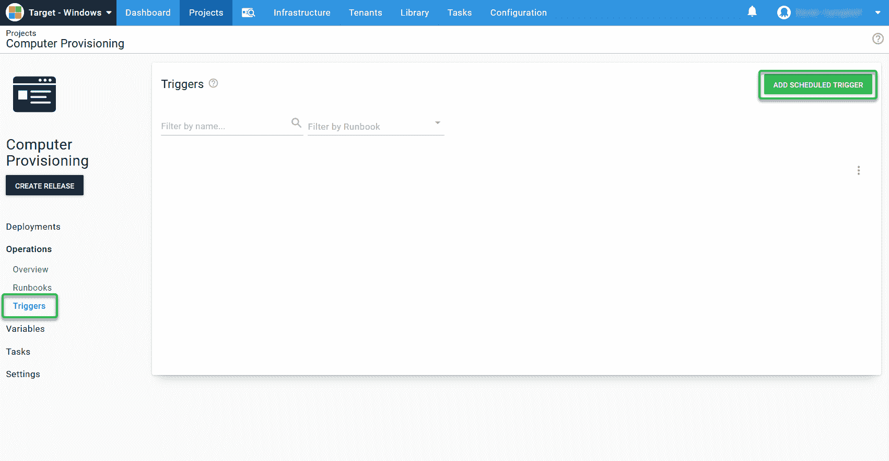](#)

在**新增预定触发**页面，您需要输入:

*   **名称**
*   **描述**
*   **选择在预定触发器**上运行的运行手册
*   **选择环境**
*   **选择每日日程或替代日程**
*   **选择执行**的时间间隔
*   **选择时间表应该执行的时间**

[T38](#)

这将在每天您设置的时间触发。我选择了下午 12:30，因为那是很多人去吃午饭的时间。

本文中的所有配置都可以在我们的[示例实例](https://samples.octopus.app)中找到，方法是以访客身份登录并选择**目标- Windows** 空间。

## 结论

Octopus Runbooks 和 Chocolatey 配合得很好，使您能够灵活地自动安装和配置本地和云中的服务器。它们消除了在您组织的基础架构中安装数千个应用程序的需要。

要了解这一点，请观看我们的网络研讨会，[利用 Runbooks 和 Chocolatey](https://octopus.com/events/automating-your-infrastructure-applications-with-runbooks-and-chocolatey) 实现基础设施&应用的自动化，由 Chocolatey 的 [Paul Broadwith](https://blog.pauby.com) 主讲。

阅读我们的 [Runbooks 系列](https://octopus.com/blog/tag/Runbooks%20Series)的其余部分。

愉快的部署！