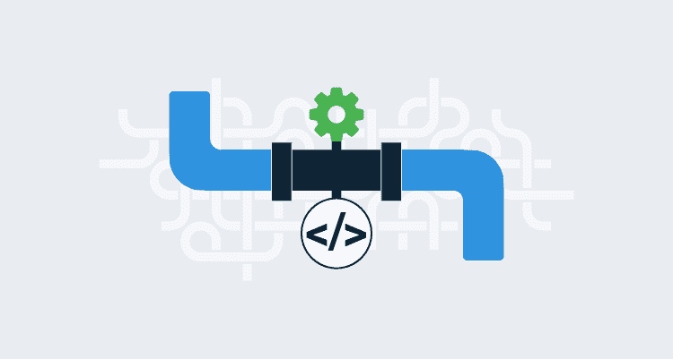

# 您的 CI/CD 流程应该作为代码文件在单个管道中实现吗？-章鱼部署

> 原文：<https://octopus.com/blog/cicd-pipeline-as-code-one-file>

管道即代码(PaC)的概念是由构建工具(即 Jenkins 管道、Azure 管道、GitLab CI/CD 管道等)开创的。)作为将正在开发的代码与构建和测试代码所需的脚本搭配起来的一种方式。这个过程立即吸引了开发人员，对于这个用例，PaC 是理想的，因为它创建的 PaC 逻辑和基础设施与它所搭配的代码非常接近。

## 作为构建和测试代码的管道

作为代码文件的管道与正在提交的代码共享相同的生存期。像单元测试一样，PaC 逻辑被设计成构建和测试它所提交的代码。正如您不会在单元测试中使用以前提交的代码来验证代码库的当前状态一样，您也不会使用以前版本的 PaC 文件来构建和测试当前的代码库。

如果 PaC 逻辑创建了任何测试基础设施，该基础设施也将是短命的，可能不会超过一个小时左右。超过一个小时的测试会让开发人员感到沮丧，通常不被认为是好的实践。

因为 PaC 逻辑仅限于构建和测试代码，所以 PaC 过程由开发人员拥有和管理，就像他们拥有和管理代码库的其余部分一样。

当 PaC 工作流被用作构建和测试周期的扩展时，它是一个自然的选择。与代码库的其余部分一样，负责 PaC 代码的是同一批人，PaC 文件随着每次提交而生或死，并且由 PaC 逻辑创建的基础结构是短命的。

## 将管道作为代码文件进行扩展以进行部署的挑战

自然，有一种倾向是将管道作为代码从构建和测试扩展到部署。乍一看，这似乎是 PaC 不可避免的演变，但是有很好的理由不为您的整个 CI/CD 工作流建立一个管道。

虽然构建代码并通过自动化测试来验证代码的过程最多只能用几个小时来衡量，但是将一个版本部署到产品中的过程却要长得多；以月为单位来衡量发布周期并不是没有听说过。

因此，与用于自动化测试的临时基础设施相比，部署中涉及的基础设施的生命周期也将成倍增长。

部署也是开发团队之外的许多人的责任；任何给定的发布都可能受制于产品所有者、QA、安全团队、技术作者和发布经理的流程。

安全性也成为一个问题，因为不同的团队最终负责部署过程的不同阶段。

当您将单个 PaC 文件从构建和测试扩展到部署时，它就从开发人员寻求解决编译、验证和打包代码的特定且有时间限制的问题的领域转移到满足多个团队在更长时间内的需求。现代软件交付实践鼓励我们[区分发布和部署](https://octopus.com/devops/continuous-delivery/deployments-vs-releases/)；分离概念缓解了开发和操作之间的紧张关系。

如果您的部署过程不是完全自动化的，那么根据定义，它需要人工输入，并且任何涉及多个团队几天、几周或几个月的过程将不可避免地产生大量的决策点、相互冲突的目标和围绕系统状态的不确定性。开创了 PaC 概念的以开发人员为中心的工具通常不太适合处理管理长时间运行的部署工作流的非常人性化的需求，这迫使团队试图在 PaC 文件中表示这些长时间运行的手动过程，该文件旨在支持短期和一次性的交互。

## 结论

尽管用单个 PaC 实现来表示整个 CI/CD 工作流很诱人，但是任何试图这样做的人都必须首先考虑，从业务的角度来看，这两个过程是否足够兼容以至于可以合并，以及托管 PaC 的工具是否充分支持部署过程的非功能性需求。

许多团队会发现这两个过程具有根本不同的时间表、责任方、报告要求和安全限制。即使 CI 和 CD 流程最终是在代码中定义的，它们也可能更容易作为单独的实体进行管理，这些实体可以通过更符合其受众的流程进行编辑、部署和保护。

浏览 [DevOps 工程师手册](https://octopus.com/devops/)了解更多关于 DevOps、CI/CD 和部署管道的信息。