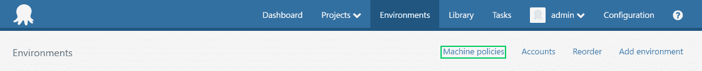
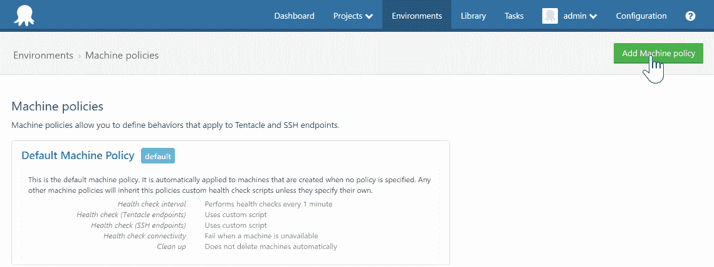
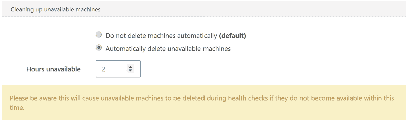
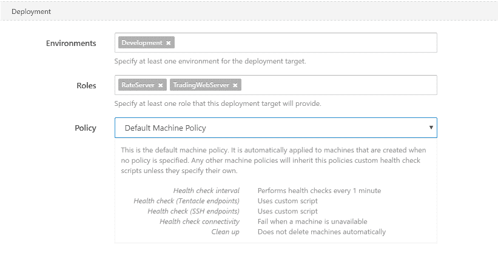

# 保持环境清洁-八达通部署

> 原文：<https://octopus.com/blog/clean-environments>

这篇文章是我们 Octopus 3.4 博客系列的一部分。在我们的[博客](https://octopus.com/blog/octopus34-blog-series-kickoff)或我们的[推特](https://twitter.com/OctopusDeploy)上关注它。

**Octopus Deploy 3.4 已经发货！阅读[博文](https://octopus.com/blog/octopus-deploy-3.4)和[今天就下载](https://octopus.com/downloads)！**

* * *

Octopus 3.4 引入了机器策略的概念。机器策略允许在可配置的时间段过后自动删除不可用的机器。

## 什么是机器？

在 Octopus land(海底深处)中，我们使用术语*部署目标*来描述可以部署到的事物类型。它们可能是触角、SSH 端点、离线点或云区域。过去，我们有 Azure 相关的部署目标。机器策略中的功能对于一些部署目标没有意义，因此我们决定使用单词 *machine* 来标识功能有意义的部署目标子集。目前，机器策略最适用于触手和 SSH 部署目标。

## 为什么要自动删除机器？

与 Octopus 相关的基础设施的典型生命周期是:

*   调配基础架构
*   安装触手或 SSH
*   向 Octopus 服务器注册触手或 SSH 端点
*   部署！
*   终止基础设施
*   从 Octopus 服务器中删除端点

小规模和长寿命的基础设施在 Octopus 中无需机器策略即可轻松管理。如果 Octopus 只注册了两个触手，或者一个触手的寿命是几年，那么当一个基础设施被终止时，从 Octopus 移除触手并不会带来太大的负担。

随着规模的扩大和寿命的缩短，管理 Octopus 中的机器变得越来越困难。考虑一下自动扩展的基础架构，在这种架构中，每天有数百台机器被供应和终止。试图让 Octopus 与底层基础设施的变化保持同步，这种情况很快就变成了一场噩梦。通过使用机器策略，Octopus 可以配置为在基础架构终止时自动移除机器。

## 配置 Octopus 自动删除机器

要配置机器策略以自动删除机器:

在环境屏幕上查找机器策略:



通过选择添加机器策略或选择默认机器策略来创建新的机器策略:



将“清理不可用的机器”设置更改为“自动删除不可用的机器”。将“不可用小时数”更改为计算机在被删除之前可以不可用的最小小时数:



现在，当分配了此计算机策略的计算机在指定的小时数内不可用时，将被永久删除。

## 将机器策略分配给机器

可以通过 Octopus 门户将机器策略分配给机器，方法是从“环境”页面中选择一台机器，然后使用策略下拉菜单选择一个机器策略:



使用`--policy`参数注册机器时，命令行可用于分配机器策略:

```
Tentacle.exe register-with --instance "Tentacle" --policy "Transient machines" --server "http://YOUR_OCTOPUS" --apiKey="API-YOUR_API_KEY" --role "web-server" --environment "Staging" --comms-style TentaclePassive 
```

还有一个名为`MachinePolicyId`的属性可以在`MachineResource`上设置，因此可以通过 Octopus API 或 Octopus 来分配机器策略。客户:

```
$machine = New-Object Octopus.Client.Model.MachineResource
$machine.Endpoint = $tentacleEndpoint
$machine.Name = $machineName
$machine.MachinePolicyId = $machinePolicyId
$machine.EnvironmentIds.Add($environmentId) 
$machine.Roles.Add($role) 
```

如果创建了一台机器，但尚未指定机器策略，则将为该机器分配默认的机器策略。

## 它是如何工作的

机器清理使用运行状况检查的结果作为标准来确定是否应该删除机器。当一个机器的生命值被取走，章鱼无法联系机器时，它的生命值状态会变成`Unavailable`。Octopus 每 5 分钟检查一次`Unavailable`机器，以确定应该删除的机器。如果机器的机器策略已配置为自动删除`Unavailable`台机器，并且机器已`Unavailable`超过机器策略中指定的时间，则机器将从 Octopus 中永久删除。Octopus 将只删除已启用的机器，因此如果一台机器即将脱机并且不应该被删除，请将其禁用。

## 进一步的信息

从我们的[环境清理指南](http://docs.octopusdeploy.com/display/OD/Cleaning+up+environments)中了解更多关于自动删除机器的信息。使用我们的[深入文档](http://docs.octopusdeploy.com/display/OD/Machine+Policies)或[探索机器政策。如果您有意见、建议或只想打声招呼，请联系](https://octopus.com/support)。