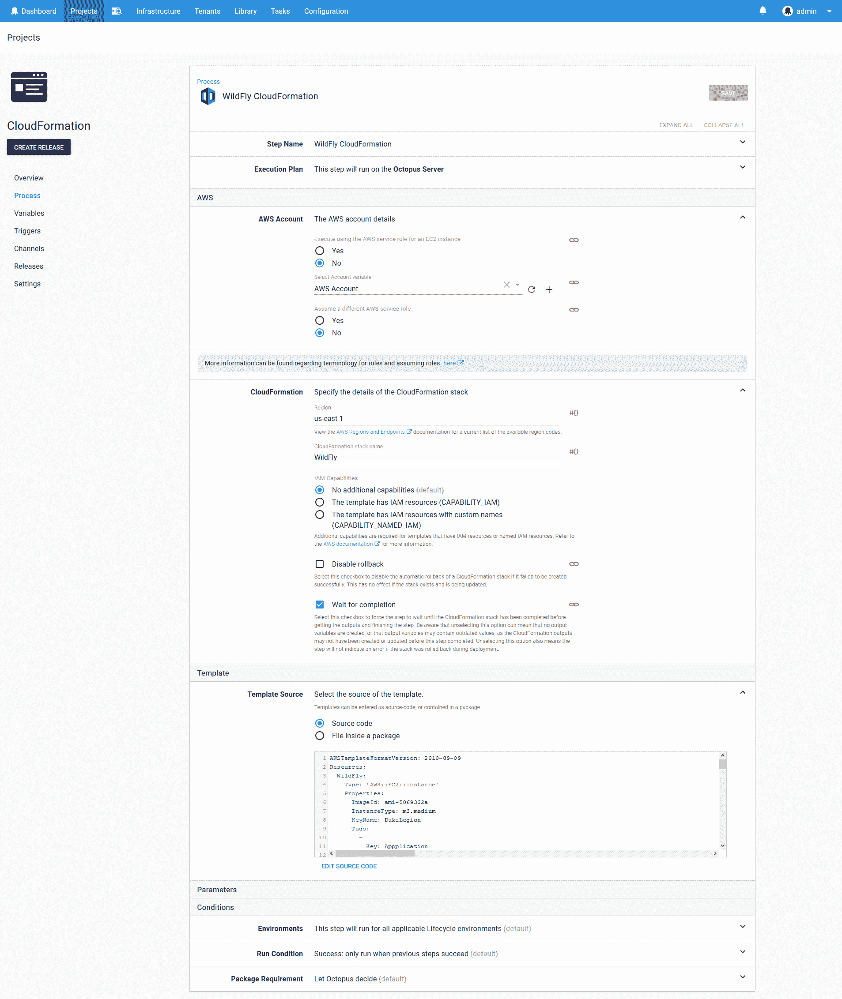
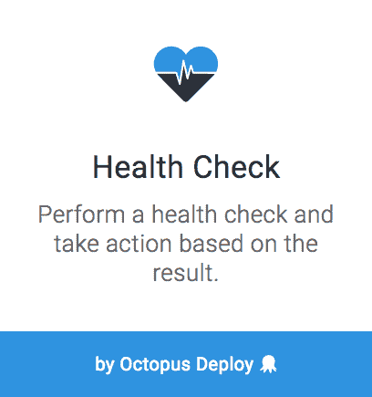

# 云形成，野火和部署 Maven 工件-章鱼部署

> 原文：<https://octopus.com/blog/cloudformation-and-java>

在过去的几个月里，Octopus 增加了许多新特性，允许您部署 Java 应用程序，使用 Maven feeds 中的工件，以及部署 AWS CloudFormation 模板。在这篇博文中，我们将探讨如何将所有这些元素结合起来，在基于云的环境中部署 Java 应用程序。

## Maven 提要

我们将要部署的应用程序将来自 Maven central。要访问它，我们需要在 Octopus 中配置 Maven 提要。这在库➜外部进料中完成。Maven Central 的网址是 https://repo.maven.apache.org/maven2/的。

[](#)

## AWS 帐户

Octopus CloudFormation 步骤通过 AWS 帐户向 AWS 进行身份验证。这些账户由基础设施➜账户➜亚马逊网络服务账户管理。你可以通过我们的[文档](https://octopus.com/docs/infrastructure/aws/creating-an-aws-account)找到更多关于创建 AWS 账户的信息，记住账户需要有一些[通用权限](https://octopus.com/docs/deployments/aws/permissions)才能有效地用于部署 CloudFormation 模板。

[](#)

## SSH 帐户

我们还需要配置一个帐户，用于通过 SSH 连接到 WildFly EC2 实例。这些账户由基础设施➜账户➜ SSH 密钥对管理。在这里，我们将创建一个 SSH 帐户，用户名为`bitnami`(因为这是 Bitnami AMIs 配置的用户名——下面将详细介绍)和 PEM 文件，您需要在 AWS 中创建该文件并将其分配给 EC2 映像。你可以在他们的[文档](https://docs.aws.amazon.com/AWSEC2/latest/UserGuide/ec2-key-pairs.html)中找到更多关于创建 AWS 密钥对的信息。

[](#)

## 机器政策

我们需要配置的最后一个全局 Octopus 设置是机器策略，可在基础设施➜机器策略下访问。

与轮询触角不同，SSH 目标必须有准确的 IP 地址或主机名才能参与 Octopus 部署。然而，将由 CloudFormation 模板创建的 EC2 实例没有固定的 IP 地址，并且当 EC2 实例停止并再次启动时，它们所具有的 IP 地址将会改变。这意味着我们需要做两件事来确保我们的 EC2 实例在 Octopus 中正确配置:

1.  每次 EC2 实例启动时，将 EC2 实例添加到 Octopus 中(如果它尚未注册)。
2.  让 Octopus 清理任何未通过健康检查的部署目标。

我们将在后面的章节中用 CloudFormation 模板中的一些脚本来处理第一步。通过编辑默认机器策略中的`Clean Up Unavailable Deployment Targets`部分来启用`Automatically delete unavailable machines`来配置步骤 2。

[](#)

## 野花 AMI

我们将利用 [Bitnami](https://bitnami.com/stack/wildfly) 提供的 ami 作为我们 CloudFormation 模板的基础。Bitnami 提供了大量免费的最新图像，并预装了流行的开源应用程序，这使我们能够快速启动并运行 EC2 WildFly 实例。

我发现获得 AMI ID 的最简单方法是在 AWS 控制台的`Public images`下搜索`WildFly`。请记住，这些 AMI IDs 是特定于地区的，所以`ami-5069332a`的 ID 只在北弗吉尼亚州有效。

[](#)

## 云形成模板

拥有一个 AMI 是成功的一半。另一半是从中构建 EC2 实例，为此我们将利用 Octopus 2018.2 中引入的 CloudFormation 步骤。

这个 CloudFormation 模板必须执行许多步骤:

1.  将 AMI 部署为 EC2 实例。
2.  配置一些标准标签。
3.  安装支持 DotNET Core 2 应用程序所需的软件包。
4.  配置文件系统权限以允许 WildFly 静默身份验证。
5.  向 Octopus 服务器注册 EC2 实例。

这是完整的模板

```
AWSTemplateFormatVersion: 2010-09-09
Resources:
  WildFly:
    Type: 'AWS::EC2::Instance'
    Properties:
      ImageId: ami-5069332a
      InstanceType: m3.medium
      KeyName: DukeLegion
      Tags:
        -
          Key: Appplication
          Value: WildFly
        -
          Key: Domain
          Value: None
        -
          Key: Environment
          Value: Test
        -
          Key: LifeTime
          Value: Transient
        -
          Key: Name
          Value: WildFly
        -
          Key: OS
          Value: Linux
        -
          Key: OwnerContact
          Value: "#{Contact}"
        -
          Key: Purpose
          Value: Support Test Instance
        -
          Key: Source
          Value: CloudForation Script in Octopus Deploy
        -
          Key: scheduler:ec2-startstop
          Value: true
      UserData:
        Fn::Base64: |
          #cloud-boothook
          #!/bin/bash
          echo "Starting" > /tmp/cloudhook
          sudo apt-get --assume-yes update
          sudo apt-get --assume-yes install curl libunwind8 gettext apt-transport-https jq
          getent group deployment || sudo groupadd deployment
          sudo usermod -a -G deployment wildfly
          sudo usermod -a -G deployment bitnami
          echo "Editing permissions" >> /tmp/cloudhook
          sudo chgrp deployment /opt/bitnami/wildfly/standalone/tmp/auth
          sudo chmod 775 /opt/bitnami/wildfly/standalone/tmp/auth
          role="WildFly"
          serverUrl="#{ServerURL}"
          apiKey="#{APIKey}"
          environment="#{Environment}"
          accountId="#{AccountID}"
          localIp=$(curl -s http://169.254.169.254/latest/meta-data/public-hostname)
          existing=$(wget -O- --header="X-Octopus-ApiKey: $apiKey" ${serverUrl}/api/machines/all | jq ".[] | select(.Name==\"$localIp\") | .Id" -r)
          if [ -z "${existing}" ]; then
            fingerprint=$(sudo ssh-keygen -l -E md5 -f /etc/ssh/ssh_host_rsa_key.pub | cut -d' ' -f2 | cut -b 5-)
            environmentId=$(wget --header="X-Octopus-ApiKey: $apiKey" -O- ${serverUrl}/api/environments?take=100 | jq ".Items[] | select(.Name==\"${environment}\") | .Id" -r)
            machineId=$(wget --header="X-Octopus-ApiKey: $apiKey" --post-data "{\"Endpoint\": {\"DotNetCorePlatform\":\"linux-x64\", \"CommunicationStyle\":\"Ssh\",\"AccountType\":\"SshKeyPair\",\"AccountId\":\"$accountId\",\"Host\":\"$localIp\",\"Port\":\"22\",\"Fingerprint\":\"$fingerprint\"},\"EnvironmentIds\":[\"$environmentId\"],\"Name\":\"$localIp\",\"Roles\":[\"${role}\"]}" -O- ${serverUrl}/api/machines | jq ".Id" -r)
          fi
Outputs:
  PublicIp:
    Value:
      Fn::GetAtt:
      - WildFly
      - PublicIp
    Description: Server's PublicIp Address 
```

为了将 AMI 部署为 EC2 实例，我们配置了一个类型为`AWS::EC2::Instance`的资源，将`ImageId`设置为我们正在部署的 AMI ID。

```
WildFly:
  Type: 'AWS::EC2::Instance'
  Properties:
    ImageId: ami-5069332a 
```

在 Octopus 内部，我们有一堆需要在任何 EC2 实例上设置的标签。至少您需要设置`Name`标记，因为这是出现在 AWS 控制台中的名称。

注意在 Octopus 中使用变量替换[来设置`OwnerContact`标签值。我们将在后面的步骤中定义这个变量。](https://octopus.com/docs/deployment-process/variables/variable-substitution-syntax)

```
Tags:
  -
    Key: Appplication
    Value: WildFly
  -
    Key: Domain
    Value: None
  -
    Key: Environment
    Value: Test
  -
    Key: LifeTime
    Value: Transient
  -
    Key: Name
    Value: WildFly
  -
    Key: OS
    Value: Linux
  -
    Key: OwnerContact
    Value: "#{Contact}"
  -
    Key: Purpose
    Value: Support Test Instance
  -
    Key: Source
    Value: CloudForation Script in Octopus Deploy
  -
    Key: scheduler:ec2-startstop
    Value: true 
```

为了将这个 EC2 实例用作 Octopus 部署目标，它需要安装 Mono，或者安装支持 DotNET Core 2 所需的包。在这个例子中，我选择支持后者。因为 Bitnami AMI 运行的是 Debian，所以我们使用`apt-get`来安装在[先决条件中列出的依赖项。Linux 上的 NET Core](https://docs.microsoft.com/en-us/dotnet/core/linux-prerequisites?tabs=netcore2x)。

`#cloud-boothook`标记被`cloud-init`服务用来[识别应该在每次引导时运行的脚本](http://cloudinit.readthedocs.io/en/latest/topics/format.html#cloud-boothook)。

在生产环境中，像这样的依赖项将被放入基本 AMI 映像中，而不是在实例启动时安装。

```
UserData:
  Fn::Base64: |
    #cloud-boothook
    #!/bin/bash
    sudo apt-get --assume-yes update
    sudo apt-get --assume-yes install curl libunwind8 gettext apt-transport-https jq 
```

Bitnami 映像在首次启动时会为 WildFly 管理控制台创建一个随机密码。您可以使用 Bitnami 提供的[指令找到这些凭证。然而，我们可以通过启用](https://docs.bitnami.com/aws/faq/#find_credentials)[静默认证](https://access.redhat.com/documentation/en-us/red_hat_jboss_enterprise_application_platform/7.0/html-single/how_to_configure_server_security/index#silent_authentication)来避免需要知道这些凭证。静默认证允许访问`/opt/bitnami/wildfly/standalone/tmp/auth`目录的进程在不提供用户名和密码的情况下通过 WildFly 进行认证。因为运行 WildFly 部署的代码将从 WildFly EC2 实例本身执行，所以我们可以授予对该目录的权限，并且不再需要知道 Bitnami 生成的随机密码。

这里我们创建一个名为`deployment`的组，将`wildfly`和`bitnami`用户添加到该组，将`/opt/bitnami/wildfly/standalone/tmp/auth`目录的组所有权分配给`deployment`组，并授予该组对该目录的完全权限。这意味着当 Octopus 使用`bitnami`用户连接到 EC2 实例时，它将完全控制`/opt/bitnami/wildfly/standalone/tmp/auth`目录，因此可以利用静默认证。

```
getent group deployment || sudo groupadd deployment
sudo usermod -a -G deployment wildfly
sudo usermod -a -G deployment bitnami
sudo chgrp deployment /opt/bitnami/wildfly/standalone/tmp/auth
sudo chmod 775 /opt/bitnami/wildfly/standalone/tmp/auth 
```

最后，我们需要这个 EC2 实例向 Octopus 服务器注册自己，如果它还没有这样做的话。脚本的这一部分查询 Octopus API，以确定 EC2 实例的当前主机名是否存在一个部署目标，如果没有找到部署目标，就会添加它。

该脚本中的许多变量是使用[变量替换](https://octopus.com/docs/deployment-process/variables/variable-substitution-syntax)提供的。这些将在下一节中定义。

```
role="WildFly"
serverUrl="#{ServerURL}"
apiKey="#{APIKey}"
environment="#{Environment}"
accountId="#{AccountID}"
localIp=$(curl -s http://169.254.169.254/latest/meta-data/public-hostname)
existing=$(wget -O- --header="X-Octopus-ApiKey: $apiKey" ${serverUrl}/api/machines/all | jq ".[] | select(.Name==\"$localIp\") | .Id" -r)
if [ -z "${existing}" ]; then
  fingerprint=$(sudo ssh-keygen -l -E md5 -f /etc/ssh/ssh_host_rsa_key.pub | cut -d' ' -f2 | cut -b 5-)
  environmentId=$(wget --header="X-Octopus-ApiKey: $apiKey" -O- ${serverUrl}/api/environments?take=100 | jq ".Items[] | select(.Name==\"${environment}\") | .Id" -r)
  machineId=$(wget --header="X-Octopus-ApiKey: $apiKey" --post-data "{\"Endpoint\": {\"DotNetCorePlatform\":\"linux-x64\", \"CommunicationStyle\":\"Ssh\",\"AccountType\":\"SshKeyPair\",\"AccountId\":\"$accountId\",\"Host\":\"$localIp\",\"Port\":\"22\",\"Fingerprint\":\"$fingerprint\"},\"EnvironmentIds\":[\"$environmentId\"],\"Name\":\"$localIp\",\"Roles\":[\"${role}\"]}" -O- ${serverUrl}/api/machines | jq ".Id" -r)
fi 
```

## 默认安全组

上面的 CloudFormation 模板没有定义安全组。这意味着使用默认的。为了通过 SSH 访问 EC2 实例并打开 WildFly 托管的网站，默认安全组需要打开端口`22`和`80`。

[](#)

在生产环境中，应该使用专用的安全组。

## 变量

CloudFormation 脚本有许多使用[变量替换](https://octopus.com/docs/deployment-process/variables/variable-substitution-syntax)定义的变量。这些变量在我们的 Octopus 项目的变量➜项目部分中定义。

通过获取 URL `https://octopusserver/app#/infrastructure/accounts/sshkeypair-bitnami`的最后一个元素找到`sshkeypair-bitnami`的`AccountID`变量，这是从基础设施➜帐户➜ SSH 密钥对打开 Bitnami SSH 帐户时显示的 URL。

注意`AWS Account`变量被设置为之前创建的`AWS Account`。该变量由 Octopus 步骤使用，而不是由 CloudFormation 模板直接使用。

你可以从[文档](https://octopus.com/docs/octopus-rest-api/how-to-create-an-api-key)中获得更多关于创建 Octopus API 密匙的信息。

[](#)

## 开始没有目标的部署

因为我们正在创建我们将作为 Octopus 项目的一部分部署到的基础设施，所以我们需要配置一些设置，以允许 Octopus 在没有任何预先存在的有效目标的情况下开始部署。这是在`Deployment Targets`下的项目设置中完成的。将值设置为`Allow deployments to be created when there are no deployment targets`意味着即使没有可用的目标，项目也可以开始部署。

[](#)

## 云形成步骤

现在是时候开始定义项目步骤了。我们将从部署 CloudFormation 模板开始，这是通过`Deploy an AWS CloudFormation template`步骤完成的。

[](#)

下面是填充步骤的屏幕截图。

[](#)

## 健康检查步骤

一旦部署了 CloudFormation 模板，它所创建的 EC2 实例将启动并向 Octopus 注册自己作为部署目标。我们现在需要将这个新目标添加到项目将要部署到的目标列表中。这是使用`Health Check`步骤完成的。

[](#)

下面是填充步骤的屏幕截图。

[](#)

## 野火部署步骤

既然我们新创建或更新的 EC2 实例是我们的部署目标列表的一部分，我们可以向它部署我们的 Java 应用程序。这是使用`Deploy to WildFly or EAP`步骤完成的。

[](#)

下面是填充步骤的屏幕截图。

`com.github.gwtmaterialdesign:gwt-material-demo`工件是由 [gwt-material](https://github.com/GwtMaterialDesign/gwt-material) 项目发布的 WAR 文件。我们在这里使用它是因为它是一个已经托管在 Maven Central 上的方便的示例项目。

请注意，我们没有提供`Management user`或`Management password`。这意味着我们依赖 WildFly 静默认证功能。

[](#)

## 最终输出步骤

为了方便运行此部署的人员，我们将显示一些有用的摘要信息。这是通过`Run a Script`步骤完成的。

[](#)

部署 CloudFormation 模板时，Octopus 会捕获任何输出变量，并将其用于后续步骤。我们利用这一点，基于 EC2 实例的公共 IP 地址构建一些 URL。

```
Write-Host "Open application at http://$($OctopusParameters["Octopus.Action[WildFly CloudFormation].Output.AwsOutputs[PublicIp]"])/gwtdemo"
Write-Host "Establish an SSH tunnel with:"
Write-Host "ssh -L 9990:localhost:9990 bitnami@$($OctopusParameters["Octopus.Action[WildFly CloudFormation].Output.AwsOutputs[PublicIp]"]) -i YourAWSKeyPair.pem"
Write-Host "Then open http://localhost:9990"
Write-Host "Find the credentials using the instructions from https://docs.bitnami.com/aws/faq/starting-bitnami-aws/find_credentials/" 
```

下面是填充步骤的屏幕截图。

[](#)

## 部署项目

下面是这个项目的一个部署结果的截图。

[](#)

请注意 CloudFormation 模板部署的输出中的这几行:

```
Saving variable "Octopus.Action[WildFly CloudFormation].Output.AwsOutputs[StackId]"
Saving variable "Octopus.Action[WildFly CloudFormation].Output.AwsOutputs[PublicIp]" 
```

这些日志消息提供了一种简单的方法来获取作为 CloudFormation 部署的结果而创建的任何输出变量的完整变量名。

还要注意运行状况检查步骤的输出。在这个部署中，我通过在 UserData 脚本中添加一个注释，对 CloudFormation 模板进行了一些调整。虽然这种变化不影响 EC2 实例的部署方式，但 CloudFormation 将其视为对现有堆栈的更改，因此关闭并重新启动 EC2 实例。这又给了 EC2 实例一个新的公共 IP，这意味着 EC2 实例将在启动时向 Octopus 注册自己。然后，运行状况检查步骤检查旧的部署目标和新的部署目标，确定旧的目标不再有效并将其删除，并成功完成对新目标的运行状况检查，并将其包括在用于剩余部署的目标列表中。

## 打开 Web 应用程序

最后一个脚本步骤的输出生成了一个 URL`http://107.20.112.198/gwtdemo/`。打开它显示 GWT 材料演示应用程序。

这个 URL 实际上对您不起作用，因为这个演示 EC2 实例已经关闭。为您生成的 URL 将具有不同的 IP 地址。

[](#)

## 结论

通过将部署 CloudFormation 模板和 Java 应用程序的许多新步骤整合在一起，我们可以非常容易地创建一个 Octopus 项目，该项目动态地构建云基础架构并向其部署应用程序。

如果您对自动化部署 Java 应用程序或创建云基础设施感兴趣，[下载 Octopus Deploy](https://octopus.com/downloads) 的试用版，并查看我们的文档。