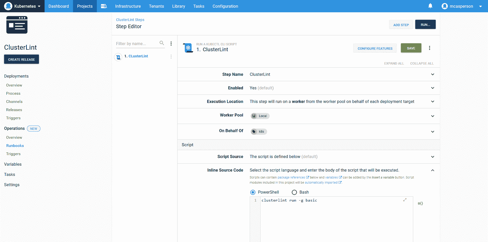
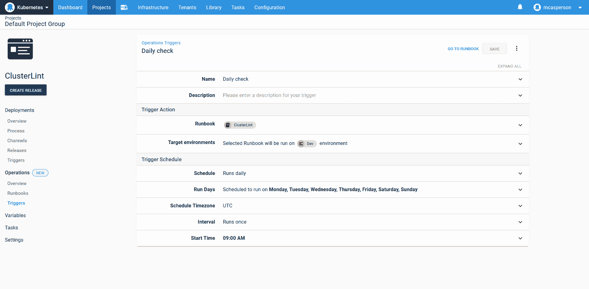
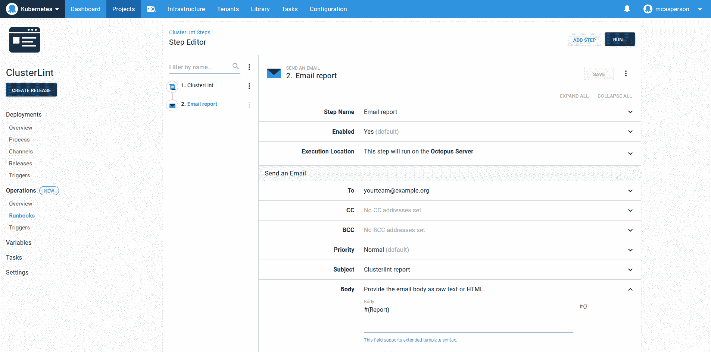
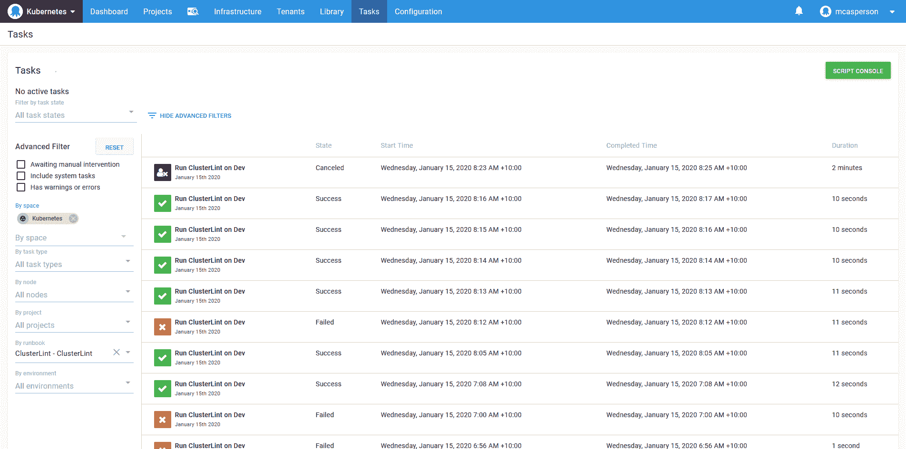

# 林挺您的 Kubernetes 集群与 Clusterlint 和 runbooks - Octopus 部署

> 原文：<https://octopus.com/blog/clusterlint-with-runbooks>

Octopus 中的操作手册将 Ops 置于 DevOps 中。这篇文章是一系列文章的一部分:

* * *

Octopus 2021 Q3 包括对 Kubernetes 部署的更新支持，以及针对 Google Cloud、AWS 和 Azure 用户的 runbooks。在我们的[发布公告](https://octopus.com/blog/octopus-release-2021-q3)中了解更多信息。

Kubernetes 让简单的事情变得困难，让困难的事情变得可能。这是一个贴切的说法。你只需要看看 Kubernetes 和周围生态系统的最佳实践指南的数量，就可以理解，即使是一个单独的 pod *正确运行*也是一项艰巨的任务。

这就是林挺工具可以帮忙的地方。通过将最佳实践封装到对集群的自动检查中，林挺工具可以突出您可能没有意识到的改进，并为改进基础架构创建反馈循环。

一个这样的林挺工具是 [Clusterlint](https://github.com/digitalocean/clusterlint) 。它由 DigitalOcean 开发，并集成到其托管的 Kubernetes 产品中，通过在集群更新等操作之前识别问题来减少支持负载。但是，大多数检查通常适用于任何集群。

## lint 反馈回路

在实现林挺工具时要问的一个问题是，它是应该以一个子集为目标，例如，仅仅是一个部署，还是整个集群。如果您的目标是单个部署的结果，那么将 lint 检查作为部署过程的一部分是有意义的。

然而，我要告诫不要过早地将林挺推入部署过程。作为一名开发人员，我见过全球代码林挺的实现每次都失败，因为它们产生了太多的误报，有着不被开发团队分享的观点，并且最终被忽略或者以一种特别的方式实现，因为它们碍事。

更好的解决方案是在部署工作流之外实现林挺，至少在最初是这样。这提供了生成具有最大价值的集中 lint 规则集的能力，并识别出没有人可能触及的配置问题，以及仅针对活动部署运行的检查所遗漏的问题。

那么，如何使用 Octopus 实现部署之外的工作流呢？直到最近，Octopus 中的每个自动化流程都被认为是一次部署。现在，随着 Operations Runbooks 的推出，Octopus 内置了对无需部署即可运行管理和维护任务的支持。

## 林挺运行手册示例

在下面的截图中，你可以看到一个调用`clusterlint`可执行文件的 runbook。

[](#)

这个 runbook 例子值得注意的是它有多简单。只需一行代码就可以自动检查您的 Kubernetes 集群。

runbook 很简单，因为它利用了 Octopus 中对 Kubernetes 的现有支持。**运行一个 kubectl 脚本**步骤用于使用从 Kubernetes 目标生成的`kubectl`配置文件执行`clusterlint`。如果您使用 Octopus 执行 Kubernetes 部署，那么这些目标已经配置好了。

## 超越概念验证的扩展

Runbooks 的真正好处是它们为超越概念验证的工作流提供了基础。

林挺应该自动按固定时间表运行。Runbooks 通过自定义触发器支持这一点:

[](#)

Lint 结果没有任何意义，除非它们被共享和执行。通过一些脚本，我们可以生成一个总结报告，并将其捕获到一个名为`Report`的 Octopus 变量中:

```
$emailReport = clusterlint run -g basic -o json |
  ConvertFrom-Json |
  Select -ExpandProperty Diagnostics |
  Group-Object -Property Check -NoElement |
  % {$report="Clusterlint report`n----"} {$report += "`n$($_.Name): $($_.Count)"} {$report}

Write-Host $emailReport

Set-OctopusVariable -name "Report" -value $emailReport 
```

```
 emailReport=`clusterlint run -g basic -o json | jq -r '.Diagnostics | group_by(.Property)[]| group_by(.Check)      | map({Check: .[0].Check, count: length}) | "Clusterlint Report", "---------", ( .[] | "\(.Check):\(.count)" )'`

echo "$emailReport"

set_octopusvariable "Report" "$emailReport" 
```

Octopus 提供了通过电子邮件、Slack、HipChat 和团队等渠道发送报告的步骤。在这里，我配置了一个发送包含报告摘要的电子邮件的步骤:

[](#)

当您的 lint 规则集被锁定时，如果有任何规则被破坏，您可以使 runbook 失败。然后，审计日志将为您提供集群状态的历史记录:

[](#)

而这些例子只是冰山一角。您可以使用:

## 结论

从概念上讲，runbooks 是一个简单的想法。它们允许您运行支持部署的相同自动化流程，而不需要部署。

但是可重复部署比部署软件的实际行为要多得多，runbooks 继承了所有这些跨领域的功能。借助 runbook automation，您可以获得内置的安全性、日志记录、审计、报告、仪表板和计划。

正如我们在这篇文章中看到的，即使是最简单的一行脚本也可以利用这些特性来扩展为一个健壮的、生产就绪的解决方案。

阅读我们的 [Runbooks 系列](https://octopus.com/blog/tag/Runbooks%20Series)的其余部分。

愉快的部署！