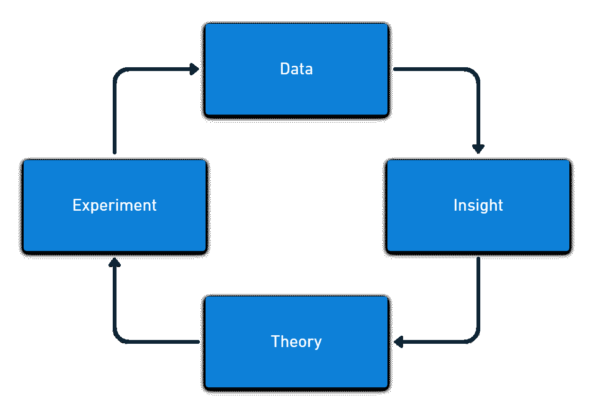

# DevOps 指标中的常见错误- Octopus 部署

> 原文：<https://octopus.com/blog/common-mistakes-devops-metrics>

作为持续改进过程的一部分，度量对于开发运维及持续交付至关重要。但是，您必须在收集和显示数据与信息泛滥之间取得平衡。你需要决定收集哪些数据，以及在任何时候关注哪些更小的数据集。

如果你的汽车有一个仪表板，显示它通过引擎管理系统收集的每一个指标，那就没有挡风玻璃的空间了。

早期汽车的仪表板上只有一个安培计，用来测量电池和电压调节器之间的电流。这很重要，因为它告诉你充电系统正在工作。没有速度计。汽车的最高时速只能达到 35 英里，而悬挂系统不鼓励以这种速度行驶。没有必要测量速度。

在现代汽车中，仪表板上没有给电流表留出空间(尽管如果出现问题，电池灯会亮起)。但是，你会发现几乎每辆车上都有速度计。当前的仪表板设计反映了汽车的发展和它们所处的更广泛的系统。发动机更强劲，悬挂系统更好，道路普遍更顺畅，更多的汽车上路。对安全的态度也发生了变化。

同样，当您对团队和组织中的差异做出反应时，您收集和显示的指标会随着时间而变化。

当您创建和发展您的测量系统时，有一些您应该避免的常见错误。

## 忽略数据

度量的第一个问题是，您花费了很大的精力来收集它们，但是它们并不总是被使用。这种情况甚至发生在定期审查数字的组织中。

你的数据需要一些能产生洞察力的过程。你可以将你从信息中发现的东西转化为你用于实验的理论。然后，实验应该提供新的数据，重新开始循环。

收集 DevOps 度量标准的唯一好的理由是更多地了解您的工作，并找到改进它的方法。如果你收集数据*只是为了以防万一*，这些数据很可能会被误用或者根本不会被使用。

## 活动偏差

有 4 个级别的测量，活动通常是最早和最容易收集的。您通常可以近乎实时地跟踪活动。活动的结果通常不会作为输出或基于结果的指标提供，直到以后的某个日期。

| Measurement level | Software example | 加热示例 |
| --- | --- | --- |
| 活动 | 代码行 | 功率消耗 |
| 输出 | 每周功能 | 加热元件温度 |
| 系统输出 | 研制周期 | 室温 |
| 结果 | 用户价值 | 人们很舒服 |

活动度量通常是您现有工具的内置特性，因此它们已经可用。问题是并不是所有的活动都代表进步。有些活动甚至会减少产出，导致更糟糕的结果。

您可以使用活动度量来预测输出和结果的未来变化。要做到这一点，您必须不断地测试您的活动度量和您的相关输出或结果度量之间的关系。

如果你只测量活动，你会得到很多运动，但没有进展。

## 一次跟踪太多

您收集和显示的指标数量可能会增加，通常会很快增加。不久，你的仪表板上堆满了图表，你不知道什么是重要的，什么是不重要的。

您需要让您跟踪的指标保持精简、最新和相关。当图表不再有用时，您应该将其从仪表板中删除。您还应该考虑是否仍然需要收集该指标，如果您没有很好的理由来跟踪它，就让它退役。

如果你已经有了一个仪表板，打开它，对每个图表问:“如果这个数字上升或下降，我会有什么不同？”。经常重温这个问题，删除任何你没有答案的图表。

您的指标集应侧重于关键的长期产出和结果指标，仪表板显示您当前改进工作中所有类别的短期指标。

像 Microsoft Power BI、Tableau 或 Google Data Studio 这样的数据可视化工具是您组织中最有用的软件产品。许多业务工具都有一个基于网格或文本的界面，但是数据工具有丰富多彩的动画图表。

创建一个引人入胜的仪表板很容易让人分心。如果你不从度量设计开始，你最终会得到许多对你的日常工作没有影响的令人愉快的仪表板。您需要仪表板和图表工具来帮助您理解信息，但是首先要设计指标。

最好从低保真度开始，以收集有意义的指标。可以从简单的电子表格甚至白板开始。在你确定了哪些测量对你的团队和组织有帮助之后，开始自动化收集和创建光滑的显示。

如果你花了太多时间来创建一个令人惊叹的仪表板，你会发现当不再需要图表时，很难删除它们。

## 标准化

一些组织试图通过让其他团队遵循相同的过程来复制高绩效团队的成功。这很少成功，因为每个团队处理不同的问题，并且具有不同的技能水平。正如过程和实践需要特定于上下文一样，度量标准也是如此。

您应该将指标作为持续改进活动的一部分。对于一个有长交付周期的团队，您测量批量大小、排队时间和工作在每个状态花费的时间。这些度量标准不适合主要问题是质量的团队。

这需要数据、洞察力、理论、实验周期，在这个过程中，你要查看你所拥有的关于你想要解决的问题的信息，形成一个关于什么可以改善这个问题的理论，然后进行一个实验来测试你的想法。

您收集的指标也向团队传达了在当前时间什么是重要的*。您经常看到改进，仅仅是因为您的度量传达了您关心软件交付的某些方面。*

## 依靠眼球

您应该创建一个简单的仪表板来显示您正在跟踪的实验指标。这应该显示在信息辐射器上，这样团队中的每个人都可以看到数据。

然而，如果您只在有人查看仪表板时对数据做出反应，您会让仪表板塞满太多的信息而错过关键事件。随着时间的推移，你所保持的跟踪进展的长期度量标准将会和你用来改进你的软件交付的短期度量标准一样重要。

解决保留长期指标而不使您的仪表板混乱的问题的关键是为数据建立一个监控和警报流程。自动化警报应该告诉您指标是否超过阈值，并且您可以使用异常检测来告诉您是否发生了有趣的事情。

通过自动跟踪指标，您可以将它们从仪表板中删除以释放空间。

## 奖励表现

如果您的团队正在努力提高他们的部署率，那么如果他们实现了日常部署，就可以通过奖励来激励他们。这种激励方式会导致糟糕的结果。一个团队可能会为了达到目标而放弃其他重要的工作——不是为了欺骗系统，而是因为你把日常部署看得比什么都重要。

在里程碑式的著作《T2》中，阿尔菲·科恩解释说，试图用激励来管理员工会给你的组织带来长期的伤害。数百项研究发现，当给予奖励时，人们会做得更差。

使用指标来营造竞争氛围，无论是为了个人表现、不同团队的比较，还是为了将工作场所游戏化(在这里，你将游戏元素作为一种“有趣”的竞争形式引入)，都会带来麻烦。

竞争与你在组织中真正需要的东西相冲突:协作。如果你假设人们想做好工作，你会发现你不需要用奖励或惩罚来让他们提高表现。

## 结论

5 DORA 度量和空间框架提供了预构建的、平衡的方法来度量软件交付性能。(以前有 4 个 DORA 指标，但增加了一个额外的*可靠性*指标。)

一套好的指标将把预测业绩的领先指标与检查预测准确性的落后指标结合起来。测量应该跨越活动、输出、系统输出和结果类别。

我们在关于测量持续交付的白皮书中详细介绍了 DevOps 和持续交付指标。

我们的 [DevOps Insights in Octopus](https://octopus.com/blog/octopus-release-2022-q3#devops-insights-better-visibility-and-actionable-dora-metrics-early-access-preview) 通过展示基于 4 个关键 DORA 指标的见解，让您更好地了解贵公司的 DevOps 绩效。这些指标有助于您确定开发运维绩效的结果，并深入了解需要改进的地方。

无论您度量什么，您都需要不断地改进您的度量标准，以确保它们对您的团队和组织仍然有用。理想情况下，您收集的指标与您正在运行的测试理论的特定实验相关。

如果您很好地使用了度量标准，那么当您试图成为软件交付中的精英之一时，您就放大了绩效和学习。

## 进一步阅读

愉快的部署！