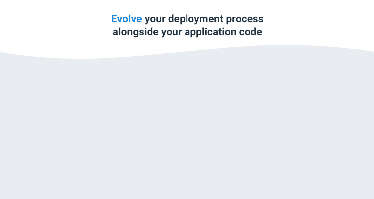
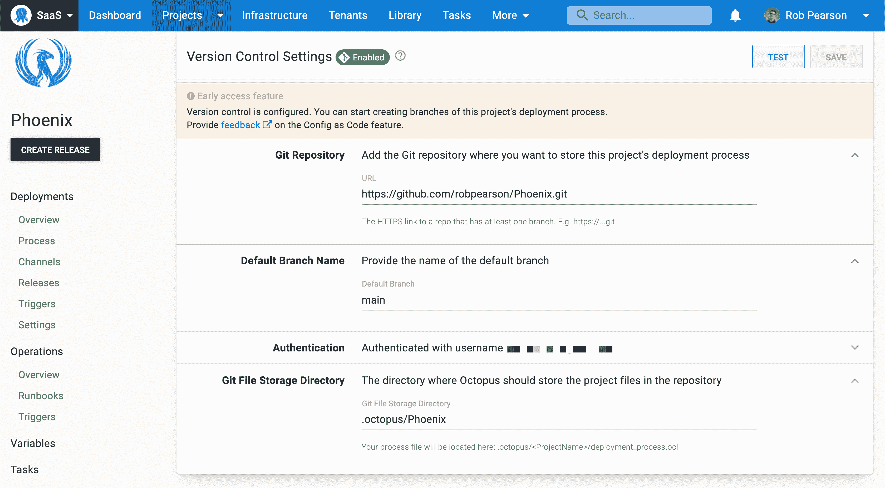
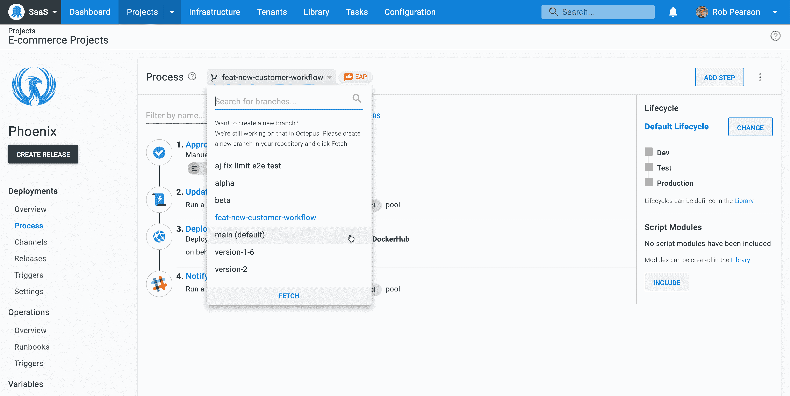
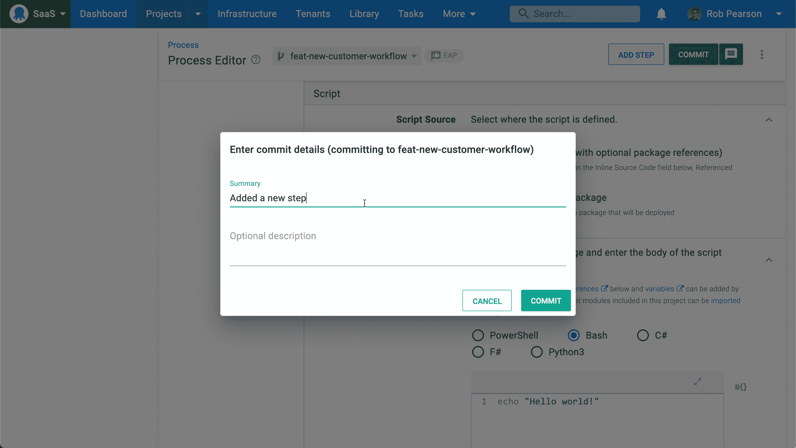
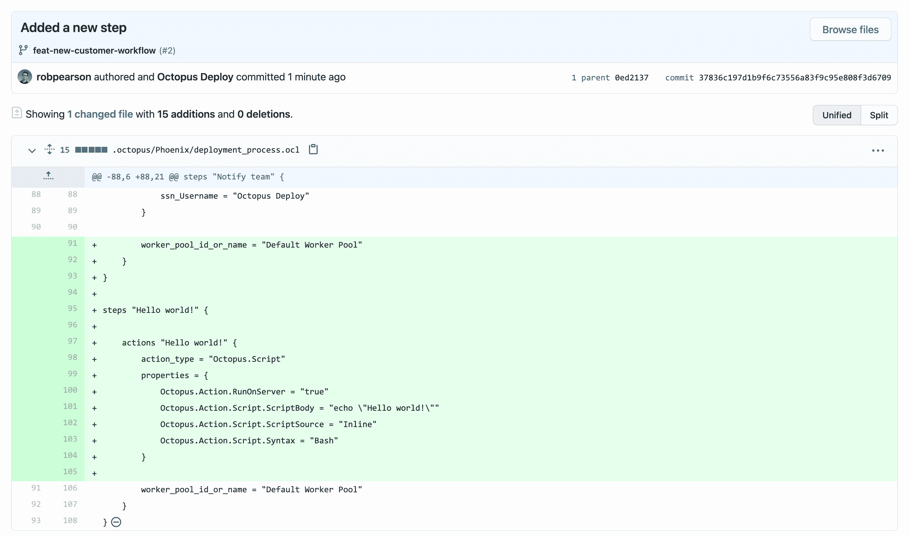
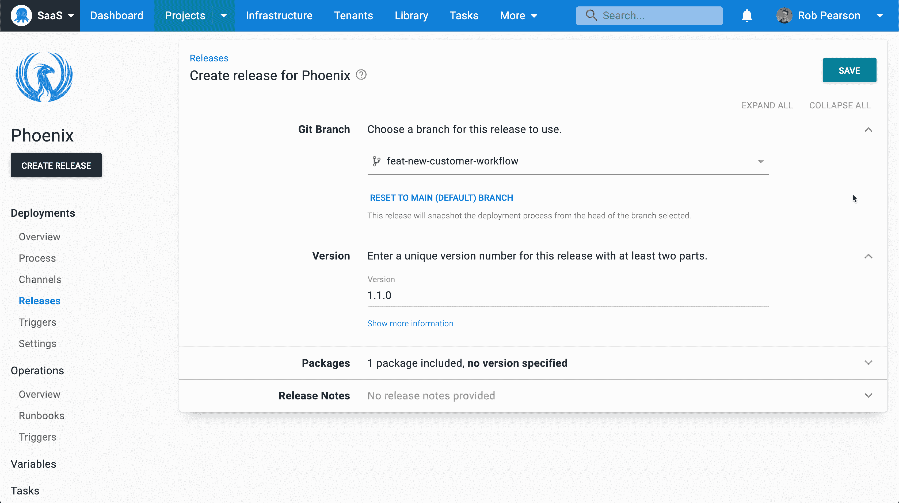

# Octopus 部署配置代码:早期访问预览- Octopus 部署

> 原文：<https://octopus.com/blog/config-as-code-eap>

我们的代码早期访问预览(EAP)配置现在可用。

Octopus 中的 configuration as Code(Config as Code)提供了 Git 的全部功能和 Octopus 的可用性。除了现有的数据库实现，我们还构建了一个健壮的 Git-persistent 层。这意味着您可以在应用程序代码旁边的 Git repo 中看到您的部署过程，并一起发展它们。

我们的配置代码解决方案允许您:

*   通过分支支持部署流程的多个版本
*   将对部署流程的更改与拉请求合并
*   查看部署流程的更改历史，包括谁在何时执行了更改
*   恢复到先前版本的部署流程

重要的是，Octopus UI 仍然有效，因此您不需要学习一种全新的语言来编辑您的流程。但是，如果您愿意，您仍然可以使用您最喜欢的文本编辑器来编辑您的配置。

在这篇文章中，我将介绍我们的 Config as Code 解决方案，并解释如何开始。

Octopus 中的 Config as 代码是一个早期的访问预览，所以可能会有一些粗糙的边缘。我们建议创建新的项目或克隆现有的项目来进行试验，而不是在生产中进行测试。

由于我们仍在开发这一功能，我们非常感谢[您愿意分享的任何反馈](https://octopusdeploy.typeform.com/to/qeW9JGyo)。我们还建议在`#config-as-code`频道的[社区 Slack](https://octopus.com/slack) 中加入讨论。

## 为什么将配置作为代码？

许多现代 IT 和 DevOps 系统提供“as code”实现。常见的例子是基础设施即代码(IaC)解决方案，如 HashiCorp 的 [Terraform](https://terraform.io) 和 [Pulumi](https://pulumi.com) 到 CI 服务器，如 [Jenkins](https://www.jenkins.io/) 和 [TeamCity](https://www.jetbrains.com/teamcity/) ，它们允许您将构建配置指定为代码。

这些解决方案将纯文本代码/配置细节存储在源代码存储库中。这允许您发展您的系统配置并享受 Git 的好处，包括分支和历史。

在 Octopus [UserVoice 网站](https://octopusdeploy.uservoice.com/)上，以及在会议和活动中，Config As Code 一直是我们的客户提出的[最高](https://octopusdeploy.uservoice.com/forums/170787-general/suggestions/15698781-version-control-configuration) [要求](https://octopusdeploy.uservoice.com/forums/170787-general/suggestions/32541541-deployment-pipeline-as-code)之一。

我们使用您的反馈来指导我们的“配置为代码”解决方案的构建。

## Octopus 配置代码-两全其美

当为项目启用 Config as Code 时，您可以像往常一样继续使用 Octopus UI，或者可以在您喜欢的编辑器中编辑文本文件。你可以在效率最高的地方工作。

我们的配置文件格式是章鱼配置语言(OCL)，基于 [HashiCorp 的 HCL](https://github.com/hashicorp/hcl) 。我们希望我们的配置文件是人类可读的，并支持复杂的文档，如部署和操作手册流程。我们喜欢 HCL，并认为它是这项工作的正确工具，但我们已经编写了自己的[解析器/串行化器](https://github.com/OctopusDeploy/Ocl)。这意味着我们没有义务遵循哈希公司的任何方向，也没有什么可以阻止我们做出改变。

参见 Michael Richardson 关于[将配置塑造成代码](https://octopus.com/blog/shaping-config-as-code)的帖子，了解更多关于将配置塑造成代码解决方案的因素。

### Git 的所有功能

分支是 Git 的超能力，我们想要展示这种能力。您可以在 Octopus UI 中切换分支(并很快创建它们)，允许您对分支上的部署过程进行更改。这实际上允许一个草稿模式，因为您可以从您的分支中创建一个发布并测试您的变更。当与 Git 提供者的特性结合起来时，比如 pull 请求、受保护的分支和代码所有者，这可以实现一组全新的工作流。

保存对部署流程的更改时，可以添加提交消息。您还可以在没有消息的情况下提交更改(这是默认设置)，这在迭代以使复杂的部署过程工作时非常方便。

### Octopus 用户界面仍然有效

我们希望你有一个伟大的配置代码使用八达通门户网站的经验。您可以配置您的 Git 存储库、选择您的分支、提交更改等等，所有这些都可以从 Octopus 用户界面中完成。

如果您喜欢完全控制，您可以编辑底层配置文件，但这不是必需的。丰富的双向同步意味着您可以混合搭配使用 web UI 和直接编辑。

### 使用 Visual Studio 代码编辑配置

有些人喜欢 web 界面，而有些人喜欢在他们喜欢的文本编辑器中编辑文本文件。为了使与 OCL 的合作更容易，我们为 Visual Studio 代码构建了一个 [Octopus Deploy 扩展来补充 Octopus UI。](https://marketplace.visualstudio.com/items?itemName=octopusdeploy.vscode-octopusdeploy)

OCL 的编辑经验包括:

*   语法突出显示
*   步骤和操作的代码片段
*   在文件中导航节点的集成树视图

我们的 VS 代码扩展也是一个早期访问预览版，但是我们迭代得很快。我们建议安装并试用它。

### 转换现有项目

可以在现有项目上启用“配置为代码”。这意味着您不需要创建一个新项目并重新开始。大多数 Octopus 特性与 Config as 代码完全兼容(例外情况见我们的[文档](https://octopus.com/docs/projects/version-control))。

注意:这是一个单向过程，您无法将项目恢复为存储在数据库中。鉴于这是早期 access 预览版，我们建议您在测试此功能时克隆现有项目或导出它们。

## 什么过程是受版本控制的？

对于这个第一版，只有部署过程是受版本控制的(还有一些与部署过程密切相关的设置)。

我们打算将操作手册和变量作为以下工作来实现。

## 以代码形式配置入门

要开始使用 Octopus 中的 Config as Code EAP，您需要启用特性标志。

导航至**配置**，然后**功能**，并开启该功能。

由于这是早期的 access 预览，请记住创建新项目或克隆现有项目来测试它。

或者，您可以在我们的网上技术交流讲座[以代码](https://octopus.com/events/technical-deep-dive-with-config-as-code)的形式深入了解配置中看到配置代码。

[https://www.youtube.com/embed/oZfxlbpSP14](https://www.youtube.com/embed/oZfxlbpSP14)

VIDEO

### 配置您的 Git 存储库

导航到**设置**然后**版本控制**来指定您的 Git 存储库细节。

在上面的例子中，我选择了一个公共存储库，并输入了我的 GitHub 用户名和一个个人访问令牌。

### 选择一个分支并提交更改

部署流程编辑器最明显的变化是我们新的分支选择器。

要开始使用:

1.  给你的回购推一个新的分支
2.  对您的部署过程进行更改(例如，添加一个新的 **Hello world！**脚本步骤)
3.  提交带有描述的更改
4.  导航到您的 Git repo 并检查更改

### 创建版本

创建发布时，选择包含您的部署过程的分支。Octopus 会自动选择所选分支的负责人。您的部署一如既往地以同样可重复且可靠的方式执行。

## 结论

我们的配置代码早期访问预览现在可用。它提供了 Git 的强大功能和人类可读的文本格式，与 Octopus 的可用性相平衡。

这只是该功能的第一步。我们有一个即将推出的功能路线图，我们希望您能帮助指导我们。

我们希望您能尝试将 Config as Code 用于您的工作流程，并[让我们知道如何改进它](https://octopusdeploy.typeform.com/to/qeW9JGyo)。

## 观看我们的网络研讨会:在 Octopus 中将配置作为代码引入

德里克·坎贝尔和皮特·加拉格尔将带你了解在 Octopus 中配置为代码的入门知识，以及在大规模使用配置为代码时的最佳实践。

[https://www.youtube.com/embed/Z4DgiJ630FU](https://www.youtube.com/embed/Z4DgiJ630FU)

VIDEO

我们定期举办网络研讨会。请参见[网络研讨会第](https://octopus.com/events)页，了解有关即将举行的活动和实时流媒体录制的详细信息。

愉快的(版本控制的)部署！