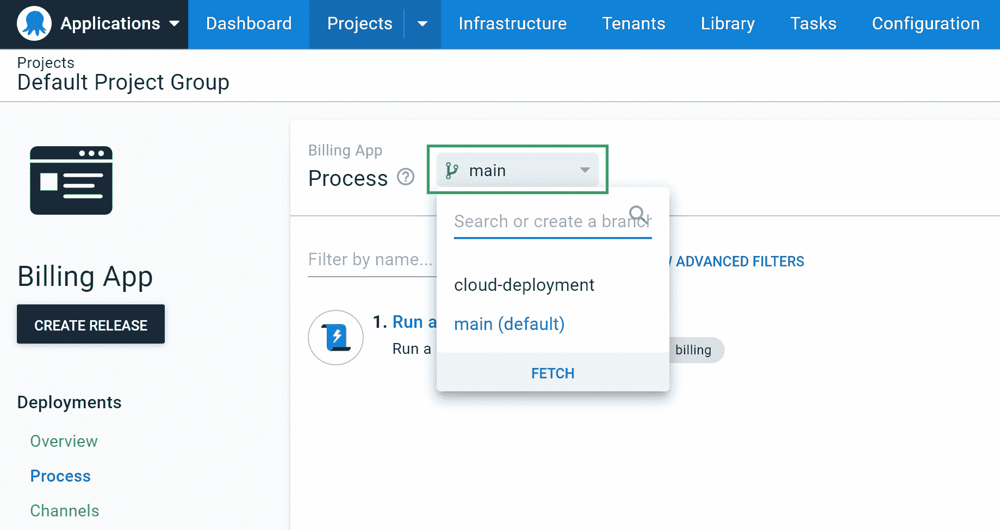

# 配置为代码策略- Octopus 部署

> 原文：<https://octopus.com/blog/config-as-code-strategies>

自从我们去年以代码形式发布 Octopus 配置的早期访问预览版以来，就有许多关于如何使用该功能以获得最佳效果的问题。

这篇文章解释了使用 Config 作为代码的一些好的实践，以及如何在不同的情况下调整你的策略。

你也可以在我们的 [2022 年 Q1 公告帖子](https://octopus.com/blog/octopus-release-2022-q1)中阅读更多关于 Octopus 中的 Config as 代码。

## 为什么使用配置作为代码？

Git 是对代码进行版本控制和跟踪随时间变化的完美解决方案。它已经建立了代码分支以及发布和批准变更的模式。如果需要的话，它还允许你比较版本和回到过去。

Octopus Config as Code 特性允许您将部署过程作为配置文件存储在 Git 存储库中，而不是 Octopus 数据库中。您可以使用 Config as Code 来:

*   将您的配置分支，并在合并之前测试分支中的更改
*   使用拉式请求对变更进行审核和协作
*   克隆现有项目以用作未来项目的模板
*   使用已经用于应用程序代码的相同工具来跟踪对部署配置的更改
*   在您喜欢的文本编辑器或 Octopus 应用程序中编辑您的部署配置

配置存储为使用 Octopus 配置语言(OCL)的可读文件。我们设计 OCL 是为了使阅读和编辑部署过程以及审查任何变更更加容易。有一个 [Visual Studio 代码扩展，使得处理 OCL 文件](https://marketplace.visualstudio.com/items?itemName=octopusdeploy.vscode-octopusdeploy)更加容易。

当您启用版本控制时，并不是所有东西都被移动到存储库中。在我们的[配置中有一个版本控制资源列表，作为代码引用](https://octopus.com/docs/projects/version-control/config-as-code-reference)。

打开项目的版本控制是单向的。一旦项目进入存储库，就不能再将它移回 Octopus 数据库。您可以克隆一个现有的项目来尝试将 Config 作为代码，并在为您的生产项目启用它之前确认它满足您的需求。

## 在哪里存储您的配置

您需要做出的第一个决定是在哪里存储您的部署配置文件。您可以保留您的配置:

*   除了您的应用程序代码
*   在单独的部署存储库中

请继续阅读，了解每个选项什么时候最有效，什么时候应该避免。

您可能已经注意到，您可以在一定范围内安排这些可能性，从与应用程序的一对一关系到单个大型存储库。我们建议将您的部署配置保存在与应用程序代码相同的存储库中，但是在某些特定的情况下，其他选项可能也适用。

将 Config 设置为代码后，如果您改变主意，您可以[移动您的部署配置文件](https://octopus.com/docs/projects/version-control/moving-version-control)。

### 除了应用程序代码

将部署配置与应用程序代码放在一起是我们推荐的模式。最好是*与您的应用程序代码*一起发展您的部署过程。将配置放在与应用程序相同的位置符合开发运维实践，在开发运维实践中，工程师对他们的应用程序承担端到端的责任。

如果您选择将您的配置存储在应用程序存储库中，每个应用程序都有自己的`.octopus`目录和配置文件。这种安排便于为每个应用程序找到合适的部署过程。它还确保对应用程序和部署过程的更改被一起版本化，这消除了应用程序和部署过程的特定版本之间的任何依赖性。

如果您不希望对部署过程的更改触发应用程序的构建，您可以在构建服务器中屏蔽掉`.octopus`文件夹。

当团队同时负责应用程序及其部署时，这种模式是理想的。

### 特定于部署的存储库

如果您需要将部署配置从应用程序存储库中分离出来，您可以创建一个特定于部署的存储库。您应该只使用一个单独的存储库来在应用程序和它的部署过程之间创建一个明确的划分。例如，如果您需要限制谁可以访问部署存储库，或者如果您需要对变更实施不同的策略。

您的组织设计可以告知您是否使用:

*   每个应用程序有单独的部署存储库
*   每个 Octopus 空间一个部署存储库
*   中央部署存储库

在为您的存储库选择设计时，考虑您可能会创建多少个分支。Octopus 应用程序将在分支切换器中显示所有分支。如果您将多个项目分组到一个单一的存储库中，您还应该将每个项目放在`.octopus`文件夹的子目录中。

## 将配置作为代码有效地用于分支和拉取请求

切换到版本控制后，您可以使用一些熟悉的工具来帮助您成功部署。其中两个是分支和拉请求。

当更改部署过程时，您可以使用分支来控制风险。您可以在 Octopus 应用程序中为受版本控制的项目创建和切换分支。您也可以在 Octopus 应用程序之外创建和编辑分支。无论您是选择使用 Octopus 应用程序、文本编辑器，还是两者都使用，流程将始终与分行保持同步。

## 当配置为代码是错误的选项时

许多部署资源不属于一个项目，例如，空间、租户、环境和帐户。我们并不打算用 Config as 代码来处理这些项目的版本控制。

你可以使用[章鱼部署平台提供商](https://registry.terraform.io/providers/OctopusDeployLabs/octopusdeploy/latest/docs)来处理这些资源。您可以在我们的博客上找到[如何开始使用面向 Octopus Deploy 的 Terraform provider。](https://octopus.com/blog/octopusdeploy-terraform-provider)

您还可以考虑在多个项目之间共享一个配置，以保持过程同步。然而，这需要许多非项目资源在项目之间保持一致，这很快变得难以管理。

不要在多个项目之间共享相同的 OCL 文件，您应该创建一个定制工具来与 [Octopus Deploy REST API](https://octopus.com/docs/octopus-rest-api) 进行交互，以执行所需的流程配置。你可以在我们的文档中读到更多关于同步多个实例的信息。

## 结论

现在，您可以放心地为代码为的[配置选择一个合适的策略。这篇文章解释了如何在版本控制中为您的配置文件选择一个合适的位置，如何使用分支和拉请求来管理您的部署过程，以及当 Config as Code 不是合适的工具时。](https://octopus.com/blog/octopus-release-2022-q1)

您可以在我们的[路线图](https://octopus.com/company/roadmap)上保持对未来新增内容的更新，例如将 Config 作为 Runbooks 的代码。

## 观看我们的网络研讨会:在 Octopus 中将配置作为代码引入

德里克·坎贝尔和皮特·加拉格尔将带你了解在 Octopus 中配置为代码的入门知识，以及在大规模使用配置为代码时的最佳实践。

[https://www.youtube.com/embed/Z4DgiJ630FU](https://www.youtube.com/embed/Z4DgiJ630FU)

VIDEO

我们定期举办网络研讨会。请参见[网络研讨会第](https://octopus.com/events)页，了解有关即将举行的活动和实时流媒体录制的详细信息。

愉快的部署！