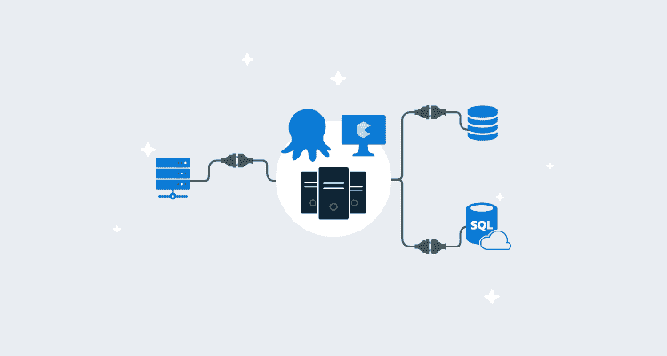

# 在 Azure - Octopus 部署中配置 Octopus 高可用性

> 原文：<https://octopus.com/blog/configure-octopus-high-availability-in-azure>

[](#)

我们最近更新了我们的[高可用性](https://octopus.com/docs/administration/high-availability)文档，为托管 Octopus 高可用性提供更多信息和选项。

在这篇博客中，我在 Azure 上设置了 Octopus 高可用性，评估了您可以使用的不同选项，并带您了解了在微软 Azure 上高可用性 Octopus Deploy 设置的不同组件。

## Octopus 高可用性的好处

[高可用性](https://octopus.com/docs/administration/high-availability)允许你运行多个 Octopus 服务器，在它们之间分配负载和任务。高可用性有几个好处:

*   业务关键型工作负载的弹性更高。
*   更简单的维护任务，如[服务器补丁](https://en.wikipedia.org/wiki/Patch_(computing))。
*   性能和可扩展性。
*   更少的停机时间。
*   使用八达通高可用性不收取额外费用。

## Octopus 高可用性组件

Octopus HA 配置需要四个主要组件:

*   **负载平衡器**:负载平衡器在不同的 Octopus 服务器节点之间引导去往 Octopus web 接口的用户流量。
*   **Octopus 服务器节点**:运行 Octopus 服务器 windows 服务。它们服务于用户流量并协调部署。
*   **一个数据库**:Octopus 服务器节点使用的大部分数据都存储在这个数据库中。
*   **共享存储**:一些较大的文件(如 [NuGet 包](https://octopus.com/docs/packaging-applications/package-repositories)，工件，部署任务日志)不适合存储在数据库中，必须存储在所有节点都可用的共享文件夹中。

## 章鱼虚拟机

当创建高可用性配置时，您需要在 Azure 中提供至少两个虚拟机来托管 Octopus。我们没有一个适用于所有章鱼的标准，因为它取决于:

如果您在 Octopus 中的工作负载相当小，您可以选择较小的虚拟机。不过，Azure D 系列虚拟机是一个很好的起点，因为它们是通用的，非常适合大多数场景。

我们的建议是考虑您的工作负载，然后使用其中一个 D 系列虚拟机，看看它在满足您的要求方面表现如何。

在这种情况下，我使用 **D2s V2** 启动了两个虚拟机，分别名为 **Octo1** 和 **Octo2** ，它们使用 **Server 2019** 拥有两个 vCPU 和 8GB 内存。这个规格是一个很好的起点，您可以将 D 系列更改为其他尺寸。

理论上，您可以根据需要增加资源和减少资源。您可以在这里使用某种形式的自动化来水平或垂直扩展。

### 虚拟机磁盘

您需要考虑您的 Octopus 虚拟机需要什么类型的存储，并且您可以看到[可用性磁盘类型](https://docs.microsoft.com/en-us/azure/virtual-machines/disks-types)的完整列表。有几个问题需要考虑:

*   [超磁盘](https://docs.microsoft.com/en-us/azure/virtual-machines/disks-types#ultra-disk) : Azure 最快的磁盘。
*   [顶级固态硬盘](https://docs.microsoft.com/en-us/azure/virtual-machines/disks-types#premium-ssd):适用于大多数工作负载的绝佳解决方案。
*   [标准固态硬盘](https://docs.microsoft.com/en-us/azure/virtual-machines/disks-types#standard-ssd):在合理的预算内为您提供高速磁盘的解决方案。
*   [标准硬盘](https://docs.microsoft.com/en-us/azure/virtual-machines/disks-types#standard-hdd):通常最适合低性能工作负载或开发和测试环境。

请务必记住，这仅适用于虚拟机，我选择了**标准固态硬盘**，因为其成本和性能符合我的要求。Octopus 对磁盘的占用不是很大，这意味着使用 Ultra Disks 不太可能获得很多好处。如果你在数千个项目中使用 Octopus，你应该考虑高级 SSD，因为这可能是有益的。

### Azure 可用性集与 Azure 可用性区域

请查看 [Azure 文档](https://docs.microsoft.com/en-us/azure/virtual-machines/availability)以获得 Azure 虚拟机可用性选项的完整列表，因为我们不会涵盖所有这些。

*   Azure 可用性区域是 Azure 区域内独立的数据中心，具有专用的电力、冷却和网络。通过这个选项，当使用可用性区域时，您可以确保 Octopus 在您的主要 Azure 区域中保持对故障的弹性。对于弹性，所有启用区域至少有三个独立的区域。Azure 为这个选项提供了 99.99%的正常运行时间 SLA。
*   [Azure 可用性集](https://docs.microsoft.com/en-us/azure/virtual-machines/availability-set-overview)是虚拟机的逻辑分组，提供冗余和可用性。Azure 为可用性集提供了 **99.95%的正常运行时间 SLA** ，除了虚拟机成本之外，没有任何成本。

在微软 Azure 上设计和配置 Octopus 时，我选择了 **Azure Availability Zones** 选项，纯粹是为了提高 SLA。这也是微软通常推荐的高可用性。

我在**可用性区域 1** 和**可用性区域 2** 中设置了我的两个虚拟机 **Octo1** 和 **Octo2** 。这让我对 Octopus HA 有了容忍度，因为它使用了不同的逻辑数据中心，并且具有对存储和 SQL 数据库进行低延迟访问的优势。

大多数 Octopus 高可用性配置将包含两个虚拟机。如果您使用三个或更多，您需要将它们放入各自的区域。

多虚拟机 Octopus 高可用性的配置示例如下:

*   AZ1 的 10 月 1 日，AZ2 的 10 月 2 日
*   AZ1 的 10 月 1 日，AZ2 的 10 月 2 日，AZ3 的 10 月 3 日
*   AZ1 中的十月一日、AZ2 中的十月二日、AZ3 中的十月三日、AZ1 中的十月四日

我们只在八个节点上测试 Octopus，但是您可以根据需要将这些节点划分到多个可用区域。

## Octopus SQL 数据库

Octopus 由一个存储环境、项目、变量、版本和部署历史的 SQL 数据库支撑。你需要在 Azure 中启动一个 SQL 服务器。有两种选择可以考虑，而 Octopus 天生就支持这两种选择:

如果您可以联系数据库管理员，您应该寻求他们的专业知识，因为他们可能会提供进一步的见解。

### SQL 虚拟机与 Azure SQL

大多数组织在云中调配 SQL 工作负载时都使用虚拟机。在这一节中，我将介绍选择 SQL 虚拟机的好处和一些缺点。

因为我们需要 Octopus 的高可用性配置，所以我们需要考虑 SQL 级别的高可用性。这意味着你最少需要三个 SQL 服务器，最好是在 Azure 的一个 SQL 集群中，或者在 Azure 的一个永远可用组中。

大多数情况下，我将保持这一部分的高水平，因为在这些主题上有很好的内容，您可能有一个数据库管理员会为您执行此操作。如果你已经在 Azure 上安装了这个，我推荐使用这个设置来托管 Octopus，最好是在一个专用的 SQL 实例上。

在 Azure SQL 上使用 SQL 虚拟机的优势:

*   更大的灵活性。
*   更多的控制。
*   托管多个数据库，无需额外成本。

在 Azure SQL 上使用 SQL 虚拟机的缺点:

*   更高的总拥有成本。
*   增加了设置时间。
*   维护基础设施和数据库。

我做了很多概念验证，我是任何 PaaS 的忠实粉丝。我特别喜欢 [Azure SQL 数据库服务](https://docs.microsoft.com/en-us/azure/sql-database/sql-database-technical-overview)，因为我不需要投入太多时间来启动虚拟机、网络安全组、配置 SQL、防火墙规则、维护计划等。

我可以登录到 [Azure 门户网站](https://portal.azure.com/)，在几分钟内就可以构建一个新的 SQL Server、数据库和连接字符串。如果你已经准备好了[手臂模板](https://azure.microsoft.com/en-gb/resources/templates/)，这可能需要一些时间。基础设施作为代码可以节省大量时间，但我意识到这可能还不是每个人的偏好。

当在 Azure SQL 上构建数据库时，我可以在几分钟内创建一个地理复制或本地复制的数据库，这就是我的高可用性数据库。然后我简单地为 Octopus 配置连接字符串，就可以开始了。

在 SQL 虚拟机上使用 Azure SQL 有很多好处:

*   更容易配置。
*   在几秒钟/几分钟内根据需要旋转和拆卸。
*   只需几个命令或几下鼠标，就能使数据库高度可用。
*   管理备份和维护任务。
*   伟大的 Azure AQL 分析和监测内置。

在 SQL 虚拟机上使用 Azure SQL 的一些缺点:

*   更少的控制。
*   当出现问题时，恢复备份需要相当长的时间。
*   重构 SQL 脚本。
*   试图理解什么是 DTU。

两种选择各有利弊。在为您和您的组织需求选择正确的解决方案时，您应该考虑这一点。

### SQL 数据库选择

下面是我在我的例子中所做的:

*   选择西欧的 Azure SQL Server，因为这是我的主要地区。
*   为我的地理复制 Octopus 数据库选择了位于北欧的 Azure SQL Server，以满足灾难恢复需求。
*   在主区域和 SQL Server 中创建了一个名为 **Octo-HA** 的数据库。
*   浏览到主 Azure SQL 数据库上的地理复制并启用复制。
*   让它复制到辅助数据库服务器和区域。

此时，您有一个主数据库服务器和数据库，它跨区域同步到一个辅助服务器和数据库。

区域冗余数据库目前正在 Azure 中预览。如果这是可用的，我会使用区域冗余数据库，因为这与我为 Azure 虚拟机设置的冗余级别相同。

### SQL 数据库规范

博客的这一部分涵盖了 SQL Server 性能的选项。我建议查看[高可用性 SLA](https://docs.microsoft.com/en-us/azure/azure-sql/database/high-availability-sla) 文档，以选择正确的数据库和服务器规模。

在我的例子中，我选择了:

*   一般用途。
*   Provisioned，提供预先分配并按小时计费的计算机资源。
*   2 个 vCores。
*   最大数据大小为 30GB。
*   区域冗余开启(区域冗余增加约 20%的成本)。

在高可用性配置中，这些规范是一个很好的起点。不过，您可能需要考虑您的工作量，因为如果您拥有一个小的 Octopus 实例，这对于您的要求来说可能太大了。

如果你拥有一个大型实例，我会考虑微软 Azure 中的超大规模和业务关键负载。找到适合您的 SQL 需求的方法，因为您不想要一个性能缓慢的 Octopus 实例，但您可能也不想让它太大，并为您的数据库托管支付太多费用。

## 八达通存储

在单节点设置中，你通常将 Octopus 托管在[本地存储上](https://en.wikipedia.org/wiki/Local_storage)在`C:\Octopus`或`D:\Octopus.`你需要 Octopus 的一些本地存储，除非你决定将 Azure 文件共享作为映射驱动器或作为到服务器的符号链接。

我们建议在服务器上本地托管您的 Octopus 日志和配置。这避免了可能导致 Octopus 停止响应的潜在文件锁定问题。

### 工件、包和任务日志

Octopus 存储了几个不适合存储在数据库中的文件。其中包括:

*   Octopus 内部的[内置 NuGet 库](https://octopus.com/docs/packaging-applications/package-repositories)使用的 NuGet 包。这些包裹通常很大。
*   部署期间收集的工件。使用 Octopus 的团队有时会在部署过程中使用这个特性从机器上收集大型日志文件和其他文件。
*   任务日志是存储部署和其他任务的所有日志输出的文本文件。

与数据库一样，从 Octopus 的角度来看，您告诉 Octopus 服务器将它们作为文件路径存储在操作系统中的什么位置。Octopus 不在乎你用什么技术来呈现共享存储；它可以是映射的网络驱动器或文件共享的 UNC 路径。这三种类型的数据都存储在不同的位置。

无论您以何种方式提供共享存储，都有一些注意事项:

*   对 Octopus 来说，它需要显示为映射的网络驱动器(例如，`D:\`)或文件共享的 UNC 路径(例如，`\\server\path`)。
*   Octopus 运行的服务帐户需要完全控制目录。
*   驱动器是按用户映射的，所以您应该使用运行 Octopus 的同一服务帐户来分配驱动器。

### Azure 文件

如果你的 Octopus 服务器运行在微软 Azure 中，只有一个解决方案(除非你在 Azure 中有一个 [DFS 副本](https://docs.microsoft.com/en-us/windows-server/storage/dfs-replication/dfsr-overview))。这个解决方案就是 [Azure 文件存储](https://docs.microsoft.com/en-us/azure/storage/files/storage-files-introduction)，它通过 SMB 3.0 提供一个文件共享，在你所有的 Octopus 服务器上共享。

一旦你创建了你的文件共享，添加 Azure 文件共享作为一个[符号链接](https://en.wikipedia.org/wiki/Symbolic_link)，然后将它添加到`C:\Octopus\`用于工件、包和任务日志，它们需要对所有节点可用。

安装 Octopus 前运行以下**:**

```
# Add the Authentication for the symbolic links. You can get this from the Azure Portal.

cmdkey /add:octostorage.file.core.windows.net /user:Azure\octostorage /pass:XXXXXXXXXXXXXX

# Add Octopus folder to add symbolic links

New-Item -ItemType directory -Path C:\Octopus
New-Item -ItemType directory -Path C:\Octopus\Artifacts
New-Item -ItemType directory -Path C:\Octopus\Packages
New-Item -ItemType directory -Path C:\Octopus\TaskLogs

# Add the Symbolic Links. Do this before installing Octopus.

mklink /D C:\Octopus\TaskLogs \\octostorage.file.core.windows.net\octoha\TaskLogs
mklink /D C:\Octopus\Artifacts \\octostorage.file.core.windows.net\octoha\Artifacts
mklink /D C:\Octopus\Packages \\octostorage.file.core.windows.net\octoha\Packages 
```

[安装 Octopus](https://octopus.com/docs/installation) ，然后运行以下程序:

```
# Set the path
& 'C:\Program Files\Octopus Deploy\Octopus\Octopus.Server.exe' path --artifacts "C:\Octopus\Artifacts"
& 'C:\Program Files\Octopus Deploy\Octopus\Octopus.Server.exe' path --taskLogs "C:\Octopus\TaskLogs"
& 'C:\Program Files\Octopus Deploy\Octopus\Octopus.Server.exe' path --nugetRepository "C:\Octopus\Packages" 
```

## 负载平衡

当您配置第一个 Octopus 服务器节点和每个后续节点时，您配置了 Octopus Web 门户可用的 HTTP 端点。

最后一步是配置一个负载平衡器，在每个 Octopus 服务器节点之间引导用户流量。

Octopus 可以与任何负载平衡器技术一起工作，包括硬件和软件负载平衡器。Azure 为我们提供了以下负载平衡器:

在评估了 Azure 中的选项后，我的首选是 Azure 负载平衡器选项，因为这是一个功能丰富的负载平衡器，符合我的要求。如果你想比较负载平衡的所有 Azure 选项，请查看[选择负载平衡服务](https://docs.microsoft.com/en-us/azure/architecture/guide/technology-choices/load-balancing-overview)。

在创建虚拟机之前创建 Azure 负载平衡器，因为您可以在配置期间选择负载平衡器。

### 负载平衡器会话持久性

我们通常建议使用循环(或类似的)方法在集群中的节点之间共享流量，因为 Octopus Web 门户是无状态的。

但是，群集中的每个节点都保留了数据的本地缓存，包括用户权限。当用户权限更改时，会出现一个已知问题。本地缓存仅在进行更改的节点上无效。

为了同时解决这个问题，您可以用**会话持久性**配置您的负载平衡器。这将确保用户会话被路由到同一个节点。

## 身份验证提供商

如果你从内部迁移到 Azure，你需要考虑你的身份验证提供者。你可能在本地使用**活动目录**，通常，这是 Azure 中的 Octopus 不支持的，因为你需要在 Octopus 安装的同一网络中有一个域控制器，以允许对你的活动目录用户进行身份验证。

如果您在 Azure 中有可联系的域控制器，您可以继续使用 Active Directory 身份验证。

如果您没有可在 Azure 中联系的域控制器，您需要考虑切换到:

### 移动身份验证提供程序

如果您已经在内部使用了 Active Directory，并且正在迁移到 Azure，并且无法继续使用 Active Directory，则可以在 Octopus 中将多个外部身份与单个用户相关联。最常见的迁移可能是从 Active Directory 到 Azure Active Directory。在这个例子中，假设我有一个名为 **Derek 的用户。坎贝尔**在一个名为 **work.local** 的域名和一个 worklocal.onmicrosoft.com**的活动目录租户上，我会:**

*   设置 [Azure 活动目录](https://octopus.com/docs/security/authentication/azure-ad-authentication)。
*   将我的**Derek.Campbell@Worklocal.OnMicrosoft.com**帐户添加到 Octopus Deploy 用户，该用户也有我的**德里克。坎贝尔@Work.local** 用户。
*   拆下**德里克。来自用户的 Campbell@work.local** 。
*   测试身份验证。
*   冲洗，并为所有用户重复。

请查看[该脚本](https://github.com/OctopusDeploy/OctopusDeploy-Api/blob/master/REST/PowerShell/Users/AddAzureActiveDirectoryLoginToUsers.ps1)，因为如果您要切换到 Azure Active Directory，它可以帮助您从本地迁移到 Azure。

## 建立工作关系网

即使在最好的情况下，网络也是一个有争议的问题，您的配置将在很大程度上取决于您现有的网络拓扑和标准。我会实现下面的一个或几个来帮助保护你的 Azure 工作负载:

*   [Azure Bastion](https://azure.microsoft.com/en-gb/services/azure-bastion/) :一个完全平台管理的 PaaS 服务，可以用来为您的服务器提供安全无缝的 RDP/SSH 连接。
*   [VPN 网关](https://azure.microsoft.com/en-gb/services/vpn-gateway/):将你的本地网络连接到 Azure 服务的服务。
*   ExpressRoute :一种通过私人链接直接连接 Azure 的专线方式。
*   [跳转框](https://en.wikipedia.org/wiki/Jump_server):一种从安全服务器启用到 Azure 服务的单一路由的方式。

考虑使用现有的方法连接到 Azure，如果你已经有了它们。如果您有快速路线，那么这是最好的方法，但它是最昂贵的。

如果你有一个 VPN 网关，一个跳转框，或者甚至 Azure Bastion 服务，我推荐你利用这些优势。

最重要的建议是减少您的[攻击面](https://en.wikipedia.org/wiki/Attack_surface)，同时保持您的网络尽可能简单明了，不会导致任何潜在的安全问题。

*   在可能的情况下，使用[内部 IP 和网络](https://en.wikipedia.org/wiki/Private_network)而不是公共 IP，尤其是针对您的 SQL 配置。
*   使用 VPN 或跳转/堡垒盒。最好两者都有。
*   安全八达通使用 HTTPS 只有一个有效的证书。

### 投票触角

监听触角不需要特殊的配置来实现高可用性。然而，轮询触须定期轮询服务器，以检查触须是否需要执行任何任务。

在高可用性场景中，轮询触角必须轮询配置中的所有 Octopus 服务器。您可以轮询一个负载平衡器，但是根据您的负载平衡器配置，存在一个风险，即触手不会立即轮询所有服务器。

您还可以将触手配置为轮询每个服务器，方法是将它注册到您的一个 Octopus 服务器，然后将每个 Octopus 服务器添加到触手. config 文件中。添加 Octopus 服务器有两种选择，通过命令行或直接编辑触手. config 文件:

**触手. config**

通过命令行配置触手是首选选项，每个服务器只执行一次命令。下面是使用默认实例的命令示例:

```
C:\Program Files\Octopus Deploy\Tentacle>Tentacle poll-server --server=http://my.Octopus.server --apikey=API-77751F90F9EEDCEE0C0CD84F7A3CC726AD123FA6 
```

有关该命令的更多信息，请参考[触手轮询服务器选项文档](https://octopus.com/docs/octopus-rest-api/tentacle.exe-command-line/poll-server)。

或者，可以直接编辑 Tentacle.config 来添加每个 Octopus 服务器(这被解释为服务器的 JSON 数组)。不建议使用此方法，因为每台服务器的 Octopus 服务都需要重新启动，以通过此方法接受传入连接:

```
<set key="Tentacle.Communication.TrustedOctopusServers">
[
  {"Thumbprint":"77751F90F9EEDCEE0C0CD84F7A3CC726AD123FA6","CommunicationStyle":2,"Address":"https://10.0.255.160:10943","Squid":null,"SubscriptionId":"poll://g3662re9njtelsyfhm7t/"},
  {"Thumbprint":"77751F90F9EEDCEE0C0CD84F7A3CC726AD123FA6","CommunicationStyle":2,"Address":"https://10.0.255.161:10943","Squid":null,"SubscriptionId":"poll://g3662re9njtelsyfhm7t/"},
  {"Thumbprint":"77751F90F9EEDCEE0C0CD84F7A3CC726AD123FA6","CommunicationStyle":2,"Address":"https://10.0.255.162:10943","Squid":null,"SubscriptionId":"poll://g3662re9njtelsyfhm7t/"}
]
</set> 
```

请注意，在高可用性配置中，每个 Octopus 服务器都有一个地址条目。根据您的配置和网络拓扑，您可以为每个 Octopus 节点使用私有 IP 或公共 IP 和/或 FQDN。以下示例显示了在端口 **10943** 上注册到**octo1.domain.com**、**octo2.domain.com**和**octo3.domain.com**的情况:

```
<set key="Tentacle.Communication.TrustedOctopusServers">
[
  {"Thumbprint":"77751F90F9EEDCEE0C0CD84F7A3CC726AD123FA6","CommunicationStyle":2,"Address":"https://octo1.domain.com:10943","Squid":null,"SubscriptionId":"poll://g3662re9njtelsyfhm7t/"},
  {"Thumbprint":"77751F90F9EEDCEE0C0CD84F7A3CC726AD123FA6","CommunicationStyle":2,"Address":"https://octo2.domain.com:10943","Squid":null,"SubscriptionId":"poll://g3662re9njtelsyfhm7t/"},
  {"Thumbprint":"77751F90F9EEDCEE0C0CD84F7A3CC726AD123FA6","CommunicationStyle":2,"Address":"https://octo3.domain.com:10943","Squid":null,"SubscriptionId":"poll://g3662re9njtelsyfhm7t/"}
]
</set> 
```

在以下示例中，我使用公共 IP，而不是 FQDN 或私有 IP:

```
<set key="Tentacle.Communication.TrustedOctopusServers">
[
  {"Thumbprint":"77751F90F9EEDCEE0C0CD84F7A3CC726AD123FA6","CommunicationStyle":2,"Address":"https://1.2.3.4:10943","Squid":null,"SubscriptionId":"poll://g3662re9njtelsyfhm7t/"},
  {"Thumbprint":"77751F90F9EEDCEE0C0CD84F7A3CC726AD123FA6","CommunicationStyle":2,"Address":"https://1.2.3.5:10943","Squid":null,"SubscriptionId":"poll://g3662re9njtelsyfhm7t/"},
  {"Thumbprint":"77751F90F9EEDCEE0C0CD84F7A3CC726AD123FA6","CommunicationStyle":2,"Address":"https://1.2.3.6:10943","Squid":null,"SubscriptionId":"poll://g3662re9njtelsyfhm7t/"}
]
</set> 
```

## 移民

如果您正在将 Octopus 的一个实例迁移到 Azure，我们推荐的方法是:

*   建立基础设施。
*   设置 Octopus 文件夹和存储位置。
*   运行高可用性 Octopus 安装。
*   对新实例进行概念验证。
*   测试身份验证和部署。
*   确认后计划生产移动。
*   计划停机时间。
*   使用[移动 Octopus 服务器和数据库](https://octopus.com/docs/administration/managing-infrastructure/moving-your-octopus/move-the-database-and-server)进行迁移。
*   切换到新的 Azure 设置。

## 结论

尽管 Azure 中的高可用性非常简单，但是在从内部部署迁移到 Azure 托管 Octopus Deploy 时，需要考虑很多问题。在这篇博客中，我解释并推荐了一些可以使用的技术，以帮助您在 Microsoft Azure 上配置 Octopus 高可用性。

我希望这些技巧能让在微软 Azure 上设置 Octopus 高可用性变得更容易。

愉快的部署！