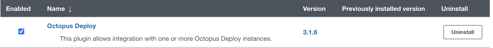
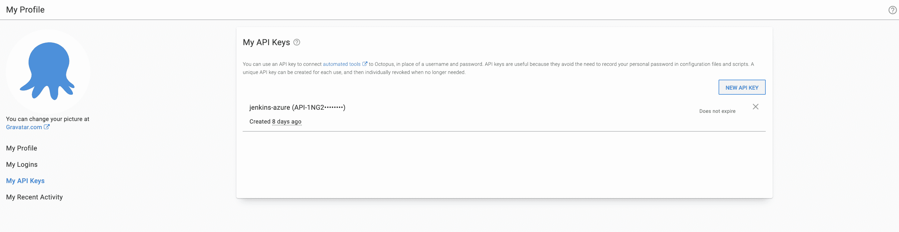
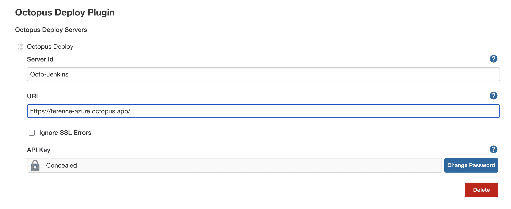
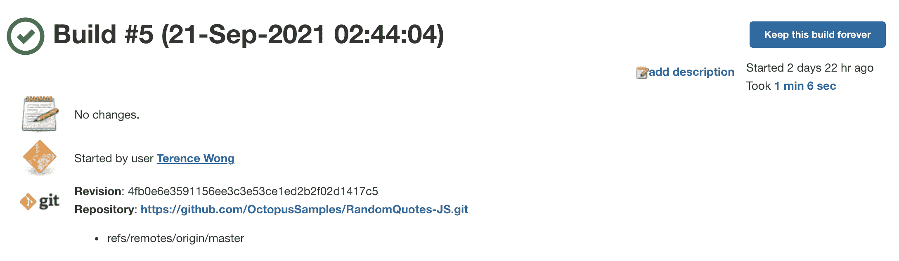
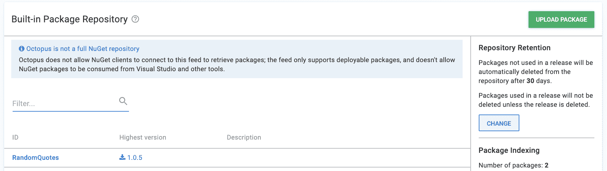
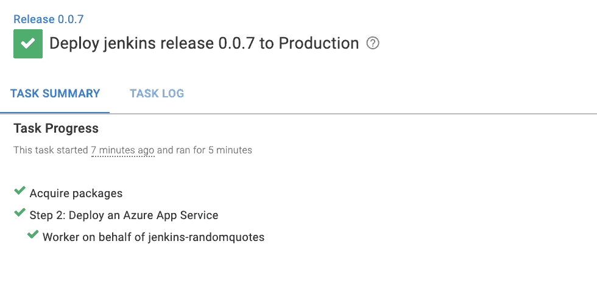

# 在 Azure 中配置 Jenkins 并使用 Octopus - Octopus Deploy 部署

> 原文：<https://octopus.com/blog/configuring-jenkins-azure-deploying-octopus>

Jenkins 是市场上最受欢迎的持续集成(CI)平台。它是开源和免费的，让你自动构建和测试你的代码。

您可以将它与 Octopus Deploy 一起使用来自动管理发布和部署。

在这篇文章中，我将向您展示如何配置一个 Jenkins 实例，将一个包推送到 Octopus Deploy 实例，以及将一个 web 应用程序部署到 Azure。

## 开始之前

要跟进这篇文章，你需要:

## 为 Octopus 部署设置 Jenkins

设置完 Jenkins 后，转到 Jenkins 实例的 URL 来访问 UI。

在 UI 中，进入**管理 Jenkins** ，然后进入**管理插件**，在**可用**下搜索 Octopus Deploy 插件，安装插件。

[](#)

现在需要在 Octopus 部署实例中生成一个 API 键。

在 Octopus 中，进入你的**用户名**，然后**个人资料**，然后**我的 API 密匙**，创建一个密匙。Jenkins 使用这个值。

[](#)

接下来，进入**管理詹金斯**，然后**配置系统**。

在 Octopus Deploy 插件设置下，添加 Octopus Deploy 实例的 URL，并添加 API 密钥。

[](#)

Jenkins 让你的编译包在 Octopus 中可用，随时可以部署。

进入 Jenkins 主页，点击**新项目**，然后点击**自由式项目**，并分配以下设置，创建一个新作业:

### 源代码管理

Git: `https://github.com/OctopusSamples/RandomQuotes-JS.git`构建说明符:`*/master`

### 构建触发器

轮询供应链:`H/5 * * * *`

### 构建步骤-执行 shell

您必须在虚拟机上安装 npm 和 Node.js。

```
npm install
npm tests 
```

### 构建步骤 Octopus 部署:打包应用程序

*   Octopus 部署 CLI:默认
*   包 ID: `RandomQuotes`
*   版本号:`1.0.${BUILD_NUMBER}`
*   包格式:zip
*   包包含路径:`${WORKSPACE}/**`
*   包输出文件夹:`${WORKSPACE}`

### 构建步骤 Octopus 部署:推送包

*   Octopus 部署 CLI:默认
*   章鱼部署连接:奥克托-詹金斯
*   包路径:`${WORKSPACE}/RandomQuotes.1.0.${BUILD_NUMBER}.zip`

点击**保存**。

回到**仪表板**并点击**立即构建**开始工作。

[](#)

构建开始后，导航到构建号并检查其进度。如果每个步骤都通过了，您会看到一个成功状态。

[](#)

Jenkins 将包上传到 Octopus Deploy 实例，您可以在**库**下找到该实例，然后在**包**下找到该实例。软件包版本对应于 Jenkins 中的最新内部版本号。

[](#)

## 配置 Azure 帐户

您需要配置一个 Azure 帐户和 web 应用程序作为从 Octopus 部署的目标。也可以使用其他目标，比如 AWS 或者 Linux 和 Windows 服务器。

通过导航到 [Azure 门户](https://portal.azure.com/)在 Azure 中创建一个帐户。

### 使用 Azure 门户创建 Azure 服务主体

[https://www.youtube.com/embed/QDwDi17Dkfs](https://www.youtube.com/embed/QDwDi17Dkfs)

VIDEO

1.  在 Azure 门户中，打开菜单，导航到 **Azure Active Directory** ，然后导航到**属性**，并复制来自**租户 ID** 字段的值。这是您的**租户 ID** 。
2.  接下来你需要你的**应用 ID** :

*   如果你创建了一个 AAD 注册的应用，导航到 **Azure Active Directory** ，然后**应用注册**，点击**查看所有应用**。选择应用程序并复制**应用程序 ID** 。请注意，Azure UI 默认为**拥有的应用**标签。点击**所有应用**选项卡查看所有应用注册。
*   如果您尚未创建已注册的应用程序，请导航至 **Azure Active Directory** ，然后导航至**应用程序注册**，点击**新注册**，并为您的应用程序添加详细信息，然后点击**保存**。记下**应用 ID** 。

1.  通过导航到**证书&机密**，然后导航到**新客户端机密**，生成一次性密码。添加新密码，输入描述，点击**保存**。记下显示的应用程序密码，以便在 Octopus 中使用。如果您不想接受默认的密码一年到期，您可以更改到期日期。

您现在拥有以下内容:

*   租户 ID
*   应用程序 ID
*   应用程序密码/机密

这意味着您可以[在 Octopus](#add-service-principal-account) 中添加服务主账户。

接下来，您需要配置您的[资源权限](#resource-permissions)。

### 资源权限

资源权限确保你的注册应用可以使用你的 Azure 资源。

1.  在 Azure 门户中，导航到**资源组**并选择您希望注册的应用程序访问的资源组。如果资源组不存在，通过转到**主页**，然后**资源组**，然后**创建**来创建一个资源组。创建之后，记下资源组的 Azure 订阅 ID。
2.  点击**访问控制(IAM)** 选项。在**角色分配**下，如果您的应用未列出，请点击**添加角色分配**。选择适当的角色( **Contributor** 是一个常见选项)，并搜索您的新应用程序名称。从搜索结果中选择它，然后点击**保存**。

下一步是设置一个 Azure web 应用程序[并配置其属性。](#web-application-setup)

### Web 应用程序设置

1.  在你的**资源组**中点击**创建**，然后 **Web App** 。
2.  在运行时堆栈和操作系统下创建 Windows 节点应用程序。
3.  记下你的 Azure 应用名称，因为这将是你的 web 应用的地址:`[your-site].azurewebsites.net`。

### 在八达通上加入服务主账户

您可以使用以下值将您的帐户添加到 Octopus:

*   应用程序 ID
*   租户 ID
*   应用程序密码/密钥

1.  导航至**基础设施**，然后导航至**账户**
2.  选择**添加账户**，然后选择 **Azure 订阅**
3.  在 Octopus 中给帐户起一个你想要的名字
4.  给账户一个描述
5.  添加您的 Azure 订阅 ID -这可以在 Azure 门户的**订阅**下找到
6.  添加**应用 ID** 、**租户 ID** 和**应用密码/关键字**

点击**保存并测试**以确认帐户可以与 Azure 交互。Octopus 尝试使用帐户凭证来访问 Azure 资源管理(ARM) API，并列出该订阅中的资源组。

您可能需要将目标 Azure 数据中心的 IP 地址列入白名单。请参见[通过防火墙部署到 Azure](https://octopus.com/docs/deployments/azure)了解更多详细信息。

新创建的服务主体可能需要几分钟才能通过凭据测试。如果您已经仔细检查了您的凭据值，请等待 15 分钟，然后重试。

## 配置 Octopus 以部署到 Azure

在您的 Octopus 实例中，通过转到**基础设施**，然后转到**环境**，再转到**添加环境**来添加生产环境。

转到**基础设施**，然后**部署目标**并添加一个 Azure Web 应用。分配生产环境，并为目标设置一个角色(例如，`azure`)。

选择您之前设置的 Azure 帐户，并选择您的 Azure Web 应用程序。点击**保存**。

进入**项目**创建一个项目，然后**添加项目**。

转到**工序**部分。添加一个**部署 Azure App 服务步骤**。

### 代表

1.  选择角色(例如，`azure`)

### 部署

2.  选择从 zip、Java WAR 或 NuGet 包部署
3.  从内置库中选择包

其他一切使用默认设置。

转到您的项目并创建一个发布。点击**保存**，然后**部署到生产**，然后**部署**，等待部署完成。

[](#)

转到您的站点 URL `[your-site].azurewebsites.net`来查看部署的 web 应用程序。

[T45](#)

## 后期制作

Octopus Deploy Jenkins 插件也可以用于在 Jenkins 中创建发布和部署。

在 Jenkins 作业的仪表板中，转到**配置**，并添加以下步骤:

### 后期生成操作:创建发布

*   Octopus 部署 CLI:默认
*   八达通服务器:`Octo-Jenkins`
*   项目名称:`jenkins`
*   发布版本:`0.0.i`
*   是否在创建后部署此版本？选中该框

点击**保存**，返回作业仪表盘，点击**立即构建**。Jenkins 触发包的构建，并在 Octopus Deploy 中开始构建后的发布和部署步骤。

## 结论

在本文中，您设置并使用了一个 Jenkins 实例来构建并推送一个包到 Octopus Deploy。您使用这个包将 web 应用程序部署到 Azure Web 应用程序。

这篇文章向你展示了 Jenkins 如何集成 Octopus Deploy 来自动管理发布和部署。

尝试我们免费的 Jenkins 管道生成器工具来用 Groovy 语法创建一个管道文件。这是您启动管道项目所需的一切。

有关持续集成(CI)和构建服务器的更多信息，[请查看我们的 CI 博客系列](https://octopus.com/blog/tag/CI%20Series)。

愉快的部署！