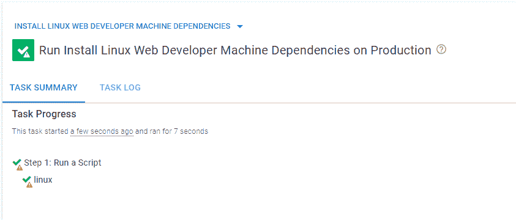
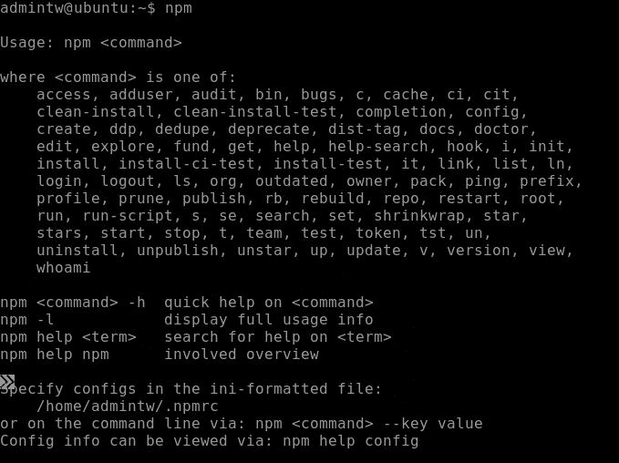
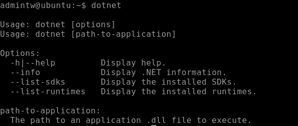

# 用 Octopus Runbooks 配置 Linux 服务器- Octopus Deploy

> 原文：<https://octopus.com/blog/configuring-linux-servers-with-runbooks>

当设置 Linux 服务器时，您必须根据您的需要配置系统。您可以将服务器用于 web 开发、系统管理、数据科学等等。每个用例都有不同的配置要求，手动配置这些服务器可能会很繁琐。

使用 Octopus Runbooks，您可以创建一个可重复的、自动的过程来配置您的 Linux 服务器，并且它可以适应不同的配置需求。

在这篇文章中，我使用 runbook 配置了一个 Linux 服务器，以指定特定任务所需的所有依赖项。可以保存并导出该操作手册，以供未来具有相同要求的服务器使用。

## 先决条件

要跟进，您需要:

## 在 Azure 中创建 Linux 服务器

Microsoft Azure 是一个云计算平台，用于创建虚拟机、web 应用程序和其他基于云的资源。我们使用 Azure 为我们的 runbook 示例创建一个 Linux 服务器。

在 Azure 主页上，导航到**创建资源**，然后 **Ubuntu Server 20.04 LTS** ，然后**创建**。

选择链接订阅并创建新的资源组。给服务器一个名称。在 **Administrator account** 下，生成一个 SSH 公钥或密码，供以后使用。选择**查看+创建**接受默认设置。

完成后，选择**转到资源**。点击**连接，堡垒**连接到服务器。您需要输入之前的 SSH 密钥或密码。如果这是你第一次设置堡垒，点击**部署堡垒**，等待它完成设置。

## 在 Linux 服务器上安装 Octopus 触手

Bastion 连接到 Linux 服务器后，您会看到一个 Bash shell。您设置了一个 Octopus 触手来与运行 runbook 的 Octopus 实例通信。

运行以下命令安装触手:

```
 sudo apt-key adv --fetch-keys https://apt.octopus.com/public.key

sudo add-apt-repository "deb https://apt.octopus.com/ stretch main"

# for Raspbian use

# sh -c "echo 'deb https://apt.octopus.com/ buster main' >> /etc/apt/sources.list"

sudo apt-get update

sudo apt-get install tentacle 
```

触手需要与您的 Octopus 实例通信，因此您需要提供触手的密钥进行身份验证。

在你的 Octopus 实例中，点击**你的个人资料**，然后**个人资料**，然后**我的 API 密匙**，以及**新 API 密匙**。给密钥命名并确保保存它，因为它只出现一次。

通过运行以下命令，在 Linux 服务器上配置触手:

```
 /opt/octopus/tentacle/configure-tentacle.sh 
```

安装脚本会询问您一系列问题。请确保指定以下参数:

1.  **触手实例的名称(默认触手):**按回车键接受默认值
2.  **你想配置哪种触手:** 1)监听或 2)轮询(默认 1): `2`
3.  您希望触手在哪里存储日志文件？(/etc/octopus): 按回车键接受默认值
4.  您希望触手将应用程序安装到哪里？(/home/Octopus/Applications):按回车键接受默认值
5.  **Octopus 服务器 URL(例如 https://octopus-server):** 您的 Octopus 实例的 URL
6.  **选择验证方法:1) API-Key 或 2)用户名和密码(默认为 1):** 1
7.  **API-Key:** 输入之前配置的 API key
8.  **选择您想要设置的触手类型:1)部署目标或 2)工作器(默认为 1):** 1
9.  **你想在哪个空间注册这个触手？(默认值):**按回车键接受默认值
10.  你想用什么名字注册这个触手？按回车键接受默认值
11.  **输入该触手的环境(用逗号分隔):**指定 Octopus 实例的环境
12.  **输入该触手的角色(用逗号分隔):**为触手指定一个角色，例如 Linux(稍后将在操作手册中使用)
13.  按下**回车**继续

### 确认触手连接

你通过导航到**基础设施**，然后**部署目标**来确认你的触手已经连接到 Octopus。这里您可以看到您连接的部署目标。

[](#)

## 在 Octopus 中设置操作手册

创建 Linux 服务器，安装并连接触手之后，就可以创建 runbook 了。该操作手册为 web 开发用例建立了一个开发环境。其他用例需要不同的配置设置。当 web 开发人员需要设置服务器时，操作人员可以运行 runbook。

### 创建操作手册

1.  通过转到**项目**，然后**添加项目**，创建一个项目来托管运行手册。
2.  在您的项目中，转到**运行手册**，然后**添加运行手册**，然后**处理**，然后**添加步骤**，然后**脚本**，然后**运行脚本**，最后**添加**。
3.  在角色中目标的**下，添加您在触手设置脚本中指定的角色。**
4.  指定一个 Bash 脚本并添加以下代码:

```
 apt update

apt upgrade

apt install -y build-essential

apt install -y curl

apt-get install -y git-core

apt-get install -y nodejs

apt-get install -y npm 
```

5.  点击**保存**和**运行**。

然后你会看到一个成功的结果。

【T2 

转到 Linux 服务器并运行`npm`命令来确认安装。

[](#)

## 创建不同的配置

让我们使用一个简单的。网络配置。

创建另一个 Linux 服务器，按照上面的步骤创建另一个带有 Octopus 触手的 runbook。

这一次，在步骤 4 中，添加以下代码:

```
 wget https://packages.microsoft.com/config/ubuntu/21.04/packages-microsoft-prod.deb -O packages-microsoft-prod.deb

sudo dpkg -i packages-microsoft-prod.deb

rm packages-microsoft-prod.deb

sudo apt-get update; \

sudo apt-get install -y apt-transport-https && \

sudo apt-get update && \

sudo apt-get install -y dotnet-sdk-6.0 
```

运行操作手册来配置服务器

[](#)

转到 Linux 服务器并运行`dotnet`命令来确认安装。

[](#)

这个工作流程演示了 runbooks 可以配置 Linux 服务器。您创建了两个操作手册，一个将 web 开发配置应用到服务器，另一个使用. NET 配置来配置服务器。

您可以根据需要为任意多的配置创建操作手册，确保每次创建时每个配置都是一致和自动的。

## 结论

配置服务器可能是一个繁琐的手动过程。通常，一台服务器有多种配置要求。为了帮助解决这个问题，Octopus Runbooks 提供了一种可重复的自动化方式来配置服务器。

Runbooks 可以满足特定的配置需求，并在需要时触发。操作手册的可重复特性在您的组织基础设施中引入了一致性。Runbooks 还减少了系统管理员的工作量，使他们可以专注于其他任务。

要进一步了解 Octopus Runbooks 如何帮助您满足部署需求，[请联系我们的客户成功团队](mailto:customersuccess@octopus.com)。

阅读我们的 [Runbooks 系列](https://octopus.com/blog/tag/Runbooks%20Series)的其余部分。

愉快的部署！