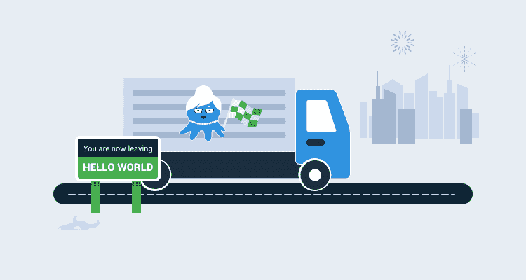
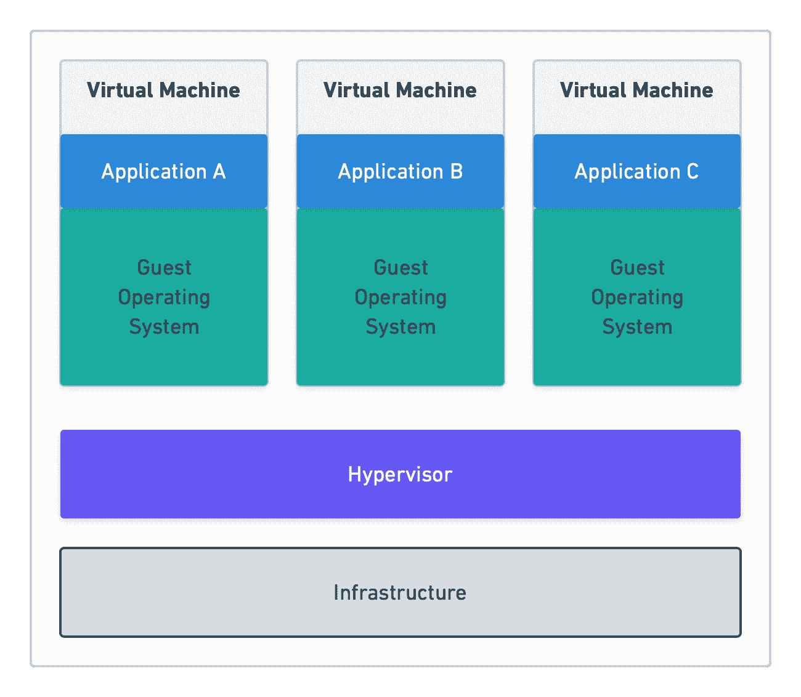
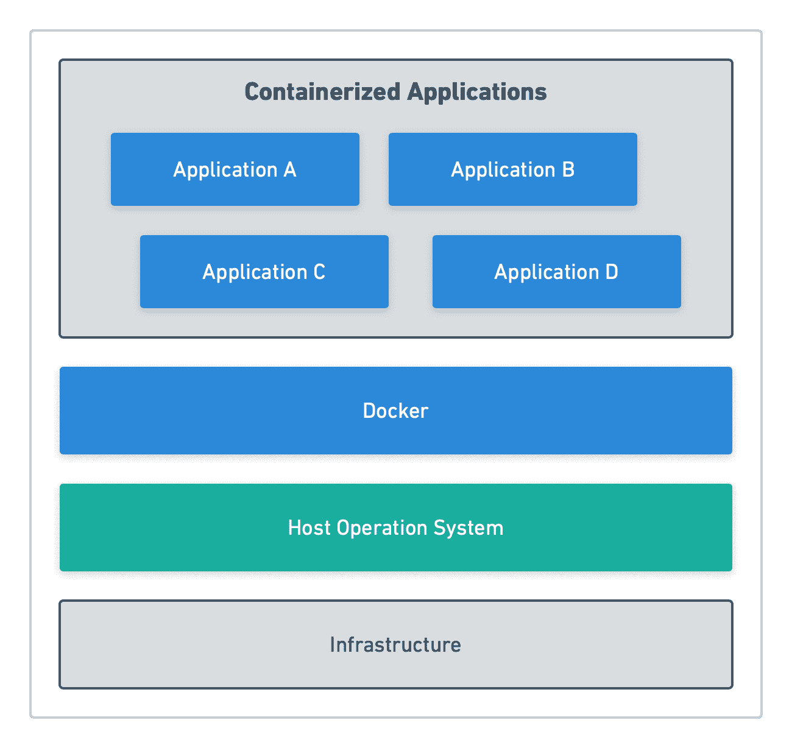
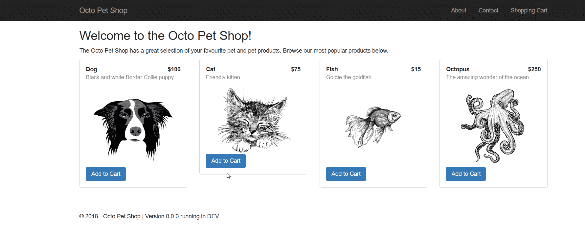

# 超越 Hello World:容器化现实世界的 web 应用程序——Octopus Deploy

> 原文：<https://octopus.com/blog/containerize-a-real-world-web-app>

[](#)

Docker 容器和 Kubernetes 是您 DevOps 工具箱中的优秀技术。这个**超越 Hello World** 博客系列涵盖了如何在现实应用中使用它们。

* * *

设计在容器中运行的应用程序已经变得非常流行，但是从哪里开始呢，如何使现有的应用程序与容器兼容呢？

在这篇文章中，我的目标是揭开容器化应用程序的含义。

## 什么是集装箱，什么是集装箱化？

与虚拟机(VM)类似，容器有自己的 RAM、CPU 和文件系统。然而，容器的许多基本功能依赖于主机操作系统(OS ),这使它们变得轻量级和可移植。当虚拟机需要安装自己的操作系统和应用程序的所有专用组件时，容器会将应用程序运行所需的组件捆绑到所谓的`image`中。这些图像是完全独立且不可变的，这意味着在它们的生命周期中不能被修改。如果需要对容器进行更新，任何正在运行的实例都必须在被容器的新版本替换之前销毁。如果容器需要保留任何数据(如数据库)，这可能是一个问题；但是，有一些方法可以在容器被销毁时保存数据。

## Docker 是什么，它与虚拟机相比如何？

最流行的容器技术是 Docker。Docker 是安装在 Windows 或 Linux 上的引擎，它使用操作系统级虚拟化来运行容器。在撰写本文时，容器是为 Windows 或 Linux 构建的，并且不是跨平台的。

为了说明虚拟机和容器之间的区别，请考虑下面的图表。首先，让我们看看虚拟机(管理程序)架构。

注意:虚拟机管理程序是一种运行 Windows Hyper-V 或 VMWare ESXi 等虚拟机的技术。

[](#)

在上图中，每个虚拟机和虚拟机管理程序都有自己的操作系统，在某种程度上独立工作(除了虚拟机需要虚拟机管理程序才能运行之外)。)然后将应用程序部署到虚拟机，并使用虚拟硬件(网络、RAM、CPU 等)提供服务...

有了 Docker，就不再需要虚拟机管理程序，容器通过 Docker 引擎直接在主机操作系统之外运行:

[](#)

### Docker 桌面

Docker 桌面是一个免费的工具，你可以从 Docker 下载，用于本地开发。Docker Desktop 在您的本地机器上创建一个 VM，您可以使用它从您的主机(即 Docker 主机)与 Docker 引擎进行交互。除了 Docker 引擎，Docker 桌面还允许您:

*   在 Windows 和 Linux 容器之间切换。
*   运行 Docker 编写。
*   运行本地版本的 Kubernetes。

## 创建 Dockerfile 文件

Docker 文件包含 Docker 构建容器映像所需的指令。在大多数情况下，映像是从基本映像构建的，包含运行容器所需的最少组件，如。NET Core SDK。

让我们以 [OctoPetShop](https://github.com/OctopusSamples/OctoPetShop) 为例。OctoPetShop 是一个用。NET 核心，包含三个主要组件:

*   一个 web 前端。
*   产品网络服务。
*   购物车 web 服务。

它也使用一个数据库，但是我们将在这篇文章的后面讨论。

为了将 OctoPetShop 前端构建为一个容器，我们定义了一个 docker 文件，如下所示:

```
FROM mcr.microsoft.com/dotnet/core/sdk:2.1

RUN mkdir /src
WORKDIR /src
ADD . /src
RUN dotnet restore
RUN ["dotnet", "build", "--configuration", "release"]

EXPOSE 5000
EXPOSE 5001

ENV ASPNETCORE_URLS="http://+:5000;https://+:5001"
ENV ASPNETCORE_ENVIRONMENT="Production"

ENTRYPOINT [ "dotnet", "run", "--no-launch-profile" ] 
```

值得注意的是，docker 文件中的每一行都构建了一个新的映像，使用前一个命令的映像作为基础。

让我们仔细看看 dockerfile 示例中的每一行。

```
FROM mcr.microsoft.com/dotnet/core/sdk:2.1 
```

dockerfile 示例的`FROM`部分告诉 Docker 什么是基本图像。对于 OctoPetShop 前端(以及产品服务、购物车服务和数据库)，基本映像是包含。NET Core SDK。这些基本映像是从公共存储库 [Docker Hub](https://hub.docker.com) 下载的。在构建 Docker 映像时，Docker 首先将基础映像下载到磁盘，然后缓存它。

图像名称的第一部分`mcr.microsoft.com`，是图像所属的存储库的用户名。下一部分`/dotnet/core/`是存储库内的文件夹路径，SDK 映像驻留在这里。最后一部分，`:2.1`，是图像 SDK 的标签名。这个标签是 SDK 图像与其他具有相同名称和位置的图像的区别。

```
RUN mkdir /src 
```

`RUN`是我们告诉 Docker 执行的指令。对于这一行，我们告诉 Docker 创建一个名为 src 的新目录(mkdir)。

```
WORKDIR 
```

和`RUN`一样，`WORKDIR`是另一个指令。`WORKDIR`设置运行其他命令的工作目录。

```
ADD . /SRC 
```

`ADD`指令将文件和文件夹复制到容器映像中。在这一行，我们指示 Docker 将当前目录中的所有文件和文件夹复制到我们之前创建的/src 目录中。

```
RUN dotnet restore 
```

这条指令运行`dotnet restore`命令，它将下载我们的应用程序构建所需的任何缺失的 NuGet 引用。

```
RUN ["dotnet", "build", "--configuration", "release"] 
```

任何需要多个参数的指令都要求将参数放在数组中。这里我们运行`dotnet build`命令，它在图像本身中编译我们的应用程序。

```
EXPOSE 5000 and EXPOSE 5001 
```

`EXPOSE`指令用于打开集装箱的端口。对于 OctoPetShop web 前端，我们开放端口 5000 和 5001。

```
ENV ASPNETCORE_URLS="http://+:5000;https://+:5001" and ENV ASPNETCORE_ENVIRONMENT="Production" 
```

`ENV`是*环境变量*的简称。我们需要告诉我们的 Kestrel 服务器监听哪个地址/端口。使用环境变量`ASPNETCORE_URLS`可以覆盖地址/端口。我们也可以用`ASPNETCORE_ENVIRONMENT`覆盖环境名。

```
ENTRYPOINT [ "dotnet", "run", "--no-launch-profile" ] 
```

`ENTRYPOINT`命令在容器启动时运行。就像我们的`RUN`命令一样，如果命令需要多个参数，它们需要封装在一个数组中。

**entry point vs CMD**
Docker 还有一个类似于`ENTRYPOINT`的命令叫做`CMD`经常会引起混淆。`ENTRYPOINT`配置一个容器作为可执行文件运行，而`CMD`设置默认命令和/或参数，当容器运行时，可以从命令行覆盖这些命令和/或参数。

## 使用 Docker build 将您的 web 应用程序构建为映像

将应用程序构建成映像的命令是`docker build`。当您运行 Docker 构建时，您需要告诉 Docker Docker 文件在哪里。如果 dockerfile 存在于当前目录中，那么运行构建命令`docker build .`。用 Docker 用户名/应用程序名来标记您的构建是一种常见的做法。要标记您的构建，只需将`-t username/application name`添加到构建命令中:

```
docker build . -t octopussamples/octopetshop-web 
```

当对 OctoPetShop 前端发出 Docker build 命令时，您将收到以下输出(GUIDs 会有所不同):

```
Sending build context to Docker daemon  4.439MB
Step 1/11 : FROM mcr.microsoft.com/dotnet/core/sdk:2.1
 ---> bf77a711b92c
Step 2/11 : RUN mkdir /src    
 ---> Using cache
 ---> e590281bfd90
Step 3/11 : WORKDIR /src      
 ---> Using cache
 ---> 3a5646783c8c
Step 4/11 : ADD . /src        
 ---> Using cache
 ---> 5ca49131b227
Step 5/11 : RUN dotnet restore
 ---> Using cache
 ---> 2c231113eef0
Step 6/11 : RUN ["dotnet", "build", "--configuration", "release"]
 ---> Using cache
 ---> a2bbe5911620
Step 7/11 : EXPOSE 5000
 ---> Using cache
 ---> 759d97686c25
Step 8/11 : EXPOSE 5001
 ---> Using cache
 ---> d973bb954156
Step 9/11 : ENV ASPNETCORE_URLS="http://+:5000;https://+:5001"
 ---> Using cache
 ---> f32adcc6f8a1
Step 10/11 : ENV ASPNETCORE_ENVIRONMENT="Production"
 ---> Using cache
 ---> 3168d6f82375
Step 11/11 : ENTRYPOINT [ "dotnet", "run", "--no-launch-profile" ]
 ---> Using cache
 ---> fc176971f626
Successfully built fc176971f626
Successfully tagged octopussamples/octopetshop-web:latest 
```

我们刚刚成功地集装箱化了 OctoPetShop 前端！

## 使用 Docker build 将 web 服务和数据库项目构建为 Docker 映像

OctoPetShop 包含两个 web 服务和一个数据库项目，我们需要将它们打包成 Docker 图像。封装这些组件的过程反映了前端的过程，您可以在 [OctoPetShop repo](https://github.com/OctopusSamples/OctoPetShop) 中找到 dockerfile 示例文件。

数据库项目使用 [DbUp](https://dbup.github.io/) 并包含脚本(数据库迁移)来创建我们的数据库并为其播种数据。唯一缺少的是数据库服务器。幸运的是，微软为 SQL Server 2017 制作了一个容器映像:`microsoft/mssql-server-linux:2017-latest`。

## 使用 Docker run 运行您的容器化应用程序

现在我们已经将所有组件整齐地放入容器中，我们需要让它们启动并运行。为了启动我们的容器，我们使用了`docker run <image>`命令。使用`EXPOSE`指令打开的任何端口都需要映射到主机端口，以便容器可以访问。这是使用 Docker run 命令的`-p`开关完成的，如果需要为一个容器映射多个端口，可以多次指定。`-e`开关将把环境变量传递给容器。

我们的 OctoPetShop web 前端需要知道产品服务和购物车服务的后端服务的地址。这些值存储在应用程序的 appsettings.json 文件中；但是，我们已经对应用程序进行了编码，以便在环境变量存在时覆盖这些变量。

为了让我们的整个解决方案正常工作(包括将数据库服务器作为容器运行)，我们运行以下命令:

```
docker run -p 1433:1433 -e SA_PASSWORD="SomeGoodPassword" -e ACCEPT_EULA="Y" -d microsoft/mssql-server-linux:2017-latest

docker run -p 5010:5000 -p 5001:5001 -d -e ProductServiceBaseUrl=http://localhost:5011 -e ShoppingCartServiceBaseUrl=http://localhost:5012 -d octopussamples/octopetshop-web

docker run -p 5011:5011 -e OPSConnectionString="Data Source=172.17.0.2;Initial Catalog=OctoPetShop; User ID=sa; Password=SomeGoodPassword" -d octopussamples/octopetshop-productservice

docker run -p 5012:5012 -e OPSConnectionString="Data Source=172.17.0.2;Initial Catalog=OctoPetShop; User ID=sa; Password=SomeGoodPassword" -d octopussamples/octopetshop-shoppingcartservice

docker run -e DbUpConnectionString="Data Source=172.17.0.2;Initial Catalog=OctoPetShop; User ID=sa; Password=SomeGoodPassword" -d octopussamples/octopetshop-database 
```

`172.17.0.2`的 IP 地址是 SQL Server 容器被分配的地址。

随着容器的运行，我们可以导航到 http://localhost:5000。OctoPetShop 自动重定向到 https 地址(使用端口 5001)，并使用自签名证书。你很可能会得到一个警告，说它不安全。在这种情况下，我们可以安全地忽略警告。当页面加载时，您应该会看到:

【T2 

## 使用 Docker compose 运行您的容器化应用程序

一个接一个地运行 Docker 命令会变得非常乏味。为了解决这个问题，Docker 创建了 Docker compose。通过一个 Docker compose YAML 文件，您可以构建所有的容器，设置它们的端口，创建一个供它们使用的本地网络，并为每个容器定义环境变量。在下面的 YAML 代码中，我们设置了所有的容器，类似于上面的 Docker run 命令。我们没有将主机端口映射到容器端口，而是创建了一个名为`container_net`的 Docker 网络。对于 container_net 网络，需要映射到主机的唯一端口是 web 前端端口(5000 和 5001)，其余端口只能由其他容器访问:

```
version: '3'
services:
  sql-server:
    container_name: sql-server-db
    image: mcr.microsoft.com/mssql/server:2019-latest
    ports:
      - "1433:1433"
    environment:
      SA_PASSWORD: "SomeGoodPassword"
      ACCEPT_EULA: "Y"
  productservice:
    environment:
      - OPSConnectionString=Data Source=sql-server;Initial Catalog=OctoPetShop; User ID=sa; Password=SomeGoodPassword
    build:
      dockerfile: dockerfile
      context: ./OctopusSamples.OctoPetshop.Productservice
    ports:
      - '5011:5011'
      - '5014:5014'
    depends_on: 
      - "database"
  octopetshop:
    environment:
      - ProductServiceBaseUrl=http://productservice:5011/
      - ShoppingCartServiceBaseUrl=http:/shoppingcartservice:5012
    build:
      dockerfile: dockerfile
      context: ./OctopusSamples.OctoPetShop.Web
    ports:
      - '5000:5000'
      - '5001:5001'
    depends_on: 
      - "shoppingcartservice"
      - "productservice"
  shoppingcartservice:
    environment:
      - OPSConnectionString=Data Source=sql-server;Initial Catalog=OctoPetShop; User ID=sa; Password=SomeGoodPassword
    build:
      dockerfile: dockerfile
      context: ./OctopusSamples.OctoPetShop.ShoppingCartService
    ports:
      - '5012:5012'
      - '5013:5013'
    depends_on: 
      - "database"
  database:
    environment:
      - DbUpConnectionString=Data Source=sql-server;Initial Catalog=OctoPetShop; User ID=sa; Password=SomeGoodPassword
    build:
      dockerfile: dockerfile
      context: ./OctopusSamples.OctoPetShop.Database
    depends_on: 
      - "sql-server" 
```

与之前对每个容器使用 Docker run 的方法不同，我们可以通过运行`docker-compose up`来启动我们的整个解决方案，这需要更少的输入。运行 Docker compose 还会向我们显示容器运行时的输出:

```
Starting octopetshop_database_1            ... done                                                                     Starting octopetshop_octopetshop_1         ... done                                                                     Recreating sql-server-db                   ... done                                                                     Starting octopetshop_shoppingcartservice_1 ... done                                                                     Starting octopetshop_productservice_1      ... done                                                                     Attaching to octopetshop_octopetshop_1, octopetshop_shoppingcartservice_1, octopetshop_productservice_1, sql-server-db, octopetshop_database_1
database_1             | Master ConnectionString => Data Source=192.168.1.4;Initial Catalog=master;User ID=sa;Password=********************
shoppingcartservice_1  | Hosting environment: Production
shoppingcartservice_1  | Content root path: /src
shoppingcartservice_1  | Now listening on: http://[::]:5012
shoppingcartservice_1  | Now listening on: https://[::]:5013
shoppingcartservice_1  | Application started. Press Ctrl+C to shut down.
octopetshop_1          | Hosting environment: Production
octopetshop_1          | Content root path: /src
octopetshop_1          | Now listening on: http://[::]:5000
octopetshop_1          | Now listening on: https://[::]:5001
octopetshop_1          | Application started. Press Ctrl+C to shut down.
productservice_1       | Hosting environment: Production
productservice_1       | Content root path: /src
productservice_1       | Now listening on: http://[::]:5011
productservice_1       | Now listening on: https://[::]:5014
productservice_1       | Application started. Press Ctrl+C to shut down.
sql-server-db          | 2019-11-07 11:44:15.07 Server      Setup step is copying system data file 'C:\templatedata\master.mdf' to '/var/opt/mssql/data/master.mdf'.
2019-11-07 11:44:15.14 Server      Did not find an existing master data file /var/opt/mssql/data/master.mdf, copying the missing default master and other system database files. If you have moved the database location, but not moved the database files, startup may fail. To repair: shutdown SQL Server, move the master database to configured location, and restart.
2019-11-07 11:44:15.14 Server      Setup step is copying system data file 'C:\templatedata\mastlog.ldf' to '/var/opt/mssql/data/mastlog.ldf'.
2019-11-07 11:44:15.15 Server      Setup step is copying system data file 'C:\templatedata\model.mdf' to '/var/opt/mssql/data/model.mdf'.
2019-11-07 11:44:15.16 Server      Setup step is copying system data file 'C:\templatedata\modellog.ldf' to '/var/opt/mssql/data/modellog.ldf'.
2019-11-07 11:44:15.17 Server      Setup step is copying system data file 'C:\templatedata\msdbdata.mdf' to '/var/opt/mssql/data/msdbdata.mdf'.
2019-11-07 11:44:15.21 Server      Setup step is copying system data file 'C:\templatedata\msdblog.ldf' to '/var/opt/mssql/data/msdblog.ldf'.
2019-11-07 11:44:15.29 Server      Microsoft SQL Server 2017 (RTM-CU13) (KB4466404) - 14.0.3048.4 (X64)
        Nov 30 2018 12:57:58
        Copyright (C) 2017 Microsoft Corporation
        Developer Edition (64-bit) on Linux (Ubuntu 16.04.5 LTS)
2019-11-07 11:44:15.29 Server      UTC adjustment: 0:00
2019-11-07 11:44:15.29 Server      (c) Microsoft Corporation.
2019-11-07 11:44:15.29 Server      All rights reserved.
2019-11-07 11:44:15.29 Server      Server process ID is 4120.
2019-11-07 11:44:15.30 Server      Logging SQL Server messages in file '/var/opt/mssql/log/errorlog'.
2019-11-07 11:44:15.30 Server      Registry startup parameters:
         -d /var/opt/mssql/data/master.mdf
         -l /var/opt/mssql/data/mastlog.ldf
         -e /var/opt/mssql/log/errorlog
2019-11-07 11:44:15.31 Server      SQL Server detected 1 sockets with 1 cores per socket and 2 logical processors per socket, 2 total logical processors; using 2 logical processors based on SQL Server licensing. This is an informational message; no user action is required.
2019-11-07 11:44:15.31 Server      SQL Server is starting at normal priority base (=7). This is an informational message only. No user action is required.
2019-11-07 11:44:15.31 Server      Detected 1600 MB of RAM. This is an informational message; no user action is required.
2019-11-07 11:44:15.31 Server      Using conventional memory in the memory manager.
2019-11-07 11:44:15.46 Server      Buffer pool extension is already disabled. No action is necessary.
2019-11-07 11:44:15.61 Server      InitializeExternalUserGroupSid failed. Implied authentication will be disabled.
2019-11-07 11:44:15.62 Server      Implied authentication manager initialization failed. Implied authentication will be disabled.
2019-11-07 11:44:15.63 Server      Successfully initialized the TLS configuration. Allowed TLS protocol versions are ['1.0 1.1 1.2']. Allowed TLS ciphers are ['ECDHE-ECDSA-AES128-GCM-SHA256:ECDHE-ECDSA-AES256-GCM-SHA384:ECDHE-RSA-AES128-GCM-SHA256:ECDHE-RSA-AES256-GCM-SHA384:ECDHE-ECDSA-AES128-SHA256:ECDHE-ECDSA-AES256-SHA384:ECDHE-ECDSA-AES256-SHA:ECDHE-ECDSA-AES128-SHA:AES256-GCM-SHA384:AES128-GCM-SHA256:AES256-SHA256:AES128-SHA256:AES256-SHA:AES128-SHA:!DHE-RSA-AES256-GCM-SHA384:!DHE-RSA-AES128-GCM-SHA256:!DHE-RSA-AES256-SHA:!DHE-RSA-AES128-SHA'].
2019-11-07 11:44:15.66 Server      The maximum number of dedicated administrator connections for this instance is '1'
2019-11-07 11:44:15.66 Server      Node configuration: node 0: CPU mask: 0x0000000000000003:0 Active CPU mask: 0x0000000000000003:0\. This message provides a description of the NUMA configuration for this computer. This is an informational message only. No user action is required.
2019-11-07 11:44:15.67 Server      Using dynamic lock allocation.  Initial allocation of 2500 Lock blocks and 5000 Lock Owner blocks per node.  This is an informational message only.  No user action is required.
2019-11-07 11:44:15.68 Server      In-Memory OLTP initialized on lowend machine.
2019-11-07 11:44:15.75 Server      Database Instant File Initialization: enabled. For security and performance considerations see the topic 'Database Instant File Initialization' in SQL Server Books Online. This is an informational message only. No user action is required.
ForceFlush is enabled for this instance.
2019-11-07 11:44:15.76 Server      Query Store settings initialized with enabled = 1,
2019-11-07 11:44:15.77 Server      Software Usage Metrics is disabled.
2019-11-07 11:44:15.78 spid7s      Starting up database 'master'.
ForceFlush feature is enabled for log durability.
2019-11-07 11:44:15.95 spid7s      The tail of the log for database master is being rewritten to match the new sector size of 4096 bytes.  3072 bytes at offset 418816 in file /var/opt/mssql/data/mastlog.ldf will be written.
2019-11-07 11:44:16.13 spid7s      Converting database 'master' from version 862 to the current version 869.
2019-11-07 11:44:16.15 spid7s      Database 'master' running the upgrade step from version 862 to version 863.
2019-11-07 11:44:16.20 spid7s      Database 'master' running the upgrade step from version 863 to version 864.
2019-11-07 11:44:16.28 spid7s      Database 'master' running the upgrade step from version 864 to version 865.
2019-11-07 11:44:16.31 spid7s      Database 'master' running the upgrade step from version 865 to version 866.
2019-11-07 11:44:16.34 spid7s      Database 'master' running the upgrade step from version 866 to version 867.
2019-11-07 11:44:16.36 spid7s      Database 'master' running the upgrade step from version 867 to version 868.
2019-11-07 11:44:16.39 spid7s      Database 'master' running the upgrade step from version 868 to version 869.
2019-11-07 11:44:16.74 spid7s      Resource governor reconfiguration succeeded.
2019-11-07 11:44:16.75 spid7s      SQL Server Audit is starting the audits. This is an informational message. No user action is required.
2019-11-07 11:44:16.77 spid7s      SQL Server Audit has started the audits. This is an informational message. No user action is required.
2019-11-07 11:44:16.84 spid7s      SQL Trace ID 1 was started by login "sa".
2019-11-07 11:44:16.87 spid19s     Password policy update was successful.
2019-11-07 11:44:16.88 spid7s      Server name is '88ca920a03ae'. This is an informational message only. No user action is required.
2019-11-07 11:44:16.89 spid22s     Always On: The availability replica manager is starting. This is an informational message only. No user action is required.
2019-11-07 11:44:16.90 spid7s      Starting up database 'msdb'.
2019-11-07 11:44:16.90 spid22s     Always On: The availability replica manager is waiting for the instance of SQL Server to allow client connections. This is an informational message only. No user action is required.
2019-11-07 11:44:16.91 spid11s     Starting up database 'mssqlsystemresource'.
2019-11-07 11:44:16.91 spid11s     The resource database build version is 14.00.3048\. This is an informational message only. No user action is required.
2019-11-07 11:44:16.93 spid11s     Starting up database 'model'.
2019-11-07 11:44:17.12 spid7s      The tail of the log for database msdb is being rewritten to match the new sector size of 4096 bytes.  512 bytes at offset 306688 in file /var/opt/mssql/data/MSDBLog.ldf will be written.
2019-11-07 11:44:17.20 spid7s      Converting database 'msdb' from version 862 to the current version 869.
2019-11-07 11:44:17.21 spid7s      Database 'msdb' running the upgrade step from version 862 to version 863.
2019-11-07 11:44:17.21 spid19s     A self-generated certificate was successfully loaded for encryption.
2019-11-07 11:44:17.22 spid11s     The tail of the log for database model is being rewritten to match the new sector size of 4096 bytes.  2048 bytes at offset 75776 in file /var/opt/mssql/data/modellog.ldf will be written.
2019-11-07 11:44:17.23 spid19s     Server is listening on [ 'any' <ipv4> 1433].
2019-11-07 11:44:17.24 Server      Server is listening on [ 127.0.0.1 <ipv4> 1434].
2019-11-07 11:44:17.24 Server      Dedicated admin connection support was established for listening locally on port 1434.
2019-11-07 11:44:17.26 spid19s     SQL Server is now ready for client connections. This is an informational message; no user action is required.
2019-11-07 11:44:17.28 spid11s     Converting database 'model' from version 862 to the current version 869.
2019-11-07 11:44:17.29 spid11s     Database 'model' running the upgrade step from version 862 to version 863.
2019-11-07 11:44:17.33 spid7s      Database 'msdb' running the upgrade step from version 863 to version 864.
2019-11-07 11:44:17.38 spid11s     Database 'model' running the upgrade step from version 863 to version 864.
2019-11-07 11:44:17.39 spid7s      Database 'msdb' running the upgrade step from version 864 to version 865.
2019-11-07 11:44:17.41 spid11s     Database 'model' running the upgrade step from version 864 to version 865.
2019-11-07 11:44:17.42 spid7s      Database 'msdb' running the upgrade step from version 865 to version 866.
2019-11-07 11:44:17.44 spid11s     Database 'model' running the upgrade step from version 865 to version 866.
2019-11-07 11:44:17.44 spid7s      Database 'msdb' running the upgrade step from version 866 to version 867.
2019-11-07 11:44:17.47 spid11s     Database 'model' running the upgrade step from version 866 to version 867.
2019-11-07 11:44:17.48 spid7s      Database 'msdb' running the upgrade step from version 867 to version 868.
2019-11-07 11:44:17.52 spid11s     Database 'model' running the upgrade step from version 867 to version 868.
2019-11-07 11:44:17.53 spid7s      Database 'msdb' running the upgrade step from version 868 to version 869.
2019-11-07 11:44:17.59 spid11s     Database 'model' running the upgrade step from version 868 to version 869.
2019-11-07 11:44:17.75 spid11s     Polybase feature disabled.
2019-11-07 11:44:17.75 spid11s     Clearing tempdb database.
2019-11-07 11:44:18.16 spid11s     Starting up database 'tempdb'.
2019-11-07 11:44:18.35 spid11s     The tempdb database has 1 data file(s).
2019-11-07 11:44:18.38 spid22s     The Service Broker endpoint is in disabled or stopped state.
2019-11-07 11:44:18.38 spid22s     The Database Mirroring endpoint is in disabled or stopped state.
2019-11-07 11:44:18.39 spid22s     Service Broker manager has started.
2019-11-07 11:44:18.77 spid51      Starting up database 'OctoPetShop'.
2019-11-07 11:44:18.92 spid51      Parallel redo is started for database 'OctoPetShop' with worker pool size [1].
2019-11-07 11:44:18.94 spid51      Parallel redo is shutdown for database 'OctoPetShop' with worker pool size [1].
database_1             | Created database OctoPetShop
2019-11-07 11:44:19.12 spid7s      Recovery is complete. This is an informational message only. No user action is required.
2019-11-07 11:44:19.14 spid17s     The default language (LCID 0) has been set for engine and full-text services.
database_1             | Beginning database upgrade
database_1             | Checking whether journal table exists..
database_1             | Journal table does not exist
database_1             | Executing Database Server script 'OctopusSamples.OctoPetShop.Database.scripts.0001-create-tables.sql'
database_1             | Checking whether journal table exists..
database_1             | Creating the [SchemaVersions] table
database_1             | The [SchemaVersions] table has been created
database_1             | Executing Database Server script 'OctopusSamples.OctoPetShop.Database.scripts.0002-seed-data.sql'
database_1             | Upgrade successful
database_1             | Success!
octopetshop_database_1 exited with code 0 
```

## 将容器并入 CI/CD 管道

到目前为止，我们已经在命令行上做了所有的事情，而不是以任何自动化的方式(除了 Docker compose)。下一个合乎逻辑的步骤是将容器映像的构建和上传交给构建服务器。诸如微软 [Azure DevOps](https://dev.azure.com) 、JetBrains [TeamCity](https://www.jetbrains.com/teamcity/) 、 [Jenkins](https://jenkins.io) 和 Atlassian [Bamboo](https://www.atlassian.com/software/bamboo) 等流行的构建服务器都有内置的或可下载插件提供的步骤，这些步骤将构建您的 Docker 映像并将它们推送到存储库。在存储库中，您可以使用 Azure DevOps Pipelines 或 Octopus Deploy 等连续交付软件来自动将映像部署到运行 Docker 引擎或 Kubernetes 集群的机器上。

## 结论

在我完成为 OctoPetShop 创建容器的练习之前，将应用程序作为容器运行对我来说是非常神奇的。这一经历让我有信心在 Kubernetes 集群中继续运行 OctoPetShop！请继续关注那篇文章。