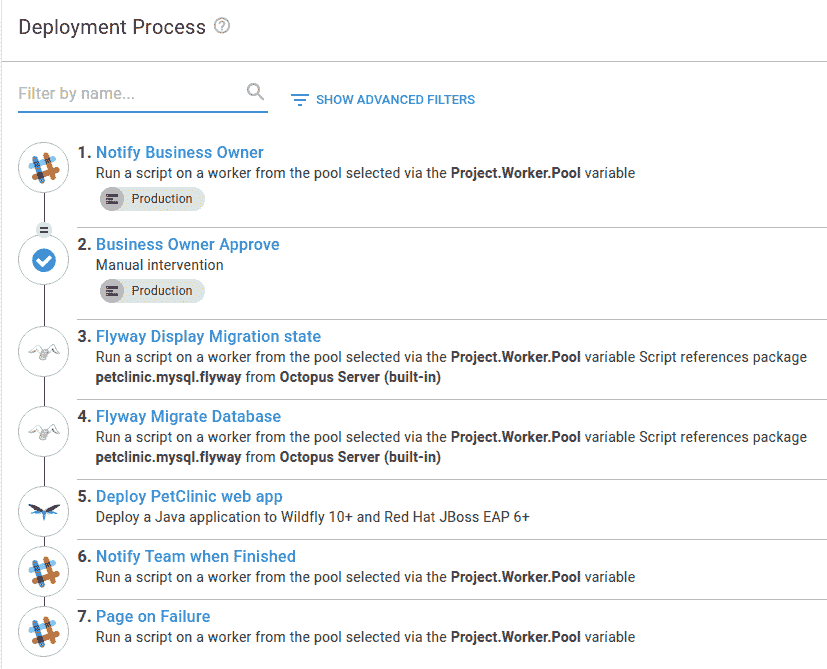
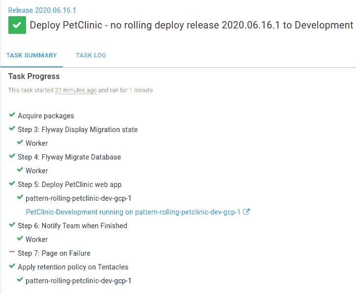
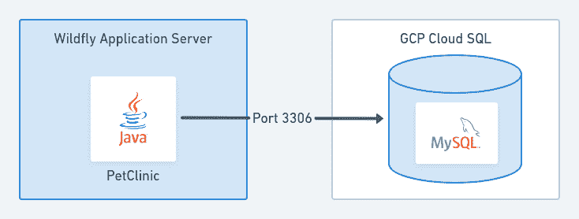
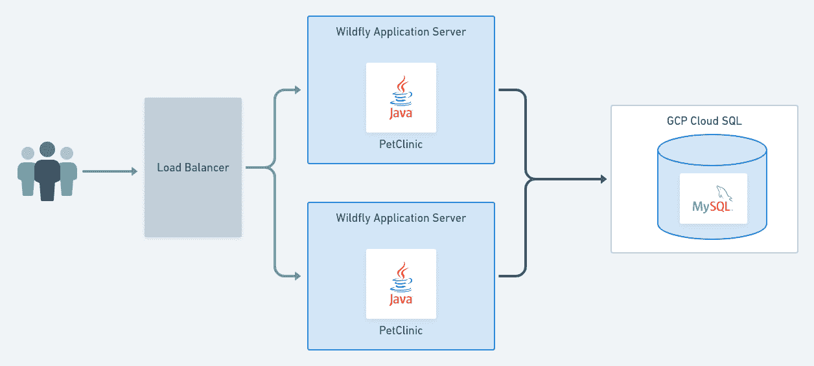
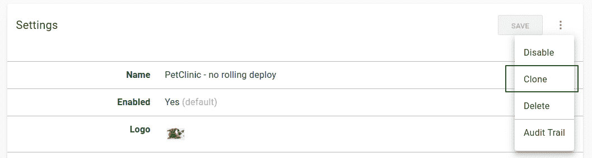
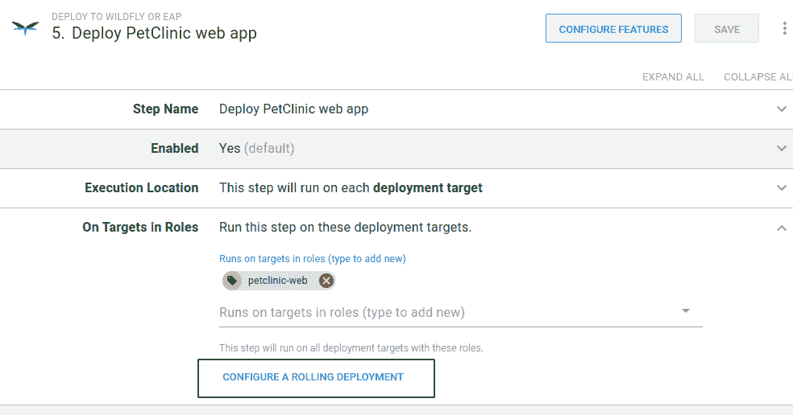
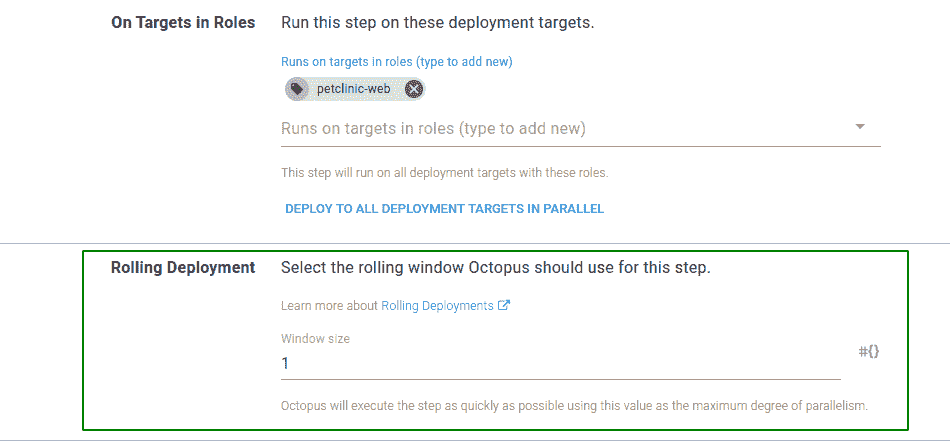
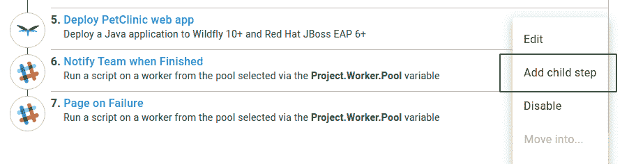
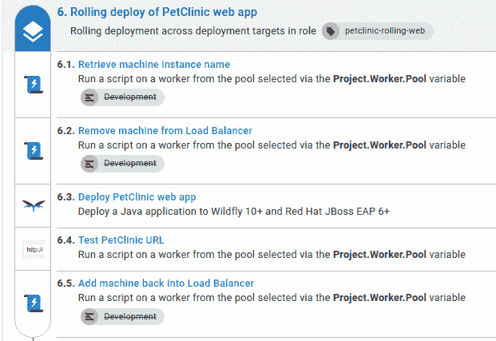
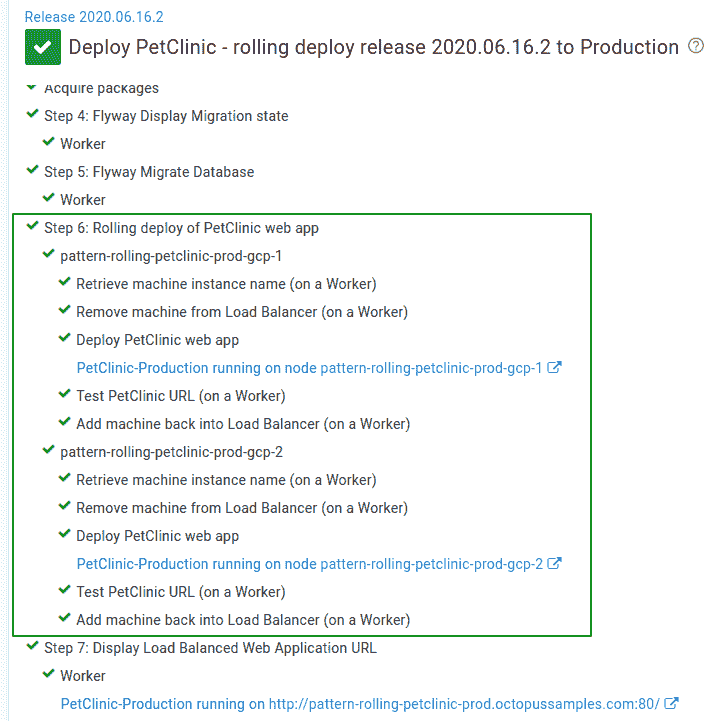

# 转换现有应用程序以使用滚动部署- Octopus Deploy

> 原文：<https://octopus.com/blog/convert-to-rolling-deployments>

[](#)

在之前的一篇文章中，我写了滚动部署模式的[好处，这是一种在部署时减少应用程序停机时间的方法。当您第一次创建应用程序时，设计一个适合这种部署模式的应用程序可能要容易得多，但是从现有的应用程序开始，如何将应用程序转换成使用滚动部署模式呢？](/blog/ultimate-guide-to-rolling-deployments)

在这篇文章中，我将向您展示如何在 Octopus 的[子步骤](https://octopus.com/docs/deployment-patterns/rolling-deployments#Rollingdeployments-Childsteps)的帮助下转换现有的应用程序以使用滚动部署模式。

## 在这篇文章中

## 应用程序

我将以 [PetClinic](https://github.com/spring-projects/spring-petclinic) 为例，将应用程序的部署过程从在 Octopus 中顺序运行部署步骤的过程转换为滚动部署过程。PetClinic 是一个用 Java 编写的示例 Spring Boot 应用程序，它有两个主要组件:

*   一个 web 前端。
*   一个数据库。

在本文中，我不会解释如何构建 PetClinic 应用程序。如果您是构建 Java 应用程序的新手，我们有许多[指南](https://octopus.com/docs/guides?application=java)，其中包括为各种工具设置 CI/CD 管道的逐步说明。

对于顺序和滚动部署流程，PetClinic 应用程序和 [MySQL](https://www.mysql.com/) 数据库都托管在 [Google Cloud](https://cloud.google.com/gcp) 中。这些示例中使用的所有基础设施，包括服务器、负载平衡器和数据库，都使用[运营手册](https://octopus.com/docs/operations-runbooks)定期重新创建。

### 一些警告

需要强调的是，这篇文章不会涵盖零停机部署所需的所有元素。它对应用程序的设置做了一些假设:

1.  数据库已经部署在高可用性配置中。有关 MySQL 高可用性的更多信息，请参考[文档](https://dev.mysql.com/doc/)。
2.  使用 [Flyway](https://flywaydb.org/) 以向后和向前兼容的方式对数据库进行更改。
3.  将单个服务器部署到时，任何必需的会话状态都将保持。

## 顺序部署流程

对于不担心应用程序停机的部署，默认情况下，Octopus 通过依次运行各个步骤来满足这一需求。

**Start trigger**
也可以配置您的部署流程，以[并行](https://octopus.com/docs/deployment-process/conditions#start-trigger)的方式运行步骤。但是，应该注意避免并行运行的步骤相互依赖的情况。

现有的 PetClinic 应用程序使用这种顺序部署技术进行建模。部署流程由许多关键步骤组成:

*   仅用于**生产**环境的[手动干预](https://octopus.com/docs/deployment-process/steps/manual-intervention-and-approvals)批准步骤。
*   Flyway DB 迁移[社区步骤模板](https://library.octopus.com/listing/flyway)显示迁移状态和应用任何新数据库更改的步骤。
*   PetClinic web 前端的部署到 [WildFly](https://wildfly.org/) 步骤。

此外，部署流程包括将消息发布到具有部署进度更新的 [Slack](https://slack.com/) 通道的步骤。

完整的部署流程如下所示:

[](#)

在 Octopus 中[创建了一个版本](https://octopus.com/docs/managing-releases#creating-a-release)之后，您可以看到一个在**开发**环境中的顺序部署实例:

[](#)

一次运行一个步骤，直到部署完成。当 **Deploy PetClinic web app** 步骤运行时，应用程序变得不可用于向用户提供请求。

也许不足为奇的是，这些部署(每个环境)中使用的基础架构如下所示:

[](#)

它包括:

*   一台 [Ubuntu](https://ubuntu.com/) 虚拟机托管 Wildfly 应用服务器。
*   一个托管在谷歌云 SQL 服务中的 MySQL 数据库。

**样本 Octopus 项目**
您可以在我们的[样本实例](https://g.octopushq.com/PatternRollingSamplePetClinicNoRollingDeploy)中看到转换为滚动部署流程之前的 PetClinic 顺序部署流程*。*

## 转换为滚动部署流程

既然我们已经看到了现有应用程序的部署过程，我们首先需要决定滚动部署过程中我们的基础设施将会是什么样子。

### 纵向扩展服务器

为了减少停机时间并满足用户的请求，我们需要增加我们使用的服务器数量。我们还需要一个负载平衡器来控制哪些服务器可用。

在前面的顺序部署示例中，我们在每个环境中有一台虚拟机。为了简单起见，我们将保持**开发**环境的基础设施和以前一样。然而，对于**测试**和**生产**环境，基础架构将如下所示:

[](#)

这包括一个*共享的*负载平衡器，这一次，每个环境中有两个应用服务器，像以前一样连接到 MySQL 数据库。

在您创建了新的服务器之后，您还需要将它们作为新的[部署目标](https://octopus.com/docs/infrastructure/deployment-targets#adding-deployment-targets)添加到 Octopus 中，并用任何适当的[目标角色](https://octopus.com/docs/octopus-concepts/target-roles)标记它们。

### 选择负载平衡器

有许多不同类型的负载平衡器，但这个滚动部署示例的一个关键要求是能够控制哪些服务器可用于服务流量。由于这个原因，并且这个例子是从 Google Cloud 运行的，我们将使用一个[网络负载平衡器](https://cloud.google.com/load-balancing/docs/network/)。作为部署过程的一部分，这提供了一种从负载均衡器中添加和删除服务器的方法，稍后我们将看到这一点。有关设置网络负载平衡器的更多信息，请参考[谷歌文档](https://cloud.google.com/load-balancing/docs/network/setting-up-network)。

在本例中，负载平衡器在**测试**和**生产**环境之间共享。为了将流量路由到正确的位置，负载平衡器使用不同的 TCP 端口来识别预期的环境。

*   端口`8080`用于去往**测试**环境的流量。
*   端口`80`用于目的地为**生产**环境的流量。

### 负载平衡器目标池

以前，用户直接在单个虚拟机上访问 PetClinic web 前端。这里，我们将专用的目标池用于测试环境和生产环境。[目标池](https://cloud.google.com/load-balancing/docs/target-pools)是一组托管在 Google Cloud 中的虚拟机实例的名称。

### 创建新项目

为了改变我们的部署过程，并保持顺序部署 PetClinic 的能力，我们需要创建一个新项目。实现这一点的方法之一是克隆现有的项目。

在现有项目中，在**设置**下，使用溢出菜单(...)并选择**克隆**:

[](#)

*   为您正在从原始项目克隆的新项目命名，检查设置，当您满意时，单击**保存**:

[T32](#)

### 转换 PetClinic 部署流程

接下来，我们将转换项目本身的部署过程。并不是所有的 PetClinic 部署过程都适合滚动部署模式，因此，我们将重点放在 PetClinic 的 web 前端。

**选择要转换的内容**
自己决定项目部署过程中的哪些元素应该转换为使用滚动部署模式是很重要的。在某些情况下，这可能会使事情*更难部署*。

#### 配置滚动部署

为了将**部署 PetCinic web app** 步骤转换为滚动部署，我们执行以下操作:

*   打开部署流程编辑器中的步骤，展开角色中目标的**部分，点击**配置滚动部署**:**

[](#)

*   在出现的**滚动展开**选项中，选择一个**窗口大小**。我选择了`1`的窗口大小，因为我们将在每个环境中最多部署两台服务器:

[](#)

*   点击**保存**更新部署步骤。

#### 添加子步骤

我们已经配置了滚动部署，但它还不是很智能。目前，该流程一次一个地将 PetClinic 部署到每个服务器，在部署时使应用程序的每个实例脱机。

我们需要向我们的滚动部署添加新的步骤，以便将 PetClinic 应用程序的新版本安全地部署到每个虚拟机，并继续向其他服务器上的用户提供流量。

这些步骤将:

1.  检索虚拟机名称。
2.  在 pet clinic 部署之前，从负载均衡器*中移除虚拟机。*
3.  在 pet clinic 部署之后，将虚拟机添加到负载均衡器*中。*
4.  测试 PetClinic web 前端是否可用。

在 Octopus 中，向滚动部署流程添加多个步骤是通过[子步骤](https://octopus.com/docs/deployment-patterns/rolling-deployments#Rollingdeployments-Childsteps)完成的。

**gcloud CLI 和授权**
下一节中用于与 Google 交互的大多数命令都利用了 [Google Cloud CLI](https://cloud.google.com/sdk/gcloud) 。要使用 g cloud CLI，你通常需要授权。有关 gcloud 授权的更多信息，请参考[文档](https://cloud.google.com/sdk/docs/authorizing)。

##### 添加新的子步骤

要添加子步骤，我们打开溢出菜单(...)对于现有的**部署 PetClinic web app** 步骤，选择**添加子步骤**:

[](#)

我们看到了**选择步骤模板**选择器，在这里我们选择所需的步骤类型。

接下来，我将介绍完成滚动部署过程所需的新的子步骤。一些脚本示例已经减少到突出关键部分所需的最少数量。

##### 检索实例名称

这个[脚本步骤](https://octopus.com/docs/deployment-examples/custom-scripts/run-a-script-step)是必需的，以便我们可以识别 Google Cloud 中托管的虚拟机的名称，以便在删除和添加负载平衡器时使用。我们通过使用 gcloud `instances describe`命令查询 Google 来做到这一点:

```
$machineName = $OctopusParameters["Octopus.Machine.Name"]

$instanceName=(& gcloud compute instances describe $machineName --project=$projectName --zone=$zone --format="get(name)" --quiet) -join ", " 
```

如果使用由 Octopus 系统变量`Octopus.Machine.Name`标识的机器找到匹配，脚本将设置一个[输出变量](https://octopus.com/docs/projects/variables/output-variables)，其名称记录在 Google Cloud 中:

```
Set-OctopusVariable -name "InstanceName" -value $instanceName 
```

##### 从负载平衡器上拆下机器

当我们知道要部署到的机器的名称时，我们需要将它从负载平衡器目标池中删除。然而，为了防止在虚拟机不存在的情况下尝试从目标池中删除虚拟机，我们可以运行 gcloud `target-pools describe`命令来检查:

```
$instances=(& gcloud compute target-pools describe $targetPoolName --format="flattened(instances[])" --region=$region --project=$projectName --quiet) 
```

如果在目标池中找到实例，我们运行 gcloud `target-pools remove-instances`命令，为实例名提供`--instances`参数:

```
$instanceName = $OctopusParameters["Octopus.Action[Retrieve machine instance name].Output.InstanceName"]

$response=(& gcloud compute target-pools remove-instances $targetPoolName --instances=$instanceName --instances-zone=$zone --project=$projectName --quiet) 
```

从负载均衡器中移除虚拟机后，我们可以继续部署 PetClinic 应用程序。

我们不需要添加新的子步骤来部署 PetClinic 应用程序，因为它已经存在。相反，我们将在添加必要的子步骤后，将该步骤放在正确的位置。

##### 测试 PetClinic 应用程序

部署 PetClinic 前端后，我们可以通过添加一个名为 **HTTP - Test URL** 的社区[步骤模板](https://g.octopushq.comCommunityContributedStepTemplates)作为子步骤来测试它是否响应请求。

我们使用变量`#{Project.Wildfly.Url}`来测试它是否返回 HTTP 200 OK 响应。这将告诉我们应用程序是否正在运行。任何其他 HTTP 响应都将导致失败。

##### 将机器添加到负载平衡器

最后，当 PetClinic 应用程序被验证为在线时，我们可以将其添加回负载平衡器目标池。我们通过运行 gcloud `target-pools add-instances`命令并为实例名(和以前一样)提供`--instances`参数来实现这一点:

```
$instanceName = $OctopusParameters["Octopus.Action[Retrieve machine instance name].Output.InstanceName"]

$response=(& gcloud compute target-pools add-instances $targetPoolName --instances=$instanceName --instances-zone=$zone --project=$projectName --quiet) 
```

##### 重新排列子步骤

添加完所有子步骤后，如果需要，可以对它们重新排序。在我们的例子中，我们需要将最初的**部署 PetClinic web 应用程序**步骤移到中间，这样我们就不会将应用程序部署到虚拟机*，直到*从负载均衡器中移除。

要重新排序子步骤:

*   使用溢出菜单(...)并选择**重新排序子步骤**。
*   按照所需的顺序重新排列这些步骤。
*   完成后点击**保存**。

#### 滚动部署流程

滚动部署过程中的一些步骤对于**开发**环境是不需要的。这是因为我们在那个环境中没有使用负载平衡器。为了跳过不需要运行的步骤，我们使用环境[运行条件](https://octopus.com/docs/deployment-process/conditions#environments)。这将跳过在部署到**开发**时适用于负载平衡环境的步骤。

完整的滚动部署流程如下所示:

[](#)

您可以看到使用新的滚动部署流程部署到**生产**的示例:

[](#)

就是这样！我们已经成功地将我们的部署流程从顺序部署流程转换为滚动部署流程。

**样本 Octopus 项目**
您可以在我们的[样本实例](https://g.octopushq.com/PatternRollingSamplePetClinicRollingDeploy)中看到转换为滚动部署流程后的完整 PetClinic 部署流程*。*

### 切换到新的基础架构

为了使用我们的新基础设施，我们需要通过负载平衡器将用户引导到我们的应用程序。最简单的方法就是调整你的 DNS 记录。在 PetClinic 的情况下，我只需要调整 DNS [A 记录](https://en.wikipedia.org/wiki/List_of_DNS_record_types)指向负载平衡器，并等待 DNS 更改更新。

更改任何 DNS 记录可能会导致用户在一段时间内仍然直接连接到虚拟机。这通常不会超过 24 小时，但这将取决于您的 DNS 提供商以及 DNS 更改传播所需的时间。

### 清理

此时，您不再需要以前的 Octopus 项目。您可以通过禁用它(并有效地将其归档)或删除它(如果您不再需要它来满足任何审计需求)来清理它。

## 结论

正如您从这篇文章中所看到的，通过几个步骤，您可以从 Octopus 中的顺序部署过程切换到使用滚动部署特性的过程。这使您能够从减少的停机时间中获益，因为您知道您的应用程序可以保持在线以满足用户的请求。

下次再见，愉快的部署！

## 了解更多信息