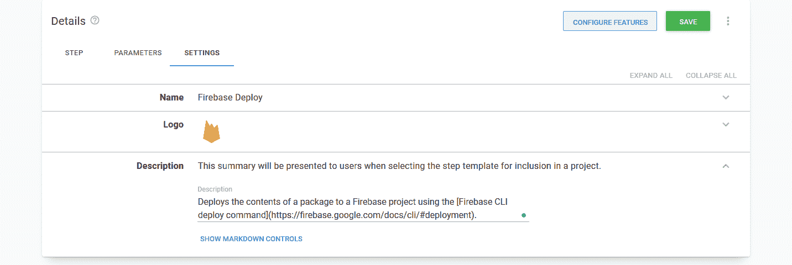
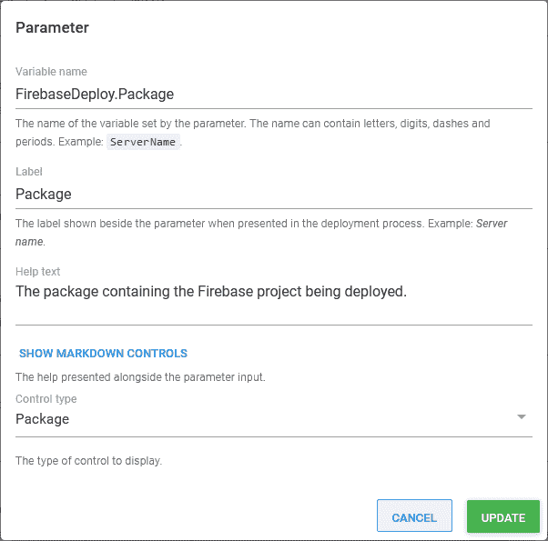
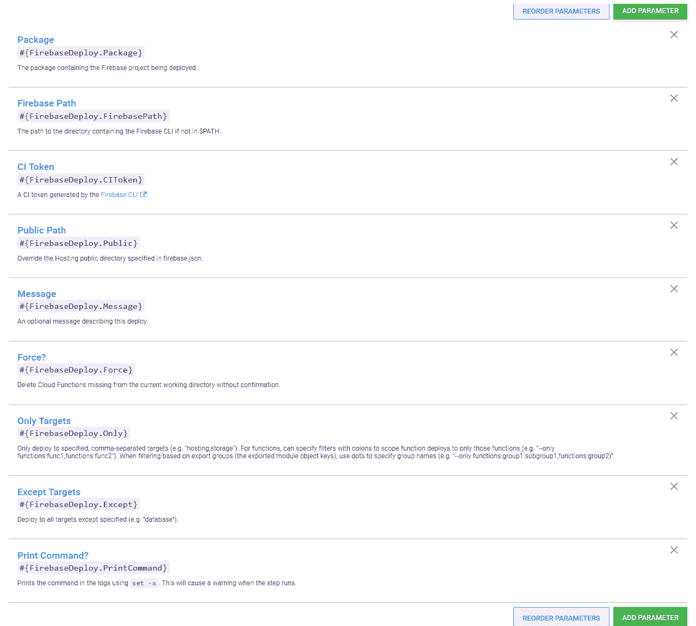
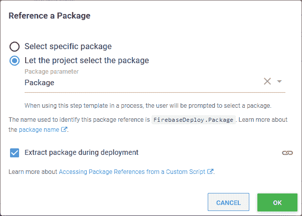
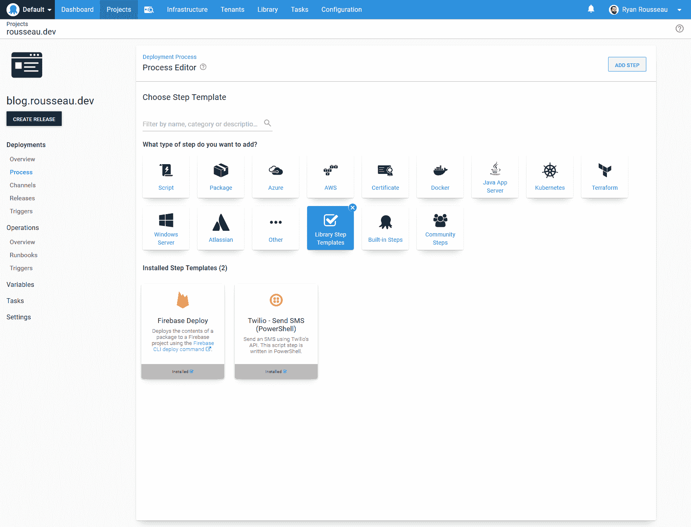
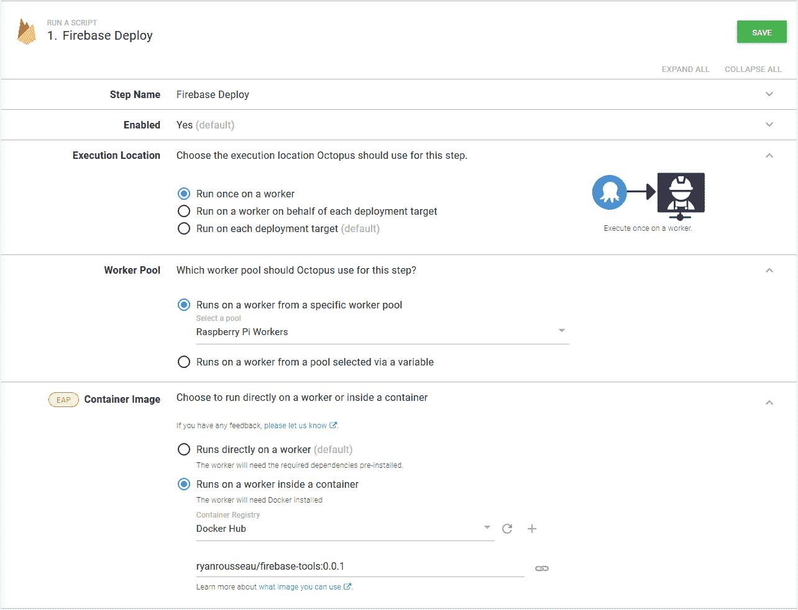
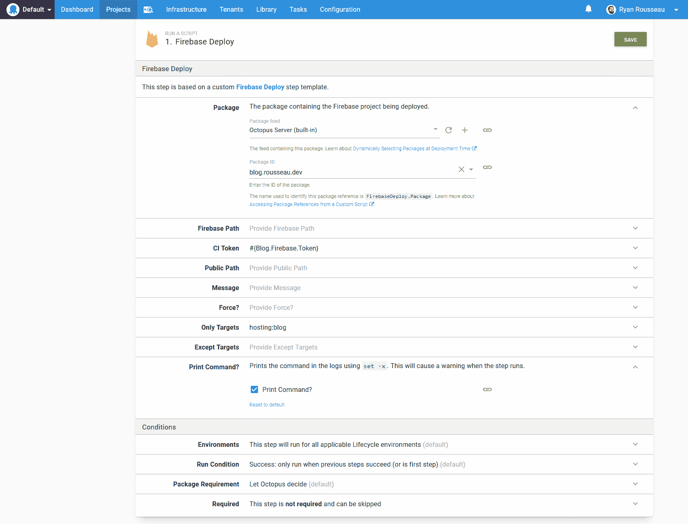
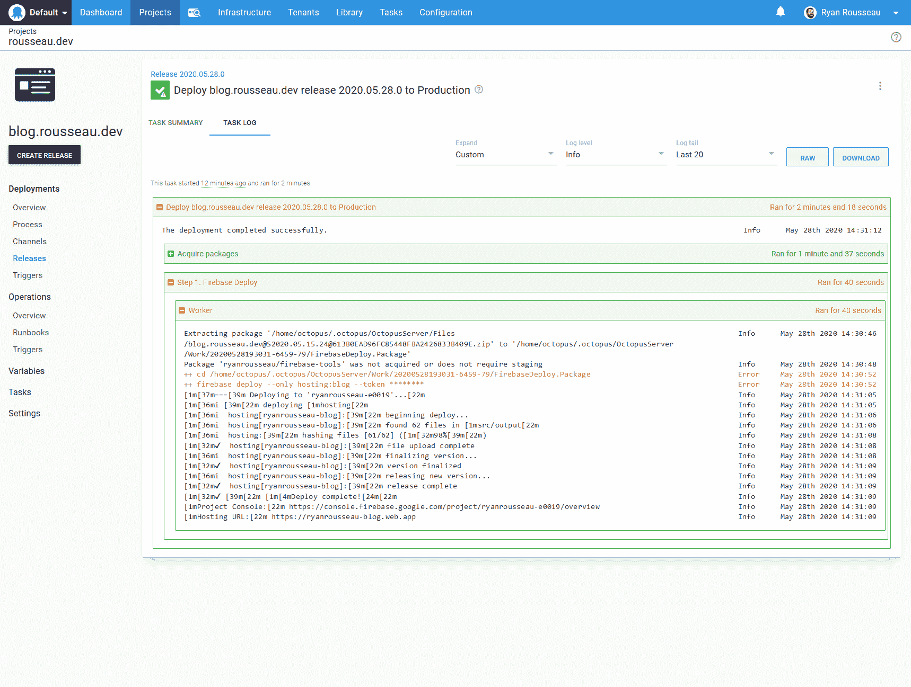

# 创建 Octopus 部署步骤模板- Octopus 部署

> 原文：<https://octopus.com/blog/creating-an-octopus-deploy-step-template>

[](#)

今天，我将在 Octopus Deploy 中创建一个[自定义步骤模板](https://octopus.com/docs/deployment-process/steps/custom-step-templates)。

自定义步骤模板对于扩展 Octopus 的功能非常有用。他们还可以在您的项目中标准化操作。

我在 Firebase 上主持了一些项目，所以我选择为 [Firebase CLI deploy 命令](https://firebase.google.com/docs/cli/#deployment)创建一个模板。

我们开始吧！

## 选择基础模板

我需要做出的第一个决定是，我将在哪个现有的步骤模板上进行构建。

我将一个包的内容部署到 Firebase，所以**部署一个包**看起来是一个合理的选择。**部署包**步骤用于将包的内容部署到它将运行的机器或 PaaS 目标。

对于我的 Firebase 部署来说，情况并非如此。

我只需要对我的文件运行 Firebase CLI。运行命令的机器并不重要。**运行脚本**步骤非常适合于此。

我点击**运行脚本**模板上的**添加**，这将我带到步骤模板编辑器。

## 设置

Octopus 让我进入**设置**选项卡。在这里，我可以提供名称、徽标和描述。

选择一个好的、描述性的步骤名称至关重要。这个名字对我来说很容易。因为我包装了 Firebase deploy 命令，所以我将我的步骤称为 **Firebase Deploy** 。

接下来是 logo。徽标不是必需的，但我喜欢添加它们。看到与技术相关的技术的标志为这一步提供了一点天赋。

最后，我给这个步骤一个描述。描述字段支持降价。我利用这一点链接回 Firebase CLI 文档:

[](#)

## 下一步做什么？

接下来我应该向我的步骤添加参数，还是添加步骤细节和逻辑？

看情况。我通常从我知道我会需要的参数开始。然后，我开始处理步骤细节，并在进行过程中添加新发现的参数。

在这篇文章中，我描述了所有的参数，然后才进入步骤细节。

## 因素

我为包含我的 Firebase 资产的包添加了一个参数。打包参数是 Octopus Deploy 中相对较新的特性。包参数允许我的步骤的使用者提供一个包供该步骤使用。

当添加参数时，我提供名称、标签、帮助文本和控件类型。

我将我的包参数命名为`FirebaseDeploy.Package`。参数的前缀将防止与其他 Octopus 变量的名称冲突。

我给它标签和控件类型`Package`。我将帮助文本设置为“包含正在部署的 Firebase 项目的包”

一个参数下降:

[](#)

其余的参数将遵循类似的命名约定，只有类型不同。

`Firebase Path`:包含 Firebase CLI 的目录的路径，如果不在＄PATH 中。

`CI Token`:Octopus 需要 CI 令牌才能代表我使用 Firebase CI。我把这个参数设为敏感参数。敏感参数值将在数据库中加密，并在日志中屏蔽。

`Public Path`:覆盖 **firebase.json** 中指定的托管公共目录。

`Message`:描述此部署的可选消息。

`Force?`:删除当前工作目录中缺失的云功能，无需确认。`Force?`是一个复选框参数。

`Only Targets`:仅部署到指定的逗号分隔目标(例如`hosting,storage`)。

`Except Targets`:部署到指定目标以外的所有目标(如`database`)。

`Print Command?`:我添加这个参数是为了在命令运行时使用`set -x`打印命令。在调试和测试该步骤时，这很方便。

[](#)

## 步骤

参数排序后，我切换到**步骤**选项卡。我的脚本源代码将保持设置为**内联源代码**。**包中的脚本文件**如果您的团队在包中存储了标准脚本，那么它会非常有用。它不太适合您计划提供给公众的模板(伏笔)。

**步骤**选项卡下有**内联源代码**部分。我将跳过这一步，创建一个引用包，因为我的脚本需要它。

### 参考包

[引用的包](https://octopus.com/docs/deployment-examples/custom-scripts/run-a-script-step#referencing-packages)是额外的包，您可以在**运行脚本**步骤中使用。

在这一步中，引用的包是包含我们的 Firebase 资产的包。我将把包参数作为引用包连接到脚本。

我可以选择直接选择一个包，但我将设置更改为`Let the project select the package`。然后我从列表中选择我的包参数。我可以通过使用参数名`FirebaseDeploy.Package`在我的脚本中使用这个包。

我确保去查`Extract package during deployment`。

[](#)

### 剧本

我选择用 Bash 编写我的脚本，因为我预计大多数消费者会在 Linux Worker 上运行它。

我的脚本的第一部分是获取参数值并将它们存储在变量中。

第一个变量是提取包的路径。变量名与其他变量名略有不同。`Octopus.Action.Package`变量是一个集合。我使用参考包的名称作为索引来访问包信息:

```
packagePath=$(get_octopusvariable "Octopus.Action.Package[FirebaseDeploy.Package].ExtractedPath") 
```

其余的变量都很标准，我用它们的名字来引用它们:

```
token=$(get_octopusvariable "FirebaseDeploy.CIToken")
public=$(get_octopusvariable "FirebaseDeploy.Public")
message=$(get_octopusvariable "FirebaseDeploy.Message")
force=$(get_octopusvariable "FirebaseDeploy.Force")
only=$(get_octopusvariable "FirebaseDeploy.Only")
except=$(get_octopusvariable "FirebaseDeploy.Except")
printCommand=$(get_octopusvariable "FirebaseDeploy.PrintCommand")
firebasePath=$(get_octopusvariable "FirebaseDeploy.FirebasePath") 
```

如果步骤消费者为 Firebase 提供了一个路径，我将它添加到 path 变量中:

```
if [ ! -z "$firebasePath" ] ; then
    PATH=$firebasePath:$PATH
fi 
```

如果`Force?`被选中，我将该值设为 true。如果不是，我就取消设置:

```
if [ "$force" = "True" ] ; then
    force=true
else
    force=
fi 
```

如果`Print Command?`被选中，我打开命令跟踪:

```
if [ "$printCommand" = "True" ] ; then
    set -x
fi 
```

最后，我切换到包目录并调用 Firebase deploy 命令:

```
cd $packagePath

firebase deploy ${public:+ -p "$public"} ${message:+ -m "$message"} ${force:+ -f} ${only:+ --only "$only"} ${except:+ --except "$except"} --token $token 
```

对于可选参数，我用了最近学的一个[招数](https://dev.to/octopus/til-about-shell-parameter-expansion-in-bash-3c5m)。

在下面的示例中，如果`public`为空或未设置，则命令中不会添加任何内容。如果`public`不为空或未置位，则将`-p "$public"`添加到命令中。

```
${public:+ -p "$public"} 
```

瞧，我已经完成了剧本。

## 测试

将步骤模板保存在我的库中后，我可以将其添加到部署流程中。自定义步骤模板在*库步骤模板*类别中:

[](#)

我将该步骤配置为在我的 Worker 上运行，并在安装了 Firebase CLI 的容器中运行:

[](#)

我将参数设置为我在部署中使用的值。

首先，我从内置提要中选择了包。

我将 CI 令牌设置为存储令牌的敏感变量。

基于我的 firebase.json 设置，我只设置了**目标**到`hosting:blog`。

最后，我检查了`Print Command?`,这样我就可以看到该步骤构建的命令:

[](#)

我创建了一个版本，并将其部署到我的环境中。一切看起来都很好！

[](#)

## 结论

[自定义步骤模板](https://octopus.com/docs/deployment-process/steps/custom-step-templates)对于扩展 Octopus 的功能非常有用。他们还可以在您的项目中标准化操作。

我为 Firebase CLI deploy 命令创建了一个自定义模板，可以在我的任何项目中使用。

## 下次

我提到过，我希望这一步涵盖所有的部署参数，并可供其他人使用。阅读我的下一篇文章，[向 Octopus Deploy 社区库](https://octopus.com/blog/contributing-a-step-template-to-the-octopus-deploy-community-library)贡献一个步骤模板，了解我如何向 [Octopus Deploy 库](https://library.octopus.com)提交这个步骤。