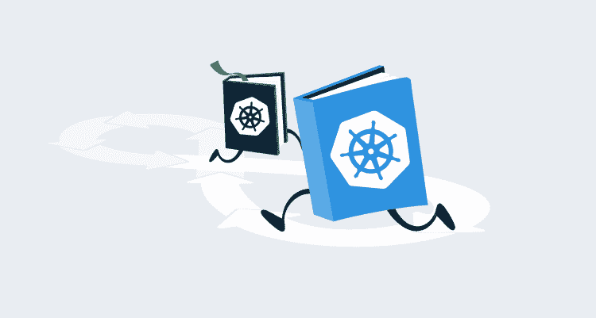
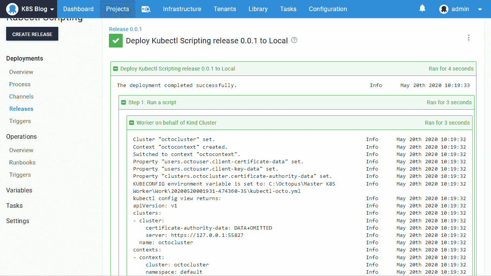
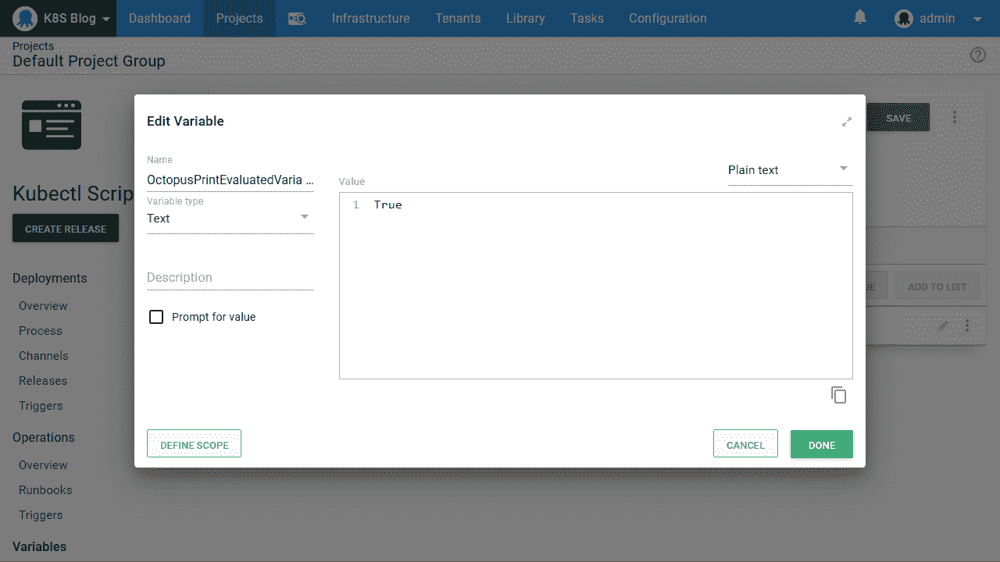
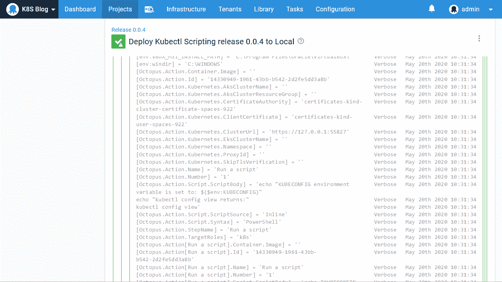
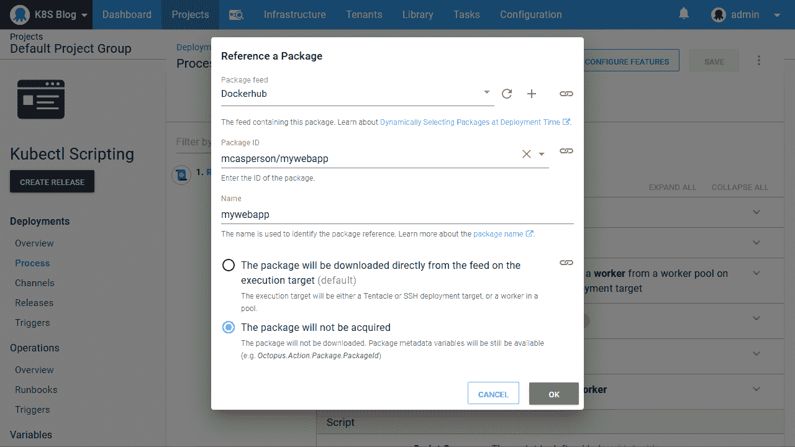
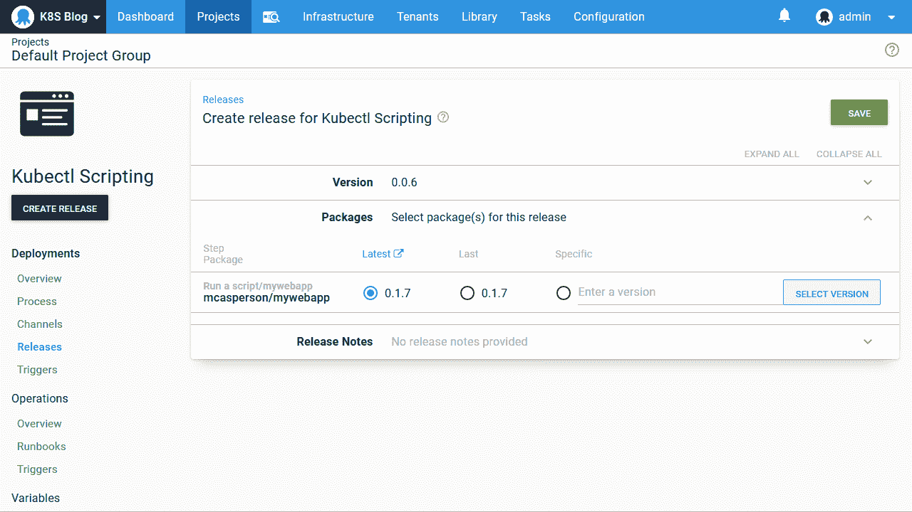
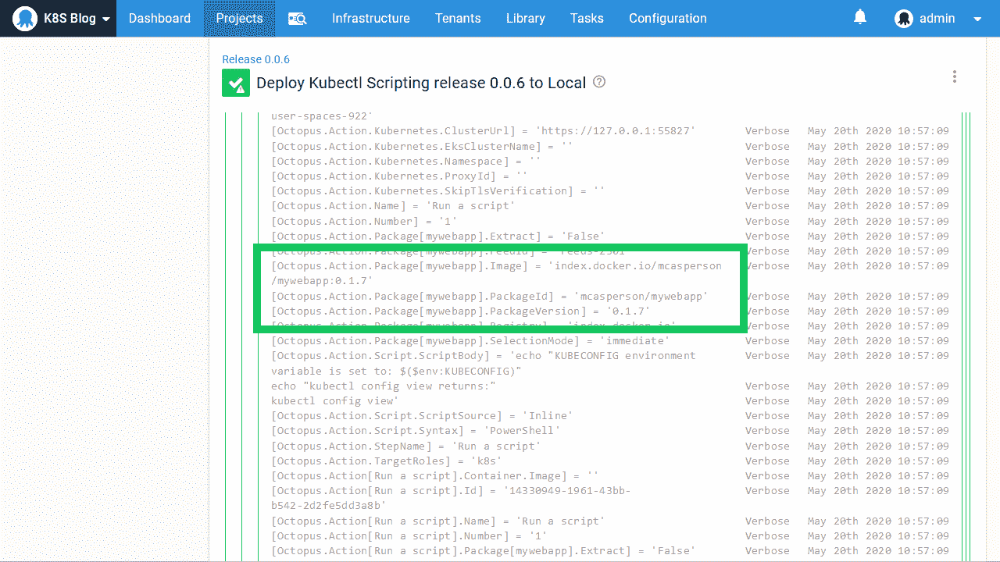
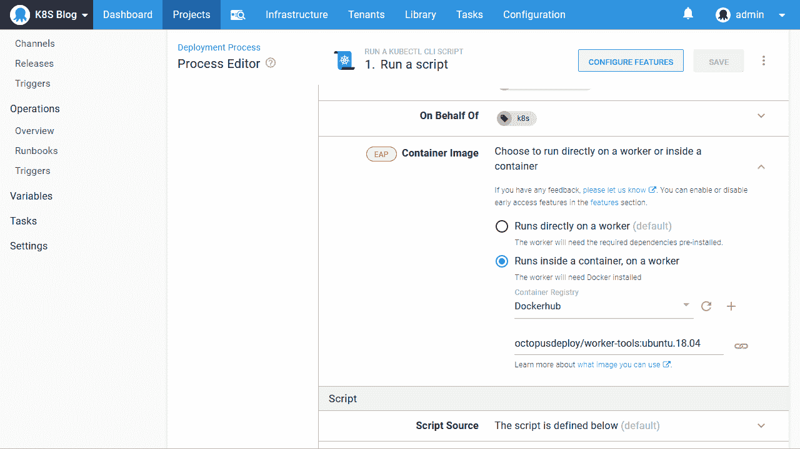
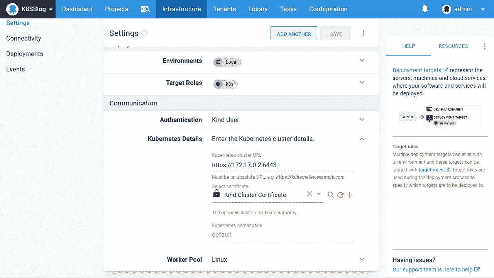
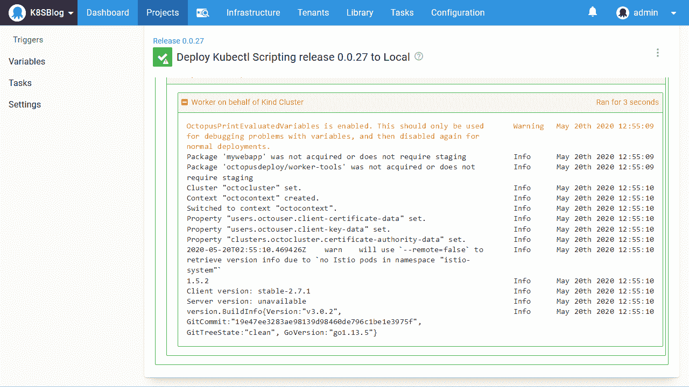

# Octopus - Octopus Deploy 中的自定义 kubectl 脚本

> 原文：<https://octopus.com/blog/custom-kubectl-scripting-in-octopus>

[](#)

本系列之前的博客都关注于如何使用 Octopus 中固执己见的步骤来执行 Kubernetes 部署。但是有时候你需要直接进入脚本。也许你想利用定制的脚本工具，如 [istioctl](https://istio.io/docs/ops/diagnostic-tools/istioctl/) 或者使用 Kubernetes 资源提供的一些高级或不常见的属性。对于这些情况，Octopus 允许您针对 kubectl 编写定制脚本。

在本帖中，我们将探讨一些技巧，您可以利用这些技巧来创建针对您的 Kubernetes 集群运行的灵活且可重用的脚本。

## 创建一个 kubectl 脚本

**运行 kubectl CLI 脚本**步骤展示了针对 Kubernetes 集群编写脚本的能力:

[](#)

这一步类似于 Octopus 中的其他脚本步骤，只是它必须针对 Kubernetes 目标运行。在幕后，Octopus 获取 Kubernetes 目标的细节，并构造一个配置文件，其作用范围是正在运行的脚本。它通过将环境变量`KUBECONFIG`设置为新生成的配置文件的路径来实现这一点，然后允许所有对`kubectl`的后续调用都指向 Kubernetes 目标。

下面是一个示例 PowerShell 脚本，它显示了环境变量和配置文件的内容:

```
echo "KUBECONFIG environment variable is set to: $($env:KUBECONFIG)"
echo "kubectl config view returns:"
kubectl config view 
```

以下是结果截图:

[](#)

从输出中，我们可以看到 Kubernetes 配置文件已经保存到了`C:\Octopus\Master K8S Worker\Work\20200520001931-474360-35\kubectl-octo.yml`，这是一个临时目录，用来保存该步骤所需的工作文件。我们还可以看到配置文件是如何用保存在 Kubernetes 目标中的细节构建的。

## 在脚本中使用变量

当该步骤运行时，我们的脚本可以访问所有可用的变量。查看可用变量的最简单方法是将[章鱼变量](https://octopus.com/docs/support/how-to-turn-on-variable-logging-and-export-the-task-log) `OctopusPrintVariables`或`OctopusPrintEvaluatedVariables`设置为`True`:

[](#)

定义了这个变量后，详细日志将显示可用的变量及其值。这是浏览可在脚本中使用的变量的便捷方式:

[](#)

## 参考 Docker 图像

Octopus 部署过程的优点之一是部署逻辑是相对静态的，即使包每次都在变化。这是通过在部署时选择包来实现的。

然而，这个过程并不是 Kubernetes 所固有的。例如，在下面的部署 YAML 中，您可以看到我们已经硬编码了对 Docker 映像`mcasperson/mywebapp:0.1.7`的引用:

```
apiVersion: apps/v1
kind: Deployment
metadata:
  name: mydeployment
  labels:
    app: mydeployment
spec:
  selector:
    matchLabels:
      app: mydeployment
  replicas: 1
  strategy:
    type: RollingUpdate
  template:
    metadata:
      labels:
        app: mydeployment
    spec:
      containers:
        - name: randomquotes
          image: mcasperson/mywebapp:0.1.7
          ports:
            - name: web
              containerPort: 80 
```

即使我们没有提供标签并使用了一个图像引用`mcasperson/mywebapp`，标签`latest`也是假定的，所以我们仍然有效地拥有一个对单个 Docker 图像的硬编码引用。

为了让上面的 YAML 可以部署不同版本的 Docker 图像，我们可以使用 Helm 这样的工具通过模板定义图像标签。但是仍然需要有人知道 Docker 映像的版本并将其提供给 Helm。

八达通提供了另一种选择。通过引用 Docker 映像作为附加包并将其设置为不被获取，Octopus 将在部署期间提示选择映像的版本，然后在运行时将该版本作为变量公开。以下是作为附加包引用的 Docker 图像:

[](#)

然后在部署期间选择包版本:

[](#)

最后，我们扫描日志中打印的变量，找到引用 Docker 图像的变量。您可以在下面的截图中看到，名为`Octopus.Action.Package[mywebapp].Image`的变量是完整的 Docker 图像名称，`Octopus.Action.Package[mywebapp].PackageVersion`是版本:

[](#)

我们可以在脚本中使用这些变量。下面的示例脚本将一个 YAML 文件写入磁盘，然后使用`kubectl`来应用它。image 属性被定义为`image: #{Octopus.Action.Package[mywebapp].Image}`，它将在每次部署时更新，以反映所选的 Docker 映像:

```
Set-Content -Path deployment.yml -Value @"
apiVersion: apps/v1
kind: Deployment
metadata:
  name: mydeployment
  labels:
    app: mydeployment
spec:
  selector:
    matchLabels:
      app: mydeployment
  replicas: 1
  strategy:
    type: RollingUpdate
  template:
    metadata:
      labels:
        app: mydeployment
    spec:
      containers:
        - name: randomquotes
          image: #{Octopus.Action.Package[mywebapp].Image}
          ports:
            - name: web
              containerPort: 80
"@

kubectl apply -f deployment.yml 
```

## 在容器映像中运行

像 Octopus 这样的工具面临的一个挑战是它所集成的平台的数量，以及 Octopus 利用的工具。这个问题最初的解决方案是用 Octopus 本身打包工具，但是随着时间的推移，不同的工具版本、不同的操作系统以及新工具的不断引入使得这种方法无法维护。

这个问题的解决方案是引入[工人工具 Docker 映像](https://hub.docker.com/r/octopusdeploy/worker-tools)，可以在其中执行部署流程。这些 Docker 映像包含了一些常见的开源工具，可以独立于 Octopus 本身进行版本控制和发布。

Octopus 提供的图像包括 Kubernetes 工具的精选，包括`kubectl`、`istioctl`、`linkerd`和`helm`，这并不奇怪。

在下面的屏幕截图中，脚本步骤已被配置为在 Worker tool Docker 映像中运行:

[](#)

但是，因为我们使用托管在 Docker with Kind 中的 Kubernetes 集群，所以我们必须做一些配置，以确保运行我们的 Octopus 步骤的 Docker 容器可以访问该集群。

首先，我们需要确保 Kubernetes 集群控制平面运行在名为`bridge`的默认 Docker 网络上。从[版本 0.8.0](https://github.com/kubernetes-sigs/kind/releases/tag/v0.8.0) 开始，Kind 将在一个名为`kind`的特殊网络中创建 Kubernetes 集群，它将集群控制平面与运行我们部署的容器隔离开来。要解决这个问题，将`KIND_EXPERIMENTAL_DOCKER_NETWORK`环境变量设置为`bridge`，以强制 Kind 使用默认网络。

您可能需要用`kind cluster delete`删除现有的集群。然后按照[上一篇博文](/blog/getting-started-with-kind-and-octopus)中的说明重新创建它，记住提取证书并重新上传到 Octopus 中，因为它们已经发生了变化。

我们还需要将我们的 Kubernetes 目标指向一个新的 IP 地址和端口。命令`docker container ls`向我们展示了托管 Kubernetes 控制平面的种类容器:

```
$ docker container ls
CONTAINER ID        IMAGE                  COMMAND                  CREATED             STATUS              PORTS                       NAMES
ebb9eb784a55        kindest/node:v1.18.2   "/usr/local/bin/entr…"   6 minutes ago       Up 6 minutes        127.0.0.1:59747->6443/tcp   kind-control-plane 
```

由此，我们可以看到端口`6443`是公开 Kubernetes API 的内部端口。

然后，我们用命令`docker container inspect kind-control-plane`获取容器的 IP 地址。以下是该命令输出的截断副本:

```
$ docker container inspect kind-control-plane
[
    {
        // ... removed the container details for brevity
        "NetworkSettings": {
            // ... removed networking details for brevity
            "Networks": {
                "bridge": {
                    "IPAMConfig": null,
                    "Links": null,
                    "Aliases": null,
                    "NetworkID": "29f0f93df185df5ecae63abcca94c7a1bdd24a13bc8cd0158b2534199a08b95e",
                    "EndpointID": "0dc06d6e58a17e169d1c58a4ddaec179252d7b3e79695c40eba52af3ae8b921a",
                    "Gateway": "172.17.0.1",
                    "IPAddress": "172.17.0.2",
                    "IPPrefixLen": 16,
                    "IPv6Gateway": "",
                    "GlobalIPv6Address": "",
                    "GlobalIPv6PrefixLen": 0,
                    "MacAddress": "02:42:ac:11:00:02",
                    "DriverOpts": null
                }
            }
        }
    }
] 
```

我们可以看到使用了`bridge`网络，这意味着`KIND_EXPERIMENTAL_DOCKER_NETWORK`环境变量按预期工作。然后我们看到`IPAddress`属性被设置为`172.17.0.2`。这意味着我们的 Kubernetes 集群的 URL 是`https://172.17.0.2:6443`:

[](#)

既然我们已经为两个同级 Docker 容器配置了正确的网络来相互通信，我们可以通过运行脚本来验证 worker-tools 映像是否公开了我们期望的工具:

```
istioctl version
linkerd version
helm version 
```

正如所料，我们的脚本可以使用所有这些工具:

[](#)

## 结论

通过暴露大量变量，允许在部署时选择 Docker 映像，并通过[工人工具 Docker 映像](https://hub.docker.com/r/octopusdeploy/worker-tools)提供广泛的工具，可以从 Octopus 针对 Kubernetes 编写复杂的部署和管理任务。

这篇文章研究了 Octopus 中一些有用的调试技术，并提供了利用包变量和工人工具 Docker images 的示例脚本，以突出使用 Octopus 来自动化 Kubernetes 集群的一些可能性。