# 使用 Octopus Deploy、Jenkins 和 Redgate - Octopus Deploy 向 Oracle 数据库部署添加部署后脚本

> 原文：<https://octopus.com/blog/database-deployment-automation-for-oracle-using-octopus-jenkins-redgate>

[](#)

在我的上一篇文章[使用 Octopus Deploy 和 Redgate](https://octopus.com/blog/oracle-database-using-redgate) 部署到 Oracle 数据库中，我介绍了如何建立一个 CI/CD 管道来部署到 Oracle 数据库，其中 TeamCity 作为构建服务器，Octopus Deploy 作为部署服务器，Redgate 处理所有繁重的工作。这篇文章建立在上一篇文章的概念之上。

Redgate 的工具使用基于模型或期望状态的方法来部署数据库。开发人员按照自己的意愿配置数据库。在这里添加一个表，在那里添加一个视图，然后将数据库的整个状态签入源代码控制。在部署过程中，将所需的状态与目标数据库进行比较，并生成一个增量脚本。

对于开始自动化数据库部署的团队来说，这是一个非常容易掌握和适应的过程。通常情况下，使用这种方法的工具都有插件，或者有一个很好的 UI 的外部程序，来处理所有繁重的工作。每个人都可以继续使用他们现有的工具，所有人需要做的就是点击几个按钮进行一些改变。

基于模型的方法在大多数时候都很棒。它涵盖了 85%的场景。它没有涵盖复杂的数据库更改，例如重命名表、将列从一个表移动到另一个表、重命名列等。对于基于模型的方法，如果您要重命名并部署一个表，该工具将生成一个删除旧表的 drop table 脚本，并为新表生成一个 create table 脚本。

摔桌子从来都不是什么好事。这篇博客文章介绍了如何管理这个场景，以及如何将构建服务器从 TeamCity 转移到 Jenkins。

## 不间断数据库更改

重命名列、将列从一个表移动到另一个表以及合并表都是破坏性更改。为了部署它们，需要关闭系统；否则，代码将开始抛出错误。这意味着非工作时间部署。

更好的方法是进行不间断的数据库更改。让我们以将一列从一个表移动到另一个表为例。按原样使用工具，情况是这样的:

1.  ColumnA 被添加到 TableB 中。
2.  列 a 从表 a 中删除。

实际上，您希望工具做到这一点:

1.  列 a 被添加到表 b 中
2.  表 a 中的数据被回填到表 b 中
3.  从表 a 中删除列 a

工具不支持这种功能。是吗？这三个步骤真的需要在一个部署中运行吗？如果发现了一个停止显示的 bug，您需要回滚您的代码更改，会发生什么？除了在一次部署中完成所有三个步骤之外，您是否可以将其分成多次部署？

部署#1

1.  ColumnA 被添加到 TableB 中。
2.  表 a 中的数据被回填到表 b 中。

部署#2

1.  列 a 从表 a 中删除。

现在我们有所进展。您可以部署您的数据库更改，然后您的代码更改可以在滚动部署中跨 web 场进行部署。现在，这个过程看起来像这样:

部署#1

1.  ColumnA 作为可空列添加到 TableB 中。
2.  代码被部署到一个网络场中。
3.  表 a 中的数据被回填到表 b 中。

部署#2

1.  列 a 从表 a 中删除。
2.  TableB 上的 ColumnA 被转换为不可为 null 的字段(如果需要)。

这种方法需要数据库开发人员和代码开发人员(如果他们是两个人的话)都遵守一些规则。当 TableB 上的 ColumnA 只有空值时，代码需要灵活地处理它。在随后的部署中，还需要记住从 TableA 中删除该列。

随着您在部署中获得灵活性，这一原则将会带来回报。随着您的数据库支持代码的两个最新版本，您可以开始研究更高级的部署策略，例如蓝/绿部署。

## 部署后脚本

在我的上一篇文章中，除了将数据从 TableA 回填到 TableB 的脚本之外，我们需要的一切都准备好了。所有必要的基础设施都已就绪，我们只需要对整个流程进行一些修改。

首先，我们在 db/src 文件夹中添加一个名为`DLMPostDeploymentScripts`的新文件夹:

[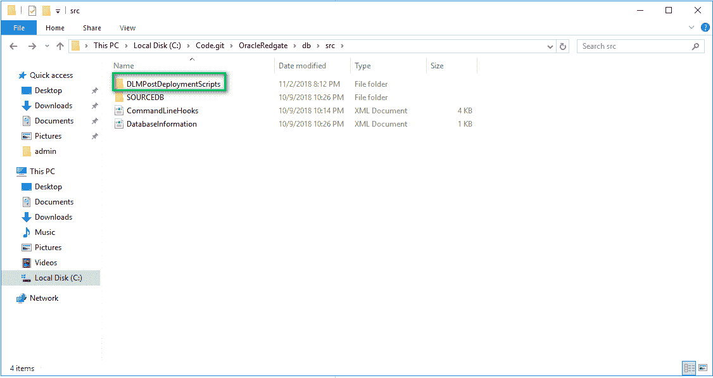](#)

该文件夹包含等幂脚本，这意味着脚本可以在部署后一直运行。换句话说，如果脚本将数据从一个表移动到另一个表，脚本应该包含不覆盖现有数据的逻辑。编写脚本时，假设它们会运行很多次。

Redgate 的 Oracle 源代码管理对该文件夹的存在没有意见。它不会抛出错误或类似的东西。它只是忽略了文件夹:

[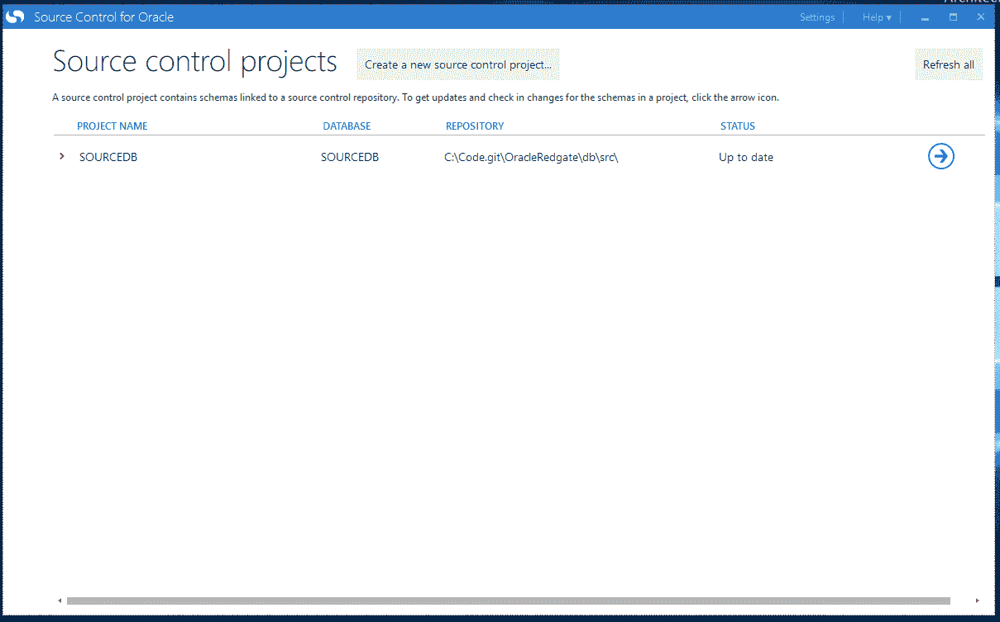](#)

Git 不会忽略文件夹，这非常符合我们的需求。我添加了一个名为 001_TestScript.sql 的新文件。它所做的只是从 dual 中选择一个测试值:

[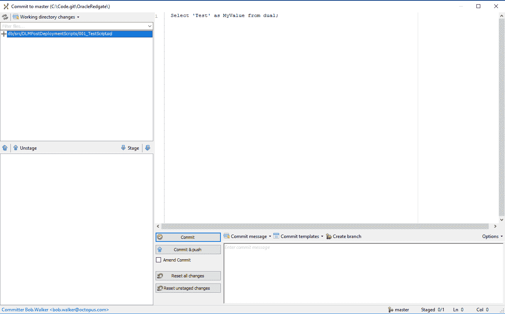](#)

## 詹金斯构型

我已经签入了那个测试文件并把它推了出来。现在是时候(再次)设置构建了。在这篇文章中，我将从 TeamCity 切换到 Jenkins。我并不是因为缺少功能而改变，而是因为我想展示使用 Octopus Deploy 配置任何构建服务器是多么容易。无论是詹金斯，团队城市，竹子，或 TFS/Azure DevOps。

### 让詹金斯准备章鱼部署

按照这些说明安装[Octopus Deploy 插件]]([https://jenkins.io/doc/book/managing/plugins/](https://jenkins.io/doc/book/managing/plugins/))。

安装 Octopus 插件后，您需要配置一个 Octopus 服务器。为此，点击**管理詹金斯**，然后**配置系统**:

[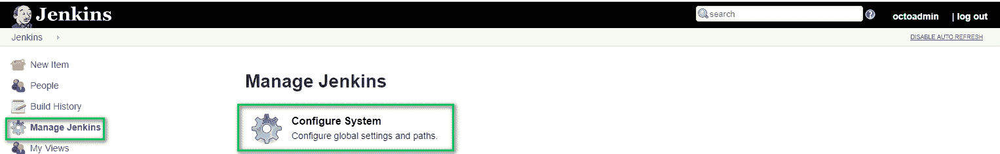](#)

向下滚动一点，直到找到 Octopus Deploy plugin 部分。输入 ID、OctopusDeploy 服务器的 URL 和 API 密钥，然后单击屏幕底部的**添加 Octopus Deploy 服务器**按钮:

[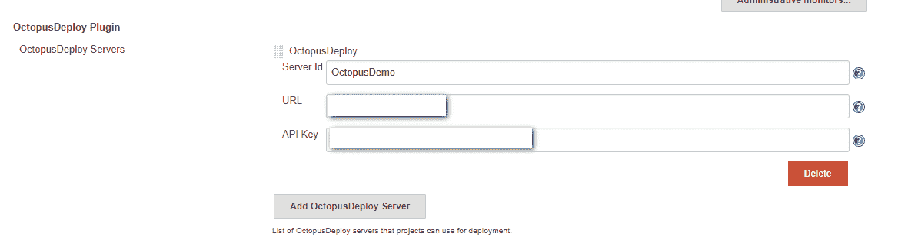](#)

Octopus Deploy 插件将处理创建发行版和部署发行版，但是它不处理打包和发布这些包。为此，我们将使用 Octopus CLI。您可以从[八达通下载页面](https://octopus.com/downloads)下载最新版本。我将把 Octopus CLI 放在一个文件夹中，供构建访问。这种情况下会是`C:\Utilities\Octo`。

### 项目设置

我将从头开始这个项目，所以我将创建一个新的自由式项目:

[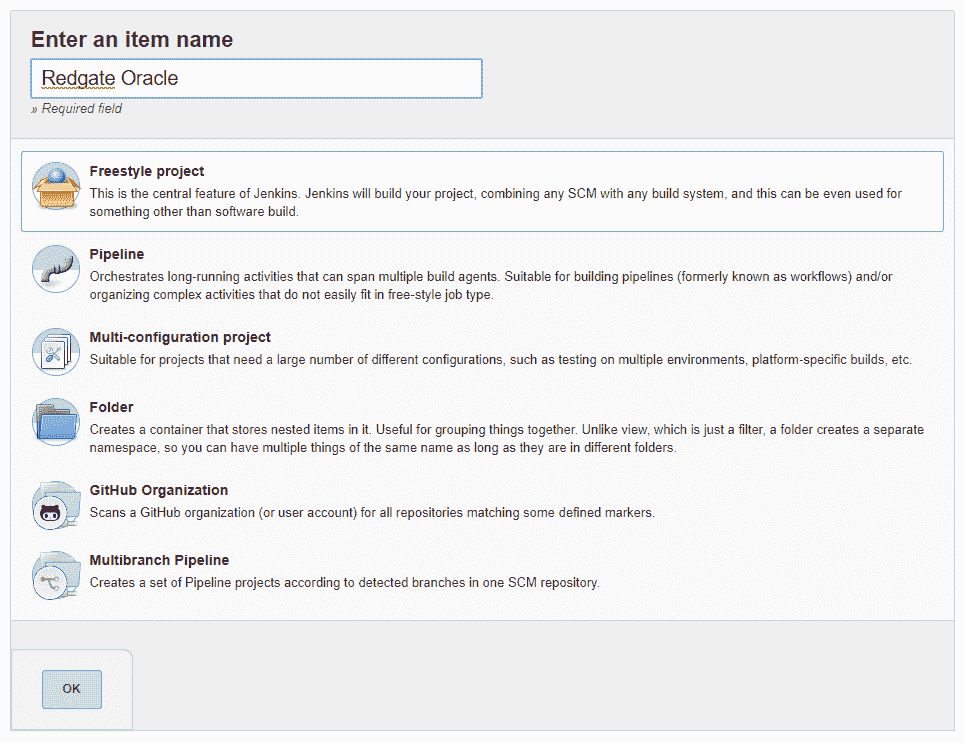](#)

接下来，我指定了将要构建的 Git repo。

**请注意:**这是 GitHub 中的公共回购，这就是为什么我没有输入任何凭证:

[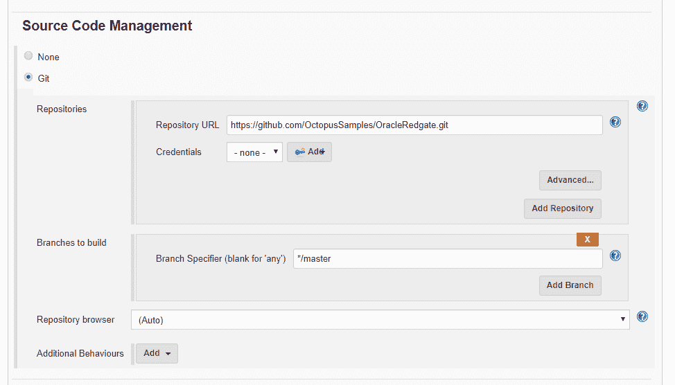](#)

对于这个演示，我告诉 Jenkins 使用 cron 表达式每三分钟轮询一次 GitHub。您可以根据需要对此进行调整，但对于我的目的来说，这就是我所需要的:

[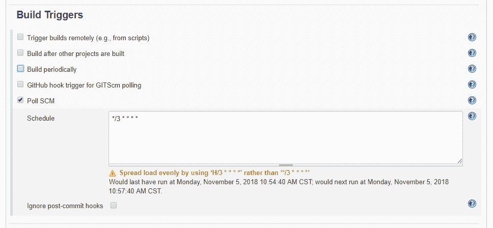](#)

构建步骤是将 db\src 文件夹打包成一个. zip 文件，并将其推入。Octopus Deploy 的 zip 文件准备好部署内置存储库:

【T2 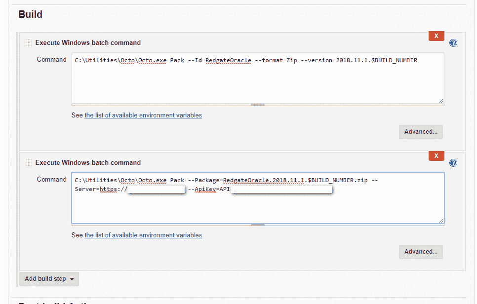

接下来，让我们创建发布。

**请注意**:我还没有对 Octopus Deploy 做任何更改，我只是想让这个构建工作起来并推进到 Octopus Deploy，当它成功时，我将对流程做一些更改:

[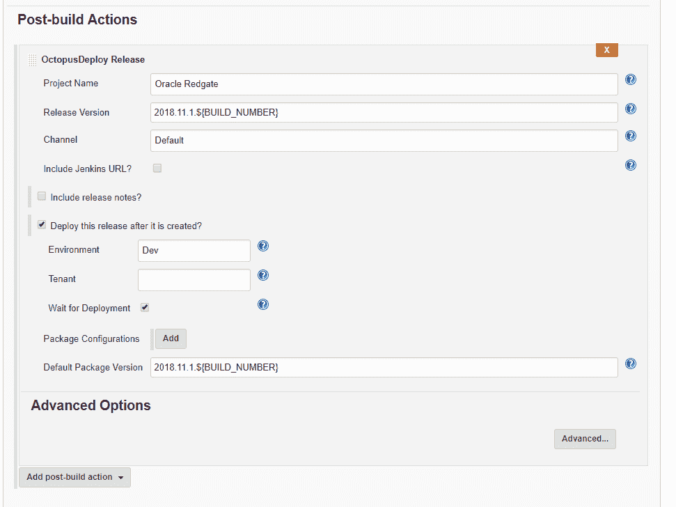](#)

就是这样！让我们开始构建，看看会发生什么！它失败了！我认为任何 CI 系统的前十个构建都应该算作 *alpha* 构建。我还没有一次构建成功的例子:

[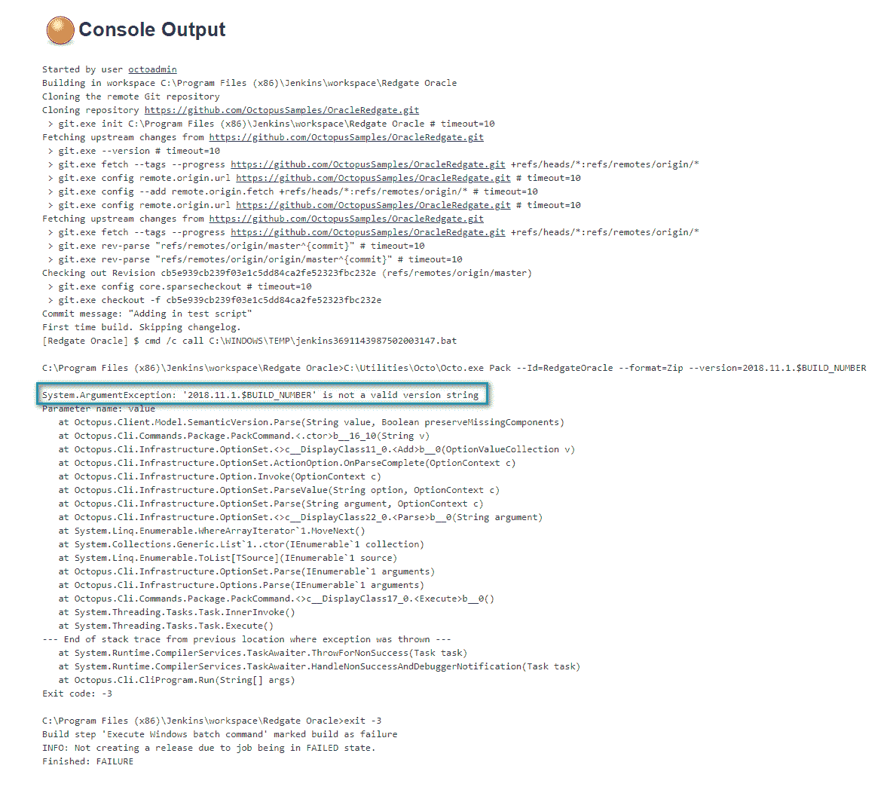](#)

让我们对打包和推送流程做一些调整。使用`%BUILD_NUMBER%`代替`$BUILD_NUMBER`，让第二步做一个推而不是一个包，并做一些其他的调整。

这些是要使用的命令。

```
C:\Utilities\Octo\Octo.exe Pack --Id=RedgateOracle --format=Zip --version=2018.11.1.%BUILD_NUMBER% --BasePath=db\src
C:\Utilities\Octo\Octo.exe Push --Package=RedgateOracle.2018.11.1.%BUILD_NUMBER%.zip --Server=[Your Server URL] --ApiKey=[Your API Key] 
```

[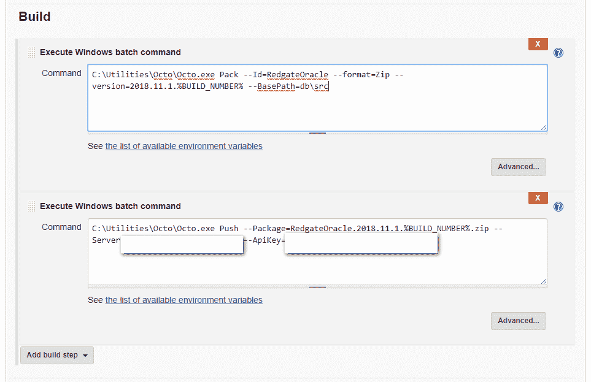](#)

尝试了几次，但最终，Jenkins 推进了 Octopus Deploy，并将该版本部署到 dev。

[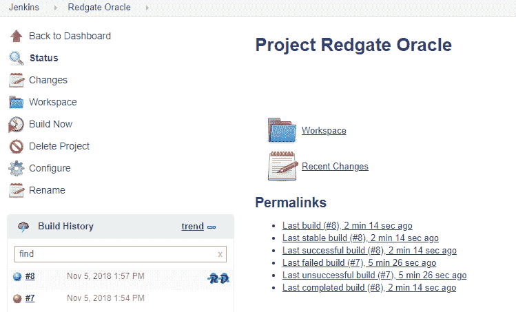](#)

### 项目更新

在前一篇文章的结尾，部署过程看起来像这样:

[](#)

我们将扩展该流程以支持额外的脚本。首先，我们需要重新安排一些项目。让我们从将一些硬编码的值移出步骤并移入变量开始。例如，导出路径:

[](#)

经过一些重新配置，这些是我现在拥有的变量:

[](#)

在查看 Redgate - Create Oracle 发布步骤时，您可以看到我使用这些变量的所有地方。

自从我的上一篇文章以来，我根据用户的反馈更新了这个步骤模板。您现在有了更精细的控制。

[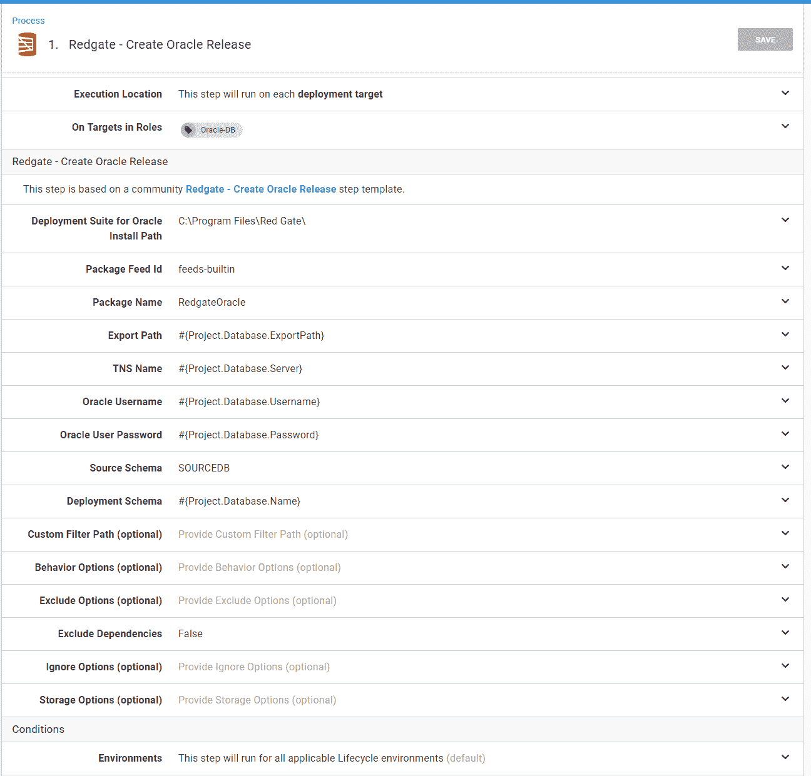](#)

同样的事情可以在最后一步看到。所有硬编码的值都已被变量替换:

[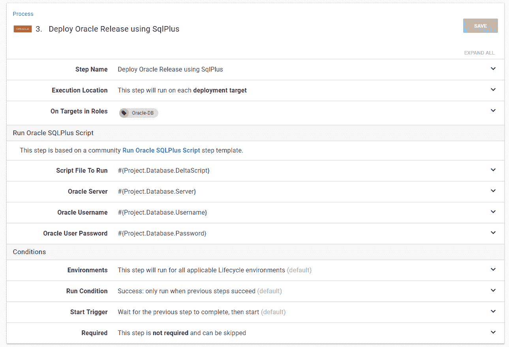](#)

我们将在流程中添加两个新步骤。第一步是将在 **DLMPostDeploymentScripts** 文件夹中找到的所有脚本合并成一个脚本，并作为工件上传。这允许审批者浏览脚本，以确保它不会做任何疯狂的事情。

我在库中创建了一个 step 模板，你可以使用它，叫做**文件系统——将一个目录中的所有文件合并成一个文件**。台阶将为您处理所有的繁重工作。你只需要给它提供必要的参数。

[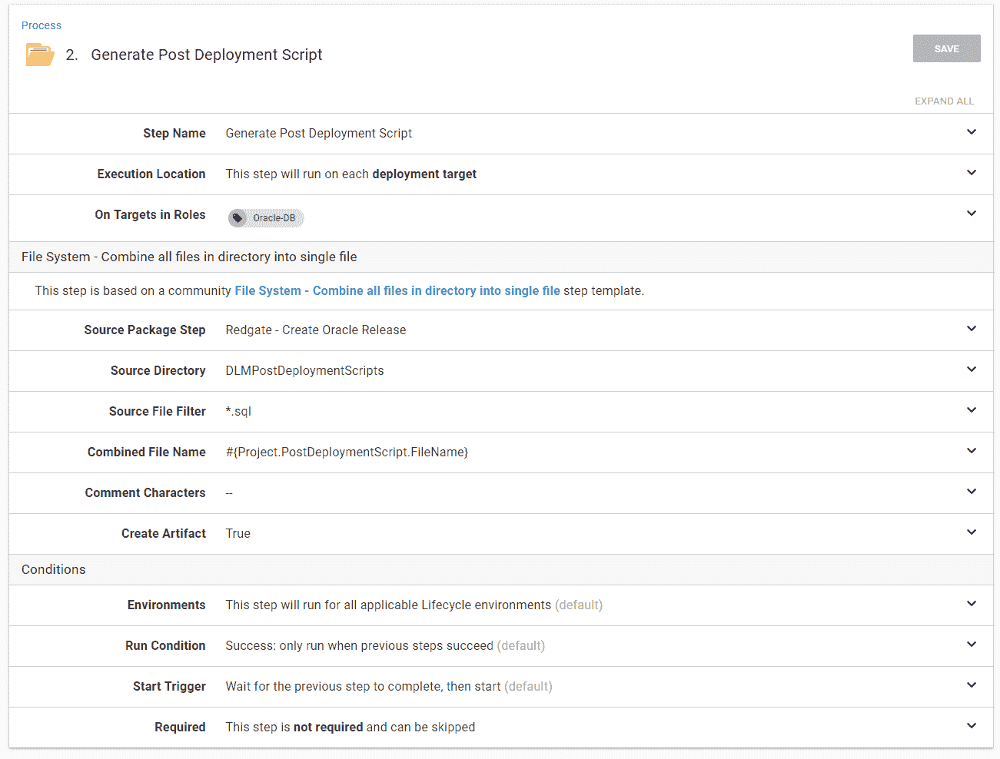](#)

我要添加的下一步是另一个**运行 Oracle SQLPlus 脚本**步骤。这一次它将运行部署后脚本。

[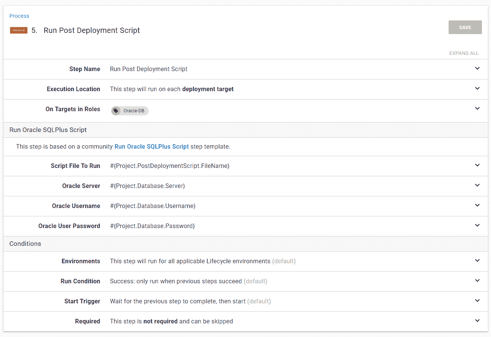](#)

这个过程现在看起来像这样:

[](#)

是时候运行部署了，看看会发生什么。如您所见，创建了一个额外的工件:

[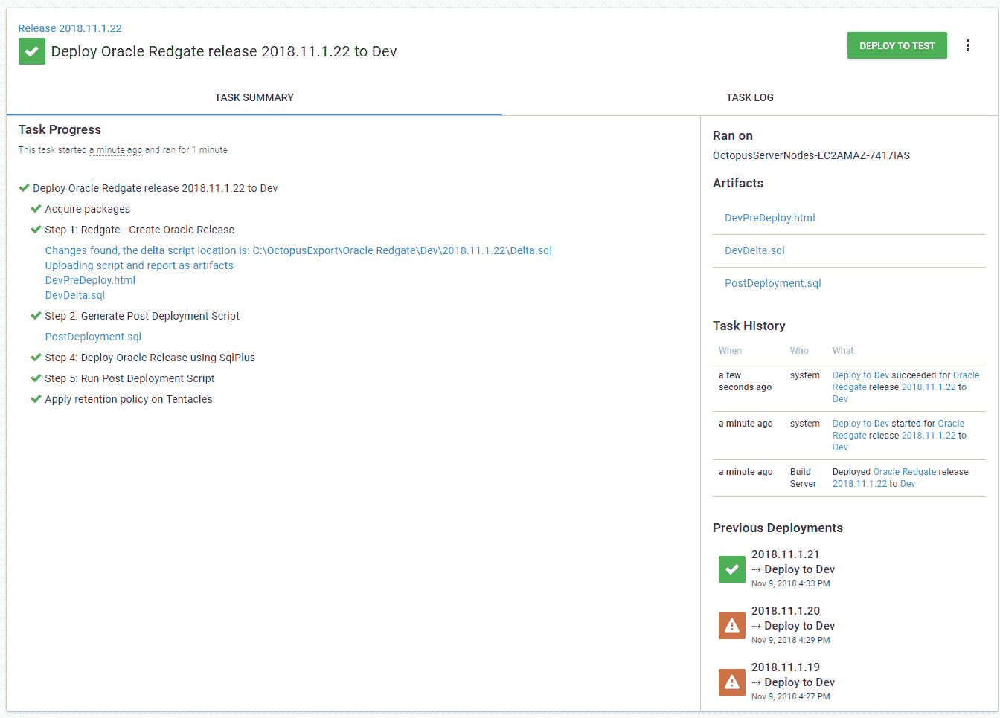](#)

并且脚本运行成功:

[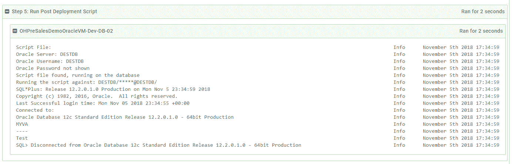](#)

## 结论

通过对流程进行一些小的修改，我们可以覆盖比以前多得多的场景。使用这个过程需要一点训练。您需要确保脚本可以运行多次。您还必须记住在脚本运行后删除它们，这样您就不会一遍又一遍地运行脚本。脚本将手动编写，因此在脚本第一次运行时，您有可能会遇到由小到大的错误。

但这些都是次要问题。当我在以前的公司帮助编写这个过程时，我很惊讶人们对它的接受程度。一旦他们知道他们可以编写自己的脚本来处理数据迁移或其他任何事情，我开始看到一些非常独特的用途。有人运行了一系列脚本，将一些初始化数据或种子数据插入到表中。我们进一步扩展了这个过程，以检查数据库是否存在。如果数据库没有，那么它将动态地创建它并用种子数据初始化它。这使得我们能够快速启动和关闭测试环境和客户。

这仅仅是开始。有了这些，就可以考虑蓝/绿部署策略了。可以建立一个流程来完成常规部署，当蓝/绿切换完成并成功测试后，可以运行最终的数据库脚本来清理数据。

下次再见，愉快的部署！

* * *

数据库部署自动化系列文章: