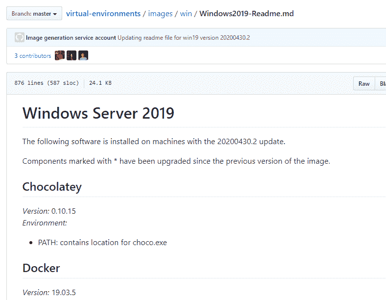
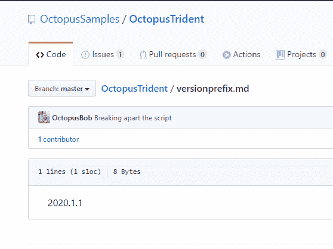
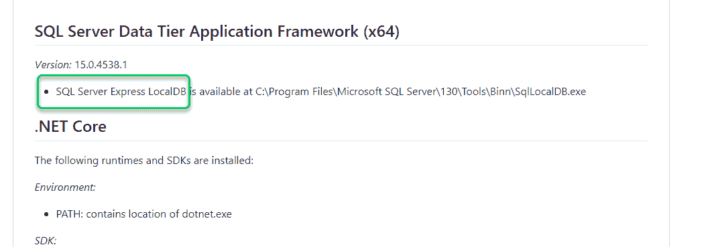
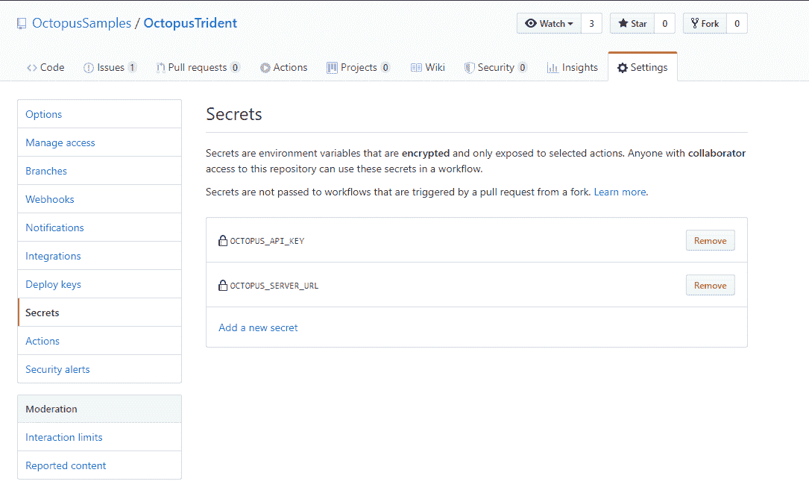

# 使用 Redgate SQL 变更自动化、GitHub Actions 和 Octopus Deploy - Octopus Deploy 进行数据库部署

> 原文：<https://octopus.com/blog/database-deployments-with-github-actions-and-redgate>

[](#)

在本文中，我将向您展示如何使用 GitHub Actions 构建一个 Redgate SQL 变更自动化包，并将其推送到 Octopus Deploy 进行部署。

我一直在准备一个关于数据库部署的网络研讨会。我的示例应用程序已经准备好了，我的部署服务器也准备好了(毫无疑问应该是哪个)，但是我应该使用哪个构建服务器呢？构建服务器只是网上研讨会的一小部分，我不喜欢在 Azure DevOps 中构建整个项目或建立一个示例 Jenkins 实例。Ryan 最近写道[用 GitHub Actions](https://octopus.com/blog/publishing-a-package-to-octopus-with-github-actions) 发布了一个包给 Octopus，所以我决定尝试一下。这种方法带来了几个额外的挑战:

*   安装 Redgate 的 SQL 变更自动化来构建数据库包。
*   Redgate 的 SQL 变更自动化只能在 Windows 上运行(它需要。NET 框架)。
*   构建 Redgate SQL 变更自动化包需要创建一个临时数据库，以确保所提议的变更在语法上是正确的。
*   我还需要安装 Octopus CLI，但是 Windows 没有内置软件包管理器。
*   我认为有一种更简单的方法来定义版本号。

多亏了 GitHub Action 的优秀文档、一些例子和一些尝试和错误，我克服了所有这些挑战。请继续阅读，看看我是如何做到的。

## 入门指南

我选择从头开始创建 GitHub 动作工作流文件。名字之后的第一个决定是监视什么。监控的可能性[相当惊人](https://help.github.com/en/actions/reference/events-that-trigger-workflows#webhook-events)。这是我的第一个行动，我想在变复杂之前先从简单开始。监控主分支变化的 GitHub 操作如下所示:

```
name: Package Database

on:
  push:
    branches: 
      - master 
```

## 配置为在 Windows 上运行

定义触发器后，就该定义作业和各个步骤了。我查看的样本被配置为`run on` Ubuntu:

```
jobs:
  build:

    runs-on: ubuntu-latest 
```

Redgate SQL 变更自动化需要在 Windows 上运行。我并不热衷于站在我自己的服务器上，GitHub 称之为 runners，这样才能工作，但谢天谢地我不需要这么做。查看 [GitHub 动作](https://help.github.com/en/actions/reference/workflow-syntax-for-github-actions#jobsjob_idruns-on)的文档，GitHub 动作可以运行在:

关于托管跑步者的文档提供了更多的见解。点击足够多的链接，你会看到一个页面，上面列出了安装在提供的跑步者上的[软件。](https://help.github.com/en/actions/reference/software-installed-on-github-hosted-runners)

在 Windows runner 的[安装软件](https://github.com/actions/virtual-environments/blob/master/images/win/Windows2019-Readme.md)的最顶端是我最喜欢的 Windows 包管理器，Chocolatey。

[](#)

现在我们在做饭。我对我需要的 Windows 版本并不挑剔，所以我选择了`windows-latest`。

```
name: Package Database

on:
  push:
    branches: 
      - master

jobs:
  build:
    name: Build and Push Database

    runs-on: windows-latest 
```

## 安装 Octopus CLI

我发现的大多数 GitHub 动作示例都使用了 bash 脚本。Redgate 的 SQL 变更自动化使用 PowerShell cmdlets。好消息是我有一个选择。我的选择是:

*   Bash(所有平台)
*   PowerShell 核心(所有平台)
*   Python(所有平台)
*   Sh (Linux/MacOS)
*   PowerShell (Windows)
*   批处理或 cmd (Windows)

这意味着我可以使用 Chocolatey 来安装包含 Octopus CLI 的 [Octopus Tools](https://chocolatey.org/packages/OctopusTools) 包:

```
name: Package Database

on:
  push:
    branches: 
      - master      

jobs:
  build:
    name: Build and Push Database

    runs-on: windows-latest

    steps:
    - uses: actions/checkout@v2

    - name: Install Octopus Tooling
      run: choco install octopustools -y
      shell: powershell 
```

## 安装 Redgate SQL 变更自动化

这很好，但是 SQL 变更自动化呢？很长一段时间以来，SQL 变更自动化一直是 PowerShell 的一个模块。PowerShell 模块有点独特；您可以将它们安装到中央静态位置或指定的文件夹中。我不确定这方面的最佳实践/建议，所以我将 SQL 变更自动化包安装到工作目录下的子文件夹中。

我使用 GitHub actions 的[环境变量](https://help.github.com/en/actions/reference/workflow-syntax-for-github-actions#env)特性为子文件夹名设置一个静态值，这样如果我重命名子文件夹，就不必在多个地方更改它。我添加了创建该文件夹的步骤，然后是将 PowerShell 模块安装到新文件夹的步骤:

```
name: Package Database

on:
  push:
    branches: 
      - master   

env:  
  PACKAGES_FOLDER: Modules    

jobs:
  build:
    name: Build and Push Database

    runs-on: windows-latest

    steps:
    - uses: actions/checkout@v2

    - name: Install Octopus Tooling
      run: choco install octopustools -y
      shell: powershell

    - name: Make Install Modules Folder
      run: New-Item "$PSScriptRoot\${env:PACKAGES_FOLDER}" -ItemType Directory -Force
      shell: powershell    

    - name: Install Redgate Tooling
      run: |
        $LocalModules = "$PSScriptRoot\${env:PACKAGES_FOLDER}"

        Get-PackageProvider NuGet -ForceBootstrap | Out-Null
        Import-PackageProvider PowerShellGet 
        Save-Module -Name PowerShellGet -Path $LocalModules -MinimumVersion 1.6 -Force -ErrorAction SilentlyContinue

        Save-Module -Name SqlChangeAutomation -Path $LocalModules -Force -ErrorAction Stop -AcceptLicense        
      shell: powershell 
```

## 构建 Redgate SQL 变更自动化包

构建 Redgate SQL 变更自动化包涉及许多小决策:

*   **输出文件夹**:包将要保存到的地方。
*   **包名**:应用程序的包名。
*   **版本号**:包的版本号，对于 Octopus Deploy 应该是自动递增的。
*   **临时数据库** : Redgate SQL Change Automation 将创建一个临时数据库，并尝试运行源代码控制中存储的所有脚本。这样做是为了确保数据库语法正确。

对于这一部分，我不会展示整个 YAML 文件(这将是相当长的)，而是其中的一部分，以突出重点。

### 输出文件夹

我在这里使用了另一个环境变量，并基于它创建了一个新的输出目录:

```
name: Package Database

on:
  push:
    branches: 
      - master   

env:  
  PACKAGES_FOLDER: Modules
  OUTPUT_FOLDER: PackagesOutput

jobs:
  build:
    name: Build and Push Database

    runs-on: windows-latest

    steps:
    - uses: actions/checkout@v2        

    - name: Make Packages Output Folder
      run: New-Item "${env:OUTPUT_FOLDER}" -ItemType Directory
      shell: powershell 
```

### 包名

构建过程应该是定义包名的过程，我不希望包名改变，所以我为包名设置了一个环境变量:

```
name: Package Database

on:
  push:
    branches: 
      - master

env:  
  PACKAGES_FOLDER: Modules
  OUTPUT_FOLDER: PackagesOutput
  PACKAGE_NAME: MySampleApplication 
```

### 版本号

我遵循以下经验法则来设置版本号:

*   为整个应用程序定义一次
*   跨应用保持一致
*   易于维护和更新

我个人认为设置版本号应该在 GitHub 操作或任何构建服务器之外进行。通过将它放在 GitHub 动作中，意味着只有开发人员可以更改它。太隐蔽了。也就是说，大多数时候，开发人员是唯一改变它的人。

我认为 GitHub 动作中应该有计算版本号的必要逻辑。你可以让它看看分行名称。或者，在我的例子中，从源代码控制的文件中提取版本前缀。GitHub 动作提供了许多预定义的环境变量。我感兴趣的是 GITHUB_RUN_NUMBER，因为它总是在增加。

[](#)

GitHub Actions 现在能够设置工作流中其他步骤可以使用的环境变量。语法有点...有趣的是:

```
echo "::set-env name=[VARIABLE NAME]::[VARIABLE VALUE] 
```

```
name: Package Database

on:
  push:
    branches: 
      - master      

env:  
  PACKAGES_FOLDER: Modules
  OUTPUT_FOLDER: PackagesOutput
  PACKAGE_NAME: OctopusTrident.Redgate.Database  

jobs:
  build:
    name: Build and Push Database

    runs-on: windows-latest

    steps:
    - uses: actions/checkout@v2

    - name: Set environment variables      
      run: |        
        $versionFromFile = Get-Content versionprefix.md 
        Write-Host "Found $versionFromFile in versionprefix.md"
        $versionNumber = "$versionfromFile.${env:GITHUB_RUN_NUMBER}"
        Write-Host "Setting environment version number to: $versionNumber"        

        echo "::set-env name=PACKAGE_VERSION::$versionNumber"                
      shell: powershell 
```

### 临时数据库

这个问题难倒我的时间比我愿意承认的要长。我走上了建立一个 Azure SQL 服务器的道路，使用一个永久的*构建*数据库。与传统的 SQL 服务器不同，Azure SQL Server 不提供使用`Create Database` T-SQL 命令创建数据库的能力。你必须使用[门户、ARM 模板](https://docs.microsoft.com/en-us/azure/sql-database/sql-database-single-database-get-started?tabs=azure-portal)、TerraForm 或 Azure CLI。基本上除了 T-SQL 什么都有。但是我对 Azure SQL Server 的默认设置有点太严格了。

构建数据库包 cmdlet 的[文档说它使用 LocalDB 作为默认数据库。一时兴起，我在已安装应用列表上做了一个快速查找。你瞧，`localdb`是预装应用的一部分:](https://documentation.red-gate.com/sca/reference/powershell-cmdlets/new-databasebuildartifact)

[](#)

## 敏感变量和调用 Octopus CLI

您可以使用 secrets 功能存储 GitHub 操作的敏感变量。这可以通过访问 GitHub UI 中的存储库，点击设置➜机密来访问:

[](#)

关于 GitHub 秘密的几点观察。

*   一个秘密只能写一次。如果您需要更新一个密码，您必须删除该密码，然后重新创建它。
*   GitHub Actions 会竭尽全力阻止你将秘密写入日志。
*   在 PowerShell 步骤中访问秘密不像 bash 那样简单。

我被最后一个要点绊倒了。语法最终看起来是这样的:

```
 - name: Handoff to Octopus Deploy
      env:
        OCTOPUS_URL: ${{ secrets.OCTOPUS_SERVER_URL }}
        OCTOPUS_API_KEY: ${{ secrets.OCTOPUS_API_KEY }}        
      run: |        
        octo push --package="${env:OUTPUT_FOLDER}\${env:PACKAGE_NAME}.${env:PACKAGE_VERSION}.nupkg" --server="${env:OCTOPUS_URL}" --apiKey="${env:OCTOPUS_API_KEY}" --space="${env:OCTOPUS_SPACE_NAME}"

        octo create-release --project="${env:OCTOPUS_PROJECT_NAME}" --packageVersion="${env:PACKAGE_VERSION}" --releaseNumber="${env:PACKAGE_VERSION}" --server="${env:OCTOPUS_URL}" --apiKey="${env:OCTOPUS_API_KEY}" --space="${env:OCTOPUS_SPACE_NAME}" --deployTo="${env:ENVIRONMENT_NAME}" 
```

## 把所有的放在一起

我已经准备好了构建 Redgate SQL 变更自动化包、将它推送到 Octopus Deploy 并创建一个版本所需的所有细节:

```
name: Package Database

on:
  push:
    branches: 
      - master   

env:  
  PACKAGES_FOLDER: Modules
  OUTPUT_FOLDER: PackagesOutput
  PACKAGE_NAME: OctopusTrident.Redgate.Database
  OCTOPUS_PROJECT_NAME: Redgate - Feature Branch Example  
  OCTOPUS_SPACE_NAME: Target - SQL Server
  ENVIRONMENT_NAME: Dev

jobs:
  build:
    name: Build and Push Database

    runs-on: windows-latest

    steps:
    - uses: actions/checkout@v2

    - name: Set environment variables      
      run: |        
        $versionFromFile = Get-Content versionprefix.md 
        Write-Host "Found $versionFromFile in versionprefix.md"
        $versionNumber = "$versionfromFile.${env:GITHUB_RUN_NUMBER}"
        Write-Host "Setting environment version number to: $versionNumber"

        echo "::set-env name=PACKAGE_VERSION::$versionNumber"        
      shell: powershell

    - name: Install Octopus Tooling
      run: choco install octopustools -y
      shell: powershell

    - name: Make Install Modules Folder
      run: New-Item "$PSScriptRoot\${env:PACKAGES_FOLDER}" -ItemType Directory -Force
      shell: powershell

    - name: Make Packages Output Folder
      run: New-Item "${env:OUTPUT_FOLDER}" -ItemType Directory
      shell: powershell

    - name: Install Redgate Tooling
      run: |
        $LocalModules = "$PSScriptRoot\${env:PACKAGES_FOLDER}"

        Get-PackageProvider NuGet -ForceBootstrap | Out-Null
        Import-PackageProvider PowerShellGet 
        Save-Module -Name PowerShellGet -Path $LocalModules -MinimumVersion 1.6 -Force -ErrorAction SilentlyContinue

        Save-Module -Name SqlChangeAutomation -Path $LocalModules -Force -ErrorAction Stop -AcceptLicense        
      shell: powershell    

    - name: Build Redgate Packages      
      run: |
        $LocalModules = "$PSScriptRoot\${env:PACKAGES_FOLDER}"
        $env:PSModulePath = "$LocalModules;$env:PSModulePath"

        Import-Module SqlChangeAutomation

        $project = "db/src"
        $validatedProject = $project | Invoke-DatabaseBuild        

        $buildArtifact = New-DatabaseBuildArtifact $validatedProject -PackageId "${env:PACKAGE_NAME}" -PackageVersion "${env:PACKAGE_VERSION}"
        Export-DatabaseBuildArtifact $buildArtifact -Path "${env:OUTPUT_FOLDER}" 
      shell: powershell   

    - name: Handoff to Octopus Deploy
      env:
        OCTOPUS_URL: ${{ secrets.OCTOPUS_SERVER_URL }}
        OCTOPUS_API_KEY: ${{ secrets.OCTOPUS_API_KEY }}        
      run: |        
        octo push --package="${env:OUTPUT_FOLDER}\${env:PACKAGE_NAME}.${env:PACKAGE_VERSION}.nupkg" --server="${env:OCTOPUS_URL}" --apiKey="${env:OCTOPUS_API_KEY}" --space="${env:OCTOPUS_SPACE_NAME}"

        octo create-release --project="${env:OCTOPUS_PROJECT_NAME}" --packageVersion="${env:PACKAGE_VERSION}" --releaseNumber="${env:PACKAGE_VERSION}" --server="${env:OCTOPUS_URL}" --apiKey="${env:OCTOPUS_API_KEY}" --space="${env:OCTOPUS_SPACE_NAME}" --deployTo="${env:ENVIRONMENT_NAME}"

      shell: powershell 
```

## 为什么移交给 Octopus Deploy？

DBA 是一群挑剔的人。我曾经和一个 DBA 一起工作，他反复告诉我，“我想要的只是简单愚蠢的东西。”接下来，他说，“我还想确保开发人员不会向数据库管理员扔垃圾。我们需要知道什么样的变化被部署到生产中。如果有些东西看起来不对劲，我需要阻止它出去。”最后，他告诉我，“当我们部署到生产时，我不希望出现任何意外。我已经厌倦了这种狂野西部的东西，你给我一个你几个小时前写的剧本。”

我相信在工作中使用正确的工具。必要时，我可以用磁铁钉钉子。但是磁石不是锤子。这同样适用于车间工具、开发工具或 CI/CD 工具。我可能会使用 GitHub Actions 拼凑一些东西来满足这些需求，但这不是它的设计目的。有了 Octopus Deploy，我可以满足所有这些需求。

我将 GitHub 动作视为任何 CI 工具。它做什么，它做得很好。但是不要试图强迫它成为它不是的东西。

## 结论

总而言之，我对 GitHub 操作的整合程度印象深刻。我能够使用他们的文档、一些例子和几个小时内的一点点尝试和错误，将整个 GitHub 操作放在一起。此后，我扩展了这个操作来处理特性分支和其他逻辑。但那是以后的事了。

下次再见，愉快的部署！

数据库部署自动化系列文章: