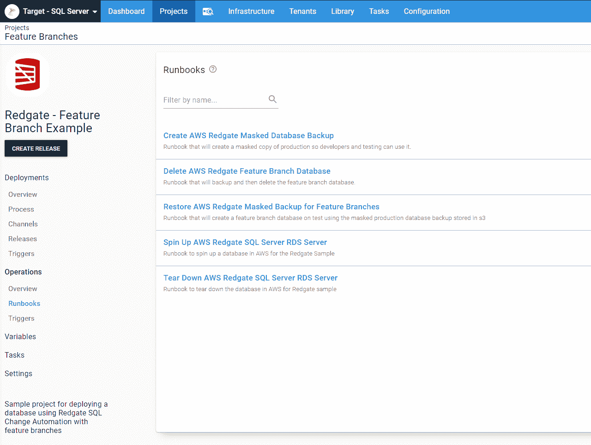
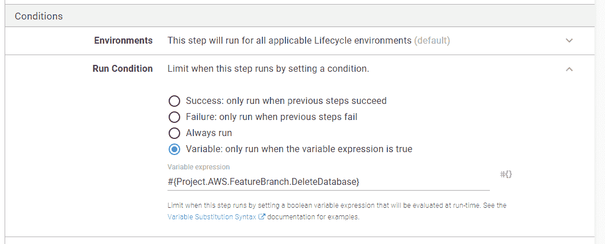

# 数据库功能分支部署- Octopus 部署

> 原文：<https://octopus.com/blog/database-feature-branch-deployments>

[](#)

在我的上一篇文章[重新思考特性分支部署](/blog/rethinking-feature-branch-deployments)中，我分享了我如何调整对特性分支部署的思考。像那篇文章那样写思想实验是一回事，但把它付诸实践又是另一回事。在本文中，我描述了如何为特性分支建立数据库部署过程。

## 快速回顾

TL；DR；对[重新思考的特性分支部署](/blog/rethinking-feature-branch-deployments)是:

使用 git 时， **开发➜测试➜试运行➜生产** 的静态工作流不工作。Git 使得创建特性分支变得非常容易。静态工作流本质上要求每个人将他们的代码签入到主干(主或开发)中进行适当的测试。这导致了三个问题:

1.  未完成的代码进入`master`，需要被测试。
2.  对于 bug 修复，没有清晰的路径通向**生产**，需要一个变通办法，比如建立一个 bug 修复分支，只包含准备➜生产。
3.  开发人员同时处理 2 到 N 个特性是很常见的。这意味着将未完成的代码合并到一个主干中。这增加了不正确的合并冲突解决的机会，这反过来减慢了测试和开发。

为解决这些问题，应进行以下更改:

1.  将 **Dev** 和 **Test** 组合成一个环境: **Test** 。
2.  在**测试**中，每个特性分支都应该有一个独立的沙箱。
3.  在 QA 测试和验证了一个特性分支之后，它应该被合并到主特性中。
4.  主设备的部署从**阶段**开始，从不经过**测试**。
5.  **测试**成为一个动态环境，根据需要添加和删除资源。**分期**和**生产**是静态稳定的。

潜在的目标是代码不应该被合并到`master`中，直到它准备好进入**生产**。

## 功能分支数据库部署业务规则

看到这些变化，自然会有很多疑问。

*   何时创建要素分支沙盒？
*   它应该是一个全新的数据库，还是应该恢复一个备份？
*   如果是恢复的备份，应该备份什么？生产还是分期？
*   应该多久进行一次备份？
*   最后，那个沙盒什么时候被拆掉？

那些问题仅仅是关于在**测试**中特性分支沙箱的创建！我还经常遇到其他一些问题。许多这样的问题都集中在数据库部署过程中建立信任。

*   数据库管理员应该在什么时候参与进来？**生产**为时已晚，而在**测试中创建特性分支**为时过早。
*   谁应该触发**生产**的部署？
*   是否可以调度**生产**部署，并且只在出现问题时呼叫数据库管理员？
*   我们能在不做**生产**部署的情况下看到**生产**吗？

对于我的流程，我做了以下决定:

1.  每个部署将检查功能分支数据库，如果它没有看到，创建一个新的。
2.  创建特征分支数据库时，恢复**暂存**的副本。
3.  将在每次部署到**转移**时创建**转移**备份。
4.  当特征分支数据库合并到主数据库时，备份并删除特征分支数据库。
5.  **试运行**部署还将为**生产**生成一份增量报告。这样，数据库管理员只需批准一次发布。
6.  数据库管理员将批准所有部署到**暂存**。
7.  逻辑将确保 DBA 只有*有*来批准某些模式变更；创建表、删除表、创建视图、删除视图、更改表等。以保持低信噪比。
8.  数据库管理员将触发**生产**部署。他们可以安排或立即开始。

在开发生命周期中，让数据库管理员在**生产**部署之前参与进来是至关重要的。他们负责保持**生产**运行，并要求他们在**生产**部署失败时快速检查变更。虫子就是这么溜进来的。DBA 是很忙的人，他们可以就潜在的数据库更改进行咨询，但是在开发一个特性时，不应该要求他们批准数据库更改。当一个特性开始开发的时候和当这个特性最终被 QA 签署的时候，这个表的结构看起来会有很大的不同。

另一个选择是将 DBA 作为拉请求的评审者。这样，代码就不会被合并到还没有准备好进入**产品**的`master`中。所有这些都取决于 DBA 的数量、他们必须支持的团队的数量，以及在给定的一天中被合并到`master`的变更的数量。要求两个 DBA 组成的团队审查合并到`master`的 20 个团队的所有拉请求，平均每天一两次，这让 DBA 很容易失败。

## Octopus 部署配置

对于本文，我将部署到托管在 [AWS RDS](https://docs.aws.amazon.com/AmazonRDS/latest/UserGuide/Welcome.html) 中的 SQL Server。我选择 AWS RDS 没有别的原因，只是因为我被要求使用 AWS RDS 设置一个示例。我在这个示例项目中做的大约 95%的事情可以在 Azure SQL 或自托管 SQL Server 中完成。我利用了一些特定于 AWS RDS 的特性，但不是很多。

您可以在我们的公共[示例实例](https://samples.octopus.app/app#/Spaces-106)中找到这个示例项目/空间。你可以作为一个客人登录，四处打探。

### 生活过程

我在 Octopus Deploy 中创建了两个生命周期，`AWS Default Lifecycle`和`AWS Feature Branch Lifecycle`。在构建这个例子时，我使用了前缀`AWS`将它们与我的其他项目分开:

[](#)

### AWS 帐户

我使用 IaC 来加速和减速 AWS RDS 实例。我选择的 IaC 技术是 [AWS CloudFormation](https://aws.amazon.com/cloudformation/) ，因为我的同事 Shawn 已经有了一个 PostgreSQL 的 RDS 示例，我可以为 SQL Server 复制和操作它。为了从 Octopus 调用 CloudFormation，我需要在 Octopus 中注册一些 AWS 帐户:

[](#)

### 静态 AWS 基础设施和库变量集

对于我的例子，我使用 IaC 或基础设施作为代码，来启动和关闭 AWS RDS 实例。在现实世界中，我不认为这是现实的，特别是对于**生产**和**暂存**数据库。即使当我在 AWS 中使用 IaC 功能时，我也喜欢有一些静态基础设施，即[VPC](https://aws.amazon.com/vpc/)、[安全组](https://docs.aws.amazon.com/vpc/latest/userguide/VPC_SecurityGroups.html)和[子网](https://docs.aws.amazon.com/vpc/latest/userguide/VPC_Subnets.html)。虽然可以使用 IaC 上下旋转它们，但这在现实世界中并不实用。许多公司喜欢在他们的数据中心和 AWS 之间建立 P2P VPN 连接。你必须使用 IaC 来旋转它，如果你能让它工作，那就太棒了。我发现它有点挑剔。

我知道我会共享 VPC、安全组、子网等。，所以我喜欢创建多个变量集来存储不同的变量组。我从不建议使用一个庞大的全局变量集。一段时间后，它变成了一个[变量的垃圾抽屉](https://www.npr.org/sections/theprotojournalist/2014/08/15/337759135/what-your-junk-drawer-reveals-about-you):

[](#)

变量集本身包含相关的变量。我通常不会让安全组和子网成为敏感变量。然而，这个实例是公开的，我不想与外界分享这些信息:

[](#)

您会注意到我的变量遵循名称间距格式`[variablesetname].[group].[variablename]`。我这样做是为了以后更容易找到变量。以我知道的`Project`开头的变量存储在项目变量中，而以我知道的`AWS`开头的变量存储在`AWS`变量集中。它还有助于防止变量名冲突。

### 工人和安全

将 AWS RDS 服务器暴露在互联网上是不明智的，即使是我正在旋转的示例服务器也是如此。我将使用 S3 来存储我的数据库的备份。暴露这一点也是不明智的。即使是章鱼云也不行。我将我的安全组配置为只接受来自端口 80、端口 443 和端口 10933 的请求。我在 AWS 中创建了一个 EC2 实例，并将其注册为一个 [worker](https://octopus.com/docs/infrastructure/workers) 。该 EC2 实例具有通过端口 1433 上传到 S3 以及连接到 AWS RDS 实例的权限:

【T2 

在现实世界的**生产**配置中，我会使用不止一个工人。我有多个工作池，一个用于不同的环境，并使用变量作用域来动态选择合适的工作池。但是这个例子已经够复杂了，没必要再增加复杂性了。

## Octopus 部署项目

现在，所有的脚手架都已拆除，是时候专注于项目了。

我使用了社区库中的一些步骤模板。以下是列表，因此您可以自己安装它们:

### 运行手册

我的项目中有五个[run book](https://octopus.com/runbooks)来处理特性分支部署的各种维护任务。我将它们都放在同一个项目中，以便您在查看我们的[示例实例](https://samples.octopus.app/app#/Spaces-106/projects/redgate-feature-branch-example/operations/runbooks)时更容易找到它们。使用我创建的 Run Octopus Deploy Runbook 步骤模板，Runbook 可以存在于任何项目中。如果我在现实世界中进行设置，所有这些操作手册都将位于一个单独的*特性分支*项目中，以供任何流程利用。

[](#)

在您的用例中，您可能没有上下旋转 SQL Servers。重点关注的三个操作手册是创建屏蔽数据库备份、删除特征分支数据库和恢复特征分支的屏蔽备份。

#### 创建屏蔽的数据库备份

在此期间，我发现 AWS RDS 的一个特性是能够[将数据库备份到 S3](https://aws.amazon.com/rds/details/backup/) 。太酷了。我不必担心设置文件共享和映射所有驱动器。我运行存储过程`msdb.dbo.rds_backup_database`来将数据库备份到 S3，或者运行存储过程`msdb.dbo.rds_restore_database`来恢复数据库。我发现调用这些存储过程会启动这项工作。你必须运行`msdb.dbo.rds_task_status`来检查备份或恢复的状态。如果您有兴趣尝试，我在我们的示例实例上创建了几个自定义步骤模板:

在这个[特定的 runbook](https://samples.octopus.app/app#/Spaces-106/projects/redgate-feature-branch-example/operations/runbooks/Runbooks-365/steps/RunbookProcess-Runbooks-365) 中，过程是将现有的`Staging`数据库备份到 S3，恢复一个名为【数据库名称】的数据库副本。然后，该进程将运行一个清理脚本来清理`Staging`。之后，该过程在 S3 存储桶中创建新的备份供功能分支使用:

[](#)

有一些屏蔽数据的技术，也有你可以购买的工具，比如 [Redgate 的 SQL Server 数据屏蔽器](https://www.red-gate.com/products/dba/data-masker/)或者你可以使用你自己的屏蔽脚本。在这个例子中，我选择滚动自己的表，因为我只关心一个表。

#### 删除特征分支数据库

删除功能分支 runbook 需要的工作比我最初想象的要多一点。起初，我打算只删除数据库。但是当我想得更多的时候，首先备份数据库然后删除它更有意义。如果我需要再次启动数据库来修复一个错误，我可以使用那个备份。添加备份步骤使事情变得有点棘手，因为我需要首先检查数据库是否存在。如果数据库不存在，AWS 提供的用于备份数据库的存储过程将会失败:

[](#)

`Check for Existing Database`步骤将[输出变量](https://octopus.com/docs/projects/variables/output-variables)设置为`True`或`False`。备份和删除步骤的运行条件在[运行条件](https://octopus.com/docs/deployment-process/conditions#variable-expressions)中使用该值:

[](#)

#### 恢复功能分支的屏蔽数据库备份

恢复屏蔽数据库备份操作手册还有一个`Check for Existing Database`步骤:

[](#)

本操作手册包含额外的逻辑。大多数情况下，如果数据库尚不存在，该过程只应创建一个新的特征分支数据库。但是，在一些用例中，他们需要使用全新的数据库副本重新开始。为了帮助解决这个问题，我创建了一个[提示变量](https://octopus.com/docs/projects/variables/prompted-variables)，默认值为`False`。当设置为`True`时，将创建数据库的新副本:

[](#)

### 频道

在我需要设置的各种变量之外，项目脚手架的最后一块是[项目通道](https://samples.octopus.app/app#/Spaces-106/projects/redgate-feature-branch-example/deployments/channels)。每个项目都有一个`Default`通道，它是在项目创建时创建的。我为`Feature Branches`添加了另一个频道:

[](#)

### 部署流程

我不打算粉饰它，为了满足之前的所有业务规则，部署过程是复杂的:

[](#)

前两步创建或拆除特征分支脚手架。我*不需要*指定频道，因为**测试**和**测试**在不同的频道，但是我这样做是为了让其他人更容易阅读:

[](#)

您可能想知道，Octopus 如何知道特性分支的名称来操作适当的基础设施？并没有。构建服务器通过提示变量传递该信息。当合并的分支值为空时，将跳过删除要素分支数据库步骤:

[](#)

您可能已经在 runbooks 流程的每个截图中看到了下一步:

[](#)

这是必要的，因为该过程会启动和关闭 AWS RDS 服务器。它运行一个快速 CLI 脚本来获取要在连接字符串中使用的完整实例名称:

[](#)

部署流程中接下来的六个步骤是实际的部署。它生成增量脚本，查看这些增量脚本中的特定 SQL 语句，获得批准，最后部署更改:

【T2 

`Check SQL Artifacts for Schema Change Commands`是我写的一个[自定义步骤模板](https://samples.octopus.app/app#/Spaces-106/library/steptemplates/ActionTemplates-341?activeTab=step)。你可以在[之前的文章](https://octopus.com/blog/autoapprove-database-deployments)中读到更多关于这个步骤的内容。

你会注意到**生产**的增量脚本正在**暂存**中生成。这不是在**生产**部署中使用的增量脚本。这是为了让 DBA 了解稍后将部署到**生产**中的内容。在 99%的情况下，它对批准非常有效。在增量脚本生成时间和它们实际运行的时间之间存在偏差的风险。但是，总的来说，这种风险很小，漂移量通常也很小。通过批准 **Staging** 中的所有内容，DBA 可以将部署安排到**生产**中，而不必在线。

部署过程的最后步骤处理清理和通知。在每个**阶段**部署之后，会创建一个数据库的新的屏蔽副本。这确保了要素分支始终具有最新的模式更改:

[](#)

## 构建服务器

对于静态环境，构建服务器的过程非常简单:

1.  建设
2.  试验
3.  推动章鱼展开
4.  在 Octopus 部署中创建一个版本
5.  部署发布

现在构建服务器需要在调用 Octopus Deploy 之前做出一些决定。它必须知道它是在一个特征分支上，在主分支上，还是刚刚发生了一个合并。触发构建的事件将改变构建服务器发送给 Octopus 的信息。主要区别在于:

*   入住`Master`:
    *   如果合并拉请求，获取特征分支名称，将其作为*合并分支*值发送给 Octopus Deploy。
    *   将目标环境设置为**暂存**。
    *   将包版本号设置为标准版本号，比如`2020.2.1.{Build Number}`。
    *   将频道名称设置为“默认”。
*   检入要素分支:
    *   提取特征分支名称，并将其作为*特征分支*值发送给 Octopus Deploy。
    *   将目标环境设置为**测试**。
    *   将软件包版本号设置为 2020.99.99。-.
    *   将通道名称设置为“特征分支”。

这是我的 [GitHub 操作](https://github.com/OctopusSamples/OctopusTrident/blob/master/.github/workflows/packageredgate.yml)中的 PowerShell 脚本:

```
$branchName = ((${env:GITHUB_REF} -replace "refs/heads/", "") -replace "feature/", "") -replace "hotfix/", ""
Write-Host "$branchName"  

$versionFromFile = Get-Content versionprefix.md
Write-Host "Found $versionFromFile in versionprefix.md"
$versionNumber = "$versionfromFile.${env:GITHUB_RUN_NUMBER}"

$channelName = "Default"
$deployEnvironment = "Staging"
$mergedBranch = ""

$commitMessage = git log -1 --pretty=oneline
Write-Host "The commit message is: $commitMessage"

if ($branchName -ne "master")
{
    $versionNumber = "2020.99.99.${env:GITHUB_RUN_NUMBER}-$branchName"    
    $channelName = "Feature Branches"
    $deployEnvironment = "Test"           
}
elseif ($branchName -eq "master" -and $commitMessage -like "*Merge pull request*")
{          
    $indexOfSlash = $commitMessage.ToString().IndexOf('/')
    Write-Host "The index of the slash is $indexOfSlash"
    $mergedBranch = $commitMessage.SubString($commitMessage.IndexOf("/") + 1)
    Write-Host "The merged branch before replacement is $mergedBranch"
    $mergedBranch = ($mergedBranch -replace "feature/", "") -replace "bugfix/", ""          
    Write-Host "The merged branch is now $mergedBranch"
}

Write-Host "Setting environment variable PACKAGE_VERSION to: $versionNumber"
Write-Host "Setting environment variable BRANCH_NAME to: $branchName"
Write-Host "Setting environment variable CHANNEL_NAME to: $channelName"
Write-Host "Setting environment variable ENVIRONMENT_NAME to: $deployEnvironment"
Write-Host "Setting environment variable MERGED_BRANCH to: $mergedBranch"

echo "::set-env name=BRANCH_NAME::$branchName"
echo "::set-env name=PACKAGE_VERSION::$versionNumber"
echo "::set-env name=CHANNEL_NAME::$channelName"
echo "::set-env name=ENVIRONMENT_NAME::$deployEnvironment"
echo "::set-env name=MERGED_BRANCH::$mergedBranch" 
```

## 结论

为特性分支建立沙箱的概念是我的一个爱好。我在很多地方工作过，但我们没有这样做，这很令人头疼。这不是一项简单的任务，但是通过利用 Octopus Deploy 中的多个特性，这项任务变得更加容易。我在 Octopus Deploy 中使用了一些新功能。Runbooks 带来了巨大的变化，让事情变得简单多了。但是回想起来，我希望我知道这种方法，因为我知道我可以得到一些工作，即使是在 3.x 版本的 Octopus Deploy 上。这将涉及更多的 API 脚本，但我知道我可以让它工作。

很难相信这其实是一个简单的例子。在本文中，我只介绍了数据库；我没有介绍 web 服务器或应用服务器。除此之外，我没有涉及涉及多个应用程序的大项目。对于这篇文章，我想把重点放在一件事情上，即数据库。我的想法是，如果我可以解决数据库，其余的应该相当简单。

下次再见，愉快的部署！