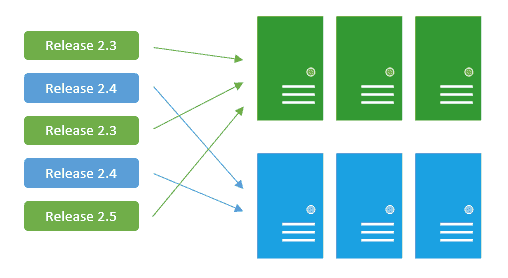

# 自动化蓝/绿数据库部署- Octopus 部署

> 原文：<https://octopus.com/blog/databases-with-blue-green-deployments>

[](#)

没有人想在周六凌晨 2 点进行部署，但几年前，我开发了一个应用程序，那是唯一一次可以安排长时间停机。快速部署和验证花了两个小时。典型的部署需要四个小时。我想实施蓝/绿部署，这允许零停机部署，但是应用程序的数据库使一切变得非常复杂，足以阻止我们转向蓝/绿部署。

在这篇文章中，我将介绍我从那时起学到的一些技术，使数据库的蓝/绿部署变得简单可行。

我将介绍高级概念和建议，但不会详细介绍如何使用 Octopus Deploy 进行蓝/绿部署。我们将在以后的文章中讨论这个问题。

## 蓝/绿部署简介

蓝绿色部署有两个相同的生产环境，一个标记为`Blue`，另一个标记为`Green`。只有一个环境是活动的，部署总是在非活动环境中进行。例如，如果`Green`是活动环境，则部署到`Blue`(非活动)环境，并且在发生验证之后，发生切换，这使得`Blue`环境成为活动环境，而`Green`环境成为非活动环境。

[](#)

这种方法有几个优点。回滚只是从`Blue`切换到`Green`或者从`Green`切换到`Blue`的问题。当切换发生时，它们是无缝的，因为代码已经运行，不需要等待它编译或预热。更改在生产中得到验证，无需任何客户点击代码，这降低了部署中的风险。如果某些东西不起作用，你不要切换，你可以再试一次。

需要注意的是，并非所有应用都可以利用蓝/绿部署。它是架构、应用程序的状态以及所使用的技术的组合。应用程序的无状态性和解耦性越强，蓝/绿部署策略就越适合。例如，与需要来自负载平衡器的粘性会话并且没有业务逻辑或数据层的 ASP.NET Web forms 应用程序相比，具有倾斜前端的. NET Core Web API 更适合蓝/绿部署。

## 场景

这篇文章涵盖了一个复杂的场景，使用一个[单页面应用程序](https://en.wikipedia.org/wiki/Single-page_application) (SPA)和一个连接到专用数据库的 ASP.NET Web API 后端。将对应用程序进行以下更改:

*   在 UI 中，字段`First Name`和`Last Name`被合并成一个名为`Full Name`的字段。并非所有的文化都使用名和姓。
*   名为`CustomerFullName`的新列将被添加到 customer 表中。
*   预先存在的`CustomerFirstName`和`CustomerLastName`列也在客户表上。
*   当`CustomerFullName`为`Null`时，将通过组合`CustomerFirstName`和`CustomerLastName`来填充`CustomerFullName`。
*   如果数据存在于`CustomerFirstName`和`CustomerLastName`中，并且 API 请求仅与`CustomerFullName`一起发送，则不要将这些列设置为`Null`。此外，不要试图分割`CustomerFullName`，因为这非常困难且容易出错。

诚然，这个场景相对复杂。大多数数据库更改不会将两列合并成一列并尝试回填新列，但是如果这种情况可以解决，那么大多数其他情况也可以解决。我们将逐一介绍每项变更、要考虑的问题、解决这些问题的建议，以及成功的蓝/绿部署必须完成的许多不同的变更。

本文中我们部署的蓝色和绿色环境如下所示:

*   `Green`是直播。
*   `Blue`不活跃。

也就是说，我们将部署到`Blue`，在`Blue`通过验证后，它将成为活动环境，`Green`将变为非活动状态。

本文中的具体步骤只是建议，并不涵盖您可以对数据库进行的所有可能的更改。我的目标是给你提供一些你可以修改的东西来满足你的需求。

## 数据库更改如何增加复杂性

下班后部署是为了避免用户在部署和验证代码和数据库更改时访问应用程序。因为所有的更改都是同时发生的，所以将编写一个回填脚本来将`CustomerFullName`设置为`CustomerFirstName`和`CustomerLastName`。如果用户在这些变化发生时访问应用程序，将会导致错误和混乱。

这种变化的一个非常简单的部署过程如下所示:

1.  禁止用户访问或关闭网站。
2.  运行脚本来添加列`CustomerFullName`。
3.  将代码部署到`Production`。
4.  运行回填脚本来填充`CustomerFullName`。
5.  运行脚本删除`CustomerFirstName`和`CustomerLastName`。
6.  验证`Production`中的代码。

要完成蓝/绿部署的相同变化，需要更多的规划。如果没有蓝/绿部署，唯一的担心是有人可能会在部署和验证一切之前使用该应用程序。如果用户得到一个错误，指出有一列丢失了，不要担心，无论如何，他们不应该出现在系统中。蓝/绿部署的情况并非如此。用户将在应用程序中；它们将运行在`Green`服务器上，这意味着数据将被操作和查询。

以下是对蓝/绿部署进行相同更改时要考虑的一些情况:

*   应用程序和数据库更改将被部署到`Blue`，包括新列`CustomerFullName`。应用程序使用任何存储过程吗？具体来说，在 customer 表中插入/更新数据？运行在`Green`上的代码不会知道添加到那些存储过程中的任何新参数。
*   当变更被部署到`Blue`时，`CustomerFullName`列中将没有数据。何时应该回填该列？使用为停机部署创建的相同回填脚本？
*   在将应用程序和数据库的更改部署到`Blue`之后，需要进行验证。在此期间，用户将使用`Green`上的应用程序，该应用程序仍在运行引用`CustomerFirstName`和`CustomerLastName`列的代码。在验证完成且`Blue`激活之前，不能删除这些列。应该在什么时候删除这些列？一旦`Blue`激活？
*   在`Blue`上验证更新的代码和数据库时，用户将使用`Green`上的代码在客户表中添加和更新记录。如果在验证之前运行回填脚本，这些更改将不会生效。是否应该重新运行回填脚本？
*   因为这是一个 SPA 应用，JavaScript 不知道什么时候`Blue`变成活动的，什么时候`Green`变成非活动的。JavaScript 存储在用户的浏览器中。当`Blue`开始运行时，使用该应用程序的用户将会发送只包含`CustomerFirstName`和`CustomerLastName`字段的 API 请求。在此期间不会发送`CustomerFullName`字段。在用户开始从服务器请求更新的 JavaScript 文件之前，可能需要一分钟到几天的时间。

针对此变更的蓝/绿部署流程的第一次尝试可能如下所示:

1.  运行脚本来添加列`CustomerFullName`。
2.  运行回填脚本来填充`CustomerFullName`。
3.  将代码部署到`Blue`环境中。
4.  在`Blue`环境中验证代码和数据库的变化。
5.  将现场环境从`Green`切换到`Blue`。
6.  运行回填脚本来填充`CustomerFullName`。

这不是理想的蓝/绿部署流程。它多次运行回填脚本，它不回答什么时候应该删除`CustomerFirstName`和`CustomerLastName`，但它是一个开始。

## 数据库更改

我坚信数据库应该只存储数据。数据库不应包含业务规则或业务逻辑。只有代码应该存储业务规则和业务逻辑。当数据库存储业务规则或业务逻辑时，会使蓝/绿部署变得更加困难。

数据库中的业务逻辑包括但不限于格式化、计算、IsNull 检查的包含、if/then 语句、while 语句、默认值以及不仅仅按 ID 进行过滤。即使它是一个空字符串或零，这些都是值。如果一列没有值，需要设置为`Null`，也就是没有值。在数据库中拥有业务规则和业务逻辑是自找麻烦。与 C#、JavaScript 或 Java 等代码相比，它们更难编写单元测试，即使使用 tSQLt 这样的工具也是如此。开发人员也很难找到它们，因为通常大多数开发人员使用他们选择的 IDE 进行搜索，不包括数据库。

本节介绍了支持蓝/绿部署的表更改、存储过程和视图更改的建议。它还将涵盖如何避免在数据库中包含业务规则和业务逻辑的技术。

### 表格更改

在进行蓝/绿部署时，您应该进行非破坏性的数据库更改。在我们的场景中，这意味着在添加时使`CustomerFullName`可为空。在没有默认值的情况下使列不可为空将是一种破坏性的改变。对`Green`的 Insert 语句将停止工作，因为它不知道这个新列。这并不意味着应该用默认值使列不可为空；即使是空字符串。请记住，默认值是一个业务规则。

另一个问题是，对于大多数数据库服务器(即 SQL Server 或 Oracle)来说，添加一个不可为空的列需要花费相当多的时间。当添加不可为空的列时，表定义会随每条记录一起更新。当添加可为空的列时，只更新表定义。如果您必须有一个默认值，那么脚本应该添加一个可为空的列，更新所有记录，然后将该列设置为不可为空。这个脚本可以被调整到惊人的速度。

破坏性数据库更改的一些其他示例包括重用现有列或重命名现有列。蓝/绿部署会失败，因为`Green`中的代码会抛出错误或显示不准确的数据。

到目前为止，本节已经介绍了如何向 customer 表中添加新列`CustomerFullName`。老的`CustomerFirstName`和`CustomerLastName`栏目呢？在场景部分，它实际上是说不要去管`CustomerFirstName`和`CustomerLastName`。不要用`Null`覆盖它，也不要试图猜测那些值会是什么。此外，一旦`Blue`开始使用这些更改，任何新记录都不会有`CustomerFirstName`和`CustomerLastName`的值，这意味着`CustomerFirstName`和`CustomerLastName`应该可以为空。

在某个时候，`CustomerFirstName`和`CustomerLastName`列将被删除。蓝绿色部署也使这变得更加复杂。假设`CustomerFullName`已经部署到`Blue`上，并且处于活动状态。运行脚本从所有表、视图、函数和存储过程中删除`CustomerFirstName`和`CustomerLastName`会导致错误。当`CustomerFullName`为空时，运行在`Blue`上的代码使用`CustomerFirstName`和`CustomerLastName`字段来填充`CustomerFullName`。

从数据库中删除这些列需要多次部署。

1.  部署将`CustomerFullName`添加到客户表中。需要`CustomerFirstName`和`CustomerLastName`，因为旧代码仍然引用它们。
2.  另一个部署发生了，代码删除了对`CustomerFirstName`和`CustomerLastName`的所有引用。
3.  最终部署从数据库中删除`CustomerFirstName`和`CustomerLastName`。

有了这样的限制，如何删除`CustomerFirstName`和`CustomerLastName`列呢？要回答这个问题，请看一个有中断的典型标准部署。

这些部署不一定要在几天之内完成。我看到每一次部署都相隔几个月。

### 存储过程和视图

假设应用程序有两个存储过程:

*   `usp_GetCustomerById`
*   `usp_GetAllCustomers`

从根本上说，它们都是从数据库中获取客户。`CustomerFullName`是一个新列，但它是空的。如前所述，回填脚本提出了很多问题。一种选择是完全跳过回填脚本，让存储过程进行快速的 IsNull 检查:

```
Select CustomerFirstName,
       CustomerLastName,
       IsNull(CustomerFullName, CustomerFirstName + ' ' + CustomerLastName) as CustomerFullName
from dbo.Customer 
```

只隐藏坏的或丢失的数据；它不能解决丢失的数据。它是一行程序，很容易复制粘贴到其他存储过程。在这个例子中，只有一个其他的存储过程，但是如果有人添加了一个存储过程，他们需要记住包括这个一行程序。当需要从数据库中删除`CustomerFirstName`和`CustomerLastName`时，也有可能忘记更新存储过程。想象一下，如果一个存储过程有 50 列，而`CustomerFullName`与`CustomerFirstName`和`CustomerLastName`之间有几十行。

检索到的存储过程和视图应该按原样返回数据，不进行任何空检查或格式化:

```
Select CustomerFirstName,
       CustomerLastName,
       CustomerFullName
from dbo.Customer 
```

创建或更新存储过程略有不同。`Green`将在`Blue`被验证时激活。`Green`没有`CustomerFullName`的概念，这意味着它将调用不包含新列的存储过程。当`Blue`激活时，它将不再向存储过程发送`CustomerFirstName`和`CustomerLastName`字段。存储过程需要处理来自`Blue`或`Green`的调用:

```
ALTER procedure [dbo].[usp_UpdateCustomer] (
    @CustomerId int,
    @CustomerFirstName varchar(128) = null,
    @CustomerLastName varchar(128) = null,
    @CustomerFullName varchar(256) = null
)
Begin
    Update dbo.Customer
        set CustomerFirstName = @CustomerFirstName,
            CustomerLastName = @CustomerLastName,
            CustomerFullName = @CustomerFullName
    where CustomerId = @CustomerId
End
Go 
```

可以在不指定列的情况下运行插入命令，但是您不应该这样做。指定所有列。这只会带来麻烦，因为 insert 语句中的列顺序必须与表中的列顺序相匹配。如果在表的中间添加了一列(这种情况会发生！)，insert 语句将开始随机失败或将数据插入错误的列。插入存储过程将类似于更新存储过程，在这种情况下，所有参数都将默认值设置为`Null`以处理调用它的`Blue`和`Green`:

```
ALTER procedure [dbo].[usp_InsertCustomer] (    
    @CustomerFirstName varchar(128) = null,
    @CustomerLastName varchar(128) = null,
    @CustomerFullName varchar(256) = null
)
Begin
    Insert into dbo.Customer (CustomerFirstName, CustomerLastName, CustomerFullName)
        value (@CustomerFirstName, @CustomerLastName, @CustomerFullName)

    select SCOPE_IDENTITY()  
End
Go 
```

视图在提供抽象层方面非常出色，如果编写正确，可以极大地提高性能。然而，我见过太多写得很差的，最终导致性能问题的。为了帮助解决这些性能问题，打破了数据库中没有业务逻辑的规则。我建议尽可能避免这种情况。就像存储过程一样，返回所有三列，`CustomerFirstName`、`CustomerLastName`和`CustomerFullName`。

视图的一个日常用例是帮助数据仓库。抽象层视图提供了一个流程，可以轻松地将所有数据复制到数据仓库中，商业智能团队可以用它来创建报告。没有一种正确的自动化方法让数据仓库知道这种变化。我的建议是尽快把变化通知他们。

我意识到将业务逻辑移出数据库是一个相当大的变化。如果你真的决定做出改变，那就务实一点。不要试图一下子改变一切。代码和数据库现在工作正常。这一部分是关于数据库未来的变化。我总是试图让数据库和代码处于比我发现它时更好的状态。也就是说，如果我对某一列进行了更改，并且在数据库中发现了该列的业务规则，我会进行一些分析。如果改变相对容易，我会去做。如果它很复杂，我将创建一个卡片，并把它放在我们的技术债务待办事项中，以便以后解决(希望如此)。

## 代码更改

如数据库更改一节所述，业务规则和业务逻辑应该存在于代码中。该场景定义了一些需要放入代码中的业务规则。

*   当`CustomerFullName`为`Null`时，将通过组合`CustomerFirstName`和`CustomerLastName`填充`CustomerFullName`。
*   如果数据存在于`CustomerFirstName`和`CustomerLastName`中，并且 API 请求仅与`CustomerFullName`一起发送，则不要将这些列设置为`Null`。此外，不要试图分割`CustomerFullName`，因为这非常困难且容易出错。

下一节将使用 C#作为示例语言，介绍如何将这些规则放入代码中的技术。

### 处理 CustomerFullName 中的 Null

在存储过程中放置这样的检查非常容易，但是如前所述，这不是一个好主意。

```
IsNull(CustomerFullName, CustomerFirstName + ' ' + CustomerLastName) as CustomerFullName 
```

另一种选择是将格式规则放在表示客户表的模型中:

```
public class CustomerModel
{
    private string _fullName;

    public int CustomerId {get; set;}
    public string FirstName {get; set;}
    public string LastName {get; set;}
    public string FullName
    {
        get
        {
            if (string.IsNullOrDefault(_fullName))
            {
                return this.GetFormattedFullName();
            }

            return _fullName;
        }
        set
        {
            if (string.IsNullOrDefault(value))
            {
                _fullName = this.GetFormattedFullName();
            }
            else
            {
                _fullName = value;
            }
        }
    }

    public string GetFormattedFullName()
    {
        return $"{this.FirstName} {this.LastName}";
    }
} 
```

如果所有层(UI、业务和数据库)都使用相同的模型，那就很好了。这需要很强的纪律性，因为模型和数据库必须是一对一的匹配，而事实往往并非如此。

以下是将所有逻辑放入模型的替代方法:

```
public Interface ICustomer
{
    public int CustomerId {get;set;}
    public string FirstName {get;set;}
    public string LastName {get;set;}
    public string FullName {get;set;}
}

public Interface ICustomerDataAdapter
{
    void InsertCustomer(ICustomer customer);
    void UpdateCustomer(ICustomer customer);
    ICustomer GetCustomerById(int customerId);
}

public static class CustomerNameFormatter
{
    public string GetFullName(this ICustomer customer)
    {
        if (string.IsNullOrWhiteSpace(customer.FullName) == false)
        {
            return customer.FullName;
        }

        return $"{customer.FirstName} {customer.LastName}";        
    }
}

public class CustomerFacade
{
    private ICustomerDataAdapter _customerDataAdapter;

    public CustomerFacade(ICustomerDataAdapter customerDataAdapter)
    {
        _customerDataAdapter = customerDataAdapter
    }

    public void GetCustomerById(int customerId)
    {
        var customer = _customerDataAdapter.GetCustomerById(customerId);

        customer.FullName = customer.GetFullName();        

        _customerDataAdapter.UpdateCustomer(customer);
    }
} 
```

使用相同的格式化程序扩展方法，插入客户记录的逻辑如下所示:

```
public Interface ICustomer
{
    public int CustomerId {get;set;}
    public string FirstName {get;set;}
    public string LastName {get;set;}
    public string FullName {get;set;}
}

public Interface ICustomerDataAdapter
{
    void InsertCustomer(ICustomer customer);
    void UpdateCustomer(ICustomer customer);
    ICustomer GetCustomerById(int customerId);
}

public static class CustomerNameFormatter
{
    public string GetFullName(this ICustomer customer)
    {
        if (string.IsNullOrWhiteSpace(customer.FullName) == false)
        {
            return customer.FullName;
        }

        return $"{customer.FirstName} {customer.LastName}";        
    }
}

public class CustomerFacade
{
    private ICustomerDataAdapter _customerDataAdapter;

    public CustomerFacade(ICustomerDataAdapter customerDataAdapter)
    {
        _customerDataAdapter = customerDataAdapter
    }

    public void InsertCustomer(ICustomer customer)
    {
        var existingCustomer = _customerDataAdapter.GetCustomerById(customer.CustomerId);

        customer.FullName = customer.GetFullName();        

        _customerDataAdapter.InsertCustomer(customer);
    }
} 
```

### 不要覆盖 CustomerFirstName 或 CustomerLastName

在`Blue`上的更改生效后，在`CustomerFirstName`和`CustomerLastName`列中仍然会有数据，将这些数据设置为 null 对代码来说是不好的。对于新记录，这些数据将不会出现。代码不应该试图猜测如何将名字和姓氏分开。对于现有记录，代码应该保持数据不变。对于新记录，需要将这些列设置为`Null`。

就像以前一样，有一种让 update 语句在参数中检查 null 的诱惑(它只有一行，有什么坏处呢？):

```
 set CustomerFirstName = IsNull(@CustomerFirstName, CustomerFirstName) 
```

`Blue`的代码应该是空支票所在的地方。将`IsNull`支票放入数据库隐藏了一个业务规则，这是我们想要避免的:

```
public Interface ICustomer
{
    string FirstName {get;}
    string LastName {get;}
    string FullName {get;}
}

public Interface ICustomerDataAdapter
{
    void InsertCustomer(ICustomer customer);
    void UpdateCustomer(ICustomer customer);
    ICustomer GetCustomerById(int customerId);
}

public class CustomerFacade
{
    private ICustomerDataAdapter _customerDataAdapter;

    public CustomerFacade(ICustomerDataAdapter customerDataAdapter)
    {
        _customerDataAdapter = customerDataAdapter
    }

    public void UpdateCustomer(ICustomer customer)
    {
        var existingCustomer = _customerDataAdapter.GetCustomerById(customer.CustomerId);

        customer.FirstName = string.IsNullOrEmpty(customer.FirstName) ? existingCustomer?.FirstName : null;
        customer.LastName = string.IsNullOrEmpty(customer.LastName) ? existingCustomer?.LastName : null;

        _customerDataAdapter.UpdateCustomer(customer);
    }
} 
```

## 用数据回填新列

我见过的大多数回填脚本只不过是一个更新底层数据的 SQL 脚本。这意味着格式化逻辑将同时存在于代码和回填脚本中。很容易更新代码以更新格式规则，但忘记更新回填脚本。我也遇到过这种事。相信我，这是糟糕的一天。

此外，对于蓝/绿部署，您必须决定何时运行脚本:

*   在代码已经部署到`Blue`并且数据库更改已经推出之后，但是在验证开始之前？
*   还是在`Blue`上线后，而`Green`已经失效？

您还必须考虑:

*   传统的回填 SQL 脚本更新低级数据，并可能锁定表。
*   根据记录的数量，脚本可能需要很长时间。也许决定在 SQL 脚本中一次更新 1000 条记录。
*   如果用户在更新与脚本相同的记录时发生死锁，该怎么办；如果脚本赢得死锁，而不是用户更新，可以吗？
*   根据脚本运行的时间，它可能需要有适当的保护条款来防止意外更新。

此外，大多数数据库部署工具，如 Redgate、DBUp、RoundhousE 和 SSDT，都没有多次运行特定 SQL 脚本的机制。如果没有内置的功能，就需要一个黑客来支持它。

代码已经有了格式化规则。它有必要的逻辑来处理各种场景。它应该有单元测试来覆盖它。这是 QA 验证的。回填脚本应该用 PowerShell 或者 Bash 编写，调用 API，而不是直接更新数据库。它可以查询数据库来查找客户列表，然后使用该客户列表来访问 API。可以将逻辑添加到脚本中，以最小化脚本和用户同时更新记录的风险。也许与客户相关的用户有一个时区偏好，脚本通过一个自动化的过程每小时运行一次，并且只在用户的时区在凌晨 2 点到 3 点之间时更新记录

下面是用 PowerShell 编写的回填脚本示例:

```
$url = "https://myapp/api"
$apiKey = "Some Key"
$header = @{ "apiKey" = $apiKey }
$connectionString = "Server=MyServer;Database=ApplicationDatabase;integrated security=true;"

$sqlConnection = New-Object System.Data.SqlClient.SqlConnection
$sqlConnection.ConnectionString = $connectionString

$command = $sqlConnection.CreateCommand()
$command.CommandType = [System.Data.CommandType]'Text'
$command.CommandText = "Select CustomerId
        from Customer
        where IsNull(CustomerFullName, '') = ''
            and (IsNull(CustomerFirstName, '') <> '' or IsNull(CustomerLastName, '') <>'')"            

$sqlConnection.Open()

$dataAdapter = new-object System.Data.SqlClient.SqlDataAdapter $SqlCommand
$dataSet = new-object System.Data.DataSet
$dataAdapter.Fill($dataSet)

$sqlConnection.Close()

$customerTable = $dataSet.Tables[0]

foreach($customerRow in $customerTable)
{
    $customerId = $customerRow["CustomerId"]

    Write-Host "Getting customer $customerId"
    $customer = (Invoke-RestMethod "$url/customers/$customerId" -Headers $header)

    Write-Host "Updating customer $customerId"
    $updateCustomerResult = (Invoke-RestMethod "$url/customer/$customerId" -Headers $header -Method Post -Body $customer -ContentType "application/json")
} 
```

该脚本是非破坏性的，可以随时运行，因此不需要在部署期间运行。让它在部署之外运行意味着它不会阻碍任何事情。脚本可以被启动，并且它可以根据需要插入任意长的时间。所有的时间问题都考虑到了。没有必要担心多次运行回填脚本来确保记录不会以某种方式丢失。也没必要担心跑完要多长时间。这将有助于尽可能无缝地从`Green`过渡到`Blue`。

## 版本化存储过程、视图和 API

典型的经验法则是:

> 如果你做了一个突破性的改变，那么就修改 API/存储过程/视图的版本。

理论上，这是一个很好的规则。实际上，这一规则很快就会瓦解。版本控制给维护代码的人带来了很大的负担。维护人员知道他们需要担心多个代码路径或多个实例。旧版本存在的时间越长，就越难转向新版本。我见过一些公司在项目上花费数百个小时让人们放弃旧版本。

我的建议是，默认情况下应该尽可能向后兼容地进行更改。有一个单一的代码库，单一的存储过程，单一的视图，每个人都使用。一个单一的代码库将会使维护变得更加容易，并且它将会使修改变得更加容易(随着时间的推移)。观察多次部署，随着时间的推移做出小的改变，而不是大的改变。在进入版本池之前，探索所有的选项。在用尽所有其他选项后，应该考虑版本控制。

## 何时应该部署数据库更改

在测试场景中考虑这篇文章中的所有内容；我认为数据库的变化不需要和代码同时部署。唯一的要求是，数据库更改必须在代码之前部署。在部署代码前几天甚至几周部署数据库更改可能有额外的好处。如果另一个应用程序正在使用同一个数据库(即使只是一个视图)，这将给他们时间来修改和测试他们的代码。一旦数据库更改完成，其他团队就可以在准备好的时候进行部署。

真正的问题是，在代码发布前几天甚至一周部署数据库更改有意义吗？这个问题有点难回答。我的建议是根据场景做有意义的事情，但是在部署过程中做的更改越少越好。一般来说，变更越少意味着风险越小。在代码包含风险之前将数据库变更推向生产环境。一旦开发、测试或 UAT 开始，可能需要额外的数据库更改。如果第一个变更成功进入生产环境，其他变更将需要再次进入生产环境。

我倾向于将代码和数据库存储在同一个存储库中。让所有东西都在一个功能分支中工作。同时合并特性分支中的所有变更，同时进行测试和验证。

我真正喜欢蓝/绿部署的是它为数据库部署提供的灵活性。在蓝/绿部署之前，一切都必须在部署期间同时进行。现在有一个选择。

## 测试和验证

在与`Green`交换之前对`Blue`的自动化测试和验证(反之亦然)使得一切进行得更快。自动测试和验证并不是蓝/绿部署的要求，Octopus Deploy 等部署工具具有手动干预步骤，可以暂停部署并等待直到有人批准继续进行。

大多数开始蓝/绿部署的人在第一天都没有可以在生产中运行的完整测试套件。关键是从某个地方开始。建立测试套件和克服技术障碍需要时间。根据工具的不同，即使是一个简单的场景，用`Green`改变`Blue`的 URL 也需要一点时间。当测试上线时，将它们包含在部署管道中，以帮助自动化验证。希望有一天，绝大多数用例都可以得到验证，手动干预步骤可以被移除。

## 常见的数据库更改场景

这篇文章介绍了一个非常复杂的场景，将两个专栏合并成一个。下面的列表中详细列出了其他几种数据库更改场景。对于每个场景，我都包括了哪些部分可以应用于该场景。

*   **添加新列**:除了删除旧列和处理遗留列之外，遵循所有步骤。
*   **重命名列**:不要重命名。按照上述步骤添加新列并删除旧列。
*   **增加新表**:类似于增加新列。
*   **重命名表格**:不要重命名。按照上述步骤添加新列并删除旧列。
*   **将一列移动到另一个表**:非常类似于添加新列和删除旧列。唯一的区别是添加列的位置。
*   **删除表格**:非常类似于删除列。希望不再使用该表，并且所有数据都已经迁移到其他表中。
*   **添加新视图/存储过程**:非常类似于添加新列。更新后的代码将使用新的视图/存储过程；旧代码不会使用视图/存储过程。
*   **更新现有的视图/存储过程**:只要没有从视图中删除列，这应该没问题。如果删除了列，那么应该遵循从上面删除列的过程。
*   **删除视图/存储过程**:与删除列非常相似的过程。除了没有数据，只有代码中的引用和潜在的其他存储过程。

## 总结

如您所见，数据库的蓝/绿部署需要在编写代码和更改数据库的方式上做一些小的改变。与停机时进行标准部署相比，它还需要对如何实施变更进行更多的规划。

蓝/绿部署流程的第一次尝试是这样的:

1.  运行脚本来添加列`CustomerFullName`。
2.  运行回填脚本来填充`CustomerFullName`。
3.  将代码部署到`Blue`环境中。
4.  在`Blue`环境中验证代码和数据库的变化。
5.  将现场环境从`Green`切换到`Blue`。
6.  运行回填脚本来填充`CustomerFullName`。

这个过程现在已经演变成了这样:

1.  运行脚本来添加列`CustomerFullName`。
2.  将代码部署到`Blue`环境中。
3.  在`Blue`环境中验证代码和数据库的变化。
4.  将现场环境从`Green`切换到`Blue`。

回填脚本根本不包含在内；它在部署之后运行，以帮助填充新的`CustomerFullName`列。事实上，在需要修改代码来删除`CustomerFirstName`和`CustomerLastName`列之前，该脚本不需要运行。

在结束这篇文章之前，我想指出蓝/绿部署并不适合每一种应用。它需要架构、基础设施和工具的正确组合。如果您正在考虑蓝/绿部署，请选择一个有数据库更改的特性，并通过蓝/绿部署策略来实现它。你必须改变你的应用程序的架构吗？是否有必要的基础架构，如负载平衡器和额外的虚拟机？您的 CI/CD 工具能支持蓝/绿部署吗？

就时间而言，蓝/绿部署的初始成本可能很高。如果有可能在一天当中部署变更，那么这一成本是值得的。能够做到这一点开启了许多不同的可能性。很快，对话将从“我如何在中午进行部署”转移到“蓝/绿部署就绪后，我能做些什么？”蓝绿色部署，或无缝的日间部署，感觉就像是 CI/CD 之旅的终点。我认为这只是开始。

下次再见，愉快的部署！