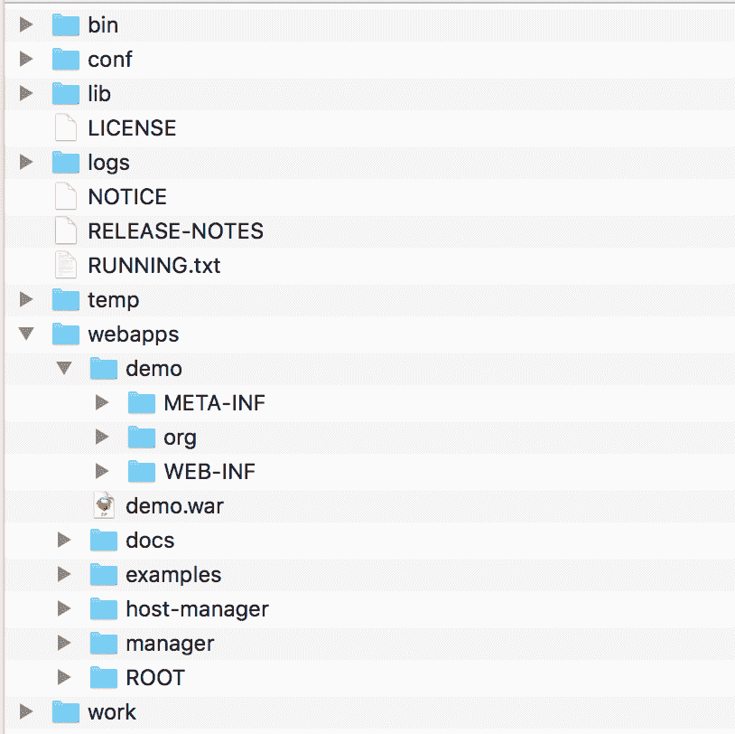

# 定义 Tomcat 上下文路径- Octopus Deploy

> 原文：<https://octopus.com/blog/defining-tomcat-context-paths>

web 应用程序的上下文路径定义了最终用户访问应用程序的 URL。像`myapp`这样简单的上下文路径意味着可以从 http://localhost:8080/myapp 这样的 URL 访问 web 应用程序。像`myapp/v1`这样的嵌套上下文路径意味着可以从 http://localhost:8080/myapp/v1 这样的 URL 访问 web 应用程序。

Tomcat 提供了许多方法来定义 web 应用程序的上下文路径，尽管配置并不像您预期的那样简单。

在这篇博文中，我们将探索 Tomcat 为部署 web 应用程序和定义它们的上下文路径提供的选项。

如果您正在寻求自动化您的 Java 部署，请点击此处开始免费的 Octopus 试用。

## `<Host>`配置元素

Tomcat 中用于部署应用程序的许多选项都是在`config/server.xml`文件的`<Host>`元素中定义的。

Tomcat 9.01 中默认的`<Host>`元素如下所示:

```
<Host name="localhost"  appBase="webapps"
      unpackWARs="true" autoDeploy="true"> 
```

下面我们将探讨这些属性如何影响 Tomcat 中的部署。

## 展开部署与战争包

部署 Java web 应用程序有两种方法。

第一种方法是部署一个 WAR 文件。WAR 文件只是一个 ZIP 存档文件，其目录结构可以被像 Tomcat 这样的 Java 应用服务器识别。WAR 文件很方便，因为它们是易于复制的单个包，并且 WAR 文件的内容被压缩，使其成为一个非常紧凑的包。

第二种方法是部署组成 web 应用程序的所有单个文件。这被称为爆炸式部署，或爆炸式战争。这种部署在开发过程中非常有用，因为像 HTML 页面和 CSS 文件这样的文件可以在应用程序动态部署和重新加载时进行编辑。

默认情况下，当您将 WAR 文件部署到 Tomcat 时，它将被提取到展开的部署中。在下面的截图中，您可以看到部署名为`demo.war`的文件的最终结果是名为`demo`的目录，其中提取了`demo.war`档案的上下文:

[](#)

可以通过将`<Host>`元素上的`unpackWARs`属性设置为`false`来禁用这种行为，这将阻止 WAR 文件在部署过程中被解包。

## `webapps`目录

`webapps`目录是 Tomcat 中部署的应用程序所在的位置。

`webapps`目录是默认的部署位置，但是这可以用`<Host>`元素上的`appBase`属性来配置。

如果 Tomcat 设置为自动部署应用程序(默认情况下是这样设置的)，那么任何复制到`webapps`文件夹中的 WAR 文件或展开的部署都会在 Tomcat 运行时自动部署。

通过将`<Host>`元素上的`autoDeploy`属性设置为`false`，可以禁用应用程序的自动部署。在这种情况下，应用程序将在启动时部署。

反过来，可以通过将`<Host>`元素上的`deployOnStartup`属性设置为`false`来禁用启动时的应用程序部署。

如果`autoDeploy`和`deployOnStartup`都为假，您可以通过在`conf/server.xml`文件的`<Host>`元素中手动添加一个`<Context>`元素来部署应用程序。参见“在`server.xml`文件中定义上下文”一节中的示例。

## 在(展开的)WAR 文件名中嵌入路径

当从`webapps`目录部署应用程序时，它将在与 WAR 文件名或展开的部署复制到的`webapps`下的目录名相匹配的上下文路径下可用。

例如，如果您部署一个名为`demo.war`的 WAR 文件，它将在`demo`上下文中可用。同样，如果您将一个爆炸的战争部署到`webapps/demo`，它也将在`demo`的上下文中可用。

Tomcat 支持嵌套的上下文路径。这些被嵌入到 WAR 文件名的单个散列字符之后。例如，如果您部署一个名为`demo#v1.war`的 WAR 文件，它将在`demo/v1`上下文中可用。上下文可以有多个层次，所以如果您部署一个名为`demo#v1#myfeature.war`的 WAR 文件，它将在`demo/v1/myfeature`上下文中可用。

同样的模式也适用于存放展开部署的目录。例如，如果您将展开的 war 部署到`webapps/demo#v1`，它将在`demo/v1`上下文中可用。

## 从`server.xml`文件定义上下文路径

通过在`conf/server.xml`文件的`<Host>`元素中添加一个`<Context>`元素，可以配置 WAR 文件或展开的部署目录。这里有一个例子:

```
<Host name="localhost"  appBase="webapps"
      unpackWARs="false" autoDeploy="false" deployOnStartup="false">
      <Context path="/mydemo/version1" docBase="demo#v1.war"/>
      ...
</Host> 
```

`docBase`属性是 WAR 文件或展开部署目录的路径。虽然可以使用绝对路径，但它是相对于`webapps`目录的。

`path`属性是我们最感兴趣的，因为它定义了应用程序的上下文路径。在这种情况下，我们已经在`/mydemo/version1`上下文中公开了 web 应用程序。

只有当战争或展开部署目录不在`webapps`目录下，或者`<Host>`元素上的`autoDeploy`和`deployOnStartup`属性为`false`时，才能定义`path`属性。

在这个例子中，我们引用了文件`webapps\demo#v1.war`，这意味着`<Host>`元素上的`autoDeploy`和`deployOnStartup`属性必须是`false`。

引用[文档](https://tomcat.apache.org/tomcat-9.0-doc/config/context.html)中的话:

> 如果不遵守这一规则，很可能会导致双重部署。

在`server.xml`文件中定义`<Context>`元素不是最佳实践。该信息应在保存在`conf/Catalina/localhost/`下的文件中定义。更多信息参见“令人困惑的`context.xml`文件案例”。

## `context.xml`档案的疑案

到目前为止，我们已经看到了两种定义上下文路径的方法:

1.  来自 WAR 文件的名称或展开的部署目录。
2.  来自`server.xml`文件中`<Context>`元素的`path`属性(注意被部署的应用程序不在`webapps`目录下，或者如果在`webapps`目录下，则`<Host>`元素的`autoDeploy`和`deployOnStartup`属性为`false`)。

Tomcat 还允许我们在 web 应用程序中包含一个名为`META-INF/context.xml`的文件，或者在 Tomcat 目录下创建文件`conf/Catalina/localhost/<context>.xml`。这些文件包含与`server.xml`文件中的`<Host>`元素相同的`<Context>`元素。

这自然会让您认为可以在这些 XML 文件中的`<Context>`元素上定义`path`属性，Tomcat 会将应用程序部署到定义的上下文路径中。

然而，事实并非如此。

例如，让我们假设下面的 XML 被保存为名为`demo#v1.war`的 WAR 文件中的`META-INF/context.xml`文件:

```
<Context path="/mydemo/version1"/> 
```

当 Tomcat 将`demo#v1.war`文件放在`webapps`文件夹中并进行部署时，它将在`demo/v1`上下文中可用。`path`属性被忽略。

同样，如果将相同的 XML 上下文保存到`conf/Catalina/localhost/demo#v1.xml`文件中，应用程序仍然可以在`demo/v1`上下文中使用。

这有点违背直觉，但在[文档](https://tomcat.apache.org/tomcat-9.0-doc/config/context.html)中有清楚的说明:

> 只有在 server.xml 中静态定义上下文时，才能使用[path]属性。xml 上下文文件或文档库。

这意味着定义上下文路径的是 WAR 文件或展开的部署目录的名称，或者是`conf/Catalina/localhost`下的 XML 文件的名称。

事实上，当为了定义从`webapps`目录部署的应用程序的上下文而在`conf/Catalina/localhost`目录下创建 XML 文件时，XML 文件需要与 WAR 文件或展开的部署目录同名。

例如，如果您有一个名为`webapps\demo#v1.war`的文件，那么相应的 XML 文件必须名为`conf/Catalina/localhost/demo#v1.xml`。这些文件需要有匹配的文件名，文件名定义了上下文。

当在`webapps`目录之外为部署配置上下文时，必须定义`docBase`属性。该属性指向 WAR 文件或展开的部署。

在这种情况下，定义上下文的仍然是 XML 文件的名称。例如，如果下面的 XML 保存到`conf/Catalina/localhost/application#version1.xml`，来自`/apps/myapp#v1.war`的应用程序将在上下文`application/version1`下可用。在这种情况下，WAR 文件名不用于生成上下文。

```
<Context docBase="/apps/myapp#v1.war"/> 
```

## 通过管理应用程序上传

最后，通过 manager REST API 上传应用程序时，可以定义应用程序的上下文路径。这可以通过对`http://localhost:8080/manager/text/deploy?path=/foo`的`PUT`请求来完成，其中请求数据是要部署的 WAR 文件，而`path`查询参数是所需的上下文路径。

对`/manager/html`的请求需要来自`manager-gui`组的用户的凭证。您可以通过网络浏览器访问此 URL 来查看管理器应用程序。

对`/manager/text`的请求需要来自`manager-script`组的用户的凭证。这个 URL 被认为是管理器 API。

仅仅因为您有一个可以通过浏览器访问管理器应用程序的用户，并不一定意味着该用户可以与 API 进行交互。事实上，单个用户成为`manager-gui`和`manager-script`组的一部分被认为是一种不好的做法。引用[文件](https://tomcat.apache.org/tomcat-9.0-doc/manager-howto.html)中的话:

> 建议永远不要向拥有 manager-gui 角色的用户授予 manager-script 或 manager-jmx 角色。

该文件上传将导致一个部署，其上下文路径嵌入在`webapps`文件夹内的文件名中。因此，实际上通过管理器应用程序上传文件并不是定义应用程序上下文的新方法，它只是确保正确命名的 web 应用程序被复制到`webapps`目录中的一种便捷方式。

## 结论

该表总结了各种上下文路径，这些路径将被分配给从`webapps`部署的、在`server.xml`文件中引用的或从`conf/Catalina/localhost/`下的文件中引用的 web 应用程序。

| 配置 | 语境 |
| --- | --- |
| 部署在`webapps/app.war`下的 WAR 文件 | `app` |
| `webapps/app`下的分解展开 | `app` |
| 部署在`webapps/app#v1.war`下的 WAR 文件 | `app/v1` |
| `webapps/app#v1`下的分解展开 | `app/v1` |
| 部署在`webapps/app#v1#feature.war`下的 WAR 文件 | `app/v1/feature` |
| `webapps/app#v1#feature`下的分解展开 | `app/v1/feature` |
| `<Context path="/mydemo/version1" docBase="/apps/demo#v1.war"/>`在`conf/server.xml` | `/mydemo/version1` |
| `<Context path="path/is/ignored" docBase="/apps/myapp#v1.war"/>`在`conf/Catalina/localhost/mydemo#version1.xml`中(即`/apps/myapp#v1.war`的配置) | `/mydemo/version1` |
| `conf/Catalina/localhost/mydemo#version1.xml`中的`<Context path="/path/is/ignored"/>`(即`webapps/mydemo#version1.war`的配置) | `/mydemo/version1` |

如果您对将 Java 应用程序自动部署到 Tomcat 感兴趣，[开始免费试用 Octopus Deploy](https://oc.to/tomcat-context-paths-trials-bottom) ，看看[我们的文档](https://octopus.com/docs/deployments/java/deploying-java-applications)。

## 了解更多信息