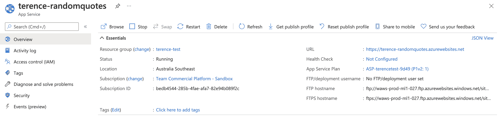
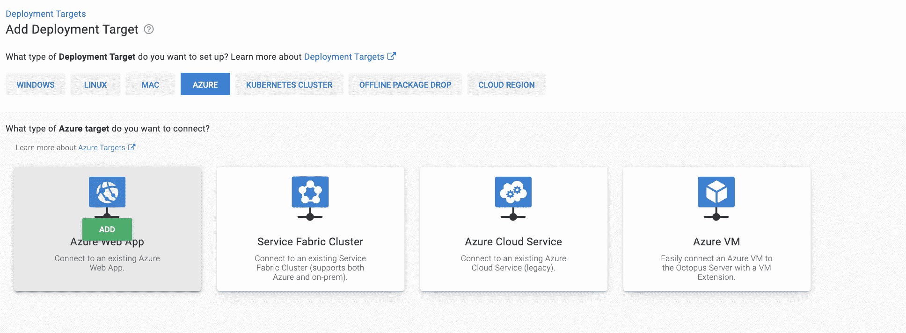
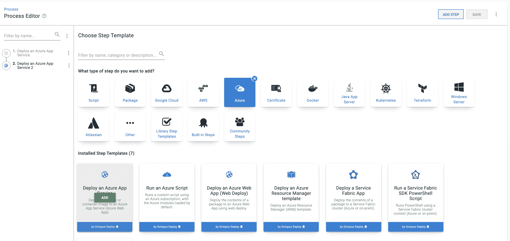
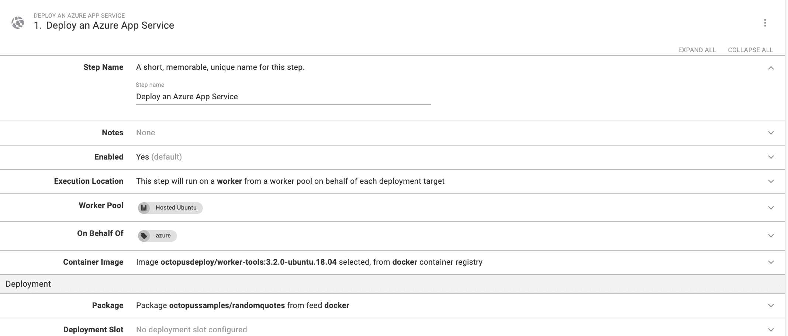
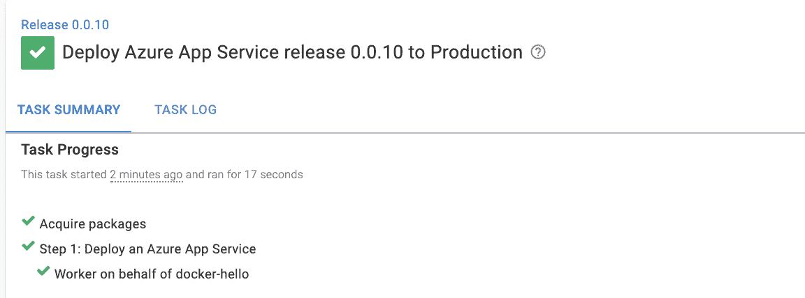
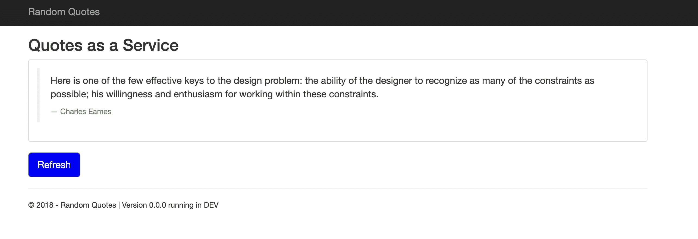

# 使用部署 Azure 应用服务步骤- Octopus 部署

> 原文：<https://octopus.com/blog/deploy-an-azure-app-service-step>

Octopus Deploy 提供了部署到 Microsoft Azure 的流程步骤。一个新的步骤**Deploy a Azure App Service**可用于将容器部署到 Azure App Service。

为此，您需要:

## 设置 Azure Web 应用程序

若要设置您将部署的 Azure Web 应用:

1.  导航到您的资源组，然后点击**创建**，然后点击 **Web 应用**。
2.  给 web 应用命名，并检查“Docker 容器”中的**发布**设置。
3.  选择适当的位置并创建 web 应用程序。
4.  您将看到一个转到资源的选项。该 URL 将是托管 Web 应用程序的地址。

## 配置 Octopus 部署

在 Octopus 部署实例中，导航到**基础设施**，然后是**部署目标**，然后是**添加部署目标**。选择 **Azure** 选项卡，然后选择 **Azure Web App** 。

填充以下字段:

*   **环境** -您希望部署到的环境
*   **目标角色** -标识部署目标的角色，如果它不存在，您可能需要创建一个
*   **账户**-Octopus Deploy 中关联的 Azure 账户
*   **Azure Web App** -你之前创建的 Web App

进入**库**，然后**外送**，然后**加送**。

填充以下字段:

*   **进给类型** - `Docker Container Registry`
*   **Name** -为提要命名

这一步激活您稍后将使用的公共 Docker 注册表提要。点击**保存**。

将**部署 Azure 应用服务**步骤添加到您的项目流程中。

用以下值填充字段:

*   **工作线程池**——运行在特定工作线程池中的一个工作线程上:`Hosted Ubuntu`
*   **代表**——您在部署目标步骤中创建的角色(我的是`azure`)
*   **容器映像**——在一个工作容器中运行:容器注册表:Docker 映像:`octopusdeploy/worker-tools:3.2.0-ubuntu.18.04`
*   **包** -从容器部署映像包提要:docker 包 ID: `octopussamples/randomquotes`

在本例中，我们部署了一个托管在 Docker Hub 上的示例 Docker 映像。下图显示了我的配置结果。点击**保存**。

点击**创建版本**，然后点击**部署**按钮，将 Web 应用部署到 Azure。

## 查看您的 Web 应用程序

导航至您的网络应用程序的网址- `[your-url].azurewebsites.net`

## 结论

在本文中，您将使用新的**部署 Azure 应用程序服务**步骤建立一个 Octopus 部署项目来部署 Web 应用程序。

愉快的部署！