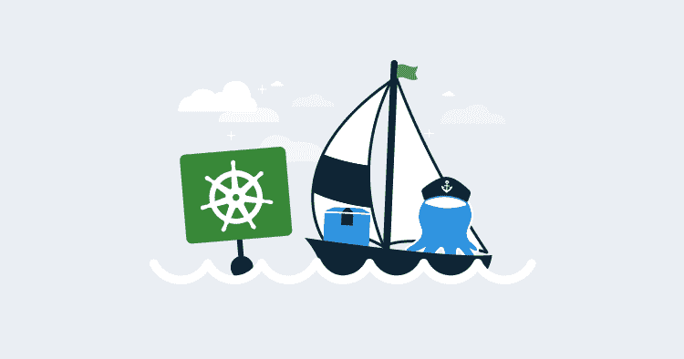
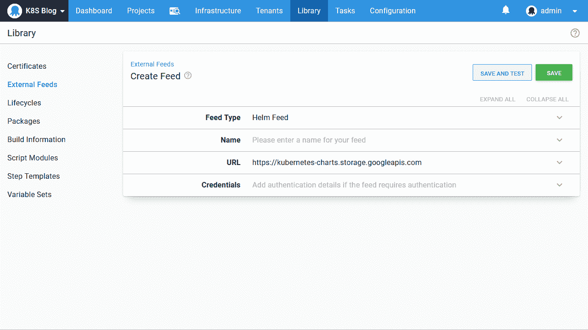
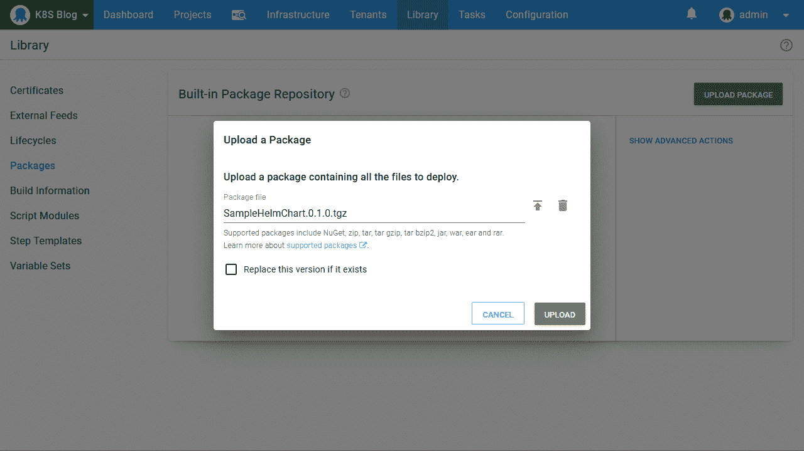
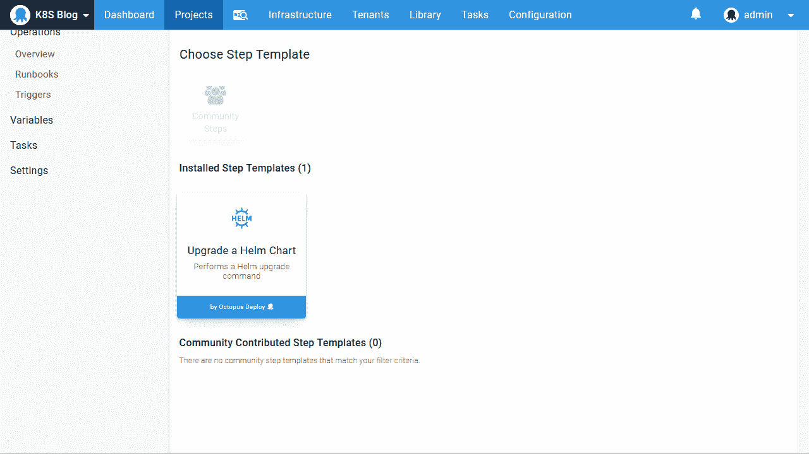
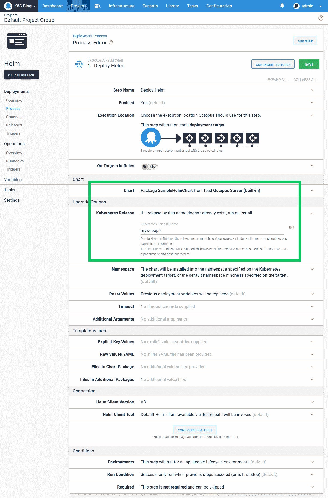

# 用章鱼-章鱼展开舵图

> 原文：<https://octopus.com/blog/deploy-helm-chart-with-octopus>

[](#)

赫尔姆已经成为事实上的 Kubernetes 包经理。它提供了丰富的模板、强大的 CLI 工具、用于共享图表的集中存储库，最近发布的 Helm 3 解决了之前 Helm 版本的安全问题。

Octopus 为部署 Helm 图表提供了本地支持，在这篇博客文章中，我们将看看如何在 Octopus 中管理 Helm 部署到 Kubernetes 集群，该集群是在之前的一篇博客文章中创建的。

## 样本图表

在博文《通过 Octopus 将您的第一个容器部署到 Kubernetes》中，我们介绍了创建 Docker 映像并将其推送到 Docker Hub 的过程。最终结果是图像 [mcasperson/mywebapp](https://hub.docker.com/r/mcasperson/mywebapp) 。我们将从我们的舵图中重用这个 Docker 图像。

舵图示例可以在 [GitHub](https://github.com/OctopusSamples/SampleHelmChart) 上找到。这个图表创建了一个 Kubernetes 部署和服务来公开嵌入在 Docker 映像中的 web 应用程序。

首先克隆 GitHub 存储库，并用命令`helm package .\SampleHelmChart`将文件打包成图表:

```
$ helm package .\SampleHelmChart
Successfully packaged chart and saved it to: C:\Code\SampleHelmChart-0.1.0.tgz 
```

结果图表的文件名为`SampleHelmChart-0.1.0.tgz`。通常，这个文件会被上传到一个图表库，比如由 [ChartMuseum](https://chartmuseum.com/) 托管的图表库。Octopus 本身支持这样的图表存储库，对于那些希望利用 Helm 的人来说，建立一个图表存储库是一个非常有效的选择:

[](#)

然而，从 2020.3.0 版本开始，Octopus 提供了将舵图直接上传到内置提要的能力。这消除了配置单独图表存储库的需要。将图表上传到内置提要的唯一要求是在文件名后附加一个包版本，这意味着我们需要在上传之前将图表文件从`SampleHelmChart-0.1.0.tgz`重命名为`SampleHelmChart.0.1.0.tgz`:

【T2 

## 部署图表

为了部署舵图，我们将使用**升级舵图**步骤:

[](#)

然后，我们引用上传到内置提要的包，并为 Helm 版本定义一个名称:

[](#)

仅此而已。只需几个简单的步骤，我们就可以在 Kubernetes 上部署我们的第一个 Helm chart。

## 结论

通过在内置提要中托管掌舵图表并使用本地掌舵步骤来消费它们，Octopus 使得向 Kubernetes 共享和部署掌舵图表变得非常简单。

如果你已经部署了一个或者希望利用可用的[公共存储库](https://github.com/helm/charts)，Octopus 也可以访问外部舵图存储库。任何成熟的 Kubernetes 基础设施将不可避免地包括一系列外部服务，如入口控制器、仪表盘、监控解决方案和其他 Kubernetes 运营商。这些第三方应用程序通常会以 Helm charts 的形式发布，因此访问外部 Helm feeds 允许 Octopus 像管理内部应用程序一样管理它们的部署。