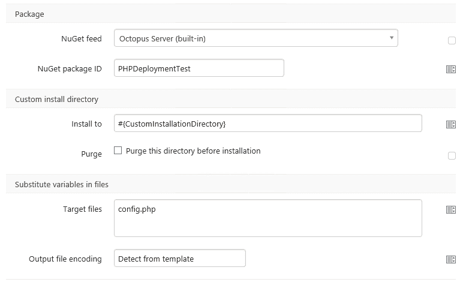

# 使用 Octopus - Octopus Deploy 将 PHP 站点部署到 IIS

> 原文：<https://octopus.com/blog/deploy-php-to-iis-with-octopus>

正如你可能已经读过的，我的背景是 LAMP 环境中的 PHP。做系统管理工作，手动发布和部署 PHP 站点。因此，当一位客户最近询问他们是否可以在 IIS 上部署一个 PHP 站点时，Paul 明智地要求我写一篇关于此事的博文。

## 一切都在于包装

正如我们所知，Octopus 依赖 NuGet 包来部署文件。所以首先我们需要把所有的 PHP 文件放到 NuGet 包中。幸运的是, [NuGet Package Explorer](http://docs.octopusdeploy.com/display/OD/Manually) 已经解决了这个问题。添加文件和创建 NuGet 包真的是再简单不过了。

一旦我的包被创建，并上传到 Octopus 中的内部 NuGet 存储库，我就准备好了！

## 在 Octopus 中创建项目

然后，我创建了一个新项目，并选择了 NuGet 包步骤。

如您所见，我选择了自定义安装目录，因为我有一个预先存在的站点设置，我希望在此实例中始终部署到相同的位置。但是我们使用的是 IIS，所以您可以选择其他 IIS 选项。我还添加了一些其他的 Octopus 特性来展示它可以与。php 文件。因此，我让定制安装目录使用一个变量，并且我还创建了一个测试配置文件，其中包含了在部署到生产环境时需要替换的变量。

所以我使用了文件中的替代变量特性并定义了我的`config.php`文件。

所有这三个变量，用于我的自定义安装目录，还有我在`config.php`文件中的两个变量。

## 部署时间到了

既然我的包被选择为一个步骤，我的变量被配置并确定了范围，那么是时候测试一个版本了。我想我应该创造一个！

部署时间！

这是该包的部署日志:

## 服务器上的结果

我们完成了，Octopus 已经部署了我的 PHP 文件。所以让我们来看看结果。这是我可爱的`phpinfo()`页面。

并且我的文件部署在 IIS 服务器上的正确位置。

我们也不能忘记我的`config.php`，它的变量被很好地替换了。

## 完全成功

因此，我在 IIS 服务器上部署 PHP 文件取得了圆满成功。我能够利用 Octopus 已经做的一切，我唯一要做的就是手动创建我的包，但这实际上是一个“找到一个文件夹并添加”的例子。是的，这个部署是一个 IIS 服务器，大部分 PHP 运行在 Linux 上，但是也许[部署现实离我们的未来](http://octopusdeploy.com/blog/rfc-linux-deployments)并不太远。